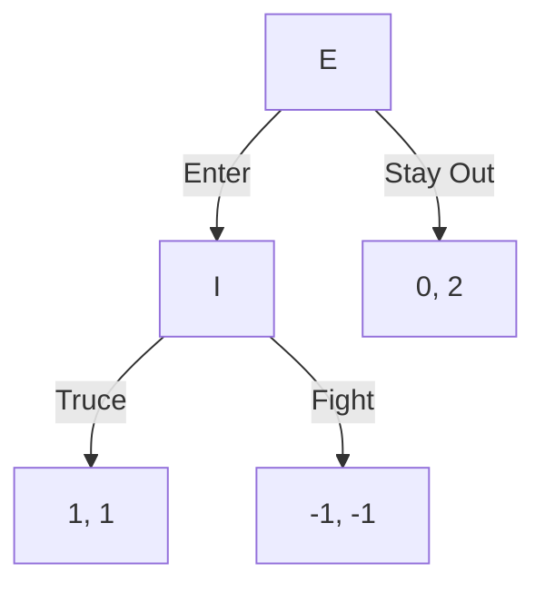

# 1. 进入威慑

## 1.1. 基本内容

[[Entry Deterrence|进入威慑]]（entry deterrence）是动态博弈的基本例子。

- 玩家：进入者 $E$ 与在位者 $I$。
- $E$ 先选择 Enter 或 Stay Out。
- 若 $E$ 选择 Enter，$I$ 再选择 Fight 或 Truce。

>[!note] 动态博弈的核心变化
> 玩家不是同时行动；后行动者可能观察到前行动者的选择，再决定自己的行动。

## 1.2. 与策略式博弈的区别

策略式博弈主要列出玩家、策略和收益；扩展式博弈还要描述历史（history）和行动顺序。

对进入威慑来说：

- 空历史：$()$。
- 非终端历史：$()$、$(Enter)$。
- 终端历史：$(Stay\ Out)$、$(Enter,Fight)$、$(Enter,Truce)$。
- 行动者函数：$P(())=E$，$P(Enter)=I$。
- 收益函数只定义在终端历史上。

![[Pasted image 20240417092350.png]]

>[!attention] strategy 不是单个行动
> 在扩展式博弈中，策略必须说明玩家在自己每个可能决策点会怎么做，即使那个决策点最后不会发生。

# 2. 扩展式转策略式

## 2.1. 一般定义

给定扩展式博弈：

$$
G=(N,H,P,\{u_i\}_{i\in N}),
$$

其策略式表示为：

$$
\Gamma=(N,\{S_i\}_{i\in N},\{v_i\}_{i\in N}),
$$

其中：

1. $S_i$ 是玩家 $i$ 在扩展式博弈中的完整策略集合。
2. $z(s)$ 是策略组合 $s$ 诱导出的终端历史。
3. $v_i(s)=u_i(z(s))$。

## 2.2. 进入威慑的策略式表示

进入威慑中，$E$ 的策略是 Enter 或 Stay Out；$I$ 的策略是 Fight 或 Truce。

收益顺序为 $(E,I)$：

| $E$ \ $I$ | Fight | Truce |
|---|---|---|
| Stay Out | $(0,2)$ | $(0,2)$ |
| Enter | $(-1,-1)$ | $(1,1)$ |

![[Pasted image 20240417194417.png]]

>[!item] 转换步骤
> 先列完整策略，再让每个策略组合沿博弈树走到终点，最后把终点收益填进矩阵。

# 3. 纳什均衡与可信性

## 3.1. 策略式纳什均衡

由策略式矩阵可得到两个纯策略纳什均衡：

- $(Stay\ Out,Fight)$。
- $(Enter,Truce)$。

还可以得到混合策略均衡：$E$ 以概率 1 选择 Stay Out，$I$ 以概率 $p\ge\frac12$ 选择 Fight。

## 3.2. 不可信威胁

问题是：$(Stay\ Out,Fight)$ 中的 Fight 是否可信？

如果 $E$ 真的进入，$I$ 在 Fight 与 Truce 之间比较：

- Fight 得 $-1$。
- Truce 得 $1$。

因此 $I$ 进入后不会真的 Fight。

>[!attention] 只求 NE 不够
> 动态博弈里的纳什均衡可能依赖不可信威胁。要排除它，需要 [[Subgame Perfect Nash Equilibrium|子博弈精炼纳什均衡]] 或 [[Backward Induction Procedure|逆向归纳]]。

# 4. 逆向归纳

## 4.1. 基本思想

[[Backward Induction|逆向归纳]]（backward induction）从最后一个决策节点开始，找出该节点行动者的最优选择，再向前倒推。

步骤是：

1. 找到最后的决策节点。
2. 在该节点选择当前行动者最优的分支。
3. 用该结果替代后续博弈。
4. 向前重复，直到起点。

>[!note] 逆向归纳像剪枝
> 每剪掉一个不可能被理性选择的后续分支，前一个玩家面对的选择就更清楚。

## 4.2. 进入威慑的逆向归纳

在进入威慑中，先看 $I$ 的节点：

- 若 Fight，$I$ 得 $-1$。
- 若 Truce，$I$ 得 $1$。

所以 $I$ 会选择 Truce。

$E$ 预期到这一点后比较：

- Enter 后得到 $1$。
- Stay Out 后得到 $0$。

因此逆向归纳结果是 $(Enter,Truce)$。

# 5. 千足虫博弈

## 5.1. 案例信息

[[Centipede Game|千足虫博弈]]中，玩家轮流选择 Stop 或 Pass。只要有人 Stop，博弈立即结束。

![[Pasted image 20240417200105.png]]

应用逆向归纳，从最后一个决策点开始：

- 最后行动者比较 Stop 与 Pass，选择收益更高的 Stop。
- 前一个玩家预期后面会 Stop，于是自己也选择 Stop。
- 一直倒推到起点，得到一开始就 Stop。

## 5.2. 策略必须写完整

>[!attention] 不能只写一个 Stop 或 Pass
> 如果玩家在多个信息集或多个决策点可能行动，策略必须写成完整计划。例如即便第二个节点不会发生，也要说明如果到达那里会 Stop 还是 Pass。

千足虫博弈的逆向归纳结果看起来反直觉，但它体现了有限动态博弈中的倒推逻辑。

# 6. 信息集

## 6.1. 信息集概念

[[Information Set|信息集]]（information set）表示某个玩家在行动时无法区分的一组决策节点。

如果一个信息集只有一个节点，玩家知道自己处于哪个历史；如果一个信息集包含多个节点，玩家无法确定具体历史。

## 6.2. 信息集表达

在博弈树中，若若干节点属于同一信息集，通常用虚线连接。

![[Pasted image 20240417202820.png]]

该图表示：玩家 1 选择 $C$ 或 $D$ 后，玩家 2 行动时不知道玩家 1 之前选择了什么。

>[!note] 完美信息与不完美信息
> 完美信息博弈中，每个信息集都是单点；不完美信息博弈中，可能存在非单点信息集。

# 7. 扩展式博弈的一般形式

## 7.1. 加入自然

更一般的 [[Extensive-form Game|扩展式博弈]] 可以加入自然（nature / chance）。

自然不是玩家，而是随机决定某些状态。

## 7.2. 完整要素

扩展式博弈可写为：

$$
G=\langle N,H,P,f,\{\mathcal I_i\}_{i\in N},\{u_i\}_{i\in N}\rangle.
$$

其中：

| 要素 | 含义 |
|---|---|
| $N$ | 玩家集合 |
| $H$ | 历史集合 |
| $P$ | 行动者函数 |
| $f$ | 自然节点上的概率 |
| $\mathcal I_i$ | 玩家 $i$ 的信息划分 |
| $u_i$ | 终端历史上的收益函数 |

若 $h\in H$ 且不存在行动 $a$ 使 $(h,a)\in H$，则 $h$ 是终端历史。终端历史集合记作 $Z\subset H$。

# 8. 子博弈精炼纳什均衡

## 8.1. 子博弈

[[Subgame|子博弈]]是从一个单点信息集出发、包含其后所有历史、且不切割任何信息集的后续博弈。

任何扩展式博弈都包含自己本身这个子博弈。

>[!attention] 子博弈不能切割信息集
> 如果从某个节点开始会把同一个信息集中的其他节点排除在外，那就不是合法子博弈。

## 8.2. 子博弈精炼均衡

[[Subgame Perfect Nash Equilibrium|子博弈精炼纳什均衡]]（SPNE）要求策略组合在每一个子博弈中都是纳什均衡。

它比普通纳什均衡更强，因为它排除了只在路径外说得通、但真到节点时不会执行的不可信威胁。

## 8.3. 与逆向归纳的关系

在有限完美信息博弈中，逆向归纳通常给出 SPNE。

千足虫博弈中，逆向归纳得到的“一开始 Stop”就是子博弈精炼结果。

![[Pasted image 20240417205505.png]]

![[Pasted image 20240417205745.png]]

# 9. 带显性威胁的进入威慑

## 9.1. 无效恐吓

在进入威慑中，如果在位者 $I$ 额外发出恐吓，但这个恐吓成本无论之后如何都会发生，那么恐吓不会改变进入者的后续收益比较。

![[Pasted image 20240417210200.png]]

对应策略式博弈如下，收益顺序为 $(E,I)$：

| $I$ \ $E$ | Enter | Stay Out |
|---|---|---|
| Silent, Truce | $(1,1)$ | $(0,2)$ |
| Silent, Fight | $(-1,-1)$ | $(0,2)$ |
| Threat, Truce | $(1-c,1)$ | $(0,2-c)$ |
| Threat, Fight | $(-1-c,-1)$ | $(0,2-c)$ |

>[!note] 无效威胁的原因
> 如果威胁只增加成本，却不改变后续节点的最优反应，它就无法改变进入者的策略。

## 9.2. 有效恐吓

有效恐吓必须改变后续子博弈中的最优反应。

例如某种承诺只在特定分支触发，并且使违背威胁的成本足够高，那么它才可能改变进入者对后续行动的预期。

破釜沉舟式承诺的作用就在于：让某些原本不可信的行为在后续节点变得可信。

# 10. 关联卡片

- [[Extensive-form Game]]
- [[Extensive Form to Strategic Form]]
- [[Entry Deterrence]]
- [[Credible Threat]]
- [[Backward Induction]]
- [[Backward Induction Procedure]]
- [[Centipede Game]]
- [[Information Set]]
- [[Subgame]]
- [[Subgame Perfect Nash Equilibrium]]
- [[Game Theory Problem Solving Map]]
