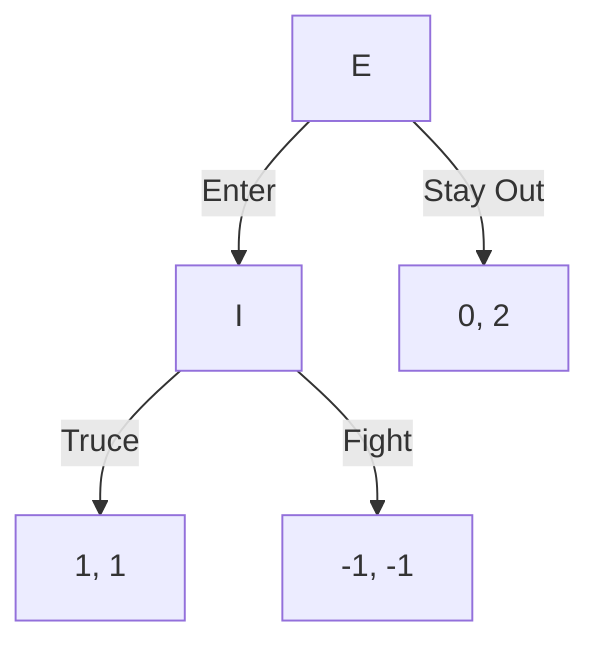

# 1. 进入威慑
<!-- bilingual-en:start -->
*Entry Deterrence*
<!-- bilingual-en:end -->

## 1.1. 基本内容
<!-- bilingual-en:start -->
*Basic Setup*
<!-- bilingual-en:end -->

[[Entry Deterrence|进入威慑]]（entry deterrence）是动态博弈的基本例子。
<!-- bilingual-en:start -->
[[Entry Deterrence]] is a standard example of a dynamic game.
<!-- bilingual-en:end -->

- 玩家：进入者 $E$ 与在位者 $I$。
- $E$ 先选择 Enter 或 Stay Out。
- 若 $E$ 选择 Enter，$I$ 再选择 Fight 或 Truce。
<!-- bilingual-en:start -->
- The players are an entrant $E$ and an incumbent $I$.
- Player $E$ first chooses Enter or Stay Out.
- If $E$ chooses Enter, $I$ then chooses Fight or Truce.
<!-- bilingual-en:end -->

>[!note] 动态博弈的核心变化
> 玩家不是同时行动；后行动者可能观察到前行动者的选择，再决定自己的行动。
> <!-- bilingual-en:start -->
> [!note] The defining change in a dynamic game
> The players do not move simultaneously. A later mover may observe an earlier choice before deciding what to do.
> <!-- bilingual-en:end -->

## 1.2. 与策略式博弈的区别
<!-- bilingual-en:start -->
*How This Differs from a Strategic-Form Game*
<!-- bilingual-en:end -->

策略式博弈主要列出玩家、策略和收益；扩展式博弈还要描述历史（history）和行动顺序。
<!-- bilingual-en:start -->
A strategic-form game mainly lists players, strategies, and payoffs. An extensive-form game also describes histories and the order of actions.
<!-- bilingual-en:end -->

对进入威慑来说：

- 空历史：$()$。
- 非终端历史：$()$、$(Enter)$。
- 终端历史：$(Stay\ Out)$、$(Enter,Fight)$、$(Enter,Truce)$。
- 行动者函数：$P(())=E$，$P(Enter)=I$。
- 收益函数只定义在终端历史上。
<!-- bilingual-en:start -->
For the entry-deterrence game:

- the empty history is $()$;
- the nonterminal histories are $()$ and $(Enter)$;
- the terminal histories are $(Stay\ Out)$, $(Enter,Fight)$, and $(Enter,Truce)$;
- the player function is $P(())=E$ and $P(Enter)=I$;
- payoff functions are defined only on terminal histories.
<!-- bilingual-en:end -->

![[Pasted image 20240417092350.png]]

>[!attention] strategy 不是单个行动
> 在扩展式博弈中，策略必须说明玩家在自己每个可能决策点会怎么做，即使那个决策点最后不会发生。
> <!-- bilingual-en:start -->
> [!attention] A strategy is not a single action
> In an extensive-form game, a strategy must state what a player would do at every possible decision point, even when that point is never reached.
> <!-- bilingual-en:end -->

# 2. 扩展式转策略式
<!-- bilingual-en:start -->
*Converting Extensive Form to Strategic Form*
<!-- bilingual-en:end -->

## 2.1. 一般定义
<!-- bilingual-en:start -->
*General Definition*
<!-- bilingual-en:end -->

给定扩展式博弈：
<!-- bilingual-en:start -->
Given an extensive-form game
<!-- bilingual-en:end -->

$$
G=(N,H,P,\{u_i\}_{i\in N}),
$$

其策略式表示为：
<!-- bilingual-en:start -->
its strategic-form representation is
<!-- bilingual-en:end -->

$$
\Gamma=(N,\{S_i\}_{i\in N},\{v_i\}_{i\in N}),
$$

其中：

1. $S_i$ 是玩家 $i$ 在扩展式博弈中的完整策略集合。
2. $z(s)$ 是策略组合 $s$ 诱导出的终端历史。
3. $v_i(s)=u_i(z(s))$。
<!-- bilingual-en:start -->
where:

1. $S_i$ is player $i$'s set of complete strategies in the extensive-form game;
2. $z(s)$ is the terminal history induced by strategy profile $s$;
3. $v_i(s)=u_i(z(s))$.
<!-- bilingual-en:end -->

## 2.2. 进入威慑的策略式表示
<!-- bilingual-en:start -->
*Strategic Form of the Entry-Deterrence Game*
<!-- bilingual-en:end -->

进入威慑中，$E$ 的策略是 Enter 或 Stay Out；$I$ 的策略是 Fight 或 Truce。
<!-- bilingual-en:start -->
In the entry-deterrence game, $E$ chooses Enter or Stay Out, while $I$ chooses Fight or Truce.
<!-- bilingual-en:end -->

收益顺序为 $(E,I)$：
<!-- bilingual-en:start -->
Payoffs are ordered as $(E,I)$:
<!-- bilingual-en:end -->

| $E$ \ $I$ | Fight | Truce |
|---|---|---|
| Stay Out | $(0,2)$ | $(0,2)$ |
| Enter | $(-1,-1)$ | $(1,1)$ |

![[Pasted image 20240417194417.png]]

>[!item] 转换步骤
> 先列完整策略，再让每个策略组合沿博弈树走到终点，最后把终点收益填进矩阵。
> <!-- bilingual-en:start -->
> [!item] Conversion procedure
> First list every complete strategy. Then follow the game tree to the terminal node induced by each strategy profile and enter that terminal payoff into the matrix.
> <!-- bilingual-en:end -->

# 3. 纳什均衡与可信性
<!-- bilingual-en:start -->
*Nash Equilibrium and Credibility*
<!-- bilingual-en:end -->

## 3.1. 策略式纳什均衡
<!-- bilingual-en:start -->
*Nash Equilibria in Strategic Form*
<!-- bilingual-en:end -->

由策略式矩阵可得到两个纯策略纳什均衡：

- $(Stay\ Out,Fight)$。
- $(Enter,Truce)$。
<!-- bilingual-en:start -->
The strategic-form matrix has two pure-strategy Nash equilibria:

- $(Stay\ Out,Fight)$;
- $(Enter,Truce)$.
<!-- bilingual-en:end -->

还可以得到混合策略均衡：$E$ 以概率 1 选择 Stay Out，$I$ 以概率 $p\ge\frac12$ 选择 Fight。
<!-- bilingual-en:start -->
There is also a mixed-strategy equilibrium in which $E$ chooses Stay Out with probability 1 and $I$ chooses Fight with probability $p\ge\frac12$.
<!-- bilingual-en:end -->

## 3.2. 不可信威胁
<!-- bilingual-en:start -->
*Non-Credible Threats*
<!-- bilingual-en:end -->

问题是：$(Stay\ Out,Fight)$ 中的 Fight 是否可信？
<!-- bilingual-en:start -->
The question is whether Fight is credible in $(Stay\ Out,Fight)$.
<!-- bilingual-en:end -->

如果 $E$ 真的进入，$I$ 在 Fight 与 Truce 之间比较：

- Fight 得 $-1$。
- Truce 得 $1$。
<!-- bilingual-en:start -->
If $E$ actually enters, $I$ compares Fight with Truce:

- Fight yields $-1$;
- Truce yields $1$.
<!-- bilingual-en:end -->

因此 $I$ 进入后不会真的 Fight。
<!-- bilingual-en:start -->
Therefore, after entry occurs, $I$ will not actually choose Fight.
<!-- bilingual-en:end -->

>[!attention] 只求 NE 不够
> 动态博弈里的纳什均衡可能依赖不可信威胁。要排除它，需要 [[Subgame Perfect Nash Equilibrium|子博弈精炼纳什均衡]] 或 [[Backward Induction Procedure|逆向归纳]]。
> <!-- bilingual-en:start -->
> [!attention] Finding NE alone is not enough
> A Nash equilibrium in a dynamic game may rely on a non-credible threat. Eliminating such equilibria requires [[Subgame Perfect Nash Equilibrium]] or the [[Backward Induction Procedure]].
> <!-- bilingual-en:end -->

# 4. 逆向归纳
<!-- bilingual-en:start -->
*Backward Induction*
<!-- bilingual-en:end -->

## 4.1. 基本思想
<!-- bilingual-en:start -->
*Core Idea*
<!-- bilingual-en:end -->

[[Backward Induction|逆向归纳]]（backward induction）从最后一个决策节点开始，找出该节点行动者的最优选择，再向前倒推。
<!-- bilingual-en:start -->
[[Backward Induction]] starts at the final decision node, identifies the action that is optimal for the player moving there, and then works backwards.
<!-- bilingual-en:end -->

步骤是：

1. 找到最后的决策节点。
2. 在该节点选择当前行动者最优的分支。
3. 用该结果替代后续博弈。
4. 向前重复，直到起点。
<!-- bilingual-en:start -->
The procedure is:

1. locate the final decision node;
2. choose the branch that is optimal for the player moving at that node;
3. replace the continuation game with the resulting outcome;
4. repeat backwards until reaching the initial node.
<!-- bilingual-en:end -->

>[!note] 逆向归纳像剪枝
> 每剪掉一个不可能被理性选择的后续分支，前一个玩家面对的选择就更清楚。
> <!-- bilingual-en:start -->
> [!note] Backward induction resembles pruning
> Each time a continuation that a rational player would never choose is removed, the preceding player's decision becomes clearer.
> <!-- bilingual-en:end -->

## 4.2. 进入威慑的逆向归纳
<!-- bilingual-en:start -->
*Backward Induction in the Entry-Deterrence Game*
<!-- bilingual-en:end -->

在进入威慑中，先看 $I$ 的节点：

- 若 Fight，$I$ 得 $-1$。
- 若 Truce，$I$ 得 $1$。
<!-- bilingual-en:start -->
In the entry-deterrence game, begin at $I$'s node:

- Fight gives $I$ a payoff of $-1$;
- Truce gives $I$ a payoff of $1$.
<!-- bilingual-en:end -->

所以 $I$ 会选择 Truce。
<!-- bilingual-en:start -->
Thus, $I$ chooses Truce.
<!-- bilingual-en:end -->

$E$ 预期到这一点后比较：

- Enter 后得到 $1$。
- Stay Out 后得到 $0$。
<!-- bilingual-en:start -->
Anticipating this, $E$ compares:

- a payoff of $1$ after Enter;
- a payoff of $0$ after Stay Out.
<!-- bilingual-en:end -->

因此逆向归纳结果是 $(Enter,Truce)$。
<!-- bilingual-en:start -->
The backward-induction outcome is therefore $(Enter,Truce)$.
<!-- bilingual-en:end -->

# 5. 千足虫博弈
<!-- bilingual-en:start -->
*The Centipede Game*
<!-- bilingual-en:end -->

## 5.1. 案例信息
<!-- bilingual-en:start -->
*Setup*
<!-- bilingual-en:end -->

[[Centipede Game|千足虫博弈]]中，玩家轮流选择 Stop 或 Pass。只要有人 Stop，博弈立即结束。
<!-- bilingual-en:start -->
In the [[Centipede Game]], players alternately choose Stop or Pass. The game ends immediately when either player chooses Stop.
<!-- bilingual-en:end -->

![[Pasted image 20240417200105.png]]

应用逆向归纳，从最后一个决策点开始：

- 最后行动者比较 Stop 与 Pass，选择收益更高的 Stop。
- 前一个玩家预期后面会 Stop，于是自己也选择 Stop。
- 一直倒推到起点，得到一开始就 Stop。
<!-- bilingual-en:start -->
Apply backward induction from the final decision point:

- the last mover compares Stop with Pass and chooses the higher-payoff action, Stop;
- the preceding player anticipates this later Stop and therefore also chooses Stop;
- continuing backwards to the initial node yields Stop immediately.
<!-- bilingual-en:end -->

## 5.2. 策略必须写完整
<!-- bilingual-en:start -->
*Strategies Must Be Complete*
<!-- bilingual-en:end -->

>[!attention] 不能只写一个 Stop 或 Pass
> 如果玩家在多个信息集或多个决策点可能行动，策略必须写成完整计划。例如即便第二个节点不会发生，也要说明如果到达那里会 Stop 还是 Pass。
> <!-- bilingual-en:start -->
> [!attention] Writing only Stop or Pass is insufficient
> If a player may act at several information sets or decision points, the strategy must be a complete contingent plan. Even if the second node will not be reached, the strategy must state whether the player would choose Stop or Pass there.
> <!-- bilingual-en:end -->

千足虫博弈的逆向归纳结果看起来反直觉，但它体现了有限动态博弈中的倒推逻辑。
<!-- bilingual-en:start -->
The backward-induction outcome of the centipede game may look counterintuitive, but it illustrates the logic of backward reasoning in a finite dynamic game.
<!-- bilingual-en:end -->

# 6. 信息集
<!-- bilingual-en:start -->
*Information Sets*
<!-- bilingual-en:end -->

## 6.1. 信息集概念
<!-- bilingual-en:start -->
*The Concept of an Information Set*
<!-- bilingual-en:end -->

[[Information Set|信息集]]（information set）表示某个玩家在行动时无法区分的一组决策节点。
<!-- bilingual-en:start -->
An [[Information Set]] is a collection of decision nodes that a player cannot distinguish when choosing an action.
<!-- bilingual-en:end -->

如果一个信息集只有一个节点，玩家知道自己处于哪个历史；如果一个信息集包含多个节点，玩家无法确定具体历史。
<!-- bilingual-en:start -->
At a singleton information set, the player knows the exact history. At an information set with several nodes, the player does not know which particular history has occurred.
<!-- bilingual-en:end -->

## 6.2. 信息集表达
<!-- bilingual-en:start -->
*Representing Information Sets*
<!-- bilingual-en:end -->

在博弈树中，若若干节点属于同一信息集，通常用虚线连接。
<!-- bilingual-en:start -->
In a game tree, nodes belonging to the same information set are usually connected by a dashed line.
<!-- bilingual-en:end -->

![[Pasted image 20240417202820.png]]

该图表示：玩家 1 选择 $C$ 或 $D$ 后，玩家 2 行动时不知道玩家 1 之前选择了什么。
<!-- bilingual-en:start -->
The figure indicates that, after player 1 chooses $C$ or $D$, player 2 moves without knowing which action player 1 selected.
<!-- bilingual-en:end -->

>[!note] 完美信息与不完美信息
> 完美信息博弈中，每个信息集都是单点；不完美信息博弈中，可能存在非单点信息集。
> <!-- bilingual-en:start -->
> [!note] Perfect and imperfect information
> In a game of perfect information, every information set is a singleton. In a game of imperfect information, non-singleton information sets may occur.
> <!-- bilingual-en:end -->

# 7. 扩展式博弈的一般形式
<!-- bilingual-en:start -->
*General Form of an Extensive-Form Game*
<!-- bilingual-en:end -->

## 7.1. 加入自然
<!-- bilingual-en:start -->
*Adding Nature*
<!-- bilingual-en:end -->

更一般的 [[Extensive-form Game|扩展式博弈]] 可以加入自然（nature / chance）。
<!-- bilingual-en:start -->
A more general [[Extensive-form Game]] may include Nature, or chance.
<!-- bilingual-en:end -->

自然不是玩家，而是随机决定某些状态。
<!-- bilingual-en:start -->
Nature is not a player; it randomly determines certain states.
<!-- bilingual-en:end -->

## 7.2. 完整要素
<!-- bilingual-en:start -->
*Complete Set of Components*
<!-- bilingual-en:end -->

扩展式博弈可写为：
<!-- bilingual-en:start -->
An extensive-form game can be written as
<!-- bilingual-en:end -->

$$
G=\langle N,H,P,f,\{\mathcal I_i\}_{i\in N},\{u_i\}_{i\in N}\rangle.
$$

其中：

| 要素 | 含义 |
|---|---|
| $N$ | 玩家集合 |
| $H$ | 历史集合 |
| $P$ | 行动者函数 |
| $f$ | 自然节点上的概率 |
| $\mathcal I_i$ | 玩家 $i$ 的信息划分 |
| $u_i$ | 终端历史上的收益函数 |
<!-- bilingual-en:start -->
where:

| Component | Meaning |
|---|---|
| $N$ | Set of players |
| $H$ | Set of histories |
| $P$ | Player function |
| $f$ | Probabilities at chance nodes |
| $\mathcal I_i$ | Player $i$'s information partition |
| $u_i$ | Payoff function on terminal histories |
<!-- bilingual-en:end -->

若 $h\in H$ 且不存在行动 $a$ 使 $(h,a)\in H$，则 $h$ 是终端历史。终端历史集合记作 $Z\subset H$。
<!-- bilingual-en:start -->
If $h\in H$ and there is no action $a$ for which $(h,a)\in H$, then $h$ is a terminal history. The set of terminal histories is denoted by $Z\subset H$.
<!-- bilingual-en:end -->

# 8. 子博弈精炼纳什均衡
<!-- bilingual-en:start -->
*Subgame Perfect Nash Equilibrium*
<!-- bilingual-en:end -->

## 8.1. 子博弈
<!-- bilingual-en:start -->
*Subgames*
<!-- bilingual-en:end -->

[[Subgame|子博弈]]是从一个单点信息集出发、包含其后所有历史、且不切割任何信息集的后续博弈。
<!-- bilingual-en:start -->
A [[Subgame]] begins at a singleton information set, contains every subsequent history, and does not cut across any information set.
<!-- bilingual-en:end -->

任何扩展式博弈都包含自己本身这个子博弈。
<!-- bilingual-en:start -->
Every extensive-form game contains the game itself as a subgame.
<!-- bilingual-en:end -->

>[!attention] 子博弈不能切割信息集
> 如果从某个节点开始会把同一个信息集中的其他节点排除在外，那就不是合法子博弈。
> <!-- bilingual-en:start -->
> [!attention] A subgame cannot cut an information set
> Starting at a node does not define a valid subgame if it excludes other nodes belonging to the same information set.
> <!-- bilingual-en:end -->

## 8.2. 子博弈精炼均衡
<!-- bilingual-en:start -->
*Subgame-Perfect Equilibrium*
<!-- bilingual-en:end -->

[[Subgame Perfect Nash Equilibrium|子博弈精炼纳什均衡]]（SPNE）要求策略组合在每一个子博弈中都是纳什均衡。
<!-- bilingual-en:start -->
A [[Subgame Perfect Nash Equilibrium]] (SPNE) requires the strategy profile to form a Nash equilibrium in every subgame.
<!-- bilingual-en:end -->

它比普通纳什均衡更强，因为它排除了只在路径外说得通、但真到节点时不会执行的不可信威胁。
<!-- bilingual-en:start -->
It is stronger than an ordinary Nash equilibrium because it rules out threats that appear effective off the equilibrium path but would not actually be carried out if the relevant node were reached.
<!-- bilingual-en:end -->

## 8.3. 与逆向归纳的关系
<!-- bilingual-en:start -->
*Relationship to Backward Induction*
<!-- bilingual-en:end -->

在有限完美信息博弈中，逆向归纳通常给出 SPNE。
<!-- bilingual-en:start -->
In a finite game of perfect information, backward induction generally yields an SPNE.
<!-- bilingual-en:end -->

千足虫博弈中，逆向归纳得到的“一开始 Stop”就是子博弈精炼结果。
<!-- bilingual-en:start -->
In the centipede game, the backward-induction outcome of stopping immediately is the subgame-perfect outcome.
<!-- bilingual-en:end -->

![[Pasted image 20240417205505.png]]

![[Pasted image 20240417205745.png]]

# 9. 带显性威胁的进入威慑
<!-- bilingual-en:start -->
*Entry Deterrence with an Explicit Threat*
<!-- bilingual-en:end -->

## 9.1. 无效恐吓
<!-- bilingual-en:start -->
*Ineffective Threats*
<!-- bilingual-en:end -->

在进入威慑中，如果在位者 $I$ 额外发出恐吓，但这个恐吓成本无论之后如何都会发生，那么恐吓不会改变进入者的后续收益比较。
<!-- bilingual-en:start -->
In the entry-deterrence game, suppose incumbent $I$ issues an additional threat but incurs its cost regardless of what happens later. The threat then does not change the entrant's comparison of continuation payoffs.
<!-- bilingual-en:end -->

![[Pasted image 20240417210200.png]]

对应策略式博弈如下，收益顺序为 $(E,I)$：
<!-- bilingual-en:start -->
The corresponding strategic-form game is shown below, with payoffs ordered as $(E,I)$:
<!-- bilingual-en:end -->

| $I$ \ $E$ | Enter | Stay Out |
|---|---|---|
| Silent, Truce | $(1,1)$ | $(0,2)$ |
| Silent, Fight | $(-1,-1)$ | $(0,2)$ |
| Threat, Truce | $(1-c,1)$ | $(0,2-c)$ |
| Threat, Fight | $(-1-c,-1)$ | $(0,2-c)$ |

>[!note] 无效威胁的原因
> 如果威胁只增加成本，却不改变后续节点的最优反应，它就无法改变进入者的策略。
> <!-- bilingual-en:start -->
> [!note] Why the threat is ineffective
> If a threat merely adds a cost without changing the optimal response at a later node, it cannot change the entrant's strategy.
> <!-- bilingual-en:end -->

## 9.2. 有效恐吓
<!-- bilingual-en:start -->
*Effective Threats*
<!-- bilingual-en:end -->

有效恐吓必须改变后续子博弈中的最优反应。
<!-- bilingual-en:start -->
An effective threat must change the optimal response in the continuation subgame.
<!-- bilingual-en:end -->

例如某种承诺只在特定分支触发，并且使违背威胁的成本足够高，那么它才可能改变进入者对后续行动的预期。
<!-- bilingual-en:start -->
For example, a commitment may be triggered only on a particular branch and make abandoning the threatened action sufficiently costly. Only then can it alter the entrant's expectation of later behaviour.
<!-- bilingual-en:end -->

破釜沉舟式承诺的作用就在于：让某些原本不可信的行为在后续节点变得可信。
<!-- bilingual-en:start -->
A commitment that removes the possibility of retreat can make behaviour that was previously non-credible become credible at a later node.
<!-- bilingual-en:end -->

# 10. 关联卡片
<!-- bilingual-en:start -->
*Related Cards*
<!-- bilingual-en:end -->

- [[Extensive-form Game]]
- [[Extensive Form to Strategic Form]]
- [[Entry Deterrence]]
- [[Credible Threat]]
- [[Backward Induction]]
- [[Backward Induction Procedure]]
- [[Centipede Game]]
- [[Information Set]]
- [[Subgame]]
- [[Subgame Perfect Nash Equilibrium]]
- [[Game Theory Problem Solving Map]]
