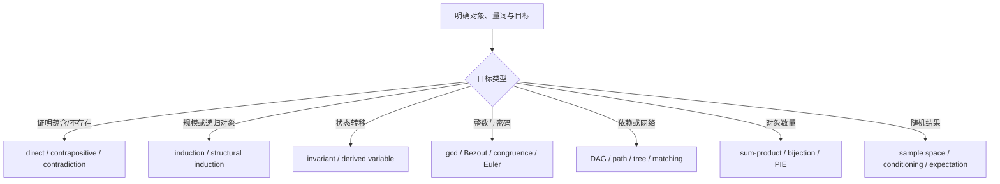

---
aliases:
  - MIT 6.042J Review and Final Exam
  - Mathematics for Computer Science Final Review
  - 离散数学综合复习与期末题解
tags:
  - discrete-mathematics
  - mit-ocw
  - course-note
  - exam-review
---

# Review and exam roadmap

> [!abstract] 本篇目标
> 把 35 个 Session 压缩成一套可执行的题型判断系统，并完整解答 Spring 2015 Final Exam。这里不重复四篇 Unit 的全部推导，而是回答：看到一道综合题时，怎样识别对象、选择工具、写出足够严密的答案并交叉验算？
> <!-- bilingual-en:start -->
> This note compresses 35 sessions into an actionable system for recognizing problem types and gives complete solutions to the Spring 2015 Final Exam. It does not repeat every derivation from the four unit notes. Instead, it asks how to identify the mathematical object, choose a tool, write a sufficiently rigorous solution, and cross-check the result when facing an integrated problem.
> <!-- bilingual-en:end -->

## 资料与使用方式
<!-- bilingual-en:start -->
*Resources and how to use them*
<!-- bilingual-en:end -->

- 课程总览：[[01_Math/07-Mathematics for Computer Science/00_课程总览|MIT 6.042J course map]]
- 原题：[[MIT_OCW_6.042J_Materials/07_Exams/MIT6_042JS15_finalexam.pdf#page=1|Final Exam p.1]]
- Unit 1：[[数学证明方法]]
- Unit 2：[[模运算、欧几里得算法与 RSA|数论、RSA]] 与 [[图的基本结构、路径与遍历|图结构]]
- Unit 3：[[组合计数原理|计数]]、[[渐近记号与算法复杂度|渐近]]与[[组合计数原理|组合原理]]
- Unit 4：[[概率空间、条件概率与 Bayes 法则|离散概率]]
<!-- bilingual-en:start -->
- Course overview: [[01_Math/07-Mathematics for Computer Science/00_课程总览|MIT 6.042J course map]]
- Original exam: [[MIT_OCW_6.042J_Materials/07_Exams/MIT6_042JS15_finalexam.pdf#page=1|Final Exam p.1]]
- Unit 1: [[数学证明方法|Methods of mathematical proof]]
- Unit 2: [[模运算、欧几里得算法与 RSA|Number theory and RSA]], and [[图的基本结构、路径与遍历|graph structures]]
- Unit 3: [[组合计数原理|Counting and combinatorial principles]], with [[渐近记号与算法复杂度|asymptotic notation]]
- Unit 4: [[概率空间、条件概率与 Bayes 法则|Discrete probability]]
<!-- bilingual-en:end -->

> [!warning] 答案来源
> MIT 公开材料没有提供本次考试的官方答案。以下均为**非官方独立题解**；每题附有定义检查、另一种推导或数值/结构验算，不能标作 official solution。
> <!-- bilingual-en:start -->
> MIT's public materials do not include official solutions for this exam. Everything below is an **independent, unofficial solution**. Each problem includes a definition check, alternative derivation, or numerical/structural verification and must not be labeled an official solution.
> <!-- bilingual-en:end -->

## 一、考试前的四层检查表
<!-- bilingual-en:start -->
*I. Four-layer pre-exam checklist*
<!-- bilingual-en:end -->

### Layer 1：先识别数学对象
<!-- bilingual-en:start -->
*Layer 1: Identify the mathematical object first*
<!-- bilingual-en:end -->

| 题面对象 | 必须先写出的定义 |
|---|---|
| 命题与证明 | 论域、量词、假设、结论 |
| 整数与同余 | 模数是否为正、哪些量与模数互素 |
| graph | directed / undirected、simple、finite、connected |
| partial order | comparable、chain、antichain、prerequisite 方向 |
| counting | 一个 outcome 是什么、顺序与重复是否重要 |
| probability | experiment、sample space、event、概率质量 |
| random variable | 对每个 outcome 输出什么数值 |
| random walk | 转移方向、转移概率、初始分布 |
<!-- bilingual-en:start -->
| Object in the question | Definition to state first |
|---|---|
| Proposition and proof | Domain of discourse, quantifiers, assumptions, and conclusion |
| Integers and congruence | Whether the modulus is positive and which quantities are coprime to it |
| Graph | Directed or undirected, simple, finite, and connected |
| Partial order | Comparable elements, chains, antichains, and the direction of prerequisites |
| Counting | What constitutes one outcome and whether order and repetition matter |
| Probability | Experiment, sample space, event, and probability mass |
| Random variable | What number is assigned to each outcome |
| Random walk | Transition directions, transition probabilities, and initial distribution |
<!-- bilingual-en:end -->

对象定义错误时，后续计算即使代数正确也没有意义。
<!-- bilingual-en:start -->
If the object is defined incorrectly, later calculations are meaningless even when the algebra is correct.
<!-- bilingual-en:end -->

### Layer 2：把目标翻译成结构
<!-- bilingual-en:start -->
*Layer 2: Translate the goal into mathematical structure*
<!-- bilingual-en:end -->

- “对所有 $n$”不是自动用归纳；先看 $n+1$ 情形是否可由更小规模构造。
- “不可能到达”通常寻找 [[数学证明方法|不变量]]。
- “至少有一个碰撞”通常寻找对象到盒子的映射。
- “平均有多少个”优先尝试 [[指示变量与随机计数#从事件到 0/1 随机变量|指示变量]]与[[指示变量与随机计数#把“数量”写成 indicators 的和|期望线性性]]。
- “最大偏离概率”先检查变量是否非负、是否已知方差，再选 [[概率不等式与集中界#Markov：把均值当作尾部质量预算|离散概率]] 或 [[概率不等式与集中界#Chebyshev：用 variance 控制双侧偏离|离散概率]]。
- “长期分布”先把平稳方程与从初始分布收敛分开；唯一性不等于收敛。
<!-- bilingual-en:start -->
- “For every $n$” does not automatically call for induction; first ask whether the $n+1$ case can be constructed from smaller instances.
- “Cannot be reached” often suggests an [[数学证明方法|invariant]].
- “At least one collision” often suggests mapping objects into boxes.
- “How many on average?” suggests [[指示变量与随机计数#从事件到 0/1 随机变量|indicator variables]] and [[指示变量与随机计数#把“数量”写成 indicators 的和|linearity of expectation]].
- For a “probability of a large deviation,” first check whether the variable is nonnegative and whether its variance is known, then choose [[概率不等式与集中界|the appropriate concentration bound]].
- For a “long-run distribution,” separate solving the stationary equation from convergence from an initial distribution; uniqueness does not imply convergence.
<!-- bilingual-en:end -->

### Layer 3：选择方法，而不是套关键词
<!-- bilingual-en:start -->
*Layer 3: Choose a method instead of matching keywords mechanically*
<!-- bilingual-en:end -->

### Layer 4：输出前交叉验算
<!-- bilingual-en:start -->
*Layer 4: Cross-check before submitting*
<!-- bilingual-en:end -->

- 真值公式：列出唯一可能为假的行，或做完整 truth table。
- 同余：用一个小模数代入，并检查是否非法约分。
- 图：检查度数和为 $2|E|$、树边数为 $|V|-1$、拓扑顺序满足每条边。
- 计数：用小参数穷举；概率必须落在 $[0,1]$。
- PMF：总和为 $1$；期望单位与变量相同；方差非负且单位平方。
- upper bound：若界大于 $1$，最终概率界应取 $\min(1,\text{bound})$。
<!-- bilingual-en:start -->
- Truth formula: identify the only rows on which it can be false, or construct the full truth table.
- Congruence: substitute a small modulus and check that no illegal cancellation occurred.
- Graph: verify that the degree sum is $2|E|$, a tree has $|V|-1$ edges, and every edge respects a proposed topological order.
- Counting: enumerate small parameter values; probabilities must lie in $[0,1]$.
- PMF: probabilities sum to $1$; expectation has the same units as the variable; variance is nonnegative and has squared units.
- Upper bound: if the calculated bound exceeds $1$, report $\min(1,\text{bound})$ as the probability bound.
<!-- bilingual-en:end -->

## 二、全课程最小公式表
<!-- bilingual-en:start -->
*II. Minimal whole-course formula sheet*
<!-- bilingual-en:end -->

### Proofs and logic

$$
P\Rightarrow Q\equiv\neg P\lor Q,
\qquad
\neg\forall x,P(x)\equiv\exists x,\neg P(x),
$$

$$
\neg\exists x,P(x)\equiv\forall x,\neg P(x).
$$

归纳证明需要 base case 与 $P(n)\Rightarrow P(n+1)$；不变量证明需要 initialization 与 preservation。
<!-- bilingual-en:start -->
An induction proof needs a base case and the implication $P(n)\Rightarrow P(n+1)$. An invariant proof needs initialization and preservation.
<!-- bilingual-en:end -->

### Number theory

$$
\gcd(a,b)=\gcd(b,a-qb),
\qquad
ax+by=\gcd(a,b),
$$

$$
a\equiv b\pmod m\Longleftrightarrow m\mid(a-b),
$$

$$
\gcd(a,m)=1\Longrightarrow a^{\varphi(m)}\equiv1\pmod m.
$$

### Graphs and counting

$$
\sum_{v\in V}\deg(v)=2|E|,
\qquad
T\text{ is a tree}\Longrightarrow |E(T)|=|V(T)|-1.
$$

$$
\binom nk=\frac{n!}{k!(n-k)!},
\qquad
\#\{x_1+\cdots+x_k=n, x_i\ge0\}=\binom{n+k-1}{k-1}.
$$

### Probability

$$
\Pr(A\mid B)=\frac{\Pr(A\cap B)}{\Pr(B)},
\qquad
\Pr(A\cap B)=\Pr(A)\Pr(B)\quad\text{if independent},
$$

$$
\mathbb E\left[\sum_iX_i\right]=\sum_i\mathbb E[X_i],
$$

$$
\operatorname{Var}(X)=\mathbb E[X^2]-\mathbb E[X]^2,
$$

$$
X\ge0\Longrightarrow \Pr(X\ge a)\le\frac{\mathbb E[X]}a,
$$

$$
\Pr(|X-\mu|\ge a)\le\frac{\sigma^2}{a^2}.
$$

## 三、Final Exam 完整题解
<!-- bilingual-en:start -->
*III. Complete Final Exam solutions*
<!-- bilingual-en:end -->

### Problem 1：probable satisfiability

> [!question]- 题目与非官方题解
> **题目转述**：$P,Q,R$ 独立，且
> $$
> \Pr(P)=\frac12,\qquad \Pr(Q)=\frac13,\qquad \Pr(R)=\frac15.
> $$
> 求公式 $(P\Rightarrow Q)\Rightarrow R$ 为真的概率。原题见 [[MIT_OCW_6.042J_Materials/07_Exams/MIT6_042JS15_finalexam.pdf#page=2|Final p.2]]。
>
> **方法**：先找外层 implication 唯一为假的情形。
>
> $A\Rightarrow R$ 仅在 $A$ 真、$R$ 假时为假，这里 $A=(P\Rightarrow Q)$。内层 implication 仅在 $P$ 真、$Q$ 假时为假，因此
> $$
> \Pr(A)=1-\Pr(P\cap\neg Q)
> =1-\frac12\cdot\frac23
> =\frac23.
> $$
> $R$ 与 $P,Q$ 独立，所以 $A$ 与 $R$ 独立：
> $$
> \Pr(\text{公式为假})
> =\Pr(A)\Pr(\neg R)
> =\frac23\cdot\frac45
> =\frac8{15}.
> $$
> 故
> $$
> \boxed{\Pr(\text{公式为真})=1-\frac8{15}=\frac7{15}}.
> $$
>
> **检查**：若把 implication 错当成 conjunction，会漏掉“前件为假时 implication 自动为真”的行。
> <!-- bilingual-en:start -->
> **Restatement:** $P,Q,R$ are independent, with
> $$
> \Pr(P)=\frac12,\qquad \Pr(Q)=\frac13,\qquad \Pr(R)=\frac15.
> $$
> Find the probability that $(P\Rightarrow Q)\Rightarrow R$ is true. See [[MIT_OCW_6.042J_Materials/07_Exams/MIT6_042JS15_finalexam.pdf#page=2|Final p.2]].
>
> **Method:** identify the only circumstance in which the outer implication is false.
>
> $A\Rightarrow R$ is false only when $A$ is true and $R$ is false, where $A=(P\Rightarrow Q)$. The inner implication is false only when $P$ is true and $Q$ is false, so
> $$
> \Pr(A)=1-\Pr(P\cap\neg Q)
> =1-\frac12\cdot\frac23
> =\frac23.
> $$
> Since $R$ is independent of $P$ and $Q$, it is independent of $A$:
> $$
> \Pr(\text{formula is false})
> =\Pr(A)\Pr(\neg R)
> =\frac23\cdot\frac45
> =\frac8{15}.
> $$
> Hence
> $$
> \boxed{\Pr(\text{formula is true})=1-\frac8{15}=\frac7{15}}.
> $$
>
> **Check:** treating implication as conjunction would omit the rows on which a false antecedent makes the implication automatically true.
> <!-- bilingual-en:end -->

### Problem 2：induction and trees

> [!question]- 题目与非官方题解
> **题目转述**：若一张 simple graph 的顶点可排成某个顺序，使每个顶点至多与一个更早出现的顶点相邻，就称图 width 1。证明每棵有限树 width 1。原题见 [[MIT_OCW_6.042J_Materials/07_Exams/MIT6_042JS15_finalexam.pdf#page=3|Final p.3]]。
>
> **目标**：构造满足条件的顶点顺序。
>
> **对顶点数 $n$ 归纳。**
>
> Base case：$n=1$ 时唯一顶点没有更早邻点，结论成立。
>
> Induction step：假设每棵 $n$ 个顶点的树都存在所需顺序。任取 $n+1$ 个顶点的树 $T$。有限树至少有一片叶子 $v$；删去 $v$ 及其唯一相接边后，剩余图 $T-v$ 仍连通且无环，所以是一棵 $n$ 顶点树。
>
> 由归纳假设，$T-v$ 的顶点有顺序
> $$
> v_1,v_2,\ldots,v_n
> $$
> 使每个顶点至多有一个更早邻点。把叶子 $v$ 放到最后：
> $$
> v_1,v_2,\ldots,v_n,v.
> $$
> 前 $n$ 个顶点的更早邻点没有改变；$v$ 在整棵树中只有一个邻点，因此也至多有一个更早邻点。
>
> 由归纳法，所有有限树 width 1：
> $$
> \boxed{\text{Every finite tree has width }1.}
> $$
>
> **边界检查**：证明使用“有限树有叶子”；无限树不能直接套这个有限归纳。
> <!-- bilingual-en:start -->
> **Restatement:** call a simple graph width 1 if its vertices can be ordered so that every vertex is adjacent to at most one earlier vertex. Prove that every finite tree has width 1. See [[MIT_OCW_6.042J_Materials/07_Exams/MIT6_042JS15_finalexam.pdf#page=3|Final p.3]].
>
> **Goal:** construct an ordering with the required property.
>
> **Induct on the number of vertices $n$.**
>
> Base case: when $n=1$, the only vertex has no earlier neighbor, so the claim holds.
>
> Induction step: assume every tree with $n$ vertices has a suitable ordering. Take a tree $T$ with $n+1$ vertices. Every finite tree has a leaf $v$. Deleting $v$ and its single incident edge leaves a connected acyclic graph $T-v$, hence a tree with $n$ vertices.
>
> By the induction hypothesis, order the vertices of $T-v$ as
> $$v_1,v_2,\ldots,v_n$$
> so that each has at most one earlier neighbor. Append the leaf:
> $$v_1,v_2,\ldots,v_n,v.$$
> The earlier-neighbor sets of the first $n$ vertices do not change, while $v$ has only one neighbor in the entire tree and therefore at most one earlier neighbor.
>
> Thus every finite tree has width 1:
> $$\boxed{\text{Every finite tree has width }1.}$$
>
> **Boundary check:** the proof uses the fact that a finite tree has a leaf; this finite induction cannot be applied directly to an infinite tree.
> <!-- bilingual-en:end -->

### Problem 3：number theory true/false

> [!question]- 题目与非官方题解
> 原题见 [[MIT_OCW_6.042J_Materials/07_Exams/MIT6_042JS15_finalexam.pdf#page=4|Final p.4]]。全部变量为整数。
>
> **(a) False.** “对任意 $a,b$ 都存在 $x,y$ 使 $ax+by=1$”只有在 $\gcd(a,b)=1$ 时成立。取 $a=b=2$，左边恒为偶数，不可能等于 $1$。
>
> **(b) True.**
> $$
> \gcd(mb+r,b)=\gcd(r,b).
> $$
> 一个整数同时整除 $mb+r$ 与 $b$，当且仅当它同时整除 $(mb+r)-mb=r$ 与 $b$；两边公约数集合相同。
>
> **(c) False.** Fermat 小定理需要 $p\nmid k$。取 $p=2,k=2$：
> $$
> k^{p-1}=2\equiv0\not\equiv1\pmod2.
> $$
>
> **(d) True.** 若 $p\ne q$ 都是素数，则 $1\le k\le pq$ 中与 $pq$ 不互素的数是 $p$ 或 $q$ 的倍数。容斥得
> $$
> \varphi(pq)=pq-q-p+1=(p-1)(q-1).
> $$
>
> **(e) False.** 从 $ac\equiv bc\pmod d$ 约去 $c$ 需要 $\gcd(c,d)=1$，题目只说明 $a,b$ 分别与 $d$ 互素。取
> $$
> d=5,\quad a=1,\quad b=2,\quad c=5.
> $$
> 则 $ac\equiv bc\equiv0\pmod5$，但 $1\not\equiv2\pmod5$。
> <!-- bilingual-en:start -->
> All variables are integers.
>
> **(a) False.** The statement that for every $a,b$ there are $x,y$ with $ax+by=1$ holds only when $\gcd(a,b)=1$. Taking $a=b=2$ makes the left-hand side even, so it cannot equal $1$.
>
> **(b) True.**
> $$\gcd(mb+r,b)=\gcd(r,b).$$
> An integer divides both $mb+r$ and $b$ if and only if it divides both $(mb+r)-mb=r$ and $b$. The two pairs therefore have the same common divisors.
>
> **(c) False.** Fermat's little theorem requires $p\nmid k$. Take $p=2,k=2$:
> $$k^{p-1}=2\equiv0\not\equiv1\pmod2.$$
>
> **(d) True.** If distinct $p$ and $q$ are prime, the integers from $1$ to $pq$ that are not coprime to $pq$ are multiples of $p$ or $q$. Inclusion–exclusion gives
> $$\varphi(pq)=pq-q-p+1=(p-1)(q-1).$$
>
> **(e) False.** Canceling $c$ from $ac\equiv bc\pmod d$ requires $\gcd(c,d)=1$; the question states only that $a$ and $b$ are each coprime to $d$. Take
> $$d=5,\quad a=1,\quad b=2,\quad c=5.$$
> Then $ac\equiv bc\equiv0\pmod5$, but $1\not\equiv2\pmod5$.
> <!-- bilingual-en:end -->

### Problem 4：scheduling and DAGs

> [!question]- 题目与非官方题解
> 有 $n$ 个单位时间任务，prerequisite 构成 partial order，最长 chain 含 $t$ 个任务。要求在恰好 $t$ 周内完成。原题见 [[MIT_OCW_6.042J_Materials/07_Exams/MIT6_042JS15_finalexam.pdf#page=5|Final p.5]]。
>
> **(a) 最小可能人员数。** 每个 Ringwraith 在 $t$ 周最多完成 $t$ 个任务，所以至少需要
> $$
> \left\lceil\frac nt\right\rceil.
> $$
> 这个下界可达到：把任务分成 $\lceil n/t\rceil$ 条互不依赖的 chains，每条长度至多 $t$，至少一条长度 $t$；每人顺序完成一条 chain。因此
> $$
> \boxed{\left\lceil\frac nt\right\rceil}.
> $$
>
> **(b) 最坏结构需要 $n-t+1$ 人。** 先处理边界 $t=1$：此时最长 chain 只有一个任务，所有 $n$ 个任务彼此不可比；要在唯一一周内完成，恰需 $n=n-t+1$ 人。
>
> 以下设 $t\ge2$。取一条长度 $t-1$ 的 chain
> $$
> a_1<a_2<\cdots<a_{t-1},
> $$
> 再放置 $n-t+1$ 个 final tasks $b_1,\ldots,b_{n-t+1}$，令每个都依赖 $a_{t-1}$，彼此不可比。
>
> 任意最长 chain 为
> $$
> a_1<\cdots<a_{t-1}<b_j,
> $$
> 长度正好 $t$。要在 $t$ 周内完成，$a_1,\ldots,a_{t-1}$ 必须占前 $t-1$ 周；所有 $b_j$ 只能在第 $t$ 周并行执行，所以需要
> $$
> \boxed{n-t+1}
> $$
> 个 Ringwraiths。
> <!-- bilingual-en:start -->
> There are $n$ unit-time tasks whose prerequisites form a partial order. The longest chain contains $t$ tasks, and all work must finish in exactly $t$ weeks. See [[MIT_OCW_6.042J_Materials/07_Exams/MIT6_042JS15_finalexam.pdf#page=5|Final p.5]].
>
> **(a) Minimum possible workforce.** Each Ringwraith can complete at most $t$ tasks in $t$ weeks, so at least
> $$\left\lceil\frac nt\right\rceil$$
> workers are required. The bound is attainable: partition the tasks into $\lceil n/t\rceil$ mutually independent chains, each of length at most $t$ and at least one of length $t$, and assign one chain to each worker. Therefore
> $$\boxed{\left\lceil\frac nt\right\rceil}.$$
>
> **(b) A worst-case structure requires $n-t+1$ workers.** First consider $t=1$. The longest chain then contains one task, so all $n$ tasks are incomparable and must be completed in the only week. This requires $n=n-t+1$ workers.
>
> Now let $t\geq2$. Take a chain of length $t-1$,
> $$a_1<a_2<\cdots<a_{t-1},$$
> and add $n-t+1$ final tasks $b_1,\ldots,b_{n-t+1}$, each depending on $a_{t-1}$ and incomparable with the others.
>
> Every longest chain has the form
> $$a_1<\cdots<a_{t-1}<b_j$$
> and length exactly $t$. To finish within $t$ weeks, $a_1,\ldots,a_{t-1}$ occupy the first $t-1$ weeks, leaving all $b_j$ to run in parallel during week $t$. Hence the instance requires
> $$\boxed{n-t+1}$$
> Ringwraiths.
> <!-- bilingual-en:end -->

### Problem 5：impossible degree sequences

> [!question]- 题目与非官方题解
> 解释四个序列为何不可能是 connected simple graph 的 degree sequence。原题见 [[MIT_OCW_6.042J_Materials/07_Exams/MIT6_042JS15_finalexam.pdf#page=6|Final p.6]]。
>
> **(a) $(1,2,3,4,5,6,7)$.** 图有 $7$ 个顶点，simple graph 中最大度数为 $7-1=6$，所以度数 $7$ 不可能。
>
> **(b) $(1,3,3,4,4,4)$.** 度数和为
> $$
> 1+3+3+4+4+4=19,
> $$
> 是奇数，违反握手定理 $\sum_v\deg(v)=2|E|$。
>
> **(c) $(1,1,1,1)$.** 每个顶点度数为 $1$，图只能由两条互不相交的边组成，因此不连通。
>
> **(d) $(1,2,3,4,4)$.** 两个度数为 $4$ 的顶点都必须与其余四个顶点相邻，所以度数为 $1$ 的顶点至少同时邻接这两个顶点，度数至少为 $2$，矛盾。
> <!-- bilingual-en:start -->
> Explain why none of the four sequences can be the degree sequence of a connected simple graph. See [[MIT_OCW_6.042J_Materials/07_Exams/MIT6_042JS15_finalexam.pdf#page=6|Final p.6]].
>
> **(a) $(1,2,3,4,5,6,7)$.** There are seven vertices, so the largest possible degree in a simple graph is $7-1=6$. Degree $7$ is impossible.
>
> **(b) $(1,3,3,4,4,4)$.** The degree sum is
> $$1+3+3+4+4+4=19,$$
> which is odd and violates the handshake lemma $\sum_v\deg(v)=2|E|$.
>
> **(c) $(1,1,1,1)$.** Every vertex has degree one, so the graph consists of two disjoint edges and is not connected.
>
> **(d) $(1,2,3,4,4)$.** Each degree-four vertex must be adjacent to all four other vertices. The degree-one vertex would therefore be adjacent to both degree-four vertices and have degree at least two, a contradiction.
> <!-- bilingual-en:end -->

### Problem 6：incomparable growth rates

> [!question]- 题目与非官方题解
> 构造 $f,g$，使 $f\notin O(g)$ 且 $g\notin O(f)$。原题见 [[MIT_OCW_6.042J_Materials/07_Exams/MIT6_042JS15_finalexam.pdf#page=7|Final p.7]]。
>
> 对 $n\ge1$ 定义
> $$
> f(n)=\begin{cases}n,&n\text{ even},\\1,&n\text{ odd},\end{cases}
> \qquad
> g(n)=\begin{cases}1,&n\text{ even},\\n,&n\text{ odd}.
> \end{cases}
> $$
> 沿偶数子序列，$f(n)/g(n)=n\to\infty$，所以不存在统一常数使 $f\le cg$，即 $f\notin O(g)$。沿奇数子序列，$g(n)/f(n)=n\to\infty$，所以 $g\notin O(f)$。
>
> 因此
> $$
> \boxed{f\text{ and }g\text{ are incomparable under big O}.}
> $$
> <!-- bilingual-en:start -->
> Construct functions $f,g$ such that $f\notin O(g)$ and $g\notin O(f)$. See [[MIT_OCW_6.042J_Materials/07_Exams/MIT6_042JS15_finalexam.pdf#page=7|Final p.7]].
>
> For $n\geq1$, define
> $$
> f(n)=\begin{cases}n,&n\text{ even},\\1,&n\text{ odd},\end{cases}
> \qquad
> g(n)=\begin{cases}1,&n\text{ even},\\n,&n\text{ odd}.
> \end{cases}
> $$
> Along the even subsequence, $f(n)/g(n)=n\to\infty$, so no uniform constant can satisfy $f\leq cg$ eventually; hence $f\notin O(g)$. Along the odd subsequence, $g(n)/f(n)=n\to\infty$, so $g\notin O(f)$.
>
> Therefore
> $$\boxed{f\text{ and }g\text{ are incomparable under big O}.}$$
> <!-- bilingual-en:end -->

### Problem 7：counting poker hands

> [!question]- 题目与非官方题解
> 标准 52 张牌中取 5 张。原题见 [[MIT_OCW_6.042J_Materials/07_Exams/MIT6_042JS15_finalexam.pdf#page=8|Final p.8]]。
>
> **(a) No-pair hands.** 先选 $5$ 个不同 ranks，再为每个 rank 选一个 suit：
> $$
> \boxed{|H_{NP}|=\binom{13}{5}4^5}.
> $$
>
> **(b) Straights.** rank 序列有 $10$ 种（A2345 到 TJQKA），每个 rank 的 suit 独立选择：
> $$
> \boxed{|H_S|=10\cdot4^5}.
> $$
>
> **(c) Flushes.** 先选一种 suit，再从该 suit 的 $13$ 张牌中选 $5$ 张：
> $$
> \boxed{|H_F|=4\binom{13}{5}}.
> $$
>
> **(d) Straight flushes.** 选 $10$ 种 rank 序列之一和 $4$ 种 suit 之一：
> $$
> \boxed{|H_{SF}|=40}.
> $$
>
> **(e) High-card hands.** 从 no-pair hands 中排除 straights 与 flushes；straight flush 被减了两次，所以加回：
> $$
> \boxed{|H_{HC}|=\binom{13}{5}4^5-10\cdot4^5-4\binom{13}{5}+40}.
> $$
>
> **检查**：同一 suit 不可能出现相同 rank 的两张牌，所以所有 flush 都已包含在 no-pair 集合中，容斥的全集选择正确。
> <!-- bilingual-en:start -->
> Choose five cards from a standard 52-card deck. See [[MIT_OCW_6.042J_Materials/07_Exams/MIT6_042JS15_finalexam.pdf#page=8|Final p.8]].
>
> **(a) No-pair hands.** Choose five distinct ranks, then choose one suit for each rank:
> $$\boxed{|H_{NP}|=\binom{13}{5}4^5}.$$
>
> **(b) Straights.** There are ten possible rank sequences, from A2345 through TJQKA, and the suit of each rank is chosen independently:
> $$\boxed{|H_S|=10\cdot4^5}.$$
>
> **(c) Flushes.** Choose a suit and then five of its thirteen cards:
> $$\boxed{|H_F|=4\binom{13}{5}}.$$
>
> **(d) Straight flushes.** Choose one of ten rank sequences and one of four suits:
> $$\boxed{|H_{SF}|=40}.$$
>
> **(e) High-card hands.** Remove straights and flushes from the no-pair hands, then add back straight flushes because they were subtracted twice:
> $$\boxed{|H_{HC}|=\binom{13}{5}4^5-10\cdot4^5-4\binom{13}{5}+40}.$$
>
> **Check:** two cards of the same suit cannot share a rank, so every flush already lies inside the no-pair universe. The universe used for inclusion–exclusion is therefore correct.
> <!-- bilingual-en:end -->

### Problem 8：conditional probability and restart

> [!question]- 题目与非官方题解
> Monty Hall 变体中，Carol 从参赛者未选的两扇门随机开一扇；若开出 prize，整局独立重启，直到开出 goat。$GP$ 表示首猜中奖，$OP$ 表示至少重启一次。原题见 [[MIT_OCW_6.042J_Materials/07_Exams/MIT6_042JS15_finalexam.pdf#page=9|Final p.9]]。
>
> **(a)** 条件在 $\overline{GP}$ 下，未选两门中恰有一扇 prize、一扇 goat，所以
> $$
> \boxed{\Pr(OP\mid\overline{GP})=\frac12}.
> $$
>
> **(b)** 首猜错误概率为 $2/3$；首猜正确时不可能开出 prize。因此
> $$
> \boxed{\Pr(OP)=\frac23\cdot\frac12=\frac13}.
> $$
>
> **(c)** 每一轮以 $p=1/3$ 重启，连续重启 $n$ 次的概率为 $p^n$，所以永远重启的概率是
> $$
> \boxed{\lim_{n\to\infty}(1/3)^n=0}.
> $$
>
> **(d)** 采用 stick 策略，令 $w=\Pr(W)$。
>
> i. 若 $GP$，当前选择就是 prize，且 Carol 必开 goat：
> $$
> \boxed{\Pr(W\mid GP)=1}.
> $$
>
> ii. 若 $\overline{GP}\cap OP$，本轮重启；重启后的问题与原问题同分布：
> $$
> \boxed{\Pr(W\mid\overline{GP}\cap OP)=w}.
> $$
>
> iii. 若 $\overline{GP}\cap\overline{OP}$，首猜是 goat，Carol 开了另一只 goat；坚持原门必输：
> $$
> \boxed{\Pr(W\mid\overline{GP}\cap\overline{OP})=0}.
> $$
>
> **(e)** 对首轮三种互斥结果使用全概率公式：
> $$
> w=\frac13\cdot1+\left(\frac23\cdot\frac12\right)w
> +\left(\frac23\cdot\frac12\right)0.
> $$
> 故 $w=1/3+w/3$，
> $$
> \boxed{w=\Pr(W)=\frac12}.
> $$
>
> **(f)** $R$ 是停止前的 restart 次数，服从“失败次数”参数化的 geometric distribution。若 $p=\Pr(OP)$，则
> $$
> \Pr(R=r)=p^r(1-p),\qquad r=0,1,\ldots,
> $$
> 所以
> $$
> \boxed{\mathbb E[R]=\frac{p}{1-p}=\frac12}.
> $$
> <!-- bilingual-en:start -->
> In a Monty Hall variant, Carol randomly opens one of the two doors not chosen by the contestant. If she reveals the prize, the entire game restarts independently; this continues until she reveals a goat. Let $GP$ mean that the initial guess contains the prize and $OP$ mean that at least one restart occurs. See [[MIT_OCW_6.042J_Materials/07_Exams/MIT6_042JS15_finalexam.pdf#page=9|Final p.9]].
>
> **(a)** Conditional on $\overline{GP}$, the two unchosen doors contain one prize and one goat, so
> $$\boxed{\Pr(OP\mid\overline{GP})=\frac12}.$$
>
> **(b)** The initial guess is wrong with probability $2/3$; when it is correct, Carol cannot reveal the prize. Hence
> $$\boxed{\Pr(OP)=\frac23\cdot\frac12=\frac13}.$$
>
> **(c)** Each round restarts with probability $p=1/3$. The probability of $n$ consecutive restarts is $p^n$, so the probability of restarting forever is
> $$\boxed{\lim_{n\to\infty}(1/3)^n=0}.$$
>
> **(d)** Under the stick strategy, let $w=\Pr(W)$.
>
> i. Given $GP$, the selected door contains the prize and Carol must reveal a goat:
> $$\boxed{\Pr(W\mid GP)=1}.$$
>
> ii. Given $\overline{GP}\cap OP$, the round restarts, and the restarted problem has the same distribution as the original:
> $$\boxed{\Pr(W\mid\overline{GP}\cap OP)=w}.$$
>
> iii. Given $\overline{GP}\cap\overline{OP}$, the initial choice is a goat and Carol has opened the other goat, so sticking loses:
> $$\boxed{\Pr(W\mid\overline{GP}\cap\overline{OP})=0}.$$
>
> **(e)** Apply the law of total probability to the three mutually exclusive first-round outcomes:
> $$
> w=\frac13\cdot1+\left(\frac23\cdot\frac12\right)w
> +\left(\frac23\cdot\frac12\right)0.
> $$
> Hence $w=1/3+w/3$, so
> $$\boxed{w=\Pr(W)=\frac12}.$$
>
> **(f)** Let $R$ be the number of restarts before stopping. It has the “number of failures” parameterization of the geometric distribution. If $p=\Pr(OP)$, then
> $$\Pr(R=r)=p^r(1-p),\qquad r=0,1,\ldots,$$
> and therefore
> $$\boxed{\mathbb E[R]=\frac{p}{1-p}=\frac12}.$$
> <!-- bilingual-en:end -->

### Problem 9：degree two in a random graph

> [!question]- 题目与非官方题解
> $n$ 个顶点中，每一对顶点独立地以概率 $p$ 放置一条边。原题见 [[MIT_OCW_6.042J_Materials/07_Exams/MIT6_042JS15_finalexam.pdf#page=10|Final p.10]]。
>
> **(a)** 固定顶点有 $n-1$ 条潜在 incident edges；其度数服从 Binomial$(n-1,p)$。恰有两条边出现：
> $$
> \boxed{t=\Pr(\deg(v)=2)=\binom{n-1}{2}p^2(1-p)^{n-3}}.
> $$
> 该式按通常情形 $n\ge3$ 书写；若 $n<3$，顶点不可能有度数 $2$，所以 $t=0$。
>
> **(b)** 对每个顶点 $v$ 定义 indicator $I_v=1$ 当且仅当 $\deg(v)=2$。令 $X=\sum_vI_v$，则无需各 $I_v$ 独立：
> $$
> \mathbb E[X]=\sum_v\mathbb E[I_v]
> =\sum_v\Pr(\deg(v)=2)
> =\boxed{nt}.
> $$
> <!-- bilingual-en:start -->
> Among $n$ vertices, each unordered pair independently receives an edge with probability $p$. See [[MIT_OCW_6.042J_Materials/07_Exams/MIT6_042JS15_finalexam.pdf#page=10|Final p.10]].
>
> **(a)** A fixed vertex has $n-1$ potential incident edges, so its degree is Binomial$(n-1,p)$. Exactly two of those edges appear with probability
> $$\boxed{t=\Pr(\deg(v)=2)=\binom{n-1}{2}p^2(1-p)^{n-3}}.$$
> This formula assumes the usual case $n\geq3$. If $n<3$, degree two is impossible and $t=0$.
>
> **(b)** For each vertex $v$, let $I_v$ be the indicator of $\deg(v)=2$. With $X=\sum_vI_v$, independence among the $I_v$ is unnecessary:
> $$
> \mathbb E[X]=\sum_v\mathbb E[I_v]
> =\sum_v\Pr(\deg(v)=2)
> =\boxed{nt}.
> $$
> <!-- bilingual-en:end -->

### Problem 10：variance of winning tries

> [!question]- 题目与非官方题解
> 第 $i$ 次 try 独立抛币 $i$ 次，全部为 heads 才赢；head 概率为 $p$。$W$ 是前 $n$ 次 try 中获胜次数。原题见 [[MIT_OCW_6.042J_Materials/07_Exams/MIT6_042JS15_finalexam.pdf#page=11|Final p.11]]。
>
> 令 $X_i$ 是第 $i$ 次 try 获胜的 indicator，则
> $$
> \Pr(X_i=1)=p^i,\qquad
> \operatorname{Var}(X_i)=p^i(1-p^i).
> $$
> 不同 tries 独立，所以
> $$
> \operatorname{Var}(W)
> =\sum_{i=1}^n\operatorname{Var}(X_i)
> =\boxed{\sum_{i=1}^n(p^i-p^{2i})}.
> $$
> 对 $0\le p<1$，几何和给出
> $$
> \boxed{
> \operatorname{Var}(W)
> =\frac{p(1-p^n)}{1-p}
> -\frac{p^2(1-p^{2n})}{1-p^2}}
> $$
>；当 $p=1$ 时所有 tries 必胜，方差为 $0$，与求和形式一致。
> <!-- bilingual-en:start -->
> On try $i$, independently toss a coin $i$ times and win only if every toss is heads; the probability of heads is $p$. Let $W$ be the number of wins among the first $n$ tries. See [[MIT_OCW_6.042J_Materials/07_Exams/MIT6_042JS15_finalexam.pdf#page=11|Final p.11]].
>
> Let $X_i$ indicate a win on try $i$. Then
> $$
> \Pr(X_i=1)=p^i,\qquad
> \operatorname{Var}(X_i)=p^i(1-p^i).
> $$
> The tries are independent, so
> $$
> \operatorname{Var}(W)
> =\sum_{i=1}^n\operatorname{Var}(X_i)
> =\boxed{\sum_{i=1}^n(p^i-p^{2i})}.
> $$
> For $0\leq p<1$, summing the two geometric series gives
> $$
> \boxed{
> \operatorname{Var}(W)
> =\frac{p(1-p^n)}{1-p}
> -\frac{p^2(1-p^{2n})}{1-p^2}}
> $$
> When $p=1$, every try is won and the variance is zero, consistent with the unsimplified sum.
> <!-- bilingual-en:end -->

### Problem 11：Markov and Chebyshev bounds

> [!question]- 题目与非官方题解
> 每天玩 draw poker 35 手、blackjack 30 手、stud poker 20 手；单手胜率依次为 $1/7,1/6,1/5$。$W$ 为一天获胜手数。原题见 [[MIT_OCW_6.042J_Materials/07_Exams/MIT6_042JS15_finalexam.pdf#page=12|Final p.12]]。
>
> **(a)** 期望线性性不要求独立：
> $$
> \mathbb E[W]
> =35\cdot\frac17+30\cdot\frac16+20\cdot\frac15
> =5+5+4
> =\boxed{14}.
> $$
>
> **(b)** 因 $W\ge0$，Markov 给出
> $$
> \boxed{\Pr(W\ge45)\le\frac{14}{45}}.
> $$
>
> **(c)** 题设给出 pairwise independence，足以使不同手的 covariance 为零。Bernoulli$(q)$ 方差为 $q(1-q)$，所以
> $$
> v:=\operatorname{Var}(W)
> =35\frac17\frac67
> +30\frac16\frac56
> +20\frac15\frac45
> =\boxed{\frac{30}{7}+\frac{25}{6}+\frac{16}{5}}
> =\frac{2447}{210}.
> $$
>
> **(d)** $W\ge45$ 蕴含 $|W-14|\ge31$，故
> $$
> \Pr(W\ge45)
> \le\Pr(|W-14|\ge31)
> \le\boxed{\frac{v}{31^2}}
> =\frac{v}{961}.
> $$
> 这是把单侧事件放进双侧 Chebyshev 事件得到的合法上界。
> <!-- bilingual-en:start -->
> Each day, a player plays 35 hands of draw poker, 30 of blackjack, and 20 of stud poker. The win probabilities per hand are $1/7,1/6,1/5$, respectively. Let $W$ be the number of hands won in one day. See [[MIT_OCW_6.042J_Materials/07_Exams/MIT6_042JS15_finalexam.pdf#page=12|Final p.12]].
>
> **(a)** Linearity of expectation does not require independence:
> $$
> \mathbb E[W]
> =35\cdot\frac17+30\cdot\frac16+20\cdot\frac15
> =5+5+4
> =\boxed{14}.
> $$
>
> **(b)** Since $W\geq0$, Markov's inequality gives
> $$\boxed{\Pr(W\geq45)\leq\frac{14}{45}}.$$
>
> **(c)** The stipulated pairwise independence is enough to make covariances between distinct hands zero. A Bernoulli$(q)$ variable has variance $q(1-q)$, so
> $$
> v:=\operatorname{Var}(W)
> =35\frac17\frac67
> +30\frac16\frac56
> +20\frac15\frac45
> =\boxed{\frac{30}{7}+\frac{25}{6}+\frac{16}{5}}
> =\frac{2447}{210}.
> $$
>
> **(d)** The event $W\geq45$ implies $|W-14|\geq31$, hence
> $$
> \Pr(W\geq45)
> \leq\Pr(|W-14|\geq31)
> \leq\boxed{\frac{v}{31^2}}
> =\frac{v}{961}.
> $$
> This is a valid upper bound obtained by embedding the one-sided event in the two-sided Chebyshev event.
> <!-- bilingual-en:end -->

### Problem 12：random walk counterexamples

> [!question]- 题目与非官方题解
> 给出满足指定性质的简单 random-walk graphs。原题见 [[MIT_OCW_6.042J_Materials/07_Exams/MIT6_042JS15_finalexam.pdf#page=13|Final p.13]]。
>
> **(a) 不可数多个 stationary distributions。** 取两个状态 $A,B$，各自只有 self-loop：
> $$
> P=\begin{bmatrix}1&0\\0&1\end{bmatrix}.
> $$
> 对任意 $\alpha\in[0,1]$，
> $$
> \pi_\alpha=(\alpha,1-\alpha)
> $$
> 都满足 $\pi_\alpha P=\pi_\alpha$。区间 $[0,1]$ 不可数，所以 stationary distributions 不可数。
>
> **(b) 唯一 stationary distribution，但图不 strongly connected。** 取 $A\to B$，$B\to B$：
> $$
> P=\begin{bmatrix}0&1\\0&1\end{bmatrix}.
> $$
> 图中不能从 $B$ 回到 $A$，所以不 strongly connected。解 $\pi P=\pi$ 得唯一解
> $$
> \boxed{\pi=(0,1)}.
> $$
>
> **(c) strongly connected，但某初始分布不收敛。** 取有向二环 $A\to B\to A$：
> $$
> P=\begin{bmatrix}0&1\\1&0\end{bmatrix}.
> $$
> 它 strongly connected，唯一 stationary distribution 是 $(1/2,1/2)$。但从 $\mu_0=(1,0)$ 出发，
> $$
> \mu_{2k}=(1,0),\qquad \mu_{2k+1}=(0,1),
> $$
> 永远振荡而不收敛。失败原因是周期为 $2$，不是缺少 stationary distribution。
> <!-- bilingual-en:start -->
> Give simple random-walk graphs with the specified properties. See [[MIT_OCW_6.042J_Materials/07_Exams/MIT6_042JS15_finalexam.pdf#page=13|Final p.13]].
>
> **(a) Uncountably many stationary distributions.** Take two states $A,B$, each with only a self-loop:
> $$P=\begin{bmatrix}1&0\\0&1\end{bmatrix}.$$
> For every $\alpha\in[0,1]$,
> $$\pi_\alpha=(\alpha,1-\alpha)$$
> satisfies $\pi_\alpha P=\pi_\alpha$. Since $[0,1]$ is uncountable, so is the set of stationary distributions.
>
> **(b) A unique stationary distribution, but the graph is not strongly connected.** Take $A\to B$ and $B\to B$:
> $$P=\begin{bmatrix}0&1\\0&1\end{bmatrix}.$$
> There is no path from $B$ back to $A$, so the graph is not strongly connected. Solving $\pi P=\pi$ gives the unique solution
> $$\boxed{\pi=(0,1)}.$$
>
> **(c) Strongly connected, but some initial distribution does not converge.** Take the directed two-cycle $A\to B\to A$:
> $$P=\begin{bmatrix}0&1\\1&0\end{bmatrix}.$$
> It is strongly connected and has the unique stationary distribution $(1/2,1/2)$. Starting from $\mu_0=(1,0)$, however,
> $$\mu_{2k}=(1,0),\qquad \mu_{2k+1}=(0,1),$$
> so the distribution oscillates forever instead of converging. The failure is caused by period two, not by the absence of a stationary distribution.
> <!-- bilingual-en:end -->

## 四、Final 结果总表
<!-- bilingual-en:start -->
*IV. Final answer summary*
<!-- bilingual-en:end -->

| Problem | 核心答案 |
|---:|---|
| 1 | $7/15$ |
| 2 | 删除叶子归纳，最后附加叶子 |
| 3 | F, T, F, T, F |
| 4 | $\lceil n/t\rceil$；最坏需要 $n-t+1$ |
| 5 | 最大度、握手定理、不连通、两个 universal vertices |
| 6 | 偶/奇子序列交替增长的 $f,g$ |
| 7 | no pair、straight、flush 的容斥公式 |
| 8 | $\Pr(OP)=1/3$，stick win $=1/2$，$E[R]=1/2$ |
| 9 | $\binom{n-1}{2}p^2(1-p)^{n-3}$；乘 $n$ |
| 10 | $\sum_{i=1}^n p^i(1-p^i)$ |
| 11 | $E[W]=14$；Markov $14/45$；Chebyshev $v/961$ |
| 12 | 两吸收态；单吸收态；周期二环 |
<!-- bilingual-en:start -->
| Problem | Core answer |
|---:|---|
| 1 | $7/15$ |
| 2 | Induct by deleting a leaf and appending it at the end |
| 3 | F, T, F, T, F |
| 4 | $\lceil n/t\rceil$; the worst case requires $n-t+1$ |
| 5 | Maximum degree, handshake lemma, disconnectedness, and two universal vertices |
| 6 | Functions $f,g$ that alternate growth on the even and odd subsequences |
| 7 | Inclusion–exclusion for no-pair, straight, and flush hands |
| 8 | $\Pr(OP)=1/3$, stick-win probability $=1/2$, and $E[R]=1/2$ |
| 9 | $\binom{n-1}{2}p^2(1-p)^{n-3}$, then multiply by $n$ |
| 10 | $\sum_{i=1}^n p^i(1-p^i)$ |
| 11 | $E[W]=14$; Markov bound $14/45$; Chebyshev bound $v/961$ |
| 12 | Two absorbing states; one absorbing state; a period-two directed cycle |
<!-- bilingual-en:end -->

## 五、最后的错误诊断清单
<!-- bilingual-en:start -->
*V. Final diagnostic checklist*
<!-- bilingual-en:end -->

- implication 的前件为假时整个 implication 为真。
- Bézout 等式右侧是 gcd；不互素时不能得到 $1$。
- 模运算约分必须检查被约因子的逆元。
- degree sequence 先检查范围、偶数和，再检查局部邻接强制条件。
- big O 需要对所有足够大的 $n$ 使用同一个常数；只比较一条子序列可用于反证。
- 计数前先定义全集；容斥的交集必须加回。
- 条件概率的条件事件会改变权重，不能交换条件方向。
- 期望线性性不要求独立；方差相加需要 covariance 为零。
- 平稳分布、唯一平稳分布和从给定初始分布收敛是三个不同命题。
<!-- bilingual-en:start -->
- An implication is true whenever its antecedent is false.
- The right-hand side of Bézout's identity is the gcd; without coprimality, it need not be $1$.
- Cancellation in modular arithmetic requires checking that the canceled factor is invertible.
- For a degree sequence, first check the allowed range and even degree sum, then inspect forced local adjacencies.
- A big-O bound must use one constant for all sufficiently large $n$; a single subsequence can be enough to disprove it.
- Define the universe before counting; add intersections back in inclusion–exclusion.
- Conditioning changes weights, so the direction of a conditional probability cannot simply be reversed.
- Linearity of expectation does not require independence; adding variances requires zero covariance.
- Having a stationary distribution, having a unique stationary distribution, and converging from a given initial distribution are three different claims.
<!-- bilingual-en:end -->

**最终知识链：**精确命题 → 证明结构 → 数论与图模型 → 组合计数 → 概率模型 → 期望与偏差 → 随机游走长期行为。
<!-- bilingual-en:start -->
**Final knowledge chain:** precise propositions → proof structure → number theory and graph models → combinatorial counting → probability models → expectation and deviation → long-run behavior of random walks.
<!-- bilingual-en:end -->
