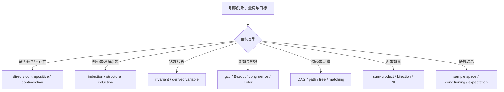

---
aliases:
  - MIT 6.042J Review and Final Exam
  - Mathematics for Computer Science Final Review
  - 离散数学综合复习与期末题解
tags:
  - discrete-mathematics
  - mit-ocw
  - course-note
  - exam-review
---

# Review and exam roadmap

> [!abstract] 本篇目标
> 把 35 个 Session 压缩成一套可执行的题型判断系统，并完整解答 Spring 2015 Final Exam。这里不重复四篇 Unit 的全部推导，而是回答：看到一道综合题时，怎样识别对象、选择工具、写出足够严密的答案并交叉验算？

## 资料与使用方式

- 课程总览：[[00_MIT OCW 6.042J course map|MIT 6.042J course map]]
- 原题：[[MIT_OCW_6.042J_Materials/07_Exams/MIT6_042JS15_finalexam.pdf#page=1|Final Exam p.1]]
- Unit 1：[[01_Proofs]]
- Unit 2：[[02_Structures]]
- Unit 3：[[03_Counting]]
- Unit 4：[[04_Probability]]

> [!warning] 答案来源
> MIT 公开材料没有提供本次考试的官方答案。以下均为**非官方独立题解**；每题附有定义检查、另一种推导或数值/结构验算，不能标作 official solution。

## 一、考试前的四层检查表

### Layer 1：先识别数学对象

| 题面对象 | 必须先写出的定义 |
|---|---|
| 命题与证明 | 论域、量词、假设、结论 |
| 整数与同余 | 模数是否为正、哪些量与模数互素 |
| graph | directed / undirected、simple、finite、connected |
| partial order | comparable、chain、antichain、prerequisite 方向 |
| counting | 一个 outcome 是什么、顺序与重复是否重要 |
| probability | experiment、sample space、event、概率质量 |
| random variable | 对每个 outcome 输出什么数值 |
| random walk | 转移方向、转移概率、初始分布 |

对象定义错误时，后续计算即使代数正确也没有意义。

### Layer 2：把目标翻译成结构

- “对所有 $n$”不是自动用归纳；先看 $n+1$ 情形是否可由更小规模构造。
- “不可能到达”通常寻找 [[State Machine Invariant|不变量]]。
- “至少有一个碰撞”通常寻找对象到盒子的映射。
- “平均有多少个”优先尝试 [[Indicator Random Variable|指示变量]]与[[Linearity of Expectation|期望线性性]]。
- “最大偏离概率”先检查变量是否非负、是否已知方差，再选 [[Markov Inequality]] 或 [[Chebyshev Inequality]]。
- “长期分布”先把平稳方程与从初始分布收敛分开；唯一性不等于收敛。

### Layer 3：选择方法，而不是套关键词

### Layer 4：输出前交叉验算

- 真值公式：列出唯一可能为假的行，或做完整 truth table。
- 同余：用一个小模数代入，并检查是否非法约分。
- 图：检查度数和为 $2|E|$、树边数为 $|V|-1$、拓扑顺序满足每条边。
- 计数：用小参数穷举；概率必须落在 $[0,1]$。
- PMF：总和为 $1$；期望单位与变量相同；方差非负且单位平方。
- upper bound：若界大于 $1$，最终概率界应取 $\min(1,\text{bound})$。

## 二、全课程最小公式表

### Proofs and logic

$$
P\Rightarrow Q\equiv\neg P\lor Q,
\qquad
\neg\forall x,P(x)\equiv\exists x,\neg P(x),
$$

$$
\neg\exists x,P(x)\equiv\forall x,\neg P(x).
$$

归纳证明需要 base case 与 $P(n)\Rightarrow P(n+1)$；不变量证明需要 initialization 与 preservation。

### Number theory

$$
\gcd(a,b)=\gcd(b,a-qb),
\qquad
ax+by=\gcd(a,b),
$$

$$
a\equiv b\pmod m\Longleftrightarrow m\mid(a-b),
$$

$$
\gcd(a,m)=1\Longrightarrow a^{\varphi(m)}\equiv1\pmod m.
$$

### Graphs and counting

$$
\sum_{v\in V}\deg(v)=2|E|,
\qquad
T\text{ is a tree}\Longrightarrow |E(T)|=|V(T)|-1.
$$

$$
\binom nk=\frac{n!}{k!(n-k)!},
\qquad
\#\{x_1+\cdots+x_k=n, x_i\ge0\}=\binom{n+k-1}{k-1}.
$$

### Probability

$$
\Pr(A\mid B)=\frac{\Pr(A\cap B)}{\Pr(B)},
\qquad
\Pr(A\cap B)=\Pr(A)\Pr(B)\quad\text{if independent},
$$

$$
\mathbb E\left[\sum_iX_i\right]=\sum_i\mathbb E[X_i],
$$

$$
\operatorname{Var}(X)=\mathbb E[X^2]-\mathbb E[X]^2,
$$

$$
X\ge0\Longrightarrow \Pr(X\ge a)\le\frac{\mathbb E[X]}a,
$$

$$
\Pr(|X-\mu|\ge a)\le\frac{\sigma^2}{a^2}.
$$

## 三、Final Exam 完整题解

### Problem 1：probable satisfiability

> [!question]- 题目与非官方题解
> **题目转述**：$P,Q,R$ 独立，且
> $$
> \Pr(P)=\frac12,\qquad \Pr(Q)=\frac13,\qquad \Pr(R)=\frac15.
> $$
> 求公式 $(P\Rightarrow Q)\Rightarrow R$ 为真的概率。原题见 [[MIT_OCW_6.042J_Materials/07_Exams/MIT6_042JS15_finalexam.pdf#page=2|Final p.2]]。
>
> **方法**：先找外层 implication 唯一为假的情形。
>
> $A\Rightarrow R$ 仅在 $A$ 真、$R$ 假时为假，这里 $A=(P\Rightarrow Q)$。内层 implication 仅在 $P$ 真、$Q$ 假时为假，因此
> $$
> \Pr(A)=1-\Pr(P\cap\neg Q)
> =1-\frac12\cdot\frac23
> =\frac23.
> $$
> $R$ 与 $P,Q$ 独立，所以 $A$ 与 $R$ 独立：
> $$
> \Pr(\text{公式为假})
> =\Pr(A)\Pr(\neg R)
> =\frac23\cdot\frac45
> =\frac8{15}.
> $$
> 故
> $$
> \boxed{\Pr(\text{公式为真})=1-\frac8{15}=\frac7{15}}.
> $$
>
> **检查**：若把 implication 错当成 conjunction，会漏掉“前件为假时 implication 自动为真”的行。

### Problem 2：induction and trees

> [!question]- 题目与非官方题解
> **题目转述**：若一张 simple graph 的顶点可排成某个顺序，使每个顶点至多与一个更早出现的顶点相邻，就称图 width 1。证明每棵有限树 width 1。原题见 [[MIT_OCW_6.042J_Materials/07_Exams/MIT6_042JS15_finalexam.pdf#page=3|Final p.3]]。
>
> **目标**：构造满足条件的顶点顺序。
>
> **对顶点数 $n$ 归纳。**
>
> Base case：$n=1$ 时唯一顶点没有更早邻点，结论成立。
>
> Induction step：假设每棵 $n$ 个顶点的树都存在所需顺序。任取 $n+1$ 个顶点的树 $T$。有限树至少有一片叶子 $v$；删去 $v$ 及其唯一相接边后，剩余图 $T-v$ 仍连通且无环，所以是一棵 $n$ 顶点树。
>
> 由归纳假设，$T-v$ 的顶点有顺序
> $$
> v_1,v_2,\ldots,v_n
> $$
> 使每个顶点至多有一个更早邻点。把叶子 $v$ 放到最后：
> $$
> v_1,v_2,\ldots,v_n,v.
> $$
> 前 $n$ 个顶点的更早邻点没有改变；$v$ 在整棵树中只有一个邻点，因此也至多有一个更早邻点。
>
> 由归纳法，所有有限树 width 1：
> $$
> \boxed{\text{Every finite tree has width }1.}
> $$
>
> **边界检查**：证明使用“有限树有叶子”；无限树不能直接套这个有限归纳。

### Problem 3：number theory true/false

> [!question]- 题目与非官方题解
> 原题见 [[MIT_OCW_6.042J_Materials/07_Exams/MIT6_042JS15_finalexam.pdf#page=4|Final p.4]]。全部变量为整数。
>
> **(a) False.** “对任意 $a,b$ 都存在 $x,y$ 使 $ax+by=1$”只有在 $\gcd(a,b)=1$ 时成立。取 $a=b=2$，左边恒为偶数，不可能等于 $1$。
>
> **(b) True.**
> $$
> \gcd(mb+r,b)=\gcd(r,b).
> $$
> 一个整数同时整除 $mb+r$ 与 $b$，当且仅当它同时整除 $(mb+r)-mb=r$ 与 $b$；两边公约数集合相同。
>
> **(c) False.** Fermat 小定理需要 $p\nmid k$。取 $p=2,k=2$：
> $$
> k^{p-1}=2\equiv0\not\equiv1\pmod2.
> $$
>
> **(d) True.** 若 $p\ne q$ 都是素数，则 $1\le k\le pq$ 中与 $pq$ 不互素的数是 $p$ 或 $q$ 的倍数。容斥得
> $$
> \varphi(pq)=pq-q-p+1=(p-1)(q-1).
> $$
>
> **(e) False.** 从 $ac\equiv bc\pmod d$ 约去 $c$ 需要 $\gcd(c,d)=1$，题目只说明 $a,b$ 分别与 $d$ 互素。取
> $$
> d=5,\quad a=1,\quad b=2,\quad c=5.
> $$
> 则 $ac\equiv bc\equiv0\pmod5$，但 $1\not\equiv2\pmod5$。

### Problem 4：scheduling and DAGs

> [!question]- 题目与非官方题解
> 有 $n$ 个单位时间任务，prerequisite 构成 partial order，最长 chain 含 $t$ 个任务。要求在恰好 $t$ 周内完成。原题见 [[MIT_OCW_6.042J_Materials/07_Exams/MIT6_042JS15_finalexam.pdf#page=5|Final p.5]]。
>
> **(a) 最小可能人员数。** 每个 Ringwraith 在 $t$ 周最多完成 $t$ 个任务，所以至少需要
> $$
> \left\lceil\frac nt\right\rceil.
> $$
> 这个下界可达到：把任务分成 $\lceil n/t\rceil$ 条互不依赖的 chains，每条长度至多 $t$，至少一条长度 $t$；每人顺序完成一条 chain。因此
> $$
> \boxed{\left\lceil\frac nt\right\rceil}.
> $$
>
> **(b) 最坏结构需要 $n-t+1$ 人。** 先处理边界 $t=1$：此时最长 chain 只有一个任务，所有 $n$ 个任务彼此不可比；要在唯一一周内完成，恰需 $n=n-t+1$ 人。
>
> 以下设 $t\ge2$。取一条长度 $t-1$ 的 chain
> $$
> a_1<a_2<\cdots<a_{t-1},
> $$
> 再放置 $n-t+1$ 个 final tasks $b_1,\ldots,b_{n-t+1}$，令每个都依赖 $a_{t-1}$，彼此不可比。
>
> 任意最长 chain 为
> $$
> a_1<\cdots<a_{t-1}<b_j,
> $$
> 长度正好 $t$。要在 $t$ 周内完成，$a_1,\ldots,a_{t-1}$ 必须占前 $t-1$ 周；所有 $b_j$ 只能在第 $t$ 周并行执行，所以需要
> $$
> \boxed{n-t+1}
> $$
> 个 Ringwraiths。

### Problem 5：impossible degree sequences

> [!question]- 题目与非官方题解
> 解释四个序列为何不可能是 connected simple graph 的 degree sequence。原题见 [[MIT_OCW_6.042J_Materials/07_Exams/MIT6_042JS15_finalexam.pdf#page=6|Final p.6]]。
>
> **(a) $(1,2,3,4,5,6,7)$.** 图有 $7$ 个顶点，simple graph 中最大度数为 $7-1=6$，所以度数 $7$ 不可能。
>
> **(b) $(1,3,3,4,4,4)$.** 度数和为
> $$
> 1+3+3+4+4+4=19,
> $$
> 是奇数，违反握手定理 $\sum_v\deg(v)=2|E|$。
>
> **(c) $(1,1,1,1)$.** 每个顶点度数为 $1$，图只能由两条互不相交的边组成，因此不连通。
>
> **(d) $(1,2,3,4,4)$.** 两个度数为 $4$ 的顶点都必须与其余四个顶点相邻，所以度数为 $1$ 的顶点至少同时邻接这两个顶点，度数至少为 $2$，矛盾。

### Problem 6：incomparable growth rates

> [!question]- 题目与非官方题解
> 构造 $f,g$，使 $f\notin O(g)$ 且 $g\notin O(f)$。原题见 [[MIT_OCW_6.042J_Materials/07_Exams/MIT6_042JS15_finalexam.pdf#page=7|Final p.7]]。
>
> 对 $n\ge1$ 定义
> $$
> f(n)=\begin{cases}n,&n\text{ even},\\1,&n\text{ odd},\end{cases}
> \qquad
> g(n)=\begin{cases}1,&n\text{ even},\\n,&n\text{ odd}.
> \end{cases}
> $$
> 沿偶数子序列，$f(n)/g(n)=n\to\infty$，所以不存在统一常数使 $f\le cg$，即 $f\notin O(g)$。沿奇数子序列，$g(n)/f(n)=n\to\infty$，所以 $g\notin O(f)$。
>
> 因此
> $$
> \boxed{f\text{ and }g\text{ are incomparable under big O}.}
> $$

### Problem 7：counting poker hands

> [!question]- 题目与非官方题解
> 标准 52 张牌中取 5 张。原题见 [[MIT_OCW_6.042J_Materials/07_Exams/MIT6_042JS15_finalexam.pdf#page=8|Final p.8]]。
>
> **(a) No-pair hands.** 先选 $5$ 个不同 ranks，再为每个 rank 选一个 suit：
> $$
> \boxed{|H_{NP}|=\binom{13}{5}4^5}.
> $$
>
> **(b) Straights.** rank 序列有 $10$ 种（A2345 到 TJQKA），每个 rank 的 suit 独立选择：
> $$
> \boxed{|H_S|=10\cdot4^5}.
> $$
>
> **(c) Flushes.** 先选一种 suit，再从该 suit 的 $13$ 张牌中选 $5$ 张：
> $$
> \boxed{|H_F|=4\binom{13}{5}}.
> $$
>
> **(d) Straight flushes.** 选 $10$ 种 rank 序列之一和 $4$ 种 suit 之一：
> $$
> \boxed{|H_{SF}|=40}.
> $$
>
> **(e) High-card hands.** 从 no-pair hands 中排除 straights 与 flushes；straight flush 被减了两次，所以加回：
> $$
> \boxed{|H_{HC}|=\binom{13}{5}4^5-10\cdot4^5-4\binom{13}{5}+40}.
> $$
>
> **检查**：同一 suit 不可能出现相同 rank 的两张牌，所以所有 flush 都已包含在 no-pair 集合中，容斥的全集选择正确。

### Problem 8：conditional probability and restart

> [!question]- 题目与非官方题解
> Monty Hall 变体中，Carol 从参赛者未选的两扇门随机开一扇；若开出 prize，整局独立重启，直到开出 goat。$GP$ 表示首猜中奖，$OP$ 表示至少重启一次。原题见 [[MIT_OCW_6.042J_Materials/07_Exams/MIT6_042JS15_finalexam.pdf#page=9|Final p.9]]。
>
> **(a)** 条件在 $\overline{GP}$ 下，未选两门中恰有一扇 prize、一扇 goat，所以
> $$
> \boxed{\Pr(OP\mid\overline{GP})=\frac12}.
> $$
>
> **(b)** 首猜错误概率为 $2/3$；首猜正确时不可能开出 prize。因此
> $$
> \boxed{\Pr(OP)=\frac23\cdot\frac12=\frac13}.
> $$
>
> **(c)** 每一轮以 $p=1/3$ 重启，连续重启 $n$ 次的概率为 $p^n$，所以永远重启的概率是
> $$
> \boxed{\lim_{n\to\infty}(1/3)^n=0}.
> $$
>
> **(d)** 采用 stick 策略，令 $w=\Pr(W)$。
>
> i. 若 $GP$，当前选择就是 prize，且 Carol 必开 goat：
> $$
> \boxed{\Pr(W\mid GP)=1}.
> $$
>
> ii. 若 $\overline{GP}\cap OP$，本轮重启；重启后的问题与原问题同分布：
> $$
> \boxed{\Pr(W\mid\overline{GP}\cap OP)=w}.
> $$
>
> iii. 若 $\overline{GP}\cap\overline{OP}$，首猜是 goat，Carol 开了另一只 goat；坚持原门必输：
> $$
> \boxed{\Pr(W\mid\overline{GP}\cap\overline{OP})=0}.
> $$
>
> **(e)** 对首轮三种互斥结果使用全概率公式：
> $$
> w=\frac13\cdot1+\left(\frac23\cdot\frac12\right)w
> +\left(\frac23\cdot\frac12\right)0.
> $$
> 故 $w=1/3+w/3$，
> $$
> \boxed{w=\Pr(W)=\frac12}.
> $$
>
> **(f)** $R$ 是停止前的 restart 次数，服从“失败次数”参数化的 geometric distribution。若 $p=\Pr(OP)$，则
> $$
> \Pr(R=r)=p^r(1-p),\qquad r=0,1,\ldots,
> $$
> 所以
> $$
> \boxed{\mathbb E[R]=\frac{p}{1-p}=\frac12}.
> $$

### Problem 9：degree two in a random graph

> [!question]- 题目与非官方题解
> $n$ 个顶点中，每一对顶点独立地以概率 $p$ 放置一条边。原题见 [[MIT_OCW_6.042J_Materials/07_Exams/MIT6_042JS15_finalexam.pdf#page=10|Final p.10]]。
>
> **(a)** 固定顶点有 $n-1$ 条潜在 incident edges；其度数服从 Binomial$(n-1,p)$。恰有两条边出现：
> $$
> \boxed{t=\Pr(\deg(v)=2)=\binom{n-1}{2}p^2(1-p)^{n-3}}.
> $$
> 该式按通常情形 $n\ge3$ 书写；若 $n<3$，顶点不可能有度数 $2$，所以 $t=0$。
>
> **(b)** 对每个顶点 $v$ 定义 indicator $I_v=1$ 当且仅当 $\deg(v)=2$。令 $X=\sum_vI_v$，则无需各 $I_v$ 独立：
> $$
> \mathbb E[X]=\sum_v\mathbb E[I_v]
> =\sum_v\Pr(\deg(v)=2)
> =\boxed{nt}.
> $$

### Problem 10：variance of winning tries

> [!question]- 题目与非官方题解
> 第 $i$ 次 try 独立抛币 $i$ 次，全部为 heads 才赢；head 概率为 $p$。$W$ 是前 $n$ 次 try 中获胜次数。原题见 [[MIT_OCW_6.042J_Materials/07_Exams/MIT6_042JS15_finalexam.pdf#page=11|Final p.11]]。
>
> 令 $X_i$ 是第 $i$ 次 try 获胜的 indicator，则
> $$
> \Pr(X_i=1)=p^i,\qquad
> \operatorname{Var}(X_i)=p^i(1-p^i).
> $$
> 不同 tries 独立，所以
> $$
> \operatorname{Var}(W)
> =\sum_{i=1}^n\operatorname{Var}(X_i)
> =\boxed{\sum_{i=1}^n(p^i-p^{2i})}.
> $$
> 对 $0\le p<1$，几何和给出
> $$
> \boxed{
> \operatorname{Var}(W)
> =\frac{p(1-p^n)}{1-p}
> -\frac{p^2(1-p^{2n})}{1-p^2}}
> $$
>；当 $p=1$ 时所有 tries 必胜，方差为 $0$，与求和形式一致。

### Problem 11：Markov and Chebyshev bounds

> [!question]- 题目与非官方题解
> 每天玩 draw poker 35 手、blackjack 30 手、stud poker 20 手；单手胜率依次为 $1/7,1/6,1/5$。$W$ 为一天获胜手数。原题见 [[MIT_OCW_6.042J_Materials/07_Exams/MIT6_042JS15_finalexam.pdf#page=12|Final p.12]]。
>
> **(a)** 期望线性性不要求独立：
> $$
> \mathbb E[W]
> =35\cdot\frac17+30\cdot\frac16+20\cdot\frac15
> =5+5+4
> =\boxed{14}.
> $$
>
> **(b)** 因 $W\ge0$，Markov 给出
> $$
> \boxed{\Pr(W\ge45)\le\frac{14}{45}}.
> $$
>
> **(c)** 题设给出 pairwise independence，足以使不同手的 covariance 为零。Bernoulli$(q)$ 方差为 $q(1-q)$，所以
> $$
> v:=\operatorname{Var}(W)
> =35\frac17\frac67
> +30\frac16\frac56
> +20\frac15\frac45
> =\boxed{\frac{30}{7}+\frac{25}{6}+\frac{16}{5}}
> =\frac{2447}{210}.
> $$
>
> **(d)** $W\ge45$ 蕴含 $|W-14|\ge31$，故
> $$
> \Pr(W\ge45)
> \le\Pr(|W-14|\ge31)
> \le\boxed{\frac{v}{31^2}}
> =\frac{v}{961}.
> $$
> 这是把单侧事件放进双侧 Chebyshev 事件得到的合法上界。

### Problem 12：random walk counterexamples

> [!question]- 题目与非官方题解
> 给出满足指定性质的简单 random-walk graphs。原题见 [[MIT_OCW_6.042J_Materials/07_Exams/MIT6_042JS15_finalexam.pdf#page=13|Final p.13]]。
>
> **(a) 不可数多个 stationary distributions。** 取两个状态 $A,B$，各自只有 self-loop：
> $$
> P=\begin{bmatrix}1&0\\0&1\end{bmatrix}.
> $$
> 对任意 $\alpha\in[0,1]$，
> $$
> \pi_\alpha=(\alpha,1-\alpha)
> $$
> 都满足 $\pi_\alpha P=\pi_\alpha$。区间 $[0,1]$ 不可数，所以 stationary distributions 不可数。
>
> **(b) 唯一 stationary distribution，但图不 strongly connected。** 取 $A\to B$，$B\to B$：
> $$
> P=\begin{bmatrix}0&1\\0&1\end{bmatrix}.
> $$
> 图中不能从 $B$ 回到 $A$，所以不 strongly connected。解 $\pi P=\pi$ 得唯一解
> $$
> \boxed{\pi=(0,1)}.
> $$
>
> **(c) strongly connected，但某初始分布不收敛。** 取有向二环 $A\to B\to A$：
> $$
> P=\begin{bmatrix}0&1\\1&0\end{bmatrix}.
> $$
> 它 strongly connected，唯一 stationary distribution 是 $(1/2,1/2)$。但从 $\mu_0=(1,0)$ 出发，
> $$
> \mu_{2k}=(1,0),\qquad \mu_{2k+1}=(0,1),
> $$
> 永远振荡而不收敛。失败原因是周期为 $2$，不是缺少 stationary distribution。

## 四、Final 结果总表

| Problem | 核心答案 |
|---:|---|
| 1 | $7/15$ |
| 2 | 删除叶子归纳，最后附加叶子 |
| 3 | F, T, F, T, F |
| 4 | $\lceil n/t\rceil$；最坏需要 $n-t+1$ |
| 5 | 最大度、握手定理、不连通、两个 universal vertices |
| 6 | 偶/奇子序列交替增长的 $f,g$ |
| 7 | no pair、straight、flush 的容斥公式 |
| 8 | $\Pr(OP)=1/3$，stick win $=1/2$，$E[R]=1/2$ |
| 9 | $\binom{n-1}{2}p^2(1-p)^{n-3}$；乘 $n$ |
| 10 | $\sum_{i=1}^n p^i(1-p^i)$ |
| 11 | $E[W]=14$；Markov $14/45$；Chebyshev $v/961$ |
| 12 | 两吸收态；单吸收态；周期二环 |

## 五、最后的错误诊断清单

- implication 的前件为假时整个 implication 为真。
- Bézout 等式右侧是 gcd；不互素时不能得到 $1$。
- 模运算约分必须检查被约因子的逆元。
- degree sequence 先检查范围、偶数和，再检查局部邻接强制条件。
- big O 需要对所有足够大的 $n$ 使用同一个常数；只比较一条子序列可用于反证。
- 计数前先定义全集；容斥的交集必须加回。
- 条件概率的条件事件会改变权重，不能交换条件方向。
- 期望线性性不要求独立；方差相加需要 covariance 为零。
- 平稳分布、唯一平稳分布和从给定初始分布收敛是三个不同命题。

**最终知识链：**精确命题 → 证明结构 → 数论与图模型 → 组合计数 → 概率模型 → 期望与偏差 → 随机游走长期行为。
