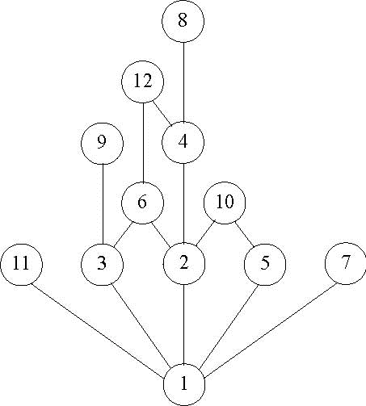

# 2.6.7 The Divisibility DAG

> [!info] 来源说明
> 题目、正确答案与反馈均从 MIT OCW 官方离线课程包提取；动态作答控件已转换为静态 Markdown。
> [官方课程页](https://ocw.mit.edu/courses/electrical-engineering-and-computer-science/6-042j-mathematics-for-computer-science-spring-2015/structures/tp7-1/vertical-839e7a19a176/)

## Official exercise

In the above DAG for the divisibility relation on \(\{1, \ldots, 12\}\), there
is an upward path from \(a\) to \(b\) iff \(a\) divides \(b\).
If \(24\) was added as a vertex, what is the minimum number of edges that
must be added to the DAG to represent divisibility on \(\{1, \ldots, 12, 24\}\)?

Exercise 1

[response]

## Official answers and feedback

> [!answer]- Q1 — official answer
> **Answer:** 2
>
> **Official feedback:**
> Edges from 8 and 12 to 24 are all that are needed.
