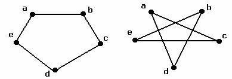
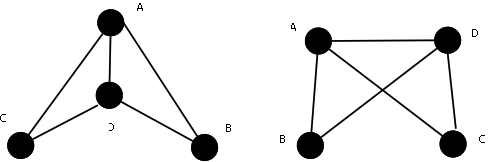

# 2.8.4 Isomorphism

> [!info] 来源说明
> 题目、正确答案与反馈均从 MIT OCW 官方离线课程包提取；动态作答控件已转换为静态 Markdown。
> [官方课程页](https://ocw.mit.edu/courses/electrical-engineering-and-computer-science/6-042j-mathematics-for-computer-science-spring-2015/structures/tp7-2/vertical-206635abfb7b/)

## Official exercise

Pair 1:

Pair 2:

Pair 3:

1. Which pair of graphs are/is isomorphic?

   Exercise 1

   [ ] Pair 1

   [ ] Pair 2

   [ ] Pair 3
  
2. Which of these properties is **NOT** preserved under isomorphism for a graph G?

   Exercise 2

   [Choose one: number of nodes | total degree of nodes | none of the numerical labels of vertices of G are even]

## Official answers and feedback

> [!answer]- Q1 — official answer
> **Answer:** Pair 2; Pair 3

> [!answer]- Q2 — official answer
> **Answer:** none of the numerical labels of vertices of G are even
