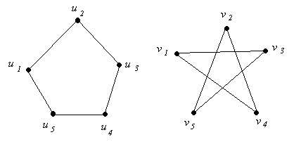

# 2.8.6 Isomorphic Graphs

> [!info] 来源说明
> 题目、正确答案与反馈均从 MIT OCW 官方离线课程包提取；动态作答控件已转换为静态 Markdown。
> [官方课程页](https://ocw.mit.edu/courses/electrical-engineering-and-computer-science/6-042j-mathematics-for-computer-science-spring-2015/structures/tp7-2/vertical-b30a643c515e/)

## Official exercise

The two graphs above are isomorphic, which means that there exists an edge-preserving bijection
from the set of vertices of the graph on the left to the set of vertices of the graph on the right.

How many such bijections are there?

Exercise 1

[response]

## Official answers and feedback

> [!answer]- Q1 — official answer
> **Answer:** 10
>
> **Official feedback:**
> We may first map \(u\_1\) to any of the 5 vertices of the graph on the right (let's call this vertex \(v\_1 \)). We then map \(u\_2\) to either of \(v\_1 \)'s 2 neighbors. The remaining vertices are then uniquely determined.
