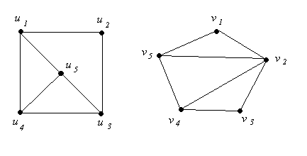

# 2.8.7 Non-Isomorphic Graphs

> [!info] 来源说明
> 题目、正确答案与反馈均从 MIT OCW 官方离线课程包提取；动态作答控件已转换为静态 Markdown。
> [官方课程页](https://ocw.mit.edu/courses/electrical-engineering-and-computer-science/6-042j-mathematics-for-computer-science-spring-2015/structures/tp7-2/vertical-3c93d1aadcac/)

## Official exercise

Let's call the graph on the left \(G \) and the graph on the right \(H \). The two graphs are not isomorphic. Indicate which of the following assertions can prove this fact.

Exercise 1

[ ] \(H\) has a vertex of degree 4, but \(G\) does not.

[ ] \(u\_1\) has degree 3, but \(v\_1\) has degree 2.

[ ] \(G\) has four vertices of degree 3, but \(H\) has only two vertices of degree 3.

[ ] \(G\) has a vertex named \(u\_1\), but \(H\) does not.

[ ] \(G\) has three vertices that form a right triangle, but no three vertices of \(H\) form a right triangle.

[ ] \(G\) has an edge that is incident to two vertices of degree 3, but \(H\) does not.

## Official answers and feedback

> [!answer]- Q1 — official answer
> **Answer:** \(H\) has a vertex of degree 4, but \(G\) does not.; \(G\) has four vertices of degree 3, but \(H\) has only two vertices of degree 3.
>
> **Official feedback:**
> Note that the last assertion mentions properties that *are* preserved under isomorphism, and so if it were true,
> it could prove that \(G\) and \(H\) are not isomorphic. Unfortunately, this assertion isn't true;
> both graphs actually have an edge that is incident to two vertices of degree 3.
