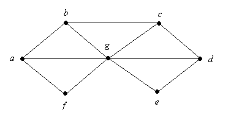

# 2.9.6 Graph Coloring I

> [!info] 来源说明
> 题目、正确答案与反馈均从 MIT OCW 官方离线课程包提取；动态作答控件已转换为静态 Markdown。
> [官方课程页](https://ocw.mit.edu/courses/electrical-engineering-and-computer-science/6-042j-mathematics-for-computer-science-spring-2015/structures/tp7-3/vertical-c79a8bf5b197/)

## Official exercise

  

What is the chromatic number of the above graph?

Exercise 1

[response]

## Official answers and feedback

> [!answer]- Q1 — official answer
> **Answer:** 3
>
> **Official feedback:**
> The chromatic number of this graph is 3. First, observe that 3 colors are sufficient. Two colors are enough for the vertices \((a, b, c, d, e, \text{ and } f)\),
> if we alternate their colors moving in a circle around the
> figure. A third color can be used for the vertex, \(g\), in the
> center, and this completes the coloring.
> Second, 3 colors are necessary. This is because the graph
> contains a triangle (for example, the one formed by \(a\), \(b\), and \(g\)), and any triangle needs 3 colors.
