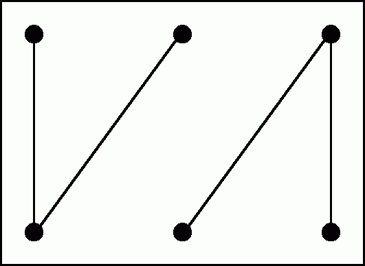
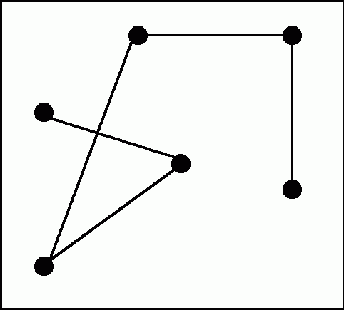
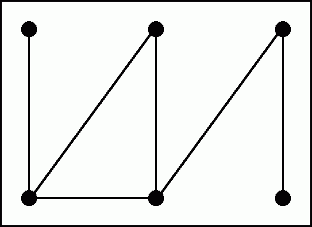
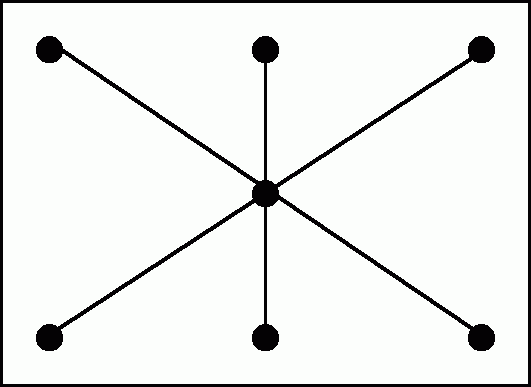

# 2.10.7 Tree or Not Tree?

> [!info] 来源说明
> 题目、正确答案与反馈均从 MIT OCW 官方离线课程包提取；动态作答控件已转换为静态 Markdown。
> [官方课程页](https://ocw.mit.edu/courses/electrical-engineering-and-computer-science/6-042j-mathematics-for-computer-science-spring-2015/structures/tp8-1/vertical-7bacea60d91e/)

## Official exercise

Which of the following graphs are trees?

Exercise 1

[ ] 

[ ] 

[ ] 

[ ] 

## Official answers and feedback

> [!answer]- Q1 — official answer
> **Answer:** See the official feedback below.
>
> **Official feedback:**
> Graphs 2 and 4 are trees, since they are both connected and acyclic. In contrast, graphs 1 and 3 are not trees: graph 1 is disconnected, while graph 3 contains a cycle.
