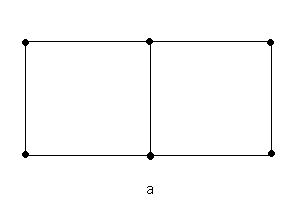
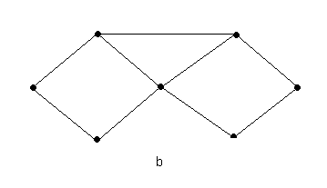
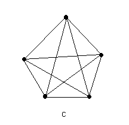

# 2.11.11 Bipartite Graphs

> [!info] 来源说明
> 题目、正确答案与反馈均从 MIT OCW 官方离线课程包提取；动态作答控件已转换为静态 Markdown。
> [官方课程页](https://ocw.mit.edu/courses/electrical-engineering-and-computer-science/6-042j-mathematics-for-computer-science-spring-2015/structures/stable-matching/bipartite-graphs-5/)

## Official exercise

  
  

Which of the graphs above are bipartite? Give your answer as a sequence of the labels separated by some spaces in any order such as "b a".
Don't use commas or parentheses.

Exercise 1

[response]

## Official answers and feedback

> [!answer]- Q1 — official answer
> **Answer:** a
>
> **Official feedback:**
> Graph a is bipartite: The first color is assigned to the top-left, bottom-middle, and top-right vertices; the second color is assigned to the other three vertices.  
>   
> Graphs b and c are not bipartite, as they contain cycles of odd length.
