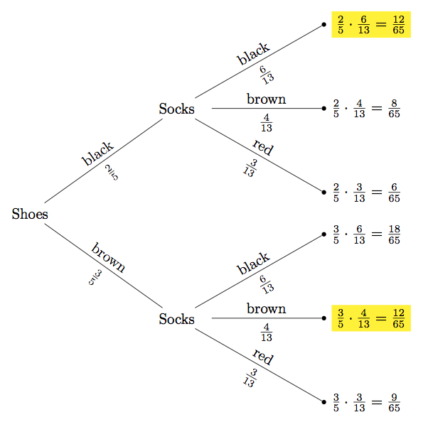

# 4.1.2 Socks and Shoes

> [!info] 来源说明
> 题目、正确答案与反馈均从 MIT OCW 官方离线课程包提取；动态作答控件已转换为静态 Markdown。
> [官方课程页](https://ocw.mit.edu/courses/electrical-engineering-and-computer-science/6-042j-mathematics-for-computer-science-spring-2015/probability/tp11-2/vertical-dcc88d262213/)

## Official exercise

Parker has two pairs of black shoes and three pairs of brown shoes. He also has three pairs of red socks, four pairs of brown socks and six pairs of black socks.

Now let's say that Parker chooses a pair of shoes at random and a pair of socks at random. We would like to know the probability of him choosing shoes and socks of the same color.

1. **Identify the outcomes!** An outcome is \_\_\_\_\_.

   Exercise 1

   [Choose one: a pair of shoes | a pair of socks | a pair of colors | all permutations of shoes and socks | a color]
  
2. **Identify the event of interest!**

   - How many outcomes are there in total?

     Exercise 2

     [response]
     
   - How many outcomes are there in the event of interest?

     Exercise 3

     [response]
  
3. **Assign outcome probabilities**

   Please answer in the form of decimals with four significant digits.

   - What is the probability of choosing black shoes?

     Exercise 4

     [response]
     
   - What is the probability of choosing red socks?

     Exercise 5

     [response]
  
4. **Compute event probabilities!**

   Please answer in the form of decimals with four significant digits.

   What is the probability that he chooses shoes and socks of the same color?

   Exercise 6

   [response]

## Official answers and feedback

> [!answer]- Q1 — official answer
> **Answer:** a pair of colors
>
> **Official feedback:**
> We care about the color of the shoes and socks, so an outcome is determined by the color of the shoes and the color of the socks. Therefore, the correct answer is *a pair of colors.*

> [!answer]- Q2 — official answer
> **Answer:** 6
> **Tolerance:** .001
>
> **Official feedback:**
> There are two possible colors for shoes and three possible for socks. Hence, the total is 2\(\cdot\)3=6.

> [!answer]- Q3 — official answer
> **Answer:** 2
> **Tolerance:** .001
>
> **Official feedback:**
> The outcomes of interest (highlighted in tree below) are the ones where the colors are either both brown or both black. There is one of each.

> [!answer]- Q4 — official answer
> **Answer:** 0.4
> **Tolerance:** .001
>
> **Official feedback:**
> There are 5 pairs of shoes in total, 3 brown and 2 black. Since Parker chooses the shoes at random, the probability of choosing black shoes is \(\frac{2}{5}\).

> [!answer]- Q5 — official answer
> **Answer:** .2307
> **Tolerance:** .001
>
> **Official feedback:**
> There are 13 pairs of socks in total, 3 red, 4 brown, and 6 black. Since Parker chooses the socks at random, the probability of choosing red socks is \(\frac{3}{13}\).

> [!answer]- Q6 — official answer
> **Answer:** 0.3692
> **Tolerance:** .001
>
> **Official feedback:**
> Using the four step method we construct a probability tree:
> 
>   
> The probability of the event of interest is the sum of its outcomes. Therefore the probability that he chooses shoes and socks of the same color is: \(\frac{12}{65}+\frac{12}{65}=\frac{24}{65}\).
