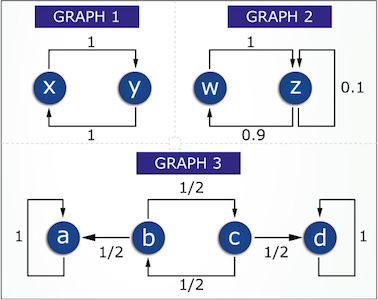

# 4.8.5 Random Walks (cont.)

> [!info] 来源说明
> 题目、正确答案与反馈均从 MIT OCW 官方离线课程包提取；动态作答控件已转换为静态 Markdown。
> [官方课程页](https://ocw.mit.edu/courses/electrical-engineering-and-computer-science/6-042j-mathematics-for-computer-science-spring-2015/probability/random-walks-pagerank/random-walks-cont/)

## Official exercise

Consider the following random-walk graphs:

1. If you start at node \(w\) in graph 2 and take a (long) random walk, does the distribution over nodes ever get close to the stationary distribution? Try a few steps to see what is happening.

   Exercise 1

   ( )  Yes

   ( )  No
2. How many stationary distributions are there for graph 3?

   Exercise 2

   ( )  0

   ( )  1

   ( )  2

   ( )  4

   ( )  \(2^4\)

   ( )  infinitely many
3. If you start at node \(b\) in graph 3 and take a (long) random walk, the probabililty you are at node \(d\) will be close to:

   Exercise 3

   ( ) \(0\)

   ( )  \(\left(\frac{1}{2}\right)^n\)

   ( ) \(\dfrac{1}{4}\)

   ( ) \(\dfrac{5}{16}\)

   ( )  \(\dfrac{1}{3}\)

   ( )  \(\dfrac{1}{2}\)

   ( )  \(\dfrac{2}{3}\)

   ( )  \(1\)

## Official answers and feedback

> [!answer]- Q1 — official answer
> **Answer:** Yes

> [!answer]- Q2 — official answer
> **Answer:** infinitely many

> [!answer]- Q3 — official answer
> **Answer:** \(\dfrac{1}{3}\)
