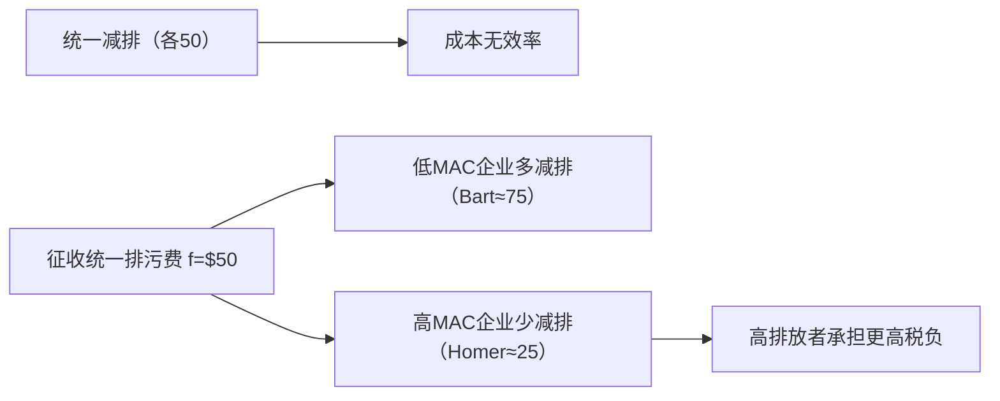

# 从一个例子讲起：Bart与Lisa
<!-- bilingual-en:start -->
*Starting with an Example: Bart and Lisa*
<!-- bilingual-en:end -->

<!-- topic51-calibration:entry:start -->
> [!tip] 连续阅读
> [[02_Economy/02_public finance财政学/03_外部性与政策选择|外部性与政策选择]]把本课情境、图形、推导与政策比较串在一起；[[外部性与内部化政策.canvas|关系图]]展示概念和条件的连接。以下保留课堂记录，各处校注可与原表达对照。
> <!-- bilingual-en:start -->
> [[02_Economy/02_public finance财政学/03_外部性与政策选择|Externalities and policy choice]] connects the example, graph, derivations and policy comparison; the [[外部性与内部化政策.canvas|map]] shows relationships. The classroom record remains below with adjacent qualifications.
> <!-- bilingual-en:end -->
<!-- topic51-calibration:entry:end -->
* Bart有一个工厂，并向一条没有主人的河流里排放污水
* Lisa靠在这条河里捕鱼维生。
<!-- bilingual-en:start -->
* Bart owns a factory that discharges wastewater into an unowned river.
* Lisa earns her living by fishing in that river.
<!-- bilingual-en:end -->

>[!note] 定义(Definition)
> <!-- bilingual-en:start -->
> *Definition*
> <!-- bilingual-en:end -->
>
> * [[外部性|Externality]] : An activity of one entity that affects the welfare of another entity in a way that is outside the market mechanism。
> * 某一实体的活动以没有反映在市场价格中的某种方式直接影响他人福利，这种影响被称为外部性([[外部性|externality]])。
> <!-- bilingual-en:start -->
> * An externality occurs when one entity's activity directly affects another person's welfare in a way that is not reflected in market prices.
> <!-- bilingual-en:end -->
> eg：Bart向河中排放了污水，他本应支付排污的成本但是他事实上并未支付，而是产生了负的外部性。
> <!-- bilingual-en:start -->
> For example, Bart discharges wastewater into the river without paying for the harm caused by the pollution, thereby creating a negative externality.
> <!-- bilingual-en:end -->
>
# 对于负外部性的处理
<!-- bilingual-en:start -->
*Addressing Negative Externalities*
<!-- bilingual-en:end -->

负外部性会导致自由市场产量水平大于社会效率水平
<!-- bilingual-en:start -->
A negative externality causes the free market to produce more than the socially efficient quantity because the producer does not bear the full external cost.
<!-- bilingual-en:end -->
The Nature of [[外部性|Externalities]]-Graphical Analysis $ Reduction from Q, to Q" means dcg Eee profit loss for Supplier and dchg welfare gain for Demander. 5 边际 私人 成 本 h d 8 MD 边际 损害 “ a_ie ° Q* Q payee TE Ta 人 Actual output oer year SAN 285, PE Ber 0044 buy MeCram till Edueatien All Biahte Bacanrad 5.
<!-- bilingual-en:start -->
This corrupted OCR describes the standard graph: reducing output from the market quantity toward the efficient quantity costs the supplier some profit but gives the affected party a larger welfare gain; the graph labels marginal private cost and marginal damage.
<!-- bilingual-en:end -->
![[Pasted image 20240315133213.png]]
如果Bart减产则Bart少∆dcg这些收入但是Lisa得到红色部分，所以社会总产出会增加。
<!-- bilingual-en:start -->
If Bart reduces output, he loses the income represented by area ∆dcg, while Lisa gains the red area. Because Lisa's gain exceeds Bart's loss over this range, total social surplus rises.
<!-- bilingual-en:end -->

正外部性会导致自由市场产量水平小于社会效率水平
<!-- bilingual-en:start -->
A positive externality causes the free market to produce less than the socially efficient quantity because the decision-maker does not capture all of the benefits created for others.
<!-- bilingual-en:end -->

<!-- topic51-calibration:quantity-graph:start -->
> [!note] 数量、损害与净收益
> 上述数量方向采用[[外部性数量偏离|单一外部性、竞争和内点的基准条件]]；其他扭曲下应重写完整边际条件。原图的红色 $dchg$ 是避免的外部损害，$dcg$ 是牺牲的私人净收益，差额 $dhg$ 才是净社会改善。若 $MB$ 是产品市场需求曲线，私人净收益一般包括消费者与生产者剩余，不能一概称为供应商利润。产量下降时增加的是扣除损害的净价值，不是物理“总产出”；是否应减至零见[[最优污染边界]]。
> <!-- bilingual-en:start -->
> The quantity direction uses the [[外部性数量偏离|single-externality, competitive interior benchmark]]. In the graph, red area $dchg$ is avoided damage; $dcg$ is forgone private net benefit; only $dhg$ is the net gain. If $MB$ is product-market demand, private net benefit generally includes both consumer and producer surplus, not solely supplier profit. Net value can rise while physical output falls. See [[最优污染边界|the boundary conditions]] for zero emissions.
> <!-- bilingual-en:end -->
<!-- topic51-calibration:quantity-graph:end -->

## 私人对策
<!-- bilingual-en:start -->
*Private Responses*
<!-- bilingual-en:end -->

### 讨价换件和科斯定理
<!-- bilingual-en:start -->
*Bargaining and the Coase Theorem*
<!-- bilingual-en:end -->

#### 讨价还价
<!-- bilingual-en:start -->
*Bargaining*
<!-- bilingual-en:end -->
当产权被严格划分时，可以通过讨价还价达到新的均衡
eg：将河划分给Bart则Lisa需要给Bart钱Bart才乐意减产以平衡收入的降低
若需求方愿意转移支付，供给方可以把污染（或产量）从 $Q_1$ 调整到社会更优的 $Q^*$。只要 $MD>(MB-MPC)$，就存在讨价还价空间。
<!-- bilingual-en:start -->
When property rights are clearly assigned, bargaining can move the parties to a new equilibrium. For example, if Bart owns the river, Lisa can compensate him for reducing output enough to offset his lost income. More generally, if the harmed party is willing to transfer part of the avoided damage to the polluter, pollution or output can move from $Q_1$ toward the socially preferable $Q^*$. Bargaining is possible whenever $MD>(MB-MPC)$.
<!-- bilingual-en:end -->

。 MD >(MB-— MPC) => the opportunity for a bargain exists
满足上述不等式的时候就还有讲价的区间，否则就没必要讲价。
事实上付的钱是一个范围而非一个定值。
<!-- bilingual-en:start -->
The inequality defines a bargaining interval: if it holds, both parties can gain from an agreement; otherwise there is no mutually beneficial bargain. The transfer is therefore a negotiable range, not one uniquely determined payment.
<!-- bilingual-en:end -->

<!-- topic51-calibration:bargaining:start -->
> [!note] 边际机会与整段补偿不同
> $MD>MB-MPC$ 比较下一小单位的得失。对一整段减排，[[外部性谈判区间|支付下限是损失的私人净收益，上限是避免的总损害]]，需要累计而非直接拿一个边际数作总价。有互利区间不保证谈判成功；原流程图到达 $Q^*$ 还以有效协商和执行为条件。
> <!-- bilingual-en:start -->
> The inequality compares the next small unit. For a finite reduction, [[外部性谈判区间|the transfer bounds are forgone private benefit and total avoided damage]], requiring accumulation rather than a marginal number as the total payment. A nonempty interval does not guarantee agreement; the flow to $Q^*$ presumes effective bargaining and enforcement.
> <!-- bilingual-en:end -->
<!-- topic51-calibration:bargaining:end -->

#### [[科斯定理]]
<!-- bilingual-en:start -->
*The Coase Theorem*
<!-- bilingual-en:end -->

* 前提条件：讨价还价成本低，产权可严格划分。
* 科斯定律起作用的必要假设：各方讨价还价成本很低，资源所有者能够识别使其财产受到损害的源头,且在防止伤害上能够得到法律保护。
<!-- bilingual-en:start -->
* Preconditions: bargaining costs are low and property rights can be assigned clearly.
* For the Coase mechanism to work, the parties must face low bargaining costs, resource owners must be able to identify the source of the harm, and the law must protect their ability to prevent or obtain redress for that harm.
<!-- bilingual-en:end -->

<!-- topic51-calibration:coase:start -->
> [!note] 效率基准和现实可行性分开
> [[科斯定理]]使用明确可交易的权利与无成本有效协商作为效率基准；“成本较低、人数较少”只是有利于现实协商，不保证达到该基准。[[科斯产权不变性|初始权利不改最终活动量]]还需排除相关财富效应并能实现同一有效配置。现实中分别检查[[交易成本]]、[[钳制问题]]与[[公共品搭便车|不愿为共享收益贡献的激励]]。
> <!-- bilingual-en:start -->
> The [[科斯定理|Coase benchmark]] assumes clear transferable rights and costless efficient bargaining. Low costs or few parties alone do not guarantee it. [[科斯产权不变性|Invariance to initial rights]] also requires no relevant wealth effects and access to the same efficient allocation. Check [[交易成本|transaction costs]], [[钳制问题|holdout]] and [[公共品搭便车|free-riding incentives]] separately.
> <!-- bilingual-en:end -->
<!-- topic51-calibration:coase:end -->
### 其他解决办法
<!-- bilingual-en:start -->
*Other Private Responses*
<!-- bilingual-en:end -->

#### 合并（外部性内部化）
<!-- bilingual-en:start -->
*Merger: Internalising the Externality*
<!-- bilingual-en:end -->
俩人结婚就行
<!-- bilingual-en:start -->
If the two parties merge their interests—for example, if Bart and Lisa form one household—the external cost becomes part of their joint decision and is therefore internalised.
<!-- bilingual-en:end -->
#### 社会习俗，道德
<!-- bilingual-en:start -->
*Social Norms and Morality*
<!-- bilingual-en:end -->
己所不欲，勿施于人
<!-- bilingual-en:start -->
Social norms can discourage people from imposing harms on others: do not do to others what you would not want done to yourself.
<!-- bilingual-en:end -->

<!-- topic51-calibration:integration:start -->
> [!note] 统一目标才改变核算
> [[合并内部化]]把相关私人收益与损害纳入同一决策目标；组织身份改变本身不保证做到，未纳入的第三方损害和组织成本还须保留。社会习俗则可能改变声誉或对他人得失的重视，不能直接推出某个唯一有效数量。
> <!-- bilingual-en:start -->
> [[合并内部化|Integration]] incorporates the relevant returns and damage into one objective; an organisational label alone does not establish this. Third-party harm and organisational costs remain relevant. Norms may alter reputation or concern for others without uniquely implementing an efficient quantity.
> <!-- bilingual-en:end -->
<!-- topic51-calibration:integration:end -->

## 公共对策
<!-- bilingual-en:start -->
*Public Policy Responses*
<!-- bilingual-en:end -->
* MSB: the marginal social benefit to Lisa of each unit of pollution Bart reduces.
* MC: the marginal cost to Bart of reducing each unit of pollution.
* Cost for reducing pollution can stem from reducing output,shifting to cleaner inputs, or installing a new technology to control pollution.
### 征收庇古税
<!-- bilingual-en:start -->
*Pigouvian Taxation*
<!-- bilingual-en:end -->
庇古税通过提高污染行为的私人成本，使决策从 $Q_1$ 向社会最优 $Q^*$ 收敛，并形成税收收入。
<!-- bilingual-en:start -->
A Pigouvian tax raises the private cost of polluting, moving the decision from $Q_1$ toward the socially optimal $Q^*$ while also generating tax revenue.
<!-- bilingual-en:end -->

MSC边际社会成本MPC边际个人成本MD边际污染
<!-- bilingual-en:start -->
MSC is marginal social cost, MPC is marginal private cost, and MD is marginal damage from pollution.
<!-- bilingual-en:end -->

<!-- topic51-calibration:tax:start -->
> [!note] 先定变量，再定最优点的税率
> [[产量、排放与减排|产量、排放和减排]]不是可互换的横轴；$MD$ 是每单位相关活动造成的边际损害，不是污染数量。[[庇古税]]的内点基准为 $t^*=MD(e^*)$。恒定税只保证最优处的边际匹配；只有在适当的恒定损害情形才可把整条 $MPC+t$ 画成 $MSC$。[[庇古税与损害赔偿|税收总额、总损害与实际赔偿]]另算；允许清洁技术后还须区分[[产量税与排放税]]。
> <!-- bilingual-en:start -->
> [[产量、排放与减排|Output, emissions and abatement]] are different axes; $MD$ is marginal damage, not pollution quantity. The interior [[庇古税|Pigouvian benchmark]] sets $t^*=MD(e^*)$. A constant tax guarantees marginal alignment at the optimum, not whole-curve coincidence unless the damage specification supports it. Separate [[庇古税与损害赔偿|revenue, total damage and compensation]], and distinguish [[产量税与排放税|output and emissions taxes]] when technology can change.
> <!-- bilingual-en:end -->
<!-- topic51-calibration:tax:end -->

### 发放庇古补贴
<!-- bilingual-en:start -->
*Pigouvian Subsidies*
<!-- bilingual-en:end -->
对减排行为发放庇古补贴，可以把个体激励调整到社会最优附近。
<!-- bilingual-en:start -->
Subsidising pollution abatement can align an individual's incentive with the socially optimal level of abatement.
<!-- bilingual-en:end -->

### 排污费
<!-- bilingual-en:start -->
*Emissions Charges*
<!-- bilingual-en:end -->
对于Bart而言，最好的情况是减少任何一点污染的排放，因为减少排污就意味着花钱，他肯定不想花钱。
当排污费为 $f_t$ 时，只会带来较低减排量 $e_t$；当排污费提高到 $f^*$ 时，可达到有效减排水平 $e^*$。
<!-- bilingual-en:start -->
From Bart's private perspective, abatement is costly, so without a price on emissions he would prefer not to reduce pollution. An emissions charge of $f_t$ induces only the lower abatement level $e_t$; raising the charge to $f^*$ can produce the efficient level $e^*$.
<!-- bilingual-en:end -->

<!-- topic51-calibration:subsidy-fee:start -->
> [!note] 减排选择与支付基准
> 上句中文应理解为：若减排只有私人成本而无私人收益，也无收费或奖励，企业不愿减排，并非“最好减少任何一点”。[[排污费|对剩余排放收费]]后，可微内点选择 $MAC=t$，角点另查。[[按量减排补贴]]也可诱导减排，但必须说明核定基准；[[税费与补贴的减排激励|同额税费与补贴的等价]]限定在固定基准与既定参与者，不能直接外推行业进入退出后的排放。这里原课的 $e_t,e^*$ 指减排量，新课统一用 $a$ 指减排、$e$ 指排放。
> <!-- bilingual-en:start -->
> Read the Chinese sentence as no voluntary abatement when it has only private costs and no private benefits or policy incentive. With an [[排污费|emissions charge]], a differentiable interior choice satisfies $MAC=t$, subject to corners. An [[按量减排补贴|abatement subsidy]] needs a stated baseline; [[税费与补贴的减排激励|equal-rate incentive equivalence]] is conditional on fixed baselines and participants. The original $e_t,e^*$ denote abatement; the continuous lesson uses $a$ for abatement and $e$ for emissions.
> <!-- bilingual-en:end -->
<!-- topic51-calibration:subsidy-fee:end -->

## 不同污染者之间统一污染减少
<!-- bilingual-en:start -->
*Allocating Abatement Across Different Polluters*
<!-- bilingual-en:end -->
假设有第三个人Homer也开了一家会排污的公司
若强制每家都减排 50 单位，在边际减排成本不同的情况下并不成本有效。更有效率的做法是让低边际成本企业减排更多。
<!-- bilingual-en:start -->
Suppose a third person, Homer, also owns a polluting firm. Requiring every firm to reduce emissions by 50 units is not cost-effective when their marginal abatement costs differ. Efficiency instead requires the low-cost firm to abate more.
<!-- bilingual-en:end -->

当排污费为 $50$ 时，Bart 减排约 75，Homer 减排约 25；Homer 的税负更高，从而同时改进效率与公平。
<!-- bilingual-en:start -->
With a uniform emissions charge of $50$, Bart abates about 75 units and Homer about 25. Homer pays more tax because he emits more, while the common price also allocates abatement to the lower-cost source.
<!-- bilingual-en:end -->

<!-- topic51-calibration:allocation:start -->
> [!note] 共同价格、成本有效与公平
> [[成本有效减排|同一环境目标下的成本有效分担]]要求可调整内点企业的MAC相等，容量角点用不等式。原课未写出费用50对应75/25的成本函数，不能由这组数字反推出唯一技术；[[02_Economy/02_public finance财政学/03_外部性与政策选择#6. 两家工厂如何分担减排|连续数例]]另设 $MAC_1=a_1,MAC_2=3a_2$，此时减排75/25对应价格75。税款等于税率乘剩余排放；谁付更多还须知道基准排放。[[共同排放价格与减排分担|共同价格]]可降低既定目标的成本，但不自动证明公平，也不证明[[成本有效与社会最优|目标本身最优]]。
> <!-- bilingual-en:start -->
> [[成本有效减排|Cost-effective allocation]] equalises MAC for adjustable interior firms, with inequalities at capacity bounds. The original notes do not specify the functions behind price 50 and abatement 75/25. The [[02_Economy/02_public finance财政学/03_外部性与政策选择#6. 两家工厂如何分担减排|continuous example]] instead specifies $MAC_1=a_1,MAC_2=3a_2$, giving price 75. Payments depend on remaining emissions and hence the baseline. A [[共同排放价格与减排分担|common price]] does not establish fairness or [[成本有效与社会最优|optimality of the target]].
> <!-- bilingual-en:end -->
<!-- topic51-calibration:allocation:end -->

### 总量控制与交易制度
<!-- bilingual-en:start -->
*Cap and Trade*
<!-- bilingual-en:end -->

发放一定量的污染许可证，政府进行初步的配给，而后经过市场进行调控直到均衡。
<!-- bilingual-en:start -->
The government fixes the total number of emissions permits and makes an initial allocation; subsequent market trading moves the permits toward an equilibrium allocation.
<!-- bilingual-en:end -->

在总量控制与交易制度下：若企业边际减排成本低于许可证价格，则卖出许可证；若高于许可证价格，则买入许可证；交易使双方都受益。
<!-- bilingual-en:start -->
Under cap and trade, a firm sells permits when its marginal abatement cost is below the permit price and buys permits when its marginal abatement cost is above that price. Trading benefits both sides and equalises marginal abatement costs.
<!-- bilingual-en:end -->

<!-- topic51-calibration:trading:start -->
> [!note] 边际减排方向不等于净买卖身份
> $MAC<p$ 表示在可调整范围内多减一单位划算，不直接表示整期净卖配额。[[配额净交易与边际减排|净购买为最终排放减初始配额]]，低减排成本者也可净买。[[初始配额中性]]是带竞争、固定禀赋与交易可行性条件的命题。[[总量排放交易]]还须规定覆盖与有效单位，通过[[排放监测与履约]]兑现总量；[[排放配额与减排信用|项目减排信用]]另需反事实核证，[[排放总量与局地损害|局地损害]]也不只由行业总吨数决定。不确定下的工具比较见[[价格与数量选择]]，有明确干预规则的混合工具见[[排放价格走廊]]。
> <!-- bilingual-en:start -->
> $MAC<p$ favours another feasible unit of abatement, not necessarily net allowance sales over the period. [[配额净交易与边际减排|Net purchases equal final emissions minus initial allowances]]. [[初始配额中性|Allocation neutrality]] is conditional. [[总量排放交易|Cap and trade]] needs defined coverage, units and [[排放监测与履约|compliance]]; [[排放配额与减排信用|project credits]] need counterfactual verification, and [[排放总量与局地损害|local damage]] depends on more than total tonnes. See [[价格与数量选择|instrument choice under uncertainty]] and [[排放价格走廊|a rule-based price collar]].
> <!-- bilingual-en:end -->
<!-- topic51-calibration:trading:end -->

#### 碳交易市场
<!-- bilingual-en:start -->
*Carbon Markets*
<!-- bilingual-en:end -->
## 命令控制管理
<!-- bilingual-en:start -->
*Command-and-Control Regulation*
<!-- bilingual-en:end -->
强制性的，不是很好用
<!-- bilingual-en:start -->
This approach imposes mandatory rules, but rigid requirements can be costly when firms face different abatement options and costs.
<!-- bilingual-en:end -->
### 技术要求
<!-- bilingual-en:start -->
*Technology Standards*
<!-- bilingual-en:end -->
加州的车辆强制装尾气处理装置
<!-- bilingual-en:start -->
For example, California can require vehicles to be fitted with exhaust-emissions control equipment.
<!-- bilingual-en:end -->

<!-- topic51-calibration:standards:start -->
> [!note] 比较结果限制与指定手段
> [[排放标准与技术标准]]区分要求排放达标与指定控制设备。相同数量要求在成本异质时可能昂贵，但监测困难也可能使技术要求更易执行，不能概括为“强制所以不好用”。上面的加州案例保留为课堂技术要求示例，不作现行法规核验。
> <!-- bilingual-en:start -->
> [[排放标准与技术标准|Performance and technology standards]] constrain different choices. Uniform quantities can be costly with heterogeneous costs, while difficult emissions monitoring may favour observable technology requirements. Mandatory compliance alone does not establish poor performance. The California reference remains a classroom example, not a verified statement of current law.
> <!-- bilingual-en:end -->
<!-- topic51-calibration:standards:end -->

# 对正外部性的处理
<!-- bilingual-en:start -->
*Addressing Positive Externalities*
<!-- bilingual-en:end -->
正外部性下，社会边际收益满足 $MSB=MPB+MEB$，因此社会最优研究投入 $R^*$ 通常高于私人自发投入 $R_a$。
<!-- bilingual-en:start -->
With a positive externality, marginal social benefit satisfies $MSB=MPB+MEB$. The socially optimal research investment $R^*$ is therefore usually greater than the privately chosen level $R_a$.
<!-- bilingual-en:end -->

与负的外部性相反，这个的边际社会受益是比边际私人受益要高的。
<!-- bilingual-en:start -->
In contrast to a negative externality, the marginal social benefit here exceeds the marginal private benefit because others also receive benefits.
<!-- bilingual-en:end -->

## 公共处理
<!-- bilingual-en:start -->
*Public Policy Responses*
<!-- bilingual-en:end -->

对私人企业研发行为发放补贴
相当于向上平移了边际私人收益
<!-- bilingual-en:start -->
The government can subsidise private firms' research and development. The subsidy effectively shifts the perceived marginal private benefit upward toward the marginal social benefit.
<!-- bilingual-en:end -->

<!-- topic51-calibration:positive:start -->
> [!note] 外部收益只计一次
> [[正外部性补贴]]的内点条件是 $MPB+MEB=MC$、$s^*=MEB(q^*)$，另需合适的最优性条件。把同一式改写为 $MPB=MC-MEB$ 只是核算位置改变，不是生产真实少耗资源；不能左右两边同时调整而重复计入同一外溢。固定补贴也只保证目标点匹配，实际追加研发和财政成本要另查。
> <!-- bilingual-en:start -->
> The interior [[正外部性补贴|positive-spillover subsidy]] condition is $MPB+MEB=MC$ with $s^*=MEB(q^*)$, subject to optimality conditions. Writing $MPB=MC-MEB$ changes the accounting position, not resource use. Do not adjust both sides for the same spillover. A fixed subsidy guarantees matching at the target, while additional research and fiscal costs require separate checks.
> <!-- bilingual-en:end -->
<!-- topic51-calibration:positive:end -->
