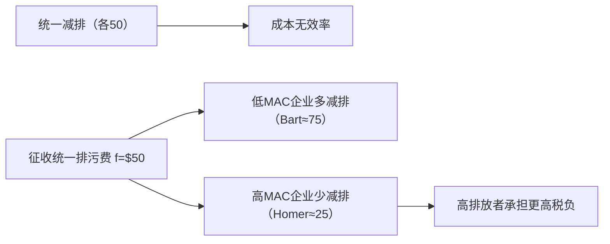

# 从一个例子讲起：Bart与Lisa
<!-- bilingual-en:start -->
*Starting with an Example: Bart and Lisa*
<!-- bilingual-en:end -->
* Bart有一个工厂，并向一条没有主人的河流里排放污水
* Lisa靠在这条河里捕鱼维生。
<!-- bilingual-en:start -->
* Bart owns a factory that discharges wastewater into an unowned river.
* Lisa earns her living by fishing in that river.
<!-- bilingual-en:end -->

>[!note] 定义(Definition)
> <!-- bilingual-en:start -->
> *Definition*
> <!-- bilingual-en:end -->
>
> * [[外部性与内部化政策|Externality]] : An activity of one entity that affects the welfare of another entity in a way that is outside the market mechanism。
> * 某一实体的活动以没有反映在市场价格中的某种方式直接影响他人福利，这种影响被称为外部性([[外部性与内部化政策|externality]])。
> <!-- bilingual-en:start -->
> * An externality occurs when one entity's activity directly affects another person's welfare in a way that is not reflected in market prices.
> <!-- bilingual-en:end -->
> eg：Bart向河中排放了污水，他本应支付排污的成本但是他事实上并未支付，而是产生了负的外部性。
> <!-- bilingual-en:start -->
> For example, Bart discharges wastewater into the river without paying for the harm caused by the pollution, thereby creating a negative externality.
> <!-- bilingual-en:end -->
>
# 对于负外部性的处理
<!-- bilingual-en:start -->
*Addressing Negative Externalities*
<!-- bilingual-en:end -->

负外部性会导致自由市场产量水平大于社会效率水平
<!-- bilingual-en:start -->
A negative externality causes the free market to produce more than the socially efficient quantity because the producer does not bear the full external cost.
<!-- bilingual-en:end -->
The Nature of [[外部性与内部化政策|Externalities]]-Graphical Analysis $ Reduction from Q, to Q" means dcg Eee profit loss for Supplier and dchg welfare gain for Demander. 5 边际 私人 成 本 h d 8 MD 边际 损害 “ a_ie ° Q* Q payee TE Ta 人 Actual output oer year SAN 285, PE Ber 0044 buy MeCram till Edueatien All Biahte Bacanrad 5.
<!-- bilingual-en:start -->
This corrupted OCR describes the standard graph: reducing output from the market quantity toward the efficient quantity costs the supplier some profit but gives the affected party a larger welfare gain; the graph labels marginal private cost and marginal damage.
<!-- bilingual-en:end -->
![[Pasted image 20240315133213.png]]
如果Bart减产则Bart少∆dcg这些收入但是Lisa得到红色部分，所以社会总产出会增加。
<!-- bilingual-en:start -->
If Bart reduces output, he loses the income represented by area ∆dcg, while Lisa gains the red area. Because Lisa's gain exceeds Bart's loss over this range, total social surplus rises.
<!-- bilingual-en:end -->

正外部性会导致自由市场产量水平小于社会效率水平
<!-- bilingual-en:start -->
A positive externality causes the free market to produce less than the socially efficient quantity because the decision-maker does not capture all of the benefits created for others.
<!-- bilingual-en:end -->

## 私人对策
<!-- bilingual-en:start -->
*Private Responses*
<!-- bilingual-en:end -->

### 讨价换件和科斯定理
<!-- bilingual-en:start -->
*Bargaining and the Coase Theorem*
<!-- bilingual-en:end -->

#### 讨价还价
<!-- bilingual-en:start -->
*Bargaining*
<!-- bilingual-en:end -->
当产权被严格划分时，可以通过讨价还价达到新的均衡
eg：将河划分给Bart则Lisa需要给Bart钱Bart才乐意减产以平衡收入的降低
若需求方愿意转移支付，供给方可以把污染（或产量）从 $Q_1$ 调整到社会更优的 $Q^*$。只要 $MD>(MB-MPC)$，就存在讨价还价空间。
<!-- bilingual-en:start -->
When property rights are clearly assigned, bargaining can move the parties to a new equilibrium. For example, if Bart owns the river, Lisa can compensate him for reducing output enough to offset his lost income. More generally, if the harmed party is willing to transfer part of the avoided damage to the polluter, pollution or output can move from $Q_1$ toward the socially preferable $Q^*$. Bargaining is possible whenever $MD>(MB-MPC)$.
<!-- bilingual-en:end -->

。 MD >(MB-— MPC) => the opportunity for a bargain exists
满足上述不等式的时候就还有讲价的区间，否则就没必要讲价。
事实上付的钱是一个范围而非一个定值。
<!-- bilingual-en:start -->
The inequality defines a bargaining interval: if it holds, both parties can gain from an agreement; otherwise there is no mutually beneficial bargain. The transfer is therefore a negotiable range, not one uniquely determined payment.
<!-- bilingual-en:end -->

#### [[外部性与内部化政策#Coase 机制及边界|科斯定理]]
<!-- bilingual-en:start -->
*The Coase Theorem*
<!-- bilingual-en:end -->

* 前提条件：讨价还价成本低，产权可严格划分。
* 科斯定律起作用的必要假设：各方讨价还价成本很低，资源所有者能够识别使其财产受到损害的源头,且在防止伤害上能够得到法律保护。
<!-- bilingual-en:start -->
* Preconditions: bargaining costs are low and property rights can be assigned clearly.
* For the Coase mechanism to work, the parties must face low bargaining costs, resource owners must be able to identify the source of the harm, and the law must protect their ability to prevent or obtain redress for that harm.
<!-- bilingual-en:end -->
### 其他解决办法
<!-- bilingual-en:start -->
*Other Private Responses*
<!-- bilingual-en:end -->

#### 合并（外部性内部化）
<!-- bilingual-en:start -->
*Merger: Internalising the Externality*
<!-- bilingual-en:end -->
俩人结婚就行
<!-- bilingual-en:start -->
If the two parties merge their interests—for example, if Bart and Lisa form one household—the external cost becomes part of their joint decision and is therefore internalised.
<!-- bilingual-en:end -->
#### 社会习俗，道德
<!-- bilingual-en:start -->
*Social Norms and Morality*
<!-- bilingual-en:end -->
己所不欲，勿施于人
<!-- bilingual-en:start -->
Social norms can discourage people from imposing harms on others: do not do to others what you would not want done to yourself.
<!-- bilingual-en:end -->

## 公共对策
<!-- bilingual-en:start -->
*Public Policy Responses*
<!-- bilingual-en:end -->
* MSB: the marginal social benefit to Lisa of each unit of pollution Bart reduces.
* MC: the marginal cost to Bart of reducing each unit of pollution.
* Cost for reducing pollution can stem from reducing output,shifting to cleaner inputs, or installing a new technology to control pollution.
### 征收庇古税
<!-- bilingual-en:start -->
*Pigouvian Taxation*
<!-- bilingual-en:end -->
庇古税通过提高污染行为的私人成本，使决策从 $Q_1$ 向社会最优 $Q^*$ 收敛，并形成税收收入。
<!-- bilingual-en:start -->
A Pigouvian tax raises the private cost of polluting, moving the decision from $Q_1$ toward the socially optimal $Q^*$ while also generating tax revenue.
<!-- bilingual-en:end -->

MSC边际社会成本MPC边际个人成本MD边际污染
<!-- bilingual-en:start -->
MSC is marginal social cost, MPC is marginal private cost, and MD is marginal damage from pollution.
<!-- bilingual-en:end -->

### 发放庇古补贴
<!-- bilingual-en:start -->
*Pigouvian Subsidies*
<!-- bilingual-en:end -->
对减排行为发放庇古补贴，可以把个体激励调整到社会最优附近。
<!-- bilingual-en:start -->
Subsidising pollution abatement can align an individual's incentive with the socially optimal level of abatement.
<!-- bilingual-en:end -->

### 排污费
<!-- bilingual-en:start -->
*Emissions Charges*
<!-- bilingual-en:end -->
对于Bart而言，最好的情况是减少任何一点污染的排放，因为减少排污就意味着花钱，他肯定不想花钱。
当排污费为 $f_t$ 时，只会带来较低减排量 $e_t$；当排污费提高到 $f^*$ 时，可达到有效减排水平 $e^*$。
<!-- bilingual-en:start -->
From Bart's private perspective, abatement is costly, so without a price on emissions he would prefer not to reduce pollution. An emissions charge of $f_t$ induces only the lower abatement level $e_t$; raising the charge to $f^*$ can produce the efficient level $e^*$.
<!-- bilingual-en:end -->

## 不同污染者之间统一污染减少
<!-- bilingual-en:start -->
*Allocating Abatement Across Different Polluters*
<!-- bilingual-en:end -->
假设有第三个人Homer也开了一家会排污的公司
若强制每家都减排 50 单位，在边际减排成本不同的情况下并不成本有效。更有效率的做法是让低边际成本企业减排更多。
<!-- bilingual-en:start -->
Suppose a third person, Homer, also owns a polluting firm. Requiring every firm to reduce emissions by 50 units is not cost-effective when their marginal abatement costs differ. Efficiency instead requires the low-cost firm to abate more.
<!-- bilingual-en:end -->

当排污费为 $50$ 时，Bart 减排约 75，Homer 减排约 25；Homer 的税负更高，从而同时改进效率与公平。
<!-- bilingual-en:start -->
With a uniform emissions charge of $50$, Bart abates about 75 units and Homer about 25. Homer pays more tax because he emits more, while the common price also allocates abatement to the lower-cost source.
<!-- bilingual-en:end -->

### 总量控制与交易制度
<!-- bilingual-en:start -->
*Cap and Trade*
<!-- bilingual-en:end -->

发放一定量的污染许可证，政府进行初步的配给，而后经过市场进行调控直到均衡。
<!-- bilingual-en:start -->
The government fixes the total number of emissions permits and makes an initial allocation; subsequent market trading moves the permits toward an equilibrium allocation.
<!-- bilingual-en:end -->

在总量控制与交易制度下：若企业边际减排成本低于许可证价格，则卖出许可证；若高于许可证价格，则买入许可证；交易使双方都受益。
<!-- bilingual-en:start -->
Under cap and trade, a firm sells permits when its marginal abatement cost is below the permit price and buys permits when its marginal abatement cost is above that price. Trading benefits both sides and equalises marginal abatement costs.
<!-- bilingual-en:end -->

#### 碳交易市场
<!-- bilingual-en:start -->
*Carbon Markets*
<!-- bilingual-en:end -->
## 命令控制管理
<!-- bilingual-en:start -->
*Command-and-Control Regulation*
<!-- bilingual-en:end -->
强制性的，不是很好用
<!-- bilingual-en:start -->
This approach imposes mandatory rules, but rigid requirements can be costly when firms face different abatement options and costs.
<!-- bilingual-en:end -->
### 技术要求
<!-- bilingual-en:start -->
*Technology Standards*
<!-- bilingual-en:end -->
加州的车辆强制装尾气处理装置
<!-- bilingual-en:start -->
For example, California can require vehicles to be fitted with exhaust-emissions control equipment.
<!-- bilingual-en:end -->

# 对正外部性的处理
<!-- bilingual-en:start -->
*Addressing Positive Externalities*
<!-- bilingual-en:end -->
正外部性下，社会边际收益满足 $MSB=MPB+MEB$，因此社会最优研究投入 $R^*$ 通常高于私人自发投入 $R_a$。
<!-- bilingual-en:start -->
With a positive externality, marginal social benefit satisfies $MSB=MPB+MEB$. The socially optimal research investment $R^*$ is therefore usually greater than the privately chosen level $R_a$.
<!-- bilingual-en:end -->

与负的外部性相反，这个的边际社会受益是比边际私人受益要高的。
<!-- bilingual-en:start -->
In contrast to a negative externality, the marginal social benefit here exceeds the marginal private benefit because others also receive benefits.
<!-- bilingual-en:end -->

## 公共处理
<!-- bilingual-en:start -->
*Public Policy Responses*
<!-- bilingual-en:end -->

对私人企业研发行为发放补贴
相当于向上平移了边际私人收益
<!-- bilingual-en:start -->
The government can subsidise private firms' research and development. The subsidy effectively shifts the perceived marginal private benefit upward toward the marginal social benefit.
<!-- bilingual-en:end -->
