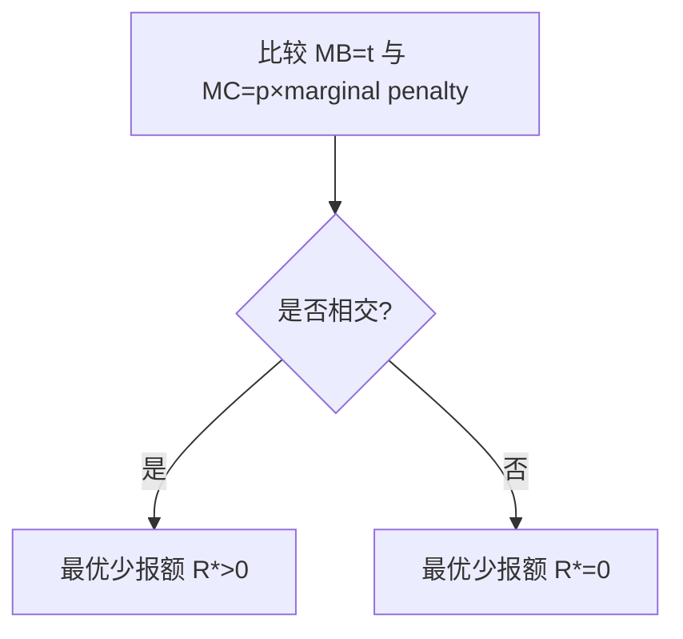

# 最适商品课税(Optimal Commodity Taxation)

假定政府的唯一目标是在保证超额负担最小的情况下,筹措国家支出所需的资金.

$$
w(T-l)=P_xX+p_yY
$$
* T:时间禀赋,即拥有的时间
* l:娱乐时间
* w:工资率(即休闲的代价)
* X,Y:两种商品
* PxPy:两种商品的价格

对X,Y,l征收从价税,税率为t,得到
$$
\frac{1}{1+t}wT=P_xX+P_yY+wl
$$
相当于一次总付税

但是事实上对休闲时间课税是不可能的,只可能对X和Y均等课税

## 拉姆齐法则

### 原则

为了使总体超额负担最小化,应令每种商品筹措到最后1美元的税收的边际超额负担相同.

### 假设

商品X和Y既不是互补品又不是替代品.,是不相关产品.

### 边际超额负担

边际超额负担可写为：
$$
\mathrm{MEB}_x=\triangle fbae=\frac{1}{2}\[[Delta|Delta]] X\,[u_x+(u_x+1)]=\[[Delta|Delta]] X.
$$

浅蓝色部分就是边际超额负担

短粗四边形gfej-细长四边形hbaj=边际税收收入

两者相除得到

$$
\frac{∆X}{X_1-∆X}
$$
同理y得到:
$$
\frac{∆Y}{Y_1-∆Y}
$$

按照拉姆齐法则,应使二者相等
$$
\frac{∆X}{X_1-∆X}=\frac{∆Y}{Y_1-∆Y}
$$
化简有
$$
\frac{∆X}{X_1}=\frac{∆Y}{Y_1}
$$
即要使总体超额负担最小化，税率的设置应当使得各种商品的需求量按相同比例减少

### 重新解释拉姆齐法则

A Reinterpretation of the Ramsey Rule 重新 解释 拉 姆 齐 法 则 。7x 补 偿 性 需求 弹性 。tx 对 X 征 收 的 从 价 税 。 税 收 引 起 的 需求 量变 化 的 百分比 tx ny 。 超 额 负担 最 小 化 条 件 : 1x71x =tyNy ty 一 Ty inverse elasticity rule t, ty 。 逆 弹性 法 则 。 有 效率 的 课 税 要 求 ， 对 相对 缺乏 弹性 的 商 品 ， 课 征 相 对 高 的 税率
![[Pasted image 20240520104827.png]]

### 科利特-黑格法则

对休闲的互补品征重税,就相当于对闲暇征税,达到见效超额负担的效果

## 公平问题

市场上有面包和奢侈品.按照拉姆齐法则,面包的需求弹性低,奢侈品的需求弹性高,那么应该对面包课重税而对奢侈品少收税,这虽然是 超额负担最小的办法,但却是不公平的办法.

### 家庭课税的应用

实证研究表明，丈夫的劳动供给弹性远低于妻子的劳动供给弹性.应课征不同的税率

----

# 最适使用费

* 使用费：使用者支付的由政府所提供的物品或服务的价格

美元 AC, MC, MR D, 4 Z/ 年
![[Pasted image 20240520112833.png]]

美元 IN ZEAL AC, fF . | 已 = MC 时 的 损失 P, 一 wa et > | tot MC, Z, Z, Zr* oye 图 16 一 3 ”针对 自然 垄断 的 各 种 定价 方法
![[Pasted image 20240520112906.png]]

## 定价策略

### 平均成本定价

 AC=P,既没有利润,也不亏损,但是仍低于效率产量

### 边际成本定价加一次总付税

P=MC满足了效率,一次总付税弥补了亏损

但是一次总付税有问题,不应该使全社会承担公共服务受益者的代价

### 拉姆齐解决办法

规定一个能使每种商品的需求按比例减少的使用费

---

# 最适所得税

## 埃奇沃斯模型

### 假设条件:

1. 在取得必要税收收入的前提下,目标是尽可能使个人效用之和最大
2. 人们的效用函数完全相同,且取决于他们的收入
3. 可获得收入总额是固定的

这暗示这一种累进程度很高的税制,即削减最高收入者的收入,直到完全平等.

### 推论

* 社会福利最大化要求每个人的边际收入效用相同
* 如果效应函数相同，只有当收入相等时，边际收入效用才相同

## 现代研究

统一所得税:
$$
税收收入=-a+t*收入
$$

边际税率恒定的累进税

----

# 政治与时间不一致问题

简称为如果政府不守信就不能实施完全有效的税收政策

----

# 税制设计的其他标准

## 横向公平

境况相同的人应收到同等对待

但是没法衡量啥时候境况相同

### 横向公平的效用定义

1. 如果两个人税前境况相同,税后境况也相同
2. 征税不能改变境况的序数

## 税收的运行成本

SERS + FE TG FE DR all AN FP Me ll BEY a] Ay es BU EY SEE AMS A EA So BY BE Ae AB 些 看 上 去 公平 而 有 效 的 制度 〈 从 超额 负担 的 角度 看 )， 也 可 能 是 不 可 取 的 ， 因 为 它们 太 复杂 ， 管 理 成 本 过 高 。 以 对 家 务 劳动 一 打扫 房间 、 照 看 孩子 等 等 一 -的 课 税 为 例 。 如 在 第 15 章 所 指出 的 ， 对 市 场 劳动 课 税 而 对 家 务 劳 动 不 征 税 的 事实 ， 对 劳动 配 置 造成 了 很 大 扭曲 。 而 且 ， 把 工作 场所 的 选择 作为 差别 课 税 的 依据 ， 违 背 了 横向 公 平 观念 。 然 而 ， 由 于 估价 家 务 劳动 的 困难 太 大 ,会 产生 巨大 的 管理 成 本 ， 故 对 其 课 税 是 不 可 行 的 。
![[Pasted image 20240520164012.png]]

## 逃税

* 逃税:税收欺骗,违法
* 避税:通过改变行为来减少应纳税额,不违法

### 分析

在偷漏税模型中，设
- 边际收益：$MB=t$（少报 1 单位带来的税负节省）；
- 边际成本：$MC=p\times$ marginal penalty。

若 $MC$ 与 $MB$ 相交，则最优少报额 $R^*>0$；若 $MC$ 始终高于 $MB$，则最优 $R^*=0$。

