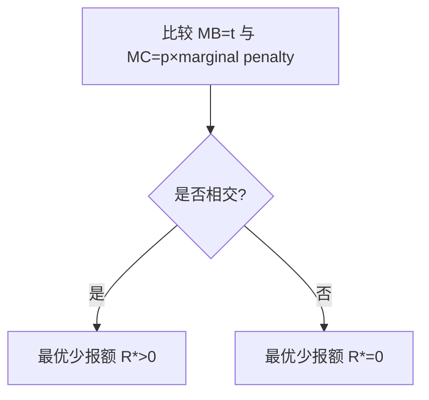

# [[最优税收：效率、公平与信息约束|最适商品课税]](Optimal Commodity Taxation)
<!-- bilingual-en:start -->
*Optimal Commodity Taxation*
<!-- bilingual-en:end -->

假定政府的唯一目标是在保证超额负担最小的情况下,筹措国家支出所需的资金.
<!-- bilingual-en:start -->
Assume that the government's sole objective is to raise the revenue needed for public expenditure while minimising excess burden.
<!-- bilingual-en:end -->

$$
w(T-l)=P_xX+p_yY
$$
* T:时间禀赋,即拥有的时间
* l:娱乐时间
* w:工资率(即休闲的代价)
* X,Y:两种商品
* PxPy:两种商品的价格
<!-- bilingual-en:start -->
* $T$ is the time endowment.
* $l$ is leisure time.
* $w$ is the wage rate and therefore the opportunity cost of leisure.
* $X$ and $Y$ are two goods.
* $P_x$ and $P_y$ are their prices.
<!-- bilingual-en:end -->

对X,Y,l征收从价税,税率为t,得到
<!-- bilingual-en:start -->
If $X$, $Y$, and leisure are all taxed at the same ad valorem rate $t$, the budget constraint becomes:
<!-- bilingual-en:end -->
$$
\frac{1}{1+t}wT=P_xX+P_yY+wl
$$
相当于一次总付税
<!-- bilingual-en:start -->
The uniform tax is equivalent to a lump-sum tax on the time endowment.
<!-- bilingual-en:end -->

但是事实上对休闲时间课税是不可能的,只可能对X和Y均等课税
<!-- bilingual-en:start -->
In practice leisure cannot be taxed directly, so the available approximation is to tax $X$ and $Y$ uniformly.
<!-- bilingual-en:end -->

## 拉姆齐法则
<!-- bilingual-en:start -->
*The Ramsey Rule*
<!-- bilingual-en:end -->

### 原则
<!-- bilingual-en:start -->
*Principle*
<!-- bilingual-en:end -->

为了使总体超额负担最小化,应令每种商品筹措到最后1美元的税收的边际超额负担相同.
<!-- bilingual-en:start -->
To minimise total excess burden, the marginal excess burden of raising the last dollar of revenue should be equal across taxed goods.
<!-- bilingual-en:end -->

### 假设
<!-- bilingual-en:start -->
*Assumption*
<!-- bilingual-en:end -->

商品X和Y既不是互补品又不是替代品.,是不相关产品.
<!-- bilingual-en:start -->
Goods $X$ and $Y$ are assumed to be independent: neither substitutes nor complements.
<!-- bilingual-en:end -->

### 边际超额负担
<!-- bilingual-en:start -->
*Marginal Excess Burden*
<!-- bilingual-en:end -->

边际超额负担可写为：
<!-- bilingual-en:start -->
Marginal excess burden can be written as:
<!-- bilingual-en:end -->
$$
\mathrm{MEB}_x=\triangle fbae=\frac{1}{2}\Delta X\,[u_x+(u_x+1)]=\Delta X.
$$

浅蓝色部分就是边际超额负担
<!-- bilingual-en:start -->
The light-blue area is marginal excess burden.
<!-- bilingual-en:end -->

短粗四边形gfej-细长四边形hbaj=边际税收收入
<!-- bilingual-en:start -->
Marginal tax revenue is the short, wide quadrilateral gfej minus the long, narrow quadrilateral hbaj.
<!-- bilingual-en:end -->

两者相除得到
<!-- bilingual-en:start -->
Dividing marginal excess burden by marginal revenue gives:
<!-- bilingual-en:end -->

$$
\frac{∆X}{X_1-∆X}
$$
同理y得到:
<!-- bilingual-en:start -->
The corresponding expression for $Y$ is:
<!-- bilingual-en:end -->
$$
\frac{∆Y}{Y_1-∆Y}
$$

按照拉姆齐法则,应使二者相等
<!-- bilingual-en:start -->
The Ramsey rule sets these two ratios equal:
<!-- bilingual-en:end -->
$$
\frac{∆X}{X_1-∆X}=\frac{∆Y}{Y_1-∆Y}
$$
化简有
<!-- bilingual-en:start -->
Simplifying yields:
<!-- bilingual-en:end -->
$$
\frac{∆X}{X_1}=\frac{∆Y}{Y_1}
$$
即要使总体超额负担最小化，税率的设置应当使得各种商品的需求量按相同比例减少
<!-- bilingual-en:start -->
Thus, under the stated assumptions, minimising total excess burden requires taxes that reduce the quantities demanded of all goods by the same proportion.
<!-- bilingual-en:end -->

### 重新解释拉姆齐法则
<!-- bilingual-en:start -->
*Reinterpreting the Ramsey Rule*
<!-- bilingual-en:end -->

A Reinterpretation of the Ramsey Rule 重新 解释 拉 姆 齐 法 则 。7x 补 偿 性 需求 弹性 。tx 对 X 征 收 的 从 价 税 。 税 收 引 起 的 需求 量变 化 的 百分比 tx ny 。 超 额 负担 最 小 化 条 件 : 1x71x =tyNy ty 一 Ty inverse elasticity rule t, ty 。 逆 弹性 法 则 。 有 效率 的 课 税 要 求 ， 对 相对 缺乏 弹性 的 商 品 ， 课 征 相 对 高 的 税率
<!-- bilingual-en:start -->
This corrupted OCR gives the inverse-elasticity interpretation. If compensated demand elasticities are $\eta_x$ and $\eta_y$ and ad valorem rates are $t_x$ and $t_y$, the minimum-burden condition equates the proportional compensated quantity responses. Efficient revenue raising therefore calls for relatively higher rates on goods with less elastic compensated demand, subject to the strong independence and equity qualifications.
<!-- bilingual-en:end -->
![[Pasted image 20240520104827.png]]

### 科利特-黑格法则
<!-- bilingual-en:start -->
*The Corlett-Hague Rule*
<!-- bilingual-en:end -->

对休闲的互补品征重税,就相当于对闲暇征税,达到见效超额负担的效果
<!-- bilingual-en:start -->
Taxing goods that are complementary with leisure more heavily indirectly taxes leisure and can reduce excess burden when labour income is already taxed.
<!-- bilingual-en:end -->

## 公平问题
<!-- bilingual-en:start -->
*Equity Problem*
<!-- bilingual-en:end -->

市场上有面包和奢侈品.按照拉姆齐法则,面包的需求弹性低,奢侈品的需求弹性高,那么应该对面包课重税而对奢侈品少收税,这虽然是 超额负担最小的办法,但却是不公平的办法.
<!-- bilingual-en:start -->
Suppose the market contains bread and luxury goods. Because demand for bread is less elastic, a mechanical Ramsey rule would tax bread more heavily and luxuries less heavily. That may minimise excess burden but can be inequitable because low-income households spend a larger share on necessities.
<!-- bilingual-en:end -->

### 家庭课税的应用
<!-- bilingual-en:start -->
*Application to Household Taxation*
<!-- bilingual-en:end -->

实证研究表明，丈夫的劳动供给弹性远低于妻子的劳动供给弹性.应课征不同的税率
<!-- bilingual-en:start -->
If spouses have different labour-supply elasticities, a pure efficiency calculation implies different effective tax rates. The source notes empirical findings in which husbands' labour supply is much less elastic than wives'.
<!-- bilingual-en:end -->

----

# 最适使用费
<!-- bilingual-en:start -->
*Optimal User Charges*
<!-- bilingual-en:end -->

* 使用费：使用者支付的由政府所提供的物品或服务的价格
<!-- bilingual-en:start -->
* A user charge is the price paid by a user for a good or service provided by government.
<!-- bilingual-en:end -->

美元 AC, MC, MR D, 4 Z/ 年
<!-- bilingual-en:start -->
This corrupted OCR labels a diagram in dollars per unit and quantity $Z$ per year, showing average cost, marginal cost, marginal revenue, and demand.
<!-- bilingual-en:end -->
![[Pasted image 20240520112833.png]]

美元 IN ZEAL AC, fF . | 已 = MC 时 的 损失 P, 一 wa et > | tot MC, Z, Z, Zr* oye 图 16 一 3 ”针对 自然 垄断 的 各 种 定价 方法
<!-- bilingual-en:start -->
This corrupted OCR is Figure 16-3, comparing pricing methods for a natural monopoly and showing the loss incurred when price equals marginal cost.
<!-- bilingual-en:end -->
![[Pasted image 20240520112906.png]]

## 定价策略
<!-- bilingual-en:start -->
*Pricing Strategies*
<!-- bilingual-en:end -->

### 平均成本定价
<!-- bilingual-en:start -->
*Average-Cost Pricing*
<!-- bilingual-en:end -->

 AC=P,既没有利润,也不亏损,但是仍低于效率产量
<!-- bilingual-en:start -->
Setting $P=AC$ lets the provider break even, but output remains below the efficient level.
<!-- bilingual-en:end -->

### 边际成本定价加一次总付税
<!-- bilingual-en:start -->
*Marginal-Cost Pricing Plus a Lump-Sum Charge*
<!-- bilingual-en:end -->

P=MC满足了效率,一次总付税弥补了亏损
<!-- bilingual-en:start -->
Setting $P=MC$ achieves allocative efficiency, while a lump-sum charge covers the resulting deficit.
<!-- bilingual-en:end -->

但是一次总付税有问题,不应该使全社会承担公共服务受益者的代价
<!-- bilingual-en:start -->
The difficulty is distributional: the whole population should not necessarily finance a service used by a narrower group of beneficiaries.
<!-- bilingual-en:end -->

### 拉姆齐解决办法
<!-- bilingual-en:start -->
*Ramsey Pricing*
<!-- bilingual-en:end -->

规定一个能使每种商品的需求按比例减少的使用费
<!-- bilingual-en:start -->
Ramsey pricing sets differentiated user charges so that the quantities demanded of the services fall in the appropriate common proportion while covering costs with the least additional burden.
<!-- bilingual-en:end -->

---

# 最适所得税
<!-- bilingual-en:start -->
*Optimal Income Taxation*
<!-- bilingual-en:end -->

## 埃奇沃斯模型
<!-- bilingual-en:start -->
*The Edgeworth Model*
<!-- bilingual-en:end -->

### 假设条件:
<!-- bilingual-en:start -->
*Assumptions*
<!-- bilingual-en:end -->

1. 在取得必要税收收入的前提下,目标是尽可能使个人效用之和最大
2. 人们的效用函数完全相同,且取决于他们的收入
3. 可获得收入总额是固定的
<!-- bilingual-en:start -->
1. Subject to raising the necessary revenue, policy maximises the sum of individual utilities.
2. Everyone has the same utility function, depending only on income.
3. Total available income is fixed.
<!-- bilingual-en:end -->

这暗示这一种累进程度很高的税制,即削减最高收入者的收入,直到完全平等.
<!-- bilingual-en:start -->
These assumptions imply an extremely progressive tax: reduce the highest incomes until everyone has equal income.
<!-- bilingual-en:end -->

### 推论
<!-- bilingual-en:start -->
*Implications*
<!-- bilingual-en:end -->

* 社会福利最大化要求每个人的边际收入效用相同
* 如果效应函数相同，只有当收入相等时，边际收入效用才相同
<!-- bilingual-en:start -->
* Maximising social welfare requires the marginal utility of income to be equal across people.
* If utility functions are identical, marginal utilities are equal only when incomes are equal.
<!-- bilingual-en:end -->

## 现代研究
<!-- bilingual-en:start -->
*Modern Analysis*
<!-- bilingual-en:end -->

统一所得税:
<!-- bilingual-en:start -->
A linear income tax can be written as:
<!-- bilingual-en:end -->
$$
税收收入=-a+t*收入
$$

边际税率恒定的累进税
<!-- bilingual-en:start -->
This is a progressive schedule with a constant marginal rate: the transfer $a$ raises the average net transfer at low income while $t$ sets the marginal tax rate.
<!-- bilingual-en:end -->

----

# 政治与时间不一致问题
<!-- bilingual-en:start -->
*Politics and Time Inconsistency*
<!-- bilingual-en:end -->

简称为如果政府不守信就不能实施完全有效的税收政策
<!-- bilingual-en:start -->
In short, a government that cannot commit to future policy cannot implement a fully efficient tax plan because people anticipate that promises may be revised later.
<!-- bilingual-en:end -->

----

# 税制设计的其他标准
<!-- bilingual-en:start -->
*Other Criteria for Tax Design*
<!-- bilingual-en:end -->

## 横向公平
<!-- bilingual-en:start -->
*Horizontal Equity*
<!-- bilingual-en:end -->

境况相同的人应收到同等对待
<!-- bilingual-en:start -->
People in equivalent circumstances should be treated equally.
<!-- bilingual-en:end -->

但是没法衡量啥时候境况相同
<!-- bilingual-en:start -->
The practical difficulty is deciding when two people's circumstances are genuinely equivalent.
<!-- bilingual-en:end -->

### 横向公平的效用定义
<!-- bilingual-en:start -->
*A Utility-Based Definition of Horizontal Equity*
<!-- bilingual-en:end -->

1. 如果两个人税前境况相同,税后境况也相同
2. 征税不能改变境况的序数
<!-- bilingual-en:start -->
1. If two people are equally well off before tax, they should remain equally well off after tax.
2. Taxation should not reverse their ordinal ranking of well-being.
<!-- bilingual-en:end -->

## 税收的运行成本
<!-- bilingual-en:start -->
*Administrative and Compliance Costs*
<!-- bilingual-en:end -->

SERS + FE TG FE DR all AN FP Me ll BEY a] Ay es BU EY SEE AMS A EA So BY BE Ae AB 些 看 上 去 公平 而 有 效 的 制度 〈 从 超额 负担 的 角度 看 )， 也 可 能 是 不 可 取 的 ， 因 为 它们 太 复杂 ， 管 理 成 本 过 高 。 以 对 家 务 劳动 一 打扫 房间 、 照 看 孩子 等 等 一 -的 课 税 为 例 。 如 在 第 15 章 所 指出 的 ， 对 市 场 劳动 课 税 而 对 家 务 劳 动 不 征 税 的 事实 ， 对 劳动 配 置 造成 了 很 大 扭曲 。 而 且 ， 把 工作 场所 的 选择 作为 差别 课 税 的 依据 ， 违 背 了 横向 公 平 观念 。 然 而 ， 由 于 估价 家 务 劳动 的 困难 太 大 ,会 产生 巨大 的 管理 成 本 ， 故 对 其 课 税 是 不 可 行 的 。
<!-- bilingual-en:start -->
This corrupted OCR explains that a tax can look fair and efficient in a deadweight-loss model yet remain undesirable because it is too complex to administer. Untaxed household work distorts the allocation between home and market labour, and differentiating tax by workplace may violate horizontal equity. But valuing and monitoring housework would impose such large administrative costs that taxing it is impractical.
<!-- bilingual-en:end -->
![[Pasted image 20240520164012.png]]

## 逃税
<!-- bilingual-en:start -->
*Tax Evasion and Avoidance*
<!-- bilingual-en:end -->

* 逃税:税收欺骗,违法
* 避税:通过改变行为来减少应纳税额,不违法
<!-- bilingual-en:start -->
* Tax evasion is illegal deception intended to escape tax.
* Tax avoidance reduces liability by changing behaviour within the law.
<!-- bilingual-en:end -->

### 分析
<!-- bilingual-en:start -->
*Analysis*
<!-- bilingual-en:end -->

在偷漏税模型中，设
- 边际收益：$MB=t$（少报 1 单位带来的税负节省）；
- 边际成本：$MC=p\times$ marginal penalty。
<!-- bilingual-en:start -->
In a model of under-reporting:
- Marginal benefit is $MB=t$, the tax saved by concealing one more unit.
- Marginal cost is $MC=p\times$ marginal penalty, the probability-weighted additional sanction.
<!-- bilingual-en:end -->

若 $MC$ 与 $MB$ 相交，则最优少报额 $R^*>0$；若 $MC$ 始终高于 $MB$，则最优 $R^*=0$。
<!-- bilingual-en:start -->
If $MC$ intersects $MB$, the optimal amount concealed is $R^*>0$. If $MC$ always lies above $MB$, the optimum is full reporting, $R^*=0$.
<!-- bilingual-en:end -->

