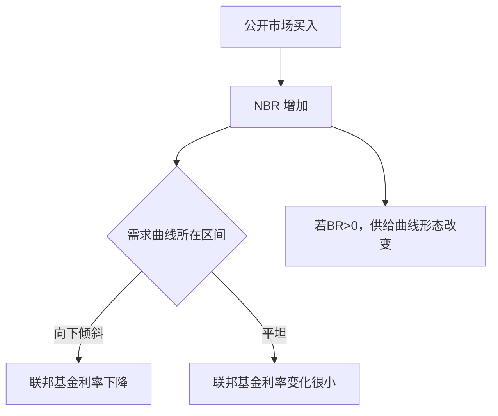

# [[02_Economy/03_货币银行学/16_货币政策的实施与传导#2. 准备金市场和联邦基金利率|准备金市场和联邦基金利率]](Reserve Market and Federal Funds Rate)
<!-- bilingual-en:start -->
*The [[02_Economy/03_货币银行学/16_货币政策的实施与传导#2. 准备金市场和联邦基金利率|reserve market and the federal funds rate]]*
<!-- bilingual-en:end -->

<!-- monetary-topic53:reading-entry:start -->
> [!summary] 连续阅读
> 从[[02_Economy/03_货币银行学/16_货币政策的实施与传导|货币政策的实施与传导]]顺序阅读定义、机制、推导与例子；[[货币政策工具、传导与可信度.canvas|学习总图]]展示关系。下面保留课堂图像及当时注明日期的制度记录，带日期的利率数值应按对应历史时点阅读。市场的一笔成交与日度统计分别见[[联邦基金利率]]、[[有效联邦基金利率]]。
> <!-- bilingual-en:start -->
> Read [[02_Economy/03_货币银行学/16_货币政策的实施与传导|implementation and transmission]] for a continuous explanation; the [[货币政策工具、传导与可信度.canvas|learning map]] shows relationships. Classroom images and dated institutional records remain below; read quoted rates at their stated historical dates. Separate [[联邦基金利率|transaction rates]] from the [[有效联邦基金利率|daily effective-rate statistic]].
> <!-- bilingual-en:end -->
<!-- monetary-topic53:reading-entry:end -->

## 准备金市场的供给与需求
<!-- bilingual-en:start -->
*Supply and demand in the reserve market*
<!-- bilingual-en:end -->

当联邦基金率变动的时候银行持有准备金的量的变动.    
`i_or` 表示准备金余额利率。2008 年后，美联储开始对准备金付息；在教材的简化模型中，它给银行把边际准备金留在央行而不以更低利率贷出的机会成本基准。
`i_ff` 表示联邦基金市场实际成交利率，由隔夜准备金融资的供求形成；目标区间上沿不是每笔交易的价格上限。
`i_d` 表示贴现窗口适用利率。在旧式稀缺准备金模型中，它常被画成高于联邦基金率的备份借款成本；这不是跨时期不变的价格排序。美国 primary credit 自 2020 年 3 月起按联邦基金目标区间上沿定价；截至 2026-08-29 为 3.75%，等于 2026-07-30 起 3.50%–3.75% 目标区间的上沿。具体比较仍须锁定便利、期限、抵押、借款人和市场基准。见 [[惩罚性利率的比较基准|贴现窗口定价边界]]。
<!-- bilingual-en:start -->
This framework describes how the quantity of reserves held by banks changes with the federal funds rate.
$i_{or}$ is the rate paid on reserve balances. Since 2008, the Federal Reserve has paid interest on reserves; in the simplified teaching model, this provides the opportunity-cost benchmark for leaving a marginal reserve balance at the central bank rather than lending it at a still lower rate.
$i_{ff}$ is the effective federal funds rate formed in the overnight reserve-funding market. The upper bound of the target range is not a ceiling on every transaction.
$i_d$ is the applicable discount-window rate. In the older scarce-reserves model it is often drawn above the federal funds rate as a backup borrowing cost, but that ordering is not invariant across operating frameworks or dates. U.S. primary credit has been priced at the top of the target range since March 2020; as checked on 2026-08-29, it was 3.75%, equal to the upper bound of the 3.50%–3.75% range effective from 2026-07-30. Any comparison must still identify the facility, maturity, collateral, borrower, and market benchmark. See [[惩罚性利率的比较基准|discount-window pricing boundary]].
<!-- bilingual-en:end -->

 图 1$ 一 1 ”准备 金 市 场 上 准备 金 市 场 上 的 均衡 点 为 供 aad 下 跌 到 六 给 曲线 Re 与 需求 曲线 Re 的 i, R 交点 ， 即 点 1， 此 时 的 均衡 MEH iF. i} a i |. 在 中 处 ， 准备 金 出 现 2 超额 需求 ， 联 邦 基金 KEI Bi, NBR ME Sth, R
<!-- bilingual-en:start -->
The reserve-market equilibrium is the intersection of the reserve-supply and reserve-demand curves, labelled point 1 in the figure. At an interest rate below equilibrium, reserve demand exceeds reserve supply, placing upward pressure on the federal funds rate. The remaining characters in the source line are OCR noise.
<!-- bilingual-en:end -->
![[Pasted image 20240511150513.png]]

教材的旧式走廊图常用下式表示其设定；它是特定操作框架的示意，不是现行制度的普遍恒等式：

$$
i_{d} > i_{ff} > i_{or}
$$

----

## 货币政策工具的变动如何影响联邦基金利率
<!-- bilingual-en:start -->
*How changes in monetary-policy instruments affect the federal funds rate*
<!-- bilingual-en:end -->

公开市场操作通过改变非借入准备金（NBR）来影响联邦基金利率：
1. 当准备金需求曲线处于向下倾斜区间时，NBR 增加会压低联邦基金利率。
2. 当准备金需求曲线处于平坦区间时，NBR 增加对利率影响很小。
3. 若存在贴现借款（BR），总准备金供给曲线会在相应区间发生形态变化。
<!-- bilingual-en:start -->
Open-market operations affect the federal funds rate by changing non-borrowed reserves (NBR):
**1.** When reserve demand lies on its downward-sloping segment, an increase in NBR lowers the federal funds rate. 
**2.** When reserve demand lies on its flat segment, an increase in NBR has little effect on the rate. 
**3.** If banks use discount borrowing (BR), the total reserve-supply curve changes shape over the relevant range. 
<!-- bilingual-en:end -->

---

# 常规货币政策工具
<!-- bilingual-en:start -->
*Conventional monetary-policy instruments*
<!-- bilingual-en:end -->

15.2125 FDR O ARF AG 种 类 型 : 旨 在 改变 准备 爹 和 基础 货币 规模 的 公开 市 场 操作 ( 吊 nnamic open market operorionsj 汀 间 在 托 消 影响 准备 爹 和 基础 货币 的 其 他 因 素 变 动 的 FB te) Fr FP 3% HEME (defensive open market operations), 一 O 通 和 情况 下 ， 美 联储 实施 公开 市 场 操作 的 对 象 是 美国 国 tit Fe BU PUA GER, Ae KEE] HE Ho
<!-- bilingual-en:start -->
Open-market operations have two main forms. Dynamic open-market operations deliberately change reserves and the monetary base, whereas defensive open-market operations offset movements in other factors that would otherwise change reserves and the monetary base. Under ordinary conditions, the Federal Reserve conducts these operations in U.S. government securities. The rest of the source line is OCR-corrupted.
<!-- bilingual-en:end -->
![[Pasted image 20240528083848.png]]
贴现窗口（discount window）在 Regulation A 下包括三类对存款机构的信用。一级信贷（primary credit）是对 Reserve Bank 判断为总体稳健的存款机构提供的短期备份融资；二级信贷（secondary credit）面向不符合一级信贷资格的机构，并须符合回归市场融资或有序解决严重财务困难的条件；季节性信贷（seasonal credit）面向符合条件的较小存款机构，用于可预期且持续的季节性资金需求。资格不等于 Federal Reserve Bank 有必须放贷的义务。
<!-- bilingual-en:start -->
Under Regulation A, the discount window provides three types of credit to depository institutions. Primary credit is short-term backup funding for institutions judged generally sound by the Reserve Bank. Secondary credit is available to institutions not eligible for primary credit, subject to conditions tied to a timely return to market funding or the orderly resolution of serious financial difficulties. Seasonal credit addresses qualifying, predictable seasonal funding needs of smaller depository institutions. Eligibility does not create an obligation for a Federal Reserve Bank to lend.
<!-- bilingual-en:end -->
![[Pasted image 20240528084130.png]]
15.2.2 最后贷款人（lender of last resort）描述的是危机中的流动性支持功能，不是“任何机构缺钱都必须获贷”的产品名称。美国实际放贷受借款对象、法律授权、抵押品、定价、偿付能力证据和 Reserve Bank 裁量约束；普通央行贷款增加流动性而不会自动重建资不抵债机构的资本。支持可能降低可避免的流动性失败，也可能改变借款人与市场的风险激励，因此必须连同资格和风险控制分析。见 [[美国 §10B 与 §13(3)|美国法权边界]]、[[准备金与银行资本|流动性不等于资本]]。
<!-- bilingual-en:start -->
Lender of last resort describes a crisis liquidity function, not a product under which every institution short of funds must receive credit. In the United States, actual lending remains subject to the eligible borrower, statutory authority, collateral, pricing, evidence concerning solvency, and Reserve Bank discretion. An ordinary central-bank loan adds liquidity but does not automatically recapitalise an insolvent institution. Support may reduce avoidable liquidity-driven failures, while also changing borrower and market incentives, so eligibility and risk controls must be analysed with it. See [[美国 §10B 与 §13(3)|U.S. legal perimeter]] and [[准备金与银行资本|liquidity is not capital]].
<!-- bilingual-en:end -->
![[Pasted image 20240528084441.png]]
1980 年《存款机构放松管制和货币控制法》把 Federal Reserve 的准备金要求扩展到所有存款机构。准备金付息制度后来又改变了操作框架：不能再把它写成“只是一个被动下限、不是政策工具”。截至 2026-08-29，美联储在充足准备金框架中把 IORB 作为主动管理短期利率的 administered rate；2026-07-30 起 IORB 为 3.65%，联邦基金目标区间为 3.50%–3.75%。实际联邦基金交易仍可因参与者资格与市场摩擦偏离 IORB。
<!-- bilingual-en:start -->
The Depository Institutions Deregulation and Monetary Control Act of 1980 extended Federal Reserve reserve requirements to all depository institutions. Interest on reserve balances later changed the operating framework, so it is no longer accurate to call the administered rate merely a passive floor rather than a policy instrument. As checked on 2026-08-29, the Federal Reserve used IORB actively in an ample-reserves framework; from 2026-07-30 IORB was 3.65% while the federal funds target range was 3.50%–3.75%. Actual federal funds trades can still differ from IORB because eligibility and market frictions differ.
<!-- bilingual-en:end -->
![[Pasted image 20240528084413.png]]

## 公开市场操作优点
<!-- bilingual-en:start -->
*Advantages of open-market operations*
<!-- bilingual-en:end -->

15.2.5 7 FF) ROA TA NS 公开 市 场 操 作 有 四 个 基本 优点 : (人 公开 市 场 操 作 是 美联储 主动 进行 的 ， 美 联储 能 够 完全 控制 交易 的 规模 ; (2) 公 开 市 场 操 作 操 作 灵 活 而 且 精 确 ， 可 用 于 各 种 规模 ; (和 公开 市 场 操作 很 容易 对 冲 ; (又 ) 公 开 市 场 操作 可 以 立即 执行 ， 不 存在 管理 时 灌 。
<!-- bilingual-en:start -->
Open-market operations have four basic advantages. First, the Federal Reserve initiates them and can control their scale. Second, they are flexible and precise across transactions of different sizes. Third, they are easy to reverse. Fourth, they can be executed immediately without a long administrative delay. The opening characters in the source line are OCR noise.
<!-- bilingual-en:end -->
![[Pasted image 20240528084539.png]]

## 只有两种情况公开市场操作不好
<!-- bilingual-en:start -->
*Two cases in which other instruments are preferable to open-market operations*
<!-- bilingual-en:end -->

<!-- monetary-topic53:tool-scope:start -->
> [!note] 工具比较的范围
> 本节列举两种教材比较情景，并非工具适用性的穷尽分类。准备金充足时，[[央行管理利率]]仍可引导利率；紧急融资还要按[[央行流动性工具分类]]检查对象、法权、抵押和风险安排。
> <!-- bilingual-en:start -->
> These are two textbook comparisons, not an exhaustive classification. [[央行管理利率|Administered rates]] can steer rates with ample reserves; emergency lending requires the borrower, authority, collateral and risk checks in [[央行流动性工具分类|the liquidity-tool classification]].
> <!-- bilingual-en:end -->
<!-- monetary-topic53:tool-scope:end -->

15.2.5 # |e] RL FLA A 9 在 两 种 情况 下 ， 其 他 政策 工具 较 公 开 市 场 操 作 更 具 优 势 (1W) 在 银行 积累 了 大 量 超额 准备 金 后 ， 如 果 美联储 想 提高 利率 ， 可 以 增加 准备 金利 息 ， 这 样 可 以 不 用 进行 大 量 的 公开 市 场 操 作 来 减 克 准备 全 ， 就 可 以 达到 提高 利率 的 目 的 ; (2) 在 美联储 履行 其 最 后 贷款 人 的 职责 时 ， 可 以 使 用 贴现 政策 。
<!-- bilingual-en:start -->
Other instruments have an advantage in two cases. First, after banks have accumulated large excess reserves, the Federal Reserve can raise the interest rate on reserves to lift market rates without using massive open-market sales to drain reserves. Second, discount policy is the appropriate instrument when the Federal Reserve performs its lender-of-last-resort function. The opening characters in the source line are OCR noise.
<!-- bilingual-en:end -->
![[Pasted image 20240528084844.png]]

---

## 非常规货币政策工具和量化宽松
<!-- bilingual-en:start -->
*Unconventional monetary-policy instruments and quantitative easing*
<!-- bilingual-en:end -->

<!-- monetary-topic53:qe-reading:start -->
> [!note] 量化宽松的解释
> 这一段文字识别严重受损，请以原图核对课堂内容；机制与例子接读[[02_Economy/03_货币银行学/16_货币政策的实施与传导#4. 利率下限、资产购买与组合调整|利率下限、资产购买与组合调整]]。
> <!-- bilingual-en:start -->
> The text extraction below is severely damaged; consult the original image for the classroom record. Read [[02_Economy/03_货币银行学/16_货币政策的实施与传导#4. 利率下限、资产购买与组合调整|the lower bound, purchases and portfolio adjustment]] for the mechanism and examples.
> <!-- bilingual-en:end -->
<!-- monetary-topic53:qe-reading:end -->

$$ \begin{array}{c}{{15.52\,\hat{\Lambda}\hat{\Lambda}\hat{\Lambda}^{\hat{\nu}\hat{\mathrm{F}}\hat{\mathrm{F}}}\hat{\vartheta}^{\hat{\nu}\hat{\mathrm{f}}}\hat{\vartheta}^{\hat{\nu}}\hat{\mathrm{F}}^{\hat{\nu}}\hat{\mathrm{f}}^{\hat{\nu}}\hat{\mathrm{f}}^{\hat{\nu}}\hat{\mathrm{f}}\hat{\eta}^{\hat{\nu}}\hat{\mathrm{f}}^{\hat{\nu}}\hat{\mathrm{f}}^{\hat{\nu}}\hat{\mathrm{f}}\hat{\mathrm{g}}^{\hat{\nu}}\hat{\mathrm{f}}\hat{\mathrm{g}}^{\hat{\nu}}\hat{\mathrm{g}}\hat{\mathrm{f}}^{\hat{\nu}}\hat{\nu}}\hat{\mathrm{f}}^{\hat{\nu}}\hat{\mathrm{f}}\hat{\mathrm{f}}\hat{\mathrm{\hat{\hat{\nu}}}}}\hat{\hat{\mathrm{\hat{\hat{\mathrm{\hat{\mathrm{\bfg}}}}}}}}}}\\ \hat{{\hat{\hat{\hat{\hat{\hat{\nu}}}\hat{\hat{\hat{\hat{\hat{\hat{\hat{\hat{\hat{\hat{\hat{\hat{\mathrm{\hat{\mathrm{\mathrm{\mathrm{\hat{\hat{\mathrm{\hat{\hat{\hat{\mathrm{\hat{\nu}}}}}}}}}}}}}\hat{ $$
![[Pasted image 20240528085133.png]]
