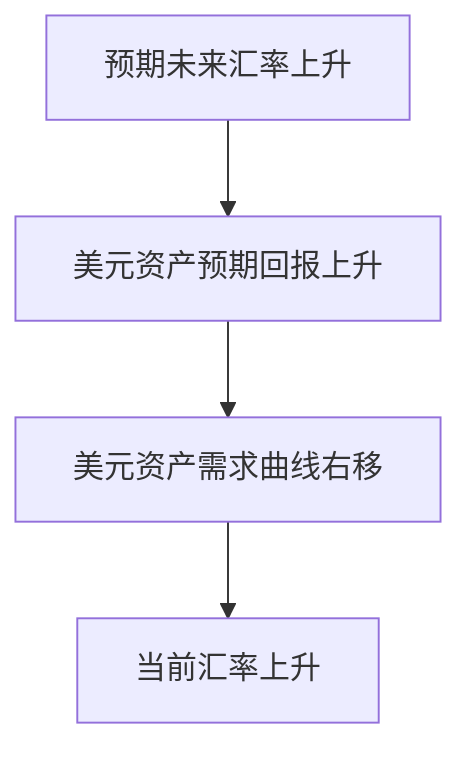

# 外汇市场(Foreign Exchange Market)

## 外汇汇率是什么

以另一种货币衡量的一种货币的价格称为汇率,某一货币价值上升叫升值appreciation下跌叫贬值depreciation

1. 现汇交易spot transaction 银行存款立即兑换的交易形式.使用现汇率spot exchange rate
2. 远期交易forward transaction银行存款在未来某个特定时间兑换的交易形式,使用远期汇率forward exchange rate

## 汇率为什么重要

影响两国商品的相对价格

jo RB PARA (An at Ee hoi ESE) , 商品 在 但 钞 就 会 变 得 更 加 昂贵 、 而 外 国 商品 在 该 国 就 会 更 加 便宜 (假定 两 国 商 品 国内 的 价格 保持 不 变 ) > 相反 ， 如 果 一 国货 币 贬 值 ， 该 国 商品 在 国外 就 会 变 得 便宜 ， 而 外 国 商品 在 该 国 就 会 变 得 更 呐 。
![[Pasted image 20240526213311.png]]

## 外汇如何进行交易

外汇市场以场外市场的形式组织的.实际上交易的都是以外国货币计量的存款

# 长期汇率

不讲

# 短期汇率:供给需求分析

## 国内资产的供给曲线

资产市场方法更关注资产的存量,不强调短期内进口和出口的流量.因为流量相对存量很小.在这里认为供给是垂直的.

## 国内资产的需求曲线

本国资产需求最重要的决定因素是本国资产的相对预期收益率.本国货币当前的价值越低,本国货币计量的资产的需求量越大.

## 外汇市场上的均衡

本国货币越值钱需求越低,纵轴越大本国货币越值钱.外 汇市 场 在 需求 曲线 侈 与 供给 曲线.S 的 交点 \ 及 达到 均衡 9 均 衡 并 Fe A &* O Exchange aes S | C Quantity of Dollar Assets![[Pasted image 20240526214307.png]] 

# 解释汇率的变动

## 预期汇率上升

预期未来汇率上升时，持有美元资产的预期回报上升，美元资产需求右移，从而推动当前汇率上升。

常见比较静态可归纳为：
- 国内利率上升（其他不变）通常提高美元资产相对回报，美元需求右移；
- 国外利率上升则相反，美元需求左移；
- 预期美元未来升值会提高当前美元资产需求；
- 预期进口需求、出口需求或相对生产能力变化，会通过净出口预期改变外汇需求曲线位置。

## 利率变动对均衡汇率的影响
