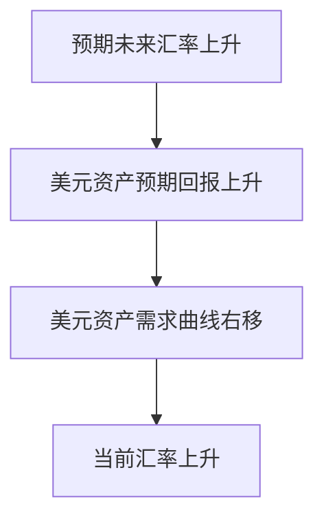

# [[外汇市场、利率平价与不可能三角|外汇市场]](Foreign Exchange Market)
<!-- bilingual-en:start -->
*The [[外汇市场、利率平价与不可能三角|foreign-exchange market]]*
<!-- bilingual-en:end -->

## 外汇汇率是什么
<!-- bilingual-en:start -->
*What is an exchange rate?*
<!-- bilingual-en:end -->

以另一种货币衡量的一种货币的价格称为汇率,某一货币价值上升叫升值appreciation下跌叫贬值depreciation
<!-- bilingual-en:start -->
An exchange rate is the price of one currency expressed in another currency. A rise in a currency's value is an appreciation; a fall is a depreciation.
<!-- bilingual-en:end -->

1. 现汇交易spot transaction 银行存款立即兑换的交易形式.使用现汇率spot exchange rate
2. 远期交易forward transaction银行存款在未来某个特定时间兑换的交易形式,使用远期汇率forward exchange rate
<!-- bilingual-en:start -->

&nbsp;
**1.** A spot transaction exchanges bank deposits immediately at the spot exchange rate. 
**2.** A forward transaction exchanges bank deposits at a specified future date using a forward exchange rate agreed today. 
<!-- bilingual-en:end -->

## 汇率为什么重要
<!-- bilingual-en:start -->
*Why do exchange rates matter?*
<!-- bilingual-en:end -->

影响两国商品的相对价格
<!-- bilingual-en:start -->
They affect the relative prices of goods produced in two countries.
<!-- bilingual-en:end -->

jo RB PARA (An at Ee hoi ESE) , 商品 在 但 钞 就 会 变 得 更 加 昂贵 、 而 外 国 商品 在 该 国 就 会 更 加 便宜 (假定 两 国 商 品 国内 的 价格 保持 不 变 ) > 相反 ， 如 果 一 国货 币 贬 值 ， 该 国 商品 在 国外 就 会 变 得 便宜 ， 而 外 国 商品 在 该 国 就 会 变 得 更 呐 。
<!-- bilingual-en:start -->
When a country's currency appreciates, its goods become more expensive abroad and foreign goods become cheaper at home, assuming domestic-currency prices in both countries remain unchanged. Conversely, depreciation makes the country's goods cheaper abroad and foreign goods more expensive at home. The opening and closing fragments in the source line are OCR noise.
<!-- bilingual-en:end -->
![[Pasted image 20240526213311.png]]

## 外汇如何进行交易
<!-- bilingual-en:start -->
*How is foreign exchange traded?*
<!-- bilingual-en:end -->

外汇市场以场外市场的形式组织的.实际上交易的都是以外国货币计量的存款
<!-- bilingual-en:start -->
The foreign-exchange market is organized as an over-the-counter market. What dealers actually trade are deposits denominated in foreign currencies.
<!-- bilingual-en:end -->

# 长期汇率
<!-- bilingual-en:start -->
*Long-run exchange rates*
<!-- bilingual-en:end -->

不讲
<!-- bilingual-en:start -->
This topic was not covered in the course.
<!-- bilingual-en:end -->

# 短期汇率:供给需求分析
<!-- bilingual-en:start -->
*Short-run exchange rates: supply-and-demand analysis*
<!-- bilingual-en:end -->

## 国内资产的供给曲线
<!-- bilingual-en:start -->
*Supply curve for domestic assets*
<!-- bilingual-en:end -->

资产市场方法更关注资产的存量,不强调短期内进口和出口的流量.因为流量相对存量很小.在这里认为供给是垂直的.
<!-- bilingual-en:start -->
The asset-market approach focuses on the stock of assets rather than short-run import and export flows, because those flows are small relative to the outstanding stock. The short-run supply curve is therefore treated as vertical.
<!-- bilingual-en:end -->

## 国内资产的需求曲线
<!-- bilingual-en:start -->
*Demand curve for domestic assets*
<!-- bilingual-en:end -->

本国资产需求最重要的决定因素是本国资产的相对预期收益率.本国货币当前的价值越低,本国货币计量的资产的需求量越大.
<!-- bilingual-en:start -->
The most important determinant of demand for domestic assets is their expected return relative to foreign assets. The lower the current value of the domestic currency, the larger the quantity demanded of assets denominated in that currency.
<!-- bilingual-en:end -->

## 外汇市场上的均衡
<!-- bilingual-en:start -->
*Equilibrium in the foreign-exchange market*
<!-- bilingual-en:end -->

本国货币越值钱需求越低（需求曲线向右下倾斜），供给在短期近似垂直；两条曲线交点给出均衡汇率与均衡资产持有量。可记为：
<!-- bilingual-en:start -->
Demand falls as the domestic currency becomes more valuable, so the demand curve slopes downward, while short-run supply is approximately vertical. Their intersection determines the equilibrium exchange rate and equilibrium asset holdings:
<!-- bilingual-en:end -->
$$
S(E^*)=D(E^*),\quad Q^*=S(E^*)=D(E^*).
$$

# 解释汇率的变动
<!-- bilingual-en:start -->
*Explaining movements in exchange rates*
<!-- bilingual-en:end -->

## 预期汇率上升
<!-- bilingual-en:start -->
*An expected rise in the future exchange rate*
<!-- bilingual-en:end -->

预期未来汇率上升时，持有美元资产的预期回报上升，美元资产需求右移，从而推动当前汇率上升。
<!-- bilingual-en:start -->
When the future exchange rate is expected to rise, the expected return on dollar assets increases. Demand for dollar assets shifts to the right, pushing up the current exchange rate.
<!-- bilingual-en:end -->

常见比较静态可归纳为：
- 国内利率上升（其他不变）通常提高美元资产相对回报，美元需求右移；
- 国外利率上升则相反，美元需求左移；
- 预期美元未来升值会提高当前美元资产需求；
- 预期进口需求、出口需求或相对生产能力变化，会通过净出口预期改变外汇需求曲线位置。
<!-- bilingual-en:start -->
The main comparative-static results are:
- A rise in the domestic interest rate, other things equal, usually raises the relative return on dollar assets and shifts dollar demand to the right.
- A rise in the foreign interest rate has the opposite effect and shifts dollar demand to the left.
- Expected future appreciation of the dollar increases current demand for dollar assets.
- Expected changes in import demand, export demand, or relative productive capacity shift the foreign-exchange demand curve through their effect on expected net exports.
<!-- bilingual-en:end -->

## 利率变动对均衡汇率的影响
<!-- bilingual-en:start -->
*How interest-rate changes affect the equilibrium exchange rate*
<!-- bilingual-en:end -->
