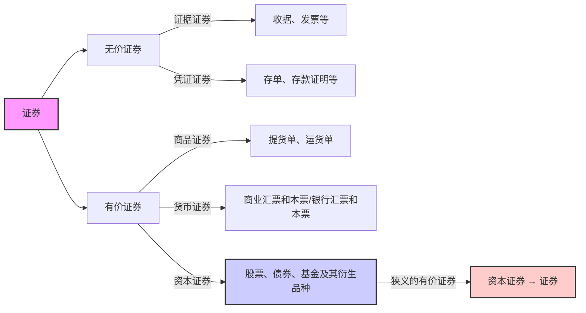
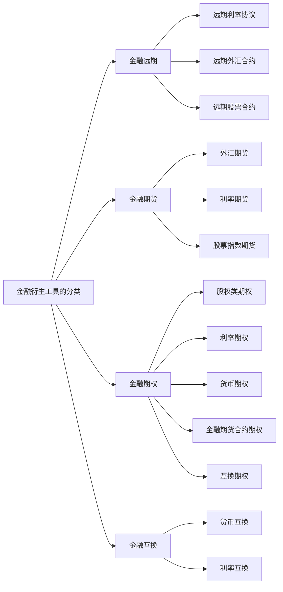

# 0. 考点,记忆用(Key Points for Exam, Memory Aid)

债券定义、股票的定义(不仅仅股票是什么还有什么样的分类)、比如1.3.3 不同的分类方法,要记住、可转换债券.（不知道是不是债券的分类也要了解清楚）(Bond definition, stock definition (not just what stocks are but also different classification methods, e.g., 1.3.3 different classification methods, need to remember), convertible bonds. (Not sure if bond classification also needs to be clearly understood))
P46 虽然是小专栏,但是要了解基本的金融期货的品种和特征.转换因子和计算方法（作业提到了）(P46 Although it is a small column, it is necessary to understand the basic types and characteristics of financial futures, conversion factors, and calculation methods (mentioned in homework))
1.5金融衍生工具 了解(1.5 [[Financial Ratio Analysis|Financial]] [[Derivative (2)|Derivative]] Tools - Understand)
1.6另类投资工具,了解，是什么,有什么特点,不需要太深的了解(1.6 Alternative [[Investment Decisions|Investment]] Tools - Understand what they are and their characteristics, no need for in-depth understanding)

- [ ] 债券的概念
- [ ] 股票的概念
- [ ] 股票的分类
- [ ] 基本金融期货的品种和特征
- [ ] 转换因子计算方法
- [ ] 另类投资工具

# 1. 证券与投资(Securities and [[Investment Decisions|Investment]])

## 1.1证券及其特征(Securities and Their Characteristics)
#考点
>[!note] 证券
>指各类记载并证明特定权益的法律凭证

票面要素：

持有人 证券的标的物 标的物的价值 权利(Holder, subject matter of the security, value of the subject matter, rights)

特征： 法律特征 书面特征   同时具备两个特征的 书面凭证称为证券(Characteristics: Legal characteristics, written characteristics. A written document with both characteristics is called a security)

## 1.2 证券分类(Classification of Securities)

有价证券和无价证券的区别：流通性，可盈利性(Differences between valuable securities and non-valuable securities: liquidity, profitability)

狭义的有价证券 —— 资本证券 → 证券(Narrowly defined valuable securities —— Capital Securities → Securities)

## 1.3 投资与证券投资([[Investment Decisions|Investment]] and Securities [[Investment Decisions|Investment]])

>[!note] 投资的定义
>投资主体为获取未来预期收益，将货币转化为资本的过程。

投资对象：实物资产或金融资产。([[Investment Decisions|Investment]] objects: real assets or financial assets)
真实物体 Vs 契约(Real Objects Vs Contracts)
投资 —— 投机 这两者没有特别明显的界限([[Investment Decisions|Investment]] —— Speculation. There is no clear boundary between the two)

* 投资目的:([[Investment Decisions|Investment]] purposes:)
	* 本金保障([[Principal-Agent Problem|Principal]] protection) 
	* 资本增值(Capital appreciation) 
	* 经常性收益。(Regular income)

>[!note] 证券投资定义
>投资者购买股票、债券、基金等资本证券及其衍 生品，以获取红利、利息及资本利得的投资行为 和投资过程

## 1.4风险与风险偏好(Risk and Risk Preference)

>[!note] 风险的定义(两种定义)
>未来结果的不确定性或损失
>个人和群体 在未来获得收益和遇到损失的可能性以及对这 种可能性的判断与认知

根据对风险的不同偏好,将人群分为三类:(According to different risk preferences, people can be divided into three categories:)

风险规避,风险中立.风险2偏好.(Risk aversion, risk neutrality, risk-seeking)

```tikz
\begin{document}
\begin{tikzpicture}[scale=0.8]

  %---------------------------------------------
  % Diagram 1: Risk-Averse (Concave utility)
  %---------------------------------------------
  \begin{scope}[xshift=0cm,yshift=0cm]
    % Axes
    \draw[->] (0,0) -- (4.5,0) node[right] {Income};
    \draw[->] (0,0) -- (0,4.5) node[above] {Utility};

    % Concave function, e.g. u(x) = 2*sqrt(x)
    \draw[domain=0:4, samples=100, thick] 
      plot (\x, {2*sqrt(\x)})
      node[right] {};

    % Caption
    \node[below=0.4cm] at (2.0,0) {Risk-Averse (Concave Utility)};
  \end{scope}

  %---------------------------------------------
  % Diagram 2: Risk-Neutral (Linear utility)
  %---------------------------------------------
  \begin{scope}[xshift=6cm,yshift=0cm]
    % Axes
    \draw[->] (0,0) -- (4.5,0) node[right] {Income};
    \draw[->] (0,0) -- (0,4.5) node[above] {Utility};

    % Linear function, e.g. u(x) = x
    \draw[domain=0:4, samples=100, thick]
      plot (\x, {\x})
      node[right] {};

    % Caption
    \node[below=0.4cm] at (2.0,0) {Risk-Neutral (Linear Utility)};
  \end{scope}

  %---------------------------------------------
  % Diagram 3: Risk-Loving (Convex utility)
  %---------------------------------------------
  \begin{scope}[xshift=3cm,yshift=-6cm]
    % Axes
    \draw[->] (0,0) -- (4.5,0) node[right] {Income};
    \draw[->] (0,0) -- (0,4.5) node[above] {Utility};

    % Convex function, e.g. u(x) = x^2/4
    \draw[domain=0:4, samples=100, thick]
      plot (\x, {(\x)^2/4})
      node[right] {};

    % Caption
    \node[below=0.4cm] at (2.0,0) {Risk-Loving (Convex Utility)};
  \end{scope}

\end{tikzpicture}

\end{document}
```

# 2. 债券(Bonds)

## 2.1 债券的定义与性质(Definition and Nature of Bonds)
#考点
>[!note] 债券的定义
债券是发行人按照法定程序向投资者发行，并约 定在一定期限还本付息的有价证券

* 基本性质：虚拟资本 有价证券 债权凭证(Basic nature: Virtual capital, valuable securities, debt certificate)
* 票面要素：票面价值(溢价发行Vs 折价发行）、偿还 期限、利率（决定因素）、付息期(Face value elements: Par value (premium issuance vs. discount issuance), repayment term, interest rate (determining factor), interest payment period) 
* 基本特征：偿还性、流通性、安全性、收益性(Basic characteristics: Repayment, liquidity, safety, profitability)

## 2.2债券融资优缺点(Advantages and Disadvantages of Bond Financing)

### 2.2.1优点(Advantages)

1. 资金成本低：抵税；利率低；(Low capital cost: tax deductible; low interest rate;) 
2. 财务杠杆；债权融资优于股权融资；([[Financial Ratio Analysis|Financial]] leverage; debt financing is better than equity financing;) 
3. 债券融资属于长期资金；(Bond financing belongs to long-term funds;) 
4. 债券筹资发行对象广，筹资额大(Bond financing has a wide range of issuance targets and large financing amounts)

### 2.2.2缺点(Disadvantages)

1. 财务风险大；(High financial risk;) 
2. 限制条款多(Many restrictive clauses)

## 2.3债券的种类(Types of Bonds)

### 2.3.1 按发行主体分类(By Issuer)

* 政府债券：中央政府、地方政府（利率高于国债）、政府机构；(Government bonds: central government, local government (interest rate higher than national debt), government agencies;) 
* 金融债券；银行或者非银金融机构发行([[Financial Ratio Analysis|Financial]] bonds; issued by banks or non-bank financial institutions) 
* 公司债券  
	* 按发行目的分为：普通公司债券、改组公司债券、利息公司债券、延期公司债券；(Classified by issuance purpose: ordinary corporate bonds, restructuring corporate bonds, interest corporate bonds, deferred corporate bonds;) 
* 国际债券 
	* 外国债券：扬基债券、武士债券、龙债券、猛犬债券、熊猫债券等(Foreign bonds: Yankee bonds, Samurai bonds, Dragon bonds, Bulldog bonds, Panda bonds, etc.)  
	* 欧洲债券：欧洲美元债券、亚洲美元债券(Eurobonds: Eurodollar bonds, Asian dollar bonds)

### 2.3.2 按债券的期限分类(By Term)

 * 短期债券：一年以内(Short-term bonds: within one year) 
 * 中期债券：1-5年(Medium-term bonds: 1-5 years) 
 * 长期债券：5年以上(Long-term bonds: more than 5 years) 
 * 永久债券 ：永续债(Perpetual bonds: Perpetual bonds)

### 2.3.3按债券形态分类：(By Form) 

* 实物债券（不记名，不挂失，可流通）；(Physical bonds (bearer, non-negotiable, transferable);)
* 凭证式债券（记名，可挂失，不流通，自购买之日计息）；(Certificate bonds (registered, negotiable, non-transferable, interest accruing from purchase date);) 
* 记账式债券：没有实物形态，电脑记账方式记录债权，在交易所发行及交易(Book-entry bonds: no physical form, recorded electronically, issued and traded on exchanges)

### 2.3.4按利息的计息方式分：(By [[Interest Rate Sensitivity Gap|Interest]] Calculation Method)

单利债券 复利债券(Simple interest bonds, compound interest bonds)

### 2.3.5按利息支付方式分类(By [[Interest Rate Sensitivity Gap|Interest]] Payment Method)

* 息票累积债券：到期一次还本付息(Accrual bond: Repays principal and interest at maturity) 
* 息票付息债券：富有息票的债券，标明利率及付息方式。(Coupon bond: Bond with coupons indicating interest rate and payment method) 
* 贴现付息债券（零息债券） ：发行价低于面额，到期按面额兑付；([[Discount Rate|Discount]] bond (zero-coupon bond): Issued at price below par, repaid at par at maturity)

### 2.3.6按债券是否记名分类(By Registration Status)

记名债券；无记名债券；(Registered bonds; bearer bonds)

### 2.3.7按抵押担保状况分类(By Collateral and Guarantee Status) 

* 抵押债券（Mortgage Bonds） 以动产或不动产作为抵押品，用以担保按期还本(Mortgage Bonds: Secured by movable or immovable property to guarantee repayment of principal) 
* 信用债券（Debenture Bonds） 指发行公司不提供任何有形、无形的抵押品，完全以公司的全部资信予以保证 的债券(Debenture Bonds: Unsecured bonds backed solely by the issuer's creditworthiness) 
* 保证债券：第三方作为还本付息担保(Guaranteed bonds: Guaranteed by a third party for principal and interest repayment) 
* 担保信托债券：以动产或者有价证券担保(Collateral trust bonds: Secured by movable property or securities)
### 2.3.8按公司债券是否可转换分类(By Convertibility)

可转换债券： 不可转换债券：(Convertible bonds; non-convertible bonds)

### 2.3.9按是否提前偿还分类(By Callability)

可赎回债券；不可赎回债券；(Callable bonds; non-callable bonds)

### 2.3.10按本金的偿还方式分类(By [[Principal-Agent Problem|Principal]] Repayment Method)

1. 到期偿还也叫回满期偿还，是指按答发行债券时规定 的还本时间，在债券到期时一次全部偿还本金的偿债方式(Maturity repayment: Repays entire principal at maturity according to terms) 
2. 期中偿还也叫中途偿还，是指在债券最终到期日之前 ，偿还部分或全部本金的偿债方式。(Interim repayment: Repays part or all principal before maturity) 
3. 展期偿还是指在债券期满后又延长原规定的还本付息 日期的偿债方式。(Extension repayment: Extends repayment date after maturity)

部分偿还和全额偿还([[Partial Autocorrelation Function|Partial]] repayment and full repayment) 
* 1.部分偿还是指从债券发行日起，经过一定宽限期后， 按发行额的一定比例，陆续偿还，到债券期满时全部还清([[Partial Autocorrelation Function|Partial]] repayment: Repays proportionally after grace period until maturity) 
* 2.全额偿还是指在债券到期之前，偿还全部本金 。(Full repayment: Repays entire principal before maturity)

定时偿还和随时偿还(Timed repayment and optional repayment) 
* 1.定时偿还亦称定期偿还，它指债券发行后待宽限期过后，分次在规定的日期，按一定的偿还率偿还本金。(Timed repayment: Repays fixed amounts on scheduled dates after grace period)  
* 2.随时偿还也称任意偿还，是指债券发行后待宽限期过后，发行人可以自由决定偿还时间，任意偿还债券的一部分或全部。(Optional repayment: Issuer decides when to repay part or all after grace period) 

抽签偿还和买入注销(Lottery repayment and buyback cancellation) 
* 1.抽签偿还是指在期满前偿还一部分债券时，通过抽签方式决 定应偿还债券的号码。(Lottery repayment: Randomly selects bonds to repay before maturity) 
* 2.买入注销是指债券发行人在债券未到期前按照市场价格从二 级市场中购回自己发行的债券而注销债务。(Buyback cancellation: Issuer repurchases bonds from secondary market to cancel debt)

### 2.3.11按投资人的收益分类(By Investor's [[Return on Assets|Return]]) 

固定利率债券([[Fixed Effects Model|Fixed]]-rate bonds) 
*  票面利率在整个债券有效期内固定不变；(Coupon rate remains fixed for bond's term)
* 或  以基础利率为基准，加上一个固定溢价加以确认。(Or based on a reference rate plus a fixed spread) 
浮动利率债券(Floating-rate bonds) 
* 典型的是指数债券，指根据某种指数的变动定期（半年或1 年）调整一次，使利率与通胀率挂钩来保证债券持有人免受 通胀的损失的一种公司债券。(Typically index-linked bonds that adjust periodically to link interest to inflation)
累进利率债券(Step-up bonds) 
* 利率与期限挂钩([[Interest Rate Sensitivity Gap|Interest]] rate linked to bond term)

### 2.3.12按债券选择权分类(By Bond Options) 

* 参加分红公司债券(Participating corporate bonds) 
* 免税债券(Tax-exempt bonds) 
* 收益公司债券([[Income and Substitution Effects|Income]] bonds)
	利息只在公司有盈利时才支付,即发行公司的利润扣除各项固定支 出后的余额用作债券利息的来源,如果余额不足支付,未付利息可以累加,待公司收 益改善后再补发。([[Interest Rate Sensitivity Gap|Interest]] paid only if company is profitable; unpaid interest accumulates) 
* 附新股认购权债券(Bonds with stock purchase rights) 
* 产权债券：该公司债券的持有者,可以按所规定的价格向发行公司请示认购新股票 的一种公司债券([[Equity Multiplier|Equity]]-linked bonds: Bondholders can purchase new shares at specified price) 
* 可赎回债券 
* 可转换债券 
* 偿还基金债券：要求发行人以偿债基金方式还债(Sinking fund bonds: Issuer must set aside funds for repayment)
### 2.3.13按债券筹集方式(By Issuance Method)

私募债券和公募债券。(Private placement bonds and public offering bonds)

### 2.3.14按使用币种(By Currency)

本币、外币、双重货币债券。(Domestic currency, foreign currency, dual currency bonds)

### 2.3.15按发行地域(By Issuance Region)

国内债券和国际债券。(Domestic bonds and international bonds)

### 2.3.16按债券表现形式分(By Form of Expression)

货币债券，实物债券，折实债券。([[Monetary Base|Monetary]] bonds, physical bonds, real-value bonds)

## 2.4 债券收益率的计算(Calculation of Bond [[Yield Curve|Yield]])

>[!NOTE] 债券收益率的定义
>利息产生在资金的所有者和使用者不统一的场合，它的实质是资金的使用者付给 资金所有者的租金，用以补偿所有者在资金租借期内不能支配该笔资金而蒙受的损失。

影响利息大小的三要素: 本金,利率,时间长度(Three factors affecting interest amount: principal, interest rate, time period)

### 2.4.1利息的度量(Measurement of [[Interest Rate Sensitivity Gap|Interest]])

#### 2.4.1.1 利息相关概念([[Interest Rate Sensitivity Gap|Interest]]-related Concepts)

##### **(1) 积累函数 $a(t)$**(**(1) Accumulation Function $a(t)$**)

累积分函数描述“$1$ 元从起始时刻（$t=0$）累积至时刻 $t$ 时变成多少”。通常约定(Accumulation function describes how much 1 yuan becomes from time $t=0$ to time $t$. Usually约定)
$$a(0) = 1 $$
即在时刻 $0$ 时，$1$ 元尚未经过任何利息累积。(At time $0$, 1 yuan has not yet accumulated any interest)

若给定某种利率或利息模型，$a(t)$ 反映了资金随时间增长的倍数。比如简单复利时，$a(t) = (1 + i)^t$；若为连续复利，$a(t) = e^{\delta t}$ 等等。(Given an interest rate or interest model, $a(t)$ reflects the growth multiple of funds over time. For example, simple compound interest: $a(t) = (1 + i)^t$; continuous compound interest: $a(t) = e^{\delta t}$, etc.)

##### **(2)总额函数 $A(t)$**(**(2) Total Amount Function $A(t)$**)

若初始投资本金为 $K$，则总额函数可写作(If initial investment principal is $K$, then total amount function can be written as)
$$A(t) = K \cdot a(t),.$$
它表示在时刻 $t$ 这笔本金所累积到的本息总额。就是上面的那个积累函数乘上本金的数值(It represents the total principal and interest accumulated at time $t$, which is the product of the above accumulation function and the principal)

##### **(3). 贴现函数 $a^{-1}(t)$**(**(3) [[Discount Rate|Discount]] Function $a^{-1}(t)$**)

一般把(Generally, it is called)
$$a^{-1}(t) = \frac{1}{a(t)}$$
称为“贴现函数”或“折现函数”，它表示在时刻 $0$ 看来，$1$ 元在时刻 $t$ 的现值有多少。(Called "discount function", it represents the present value of 1 yuan at time $t$ as viewed from time $0$)

就是a(t)的倒数(It is the reciprocal of $a(t)$)

##### **(4) 第 $N$ 期利息 $I(n)$**(**(4) [[Interest Rate Sensitivity Gap|Interest]] in Period $N$, $I(n)$**)

第 $n$ 期利息常记为([[Interest Rate Sensitivity Gap|Interest]] in period $n$ is often denoted as)
$$I(n) = A(n) - A(n-1),.$$
如果按离散期（如每年、每月等）计息，$I(n)$ 就表示第 $n$ 期相对于第 $n-1$ 期增长的“那部分利息”。(If interest is calculated in discrete periods (e.g., annual, monthly, etc.), $I(n)$ represents the "part of interest" that increased in period $n$ compared to period $n-1$)

这个公式说明：(This formula indicates:)
1. $A(n)$ 是第 $n$ 期末的本息总和；($A(n)$ is the total principal and interest at the end of period $n$;)
2. $A(n-1)$ 是上一期末的本息总和；($A(n-1)$ is the total principal and interest at the end of previous period;)
3. 两者相减得到当前期的纯利息数额(The difference between the two gives the pure interest amount of current period)

#### 2.4.1.2 单利计息和复利计息(Simple [[Interest Rate Sensitivity Gap|Interest]] and [[Compound Poisson Process|Compound]] [[Interest Rate Sensitivity Gap|Interest]])

```tikz
\begin{document}
\begin{tikzpicture}[scale=1.2, font=\small]
  % 1) Draw axes
  \draw[->, thick] (0,0) -- (6,0) node[right]{Time $t$};
  \draw[->, thick] (0,0) -- (0,6) node[above]{Value};
  % 2) Add a light grid for reference
  \draw[step=1, thin, gray!30] (0,0) grid (5,5);
  % 3) Simple Interest: V_simple(t) = 1 + 0.2 * t
  \draw[
    color=blue,       % line color
    thick,            % line thickness
    domain=0:5,       % plot from x=0 to x=5
    samples=100
  ] plot (\x, {1 + 0.3*\x});
  % 4) Compound Interest: V_compound(t) = (1.2)^t
  \draw[
    color=red,
    thick,
    domain=0:5,
    samples=100
  ] plot (\x, {(1.3)^\x});
  % 5) Legend in the top-right corner
  %    You can adjust the shift to move the box
  \begin{scope}[shift={(4.2,4.2)}]
    % Draw legend background (white rectangle) & border
    \draw[fill=white, draw=black, very thin] (0,0) rectangle (3,1);
    % Blue line for Simple Interest
    \draw[blue, thick] (0.3,0.7) -- (1,0.7);
    \node[anchor=west] at (1,0.7) {Simple Interest};
    % Red line for Compound Interest
    \draw[red, thick] (0.3,0.3) -- (1,0.3);
    \node[anchor=west] at (1,0.3) {Compound Interest};
  \end{scope}
\end{tikzpicture}
\end{document}
```

单利计息是线性积累.$a(t) = 1 + i t$                     $i_n = \frac{i}{1 + (n - 1)i}$(Simple interest is linear accumulation. $a(t) = 1 + it$, $i_n = \frac{i}{1 + (n - 1)i}$)
复利计息是指数积累$a(t) = (1 + i)^t$                   $i_n = i$([[Compound Poisson Process|Compound]] interest is exponential accumulation. $a(t) = (1 + i)^t$, $i_n = i$)

在这里引入一个概念:实际利率:实际某一时期的利率应当是该期获得的利息相对于前一期末累计金额的比例。(Here introduces a concept: [[Effective Duration|Effective]] interest rate: the actual interest rate in a certain period should be the ratio of the interest earned in that period to the cumulative amount at the end of the previous period)

那么易得:单利的实质利率逐期递减,复利的实质利率保持恒定。(Then it is easy to get: the effective interest rate of simple interest decreases period by period, while that of compound interest remains constant)

>[!tip] 针对不同时期的单复利选择([!tip] Choice of Simple vs [[Compound Poisson Process|Compound]] [[Interest Rate Sensitivity Gap|Interest]] for Different Periods)
>$t\leq1$时，相同单复利场合，单利计息比复 利计息产生更大的积累值。所以短期业务 一般单利计息。(When $t \leq 1$, simple interest produces a larger accumulation value than compound interest in the same scenario. So short-term business generally uses simple interest) 
>$t\geq1$时，相同单复利场合，复利计息比单 利计息产生更大的积累值。所以长期业务 一般复利计息。(When $t \geq 1$, compound interest produces a larger accumulation value than simple interest in the same scenario. So long-term business generally uses compound interest)

#### 2.4.1.3利率和贴现率([[Interest Rate Sensitivity Gap|Interest]] Rate and [[Discount Rate|Discount Rate]])

==期末计息--利率==(==End-of-period interest calculation -- interest rate==)
$$
i_n = \frac{I(n)}{A(n-1)} 
$$
$i_n$ 描述了第 $n$ 期从上一期末金额中**增长**了多少比例。例如，如果第 2 期的 $i_2 = 0.05$，就意味着从第 1 期末金额再增加了 5% 的利息。($i_n$ describes how much the amount at the end of period $n$ increases from the previous period. For example, if $i_2 = 0.05$, it means the amount at the end of period 1 increases by 5% interest)

==期初计息：[[Discount Rate|贴现率]]==(==Beginning-of-period interest calculation: discount rate==)

期初计息通常指：**把本期末的本息总和**当作基数，先想好“未来会有多少利息”，再“贴现”回本期初。也就是说，贴现率衡量的是“利息在最终金额中占多大比例”(Beginning-of-period interest calculation usually means: taking the total principal and interest at the end of the period as the base, first calculate the future interest, then discount back to the beginning of the period. That is, discount rate measures the proportion of interest in the final amount)
$$
d_n = \frac{I(n)}{A(n)} 
$$
其中 $A(n)$ 是第 $n$ 期末的总额（本金+利息）。(where $A(n)$ is the total amount at the end of period $n$ (principal + interest))

$d_n$ 描述了第 $n$ 期从最终金额中**减少**多少算作“本期的利息”。在保险精算或债券贴现等场景里，常用贴现率来度量未来收到的钱折算到期初值时“扣掉”的那部分占比。($d_n$ describes how much is deducted from the final amount as the "interest of the current period". In scenarios like insurance actuarial or bond discounting, discount rate is used to measure the proportion of deduction when future money is discounted to present value)

>[!example] 假设第 1 期末有 100 元，第 2 期末有 105 元，于是第 2 期获得的利息是 5 元 (I(2)=5)(>[!example] Suppose there is 100 yuan at the end of period 1 and 105 yuan at the end of period 2, so the interest earned in period 2 is 5 yuan (I(2)=5))
>• **期末计息（利率）**(• **End-of-period interest calculation (interest rate)**)
>$$i_2 = \frac{5}{100} = 0.05 \quad (\text{即 }5\%).$$
>• **期初计息（[[Discount Rate|贴现率]]）**(• **Beginning-of-period interest calculation (discount rate)**)
>$$d_2 = \frac{5}{105} \approx 0.0476 \quad (\text{即 }4.76\%).$$
>从 100 长到 105，增加 5，若用“上一期末的本金 100”做基数，利率就变成 5%；可如果从“本期末总额 105”来反推利息所占份额，就只有约 4.76%。它们都描述的是同一笔利息，只不过分母不同，因而数值有所区别。(From 100 to 105, an increase of 5. If using "previous period's principal 100" as the base, the interest rate is 5%; but if inferring from "current period's total 105", the interest share is only about 4.76%. They describe the same interest, but with different denominators, hence different values)
>==觉得别扭的主要是因为贴现率的概念在日常场景不太常用。你只要记住：**[[Discount Rate|贴现率]] = 利息 ÷ 期末总额**，它测的是“利息在期末总额中所占的份额”。==(==The discomfort is mainly because the concept of discount rate is not commonly used in daily scenarios. Just remember: **discount rate = interest ÷ final amount**, it measures the "proportion of interest in the final amount"==)

#### 2.4.1.4不同场合下的贴现率与利率关系(Relationship between [[Discount Rate|Discount Rate]] and [[Interest Rate Sensitivity Gap|Interest]] Rate in Different Scenarios)

**在“单利场合”**(**In "simple interest scenario"**)
$$
d_n
= \frac{a(n) - a(n-1)}{a(n)}
= \frac{\bigl[1 + in\bigr] - \bigl[1 + i(n-1)\bigr]}{1 + in}
= \frac{i}{1 + in} 
$$

说明：

在单利下，第 $n$ 期的利息相对于“期末总额”所占的比例是 $\tfrac{i}{1 + in}$。当 $n$ 越大，分母越大，所以 $d_n$ 越小。(Under simple interest, the ratio of interest in period $n$ to the "final amount" is $\tfrac{i}{1 + in}$. As $n$ increases, the denominator increases, so $d_n$ decreases)

**在“复利场合”**(**In "compound interest scenario"**)
$$
d_n
= \frac{(1+i)^n - (1+i)^{n-1}}{(1+i)^n}
= \frac{(1+i)^{n-1}\bigl[(1+i) - 1\bigr]}{(1+i)^n}
= \frac{i(1+i)^{n-1}}{(1+i)^n}
= \frac{i}{1 + i} 
$$
  

说明：

在复利下，每期贴现率 $d_n$ 都等于 $\tfrac{i}{1 + i}$，**与 $n$ 无关**；这是因为每一期按相同的利率 $i$ 复利，导致期初贴现率也恒定不变。(Under compound interest, the discount rate $d_n$ per period equals $\tfrac{i}{1 + i}$, **independent of $n$**; this is because each period is compounded at the same interest rate $i$, resulting in a constant discount rate at the beginning of each period)

| **初始值** | **利息** | **积累值** |
| ------- | ------ | ------- |
| 1       | $i$    | $1 + i$ |
| $v$     | $d$    | 1       |

### 2.4.2年金([[Annuity|Annuity]])

>[!note] 年金的定义(Definition of [[Annuity|Annuity]])
>按一定的时间间隔支付的一系列付款称为年金。原始含义是限于一年支付一次的付款，现已推广到任意间隔长度的系列付款([[Annuity|Annuity]] refers to a series of payments made at regular time intervals. Originally limited to annual payments, now extended to any interval length)

#### 2.4.2.2年金的分类(Classification of [[Annuity|Annuity]])

基本年金 :等时间间隔付款,付款频率与利息转换频率一致,每次付款金额恒定(Basic annuity: payments at equal time intervals, payment frequency consistent with interest conversion frequency, constant payment amount each time)
	付款时刻不同：初付年金/延付年金(Different payment times: annuity due / ordinary annuity) 
	付款期限不同：有限年金/永久年金(Different payment terms: finite annuity / perpetual annuity)
一般年金 :不满足基本年金三个约束条件的年金即为一般年金(General annuity: annuity that does not meet three basic annuity constraints)

#### 2.4.2.3年金相关计算([[Annuity|Annuity]]-related Calculation)

• 用变量$i$表示有效利率(interest rate)，即每期的利率；(• Variable $i$ represents effective interest rate, i.e., per period interest rate;)
• 用$v$表示贴现因子(discount factor)，常见定义是 $v = \frac{1}{1 + i}$；(• Variable $v$ represents discount factor, commonly defined as $v = \frac{1}{1 + i}$;)
• 用$d$表示贴现率(discount rate)，常见定义是 $d = \frac{i}{1 + i}$，因此 $d = 1 - v$；(• Variable $d$ represents discount rate, commonly defined as $d = \frac{i}{1 + i}$, so $d = 1 - v$;)
• 上标或下标如 $n$ 表示期限(如$n$期)(• Superscript or subscript such as $n$ represents term (e.g., $n$-period))
• 符号 $a_{\overline{n}|}$、$\ddot{a}_{\overline{n}|}$、$s_{\overline{n}|}$、$\ddot{s}_{\overline{n}|}$ 等，分别表示不同类型年金(先付、后付)的现值或终值。S是终值,a是现值.带冒号的是先付年金,不带的是后付年金.(• Symbols $a_{\overline{n}|}$, $\ddot{a}_{\overline{n}|}$, $s_{\overline{n}|}$, $\ddot{s}_{\overline{n}|}$ etc., represent present value or future value of different types of annuity (annuity due, ordinary annuity). $s$ is future value, $a$ is present value. With colon is annuity due, without is ordinary annuity)
##### **(1). 延付年金现值**(**(1) [[Present Value|Present Value]] of Ordinary [[Annuity|Annuity]]**)

$$a_{\overline{n}|} = v + v^2 + \cdots + v^n = \frac{v (1 - v^n)}{1 - v} = \frac{1 - v^n}{i}$$
• 这里的后付年金(ordinary annuity 或 annuity immediate)是指：在每个期末支付(或收款)1元，持续$n$期；(• Ordinary annuity (or annuity immediate) here refers to: paying (or receiving) 1 yuan at the end of each period for $n$ periods;)
• $v^k$ 表示第$k$期末支付的金额的现值系数；(• $v^k$ represents present value coefficient for payment at the end of period $k$;)
• 也可以写成 $\frac{1 - v^n}{i}$，其中 $i$ 为利率，$v = \frac{1}{1 + i}$。(• Can also be written as $\frac{1 - v^n}{i}$, where $i$ is interest rate, $v = \frac{1}{1 + i}$)
>[!example] **例子**：假设利率为 $i = 5\%$，即 $v = \frac{1}{1.05} \approx 0.95238$。(>[!example] **Example**: Suppose interest rate $i = 5\%$, i.e., $v = \frac{1}{1.05} \approx 0.95238$)
>若你在每年期末存入1元，连续存5年，那么它们在第0期(现在)的总现值就是(If you deposit 1 yuan at the end of each year for 5 consecutive years, their total present value at period 0 (now) is)
>$$a_{\overline{5}|} = \frac{1 - v^5}{i}= \frac{1 - 0.95238^5}{0.05}\approx \frac{1 - 0.95238^5}{0.05}.$$

##### **(2). 初付年金现值**(**(2) [[Present Value|Present Value]] of [[Annuity|Annuity]] Due**)

$$\ddot{a}_{\overline{n}|} = 1 + v + \cdots + v^{n-1} = (1 + i), a_{\overline{n}|} = \frac{1 - v^n}{d}$$

• 先付年金(annuity due)是指：在每个期初支付(或收款)1元，持续$n$期；(• [[Annuity|Annuity]] due refers to: paying (or receiving) 1 yuan at the beginning of each period for $n$ periods;)
• 相比后付年金，它比后付年金多“提前”了一期的贴现(或说每笔款项都比后付年金早付1期)；(• Compared to ordinary annuity, it has "one period earlier" discount (i.e., each payment is made one period earlier than ordinary annuity);)
• 因此也有 $\ddot{a}_{\overline{n}|} = (1 + i), a_{\overline{n}|}$ 的关系，其中 $d = 1 - v = \frac{i}{1 + i}$。(• Therefore, there is also the relationship $\ddot{a}_{\overline{n}|} = (1 + i) \cdot a_{\overline{n}|}$, where $d = 1 - v = \frac{i}{1 + i}$)

>[!example] **例子**：若还是 $i = 5\%$ (>[!example] **Example**: Still $i = 5\%$)
>但改为每年期初就存入1元，连续存5年，那么它们在现在的总现值就是(But instead, if you deposit 1 yuan at the beginning of each year for 5 consecutive years, their total present value now is)
>$$\ddot{a}_{\overline{5}|} = (1 + i) a_{\overline{5}|} = 1.05 \times a_{\overline{5}|}.$$
>
>因为先付年金比后付年金要“多”一段利息(每笔款项都早存了一期)。(Because annuity due "earns" one more period of interest than ordinary annuity (each payment is deposited one period earlier))

##### **(3). 后付年金终值(累积值)**(**(3) [[Future Value|Future Value]] of Ordinary [[Annuity|Annuity]] (Accumulated Value)**)

$$s_{\overline{n}|} = 1 + (1 + i) + \cdots + (1 + i)^{n-1} = \frac{(1 + i)^n - 1}{i}$$

• 后付年金的终值(future value)指的是：在每个期末存入1元，持续$n$期后，所有存入金额到最后一期末的累计值之和；

>[!example] **例子**：每年期末存1元，存5年，利率 $i = 5\%$
>那么在第5年期末的累积总额是
>$$s_{\overline{5}|} = \frac{(1.05)^5 - 1}{0.05}.$$

##### **(4). 先付年金终值**

$$\ddot{s}_{\overline{n}|} = (1 + i) + (1 + i)^2 + \cdots + (1 + i)^n = (1 + i), s_{\overline{n}|} = \frac{(1 + i)^n - 1}{d}$$

• 先付年金的终值：在每个期初存1元，持续$n$期，在第$n$期末时的总累积值；
• 由于每笔款都比后付年金“提早”存入1期，因此可以乘以 $(1 + i)$ 得到和后付年金的关系。

##### **(5). 无限年金(永续年金)[[Present Value|现值]]**

• 当 $n \to \infty$ 时(也就是持续无限期支付)，我们就得到常见的永续年金现值公式：

$$
a_{\overline{\infty}|}
= \lim_{n \to \infty} a_{\overline{n}|}
= \lim_{n \to \infty} \frac{1 - v^n}{i}
= \frac{1}{i},
$$
$$
\ddot{a}_{\overline{\infty}|}= \lim_{n \to \infty} \ddot{a}_{\overline{n}|}= \lim_{n \to \infty} \frac{1 - v^n}{d}
= \frac{1}{d}.
$$

• 这就是著名的“永续年金现值 = 每期支付 / 利率”。

#### 2.4.2.4 银行贷款问题

##### **(1)分期偿还的基本概念**

分期偿还（Installment Repayment）指借款人在约定的还款期限内，以一定的周期（如按月、按季度等）向银行或其他金融机构归还部分本金和利息，直到贷款本息全部还清为止。

##### **(2)常见的分期偿还类型**

###### **1. 等额本息还款**

• **特点**：每期还款金额相同（本息合计金额相同），其中利息与本金的占比随期数变化。

**等额本息还款的核心公式**：

若贷款总额为$P$，期利率为$r$（注意如果是年利率，需要先转换为每期利率），还款总期数为$n$，则每期还款金额记为$A$。

$$
A = P \times \frac{r(1+r)^n}{(1+r)^n - 1}
$$

其中：
• $P$：贷款本金
• $r$：每期利率（如月利率$= \frac{\text{年利率}}{12}$）
• $n$：还款总期数
• $A$：每期固定偿还额（含本金和利息）

计算过程:

将每月还款看作是一系列等额支付的现金流，其现值之和应等于贷款本金 $P$。即：
$$
P = A \left[\frac{1}{(1+r)^1} + \frac{1}{(1+r)^2} + \cdots + \frac{1}{(1+r)^n}\right]
$$
利用等比数列求和公式，上式可写为：
$$
P = A \cdot \frac{1 - (1+r)^{-n}}{r}
$$
整理后得出每月还款额公式：
$$
A = P \cdot \frac{r(1+r)^n}{(1+r)^n - 1}
$$

**每期的利息和本金**可以进一步拆分：

• 第$k$期应还利息：
$$I_k = \text{上期末剩余本金} \times r$$
• 第$k$期应还本金：
$$B_k = A - I_k$$

等额本息还款中，随着期数增加，每期还款中利息占比逐渐减少、本金占比逐渐增加，但每期还款总额$A$保持不变。

>[!example] **等额本息还款示例**
>假设某人向银行贷款$P=10000$元，年利率为$12\%$，按月计息，则月利率$r = 12\%/12 = 1\% = 0.01$，还款期数$n=12$期（1年按12个月计）。
>
>
>• 计算每期应还款额$A$：
$$A = 10000 \times \frac{0.01 \times (1 + 0.01)^{12}}{(1 + 0.01)^{12} - 1}$$
你可以先计算$(1.01)^{12}$，再代入公式即可得出数值结果（此处仅展示公式结构）。
• 每期利息$= \text{上期末剩余本金} \times 0.01$；
• 每期本金$= A - \text{当期利息}$；
• 每期还完之后，更新剩余本金并进入下一期。

###### **2. 等额本金还款**

• **特点**：每期归还的本金相同，而利息部分逐期减少，所以每期还款总额呈递减趋势。
• **适用场景**：如果借款人希望前期能尽快偿还更多本金，后期还款压力逐步减小，可以选择等额本金还款。

**等额本金的计算方法**：

• 每期本金：
$$B = \frac{P}{n}$$
• 第$k$期应还利息：
$$I_k = (\text{上期末剩余本金}) \times r$$
其中，上期末剩余本金会随偿还逐期递减。
• 第$k$期还款总额：
$$A_k = B + I_k$$

>[!example] **等额本金还款示例**
>仍以$P=10000$元，月利率$r=0.01$，还款期数$n=12$为例：
>
>• 每期归还本金$B = 10000 / 12 \approx 833.33$元；
>• 第1期利息$= 10000 \times 0.01 = 100$元，第1期还款$= 833.33 + 100 = 933.33$元；
>• 第2期利息$= (10000 - 833.33) \times 0.01 \approx 91.67$元，第2期还款$= 833.33 + 91.67 = 925$元；
>• 依此类推，直到第12期。
>可以看到还款总额逐期递减，这就是等额本金还款的特征。

###### **3. 不等额分期偿还**

• **递增分期偿还**：每期偿还金额在一定规则下递增，通常适用于预期未来收入会逐步增加的人群。
• **递减分期偿还**：每期偿还金额在一定规则下递减，一般适用于前期偿还能力较强，希望后期压力减轻的情形。

### 2.4.3债券收益率的计算

决定债券收益率的主要因素有债券的票面利率、期限、面值和购买价格。  
最基本的债券收益率计算公式为：

$$
\text{债券收益率}
= \frac{\text{到期本利合计} - \text{发行价格}}{\text{发行价格}}
\times \frac{100\%}{\text{持有年数}}
$$

由于债券持有人可能在债券还未到期前卖出债券，因此债券的收益率还可以细分为债券持有者的收益率、债券购买时的收益率和债券持有期间的收益率。各自的计算公式如下：

1. **债券持有者的收益率**  
   $$
   \text{债券持有者的收益率}
   = \frac{\text{卖出价格} - \text{发行价格}}{\text{发行价格}}
   \times \frac{100\%}{\text{持有年数}}
   $$

2. **债券购买时的收益率**  
   $$
   \text{债券购买时的收益率}
   = \frac{\text{到期本利合计} - \text{购买价格}}{\text{购买价格}}
   \times \frac{100\%}{\text{持有年数}}
   $$

3. **债券持有期间的收益率**  
   $$
   \text{债券持有期间的收益率}
   = \frac{\text{卖出价格} - \text{购买价格}}{\text{购买价格}}
   \times \frac{100\%}{\text{持有年数}}
   $$

# 3. 股票

## 3.1股票的概念与价值

>[!note]  股票的概念
>股票是一种有价证券，是股份有限公司发行的、 用以证明投资者的股东身份和权益、并据以获取股息 和红利的凭证。 
>
>* 不可偿还性、参与性、收益性、流通性、价格波动性和风险性
>* 一旦发行不可退换

### 3.1.2 股票的价值

>[!quote] 1. 票面价值
>==用货币来衡量的作为获利手段的价值==
>股票票面上标明的票面金额 发行时有意义

>[!quote] 2. 账面价值
>又称为每股净资产.是用会计统计的方法计算出 来的每股股票所代表的实际资产的价值

>[!quote] 3. 市场价值
>在股票市场交易过程中所具有的价值

>[!quote] 4. 清算价值
>公司解散的时候需要清算的价值

## 3.2股票的类型

### 3.2.1普通股票

 最常见的一种股票，其持有者享受股东的基本 权利和义务 股利完全随公司盈利的高低而变化 收益分配在还债纳税之后 

股东权利:
公司重大决策的参与权 公司盈余和剩余财产分配权 优先认股权

### 3.2.2 优先股票

是一种特殊股票 分配上比普通股股东享有优先权

特征:
股息率固定 股息分派优先 剩余资产分配优先 一般无表决权

## 3.3我国现行的股票类型

### 3.3.1外资股

境内上市:向境外投资者融资在境内上市
	以人民币表明面值，以外币认购或买卖
境外上市:向境外投资者募集在境外上市
	以人民币表明面值，以外币认购或买卖

### 3.3.2 股票的内在价值

>[!note] 普通股的估值.使用贴现现金流模型
>股票理论价格等于股票的未来预期现金流的现值。

股票价格与内在价值的偏离容易造成股市泡沫 
原因：过度投机、道德风险、规范失灵、诈骗、羊群效 应等

eg:2015中国股灾.当时对于牛市的信心太足了,不少人冒进加大杠杆.

### 3.3.3 送红股 配股 转增股本

| **区别/名称**        | **送红股（发放股票股利）**                 | **配股**                                  | **转增股本**                         |
| ---------------- | ------------------------------- | --------------------------------------- | -------------------------------- |
| **定义**           | 将本年度的利润留在公司，通过发放股票作为股利，将利润转化为股本 | 公司按一定比例向现有股东发行新股，股东需要按配股价格和数量缴纳配股款      | 将公积金（如资本公积或盈余公积）转化为股本，与送红股在形式上相似 |
| **资金来源**         | 来自公司当期可分配利润                     | 来自股东的实际出资（股东需投入额外资金）                    | 来自公司公积金（资本公积或盈余公积）               |
| **是否需要股东投入额外资金** | 否                               | 是                                       | 否                                |
| **对公司总资产的影响**    | 总资产不变                           | 总资产增加（因股东投入新资金）                         | 总资产不变                            |
| **对股东权益总额的影响**   | 股东权益总额不变（内部结构变化：留存收益减少、股本增加）    | 股东权益总额增加（股本增加+股东投入的资金）                  | 股东权益总额不变（公积金转为股本）                |
| **对每股收益和股价的影响**  | 由于股本增多、每股收益通常摊薄，股价会相应除权         | 新增股本会摊薄每股收益，配股后股价也会除权                   | 同样增大股本摊薄每股收益，股价除权                |
| **与股东持股比例的关系**   | 所有股东按原有持股比例获得红股，一般不会改变股东之间的持股比例 | 如果股东不参与配股，其持股比例可能被摊薄；若按比例全额参与，可保持原有持股比例 | 所有股东持股比例不变（按持股比例同步增加股本）          |

<span style="color: yellow;">送红股要收税,公积金转增股本不收税</span>

## 3.4股票与债券的异同

| **区分**       | **股票**                                                                                                  | **债券**                                                                                                      |
|----------------|-----------------------------------------------------------------------------------------------------------|---------------------------------------------------------------------------------------------------------------|
| **相同点**     | 1. 长期投资金融工具<br>2. 有流通性<br>3. 具有获得一定收益的权利<br>4. 可以进行转让买卖                     | 1. 与股票同为长期投资金融工具<br>2. 同样具有流通性等特征                                                       |
| **关系**       | 1. 所有权凭证<br>2. 产权证券                                                                               | 1. 债权凭证<br>2. 债务关系                                                                                    |
| **目的**       | 1. 增加资本收益<br>2. 可以分红                                                                             | 1. 追加资金的需要<br>2. 公司负债<br>3. 不浪费资本                                                              |
| **期限**       | 1. 永久投资<br>2. 股份可流通                                                                               | 1. 有期限<br>2. 到期还本付息                                                                                 |
| **风险与收益** | 1. 风险较大<br>2. 股利和分红来自公司利润的一部分<br>3. 市场价格波动频繁                                     | 1. 风险较小<br>2. 利息固定<br>3. 利息属于公司支出成本或费用<br>4. 市场价格波动较小<br>5. 先还债券后分红       |

# 4.证券投资基金

## 4.1证券投资基金的定义和特征

>[!note] 证券投资基金的定义
>指通过发售基金份额，将众多投资者的资金集 中起来，形成独立财产，由基金托管人托管，基金 管理人管理，以投资组合的方法进行证券投资的一 种利益共享、风险共担的集合投资方式。

特征:
* 集合理财，专业管理 
* 组合投资，分散风险 
* 利益共享，风险共担 
* 严格监管，信息透明 
* 独立托管，保障安全

## 4.2 证券投资基金的运作

$$ \begin{array}{c}{{\left.\frac{\[[Gamma|Gamma]]-\rightarrow\frac{\gamma_{\mathrm{E}}}{\sqrt{\mathrm{B}}}-\rightarrow\frac{\gamma_{\mathrm{E}}}{\sqrt{\mathrm{B}}}-\rightarrow\frac{\gamma_{\mathrm{E}}}{\sqrt{\mathrm{B}}}-\frac{\gamma_{\mathrm{E}}}{\sqrt{\mathrm{B}}}\right\}}{\left[\frac{\gamma_{\mathrm{E}}}{\sqrt{\mathrm{B}}}\frac{\gamma}{\Lambda}}{\Lambda}\right]}}\\ {{\left.\frac{\gamma}{\sqrt{\beta}}\left(\frac{\gamma_{\mathrm{E}}}{\sqrt{\frac{\gamma}{\Lambda}}}\right)}}\\ {{\left.\frac{\gamma}{\sqrt{\frac{\gamma}{\Lambda_{\mathrm{-}}\frac{\Lambda}{\sqrt{\Lambda}}}}{\Lambda}}}}\\ {{\frac{\beta}{\sqrt{\beta}}}}\end{array} $$
![[Pasted image 20250226152919.png]]

委托人:
	受益凭证持有人/投资者/受益人 
	享有《基金法》规定的基金份额持有人的一切权利
基金管理人 —— 基金管理公司
	基金产品的募集者和基金的管理者，在基金资产进 行具体的投资运用中具有核心作用
托管人 —— 具有托管资格的商业银行
	负责保管信托财产，会计核算 
	具体办理证券和现金的管理及相关的代理业务，对基 金投资运作进行监督
证券投资基金市场服务机构
	基金销售机构 
	注册登记机构 
	律师事务所 
	会计事务所 
	基金投资咨询公司 
	基金评级机构

中 国 证 券 监督 管理 委员 会 aoe 部 门 证 监 会 基金 监管 部 深 沪 证 关 ee aeean 交易 所 地 方 证 券 监管 局 券 投 资 基金 委员 会 ) 各 下 属 省 市 证 券 监管 办 公 处 基金 管理 公司 及 各 类 中 介 机 构
![[Pasted image 20250304201422.png]]
—s a a * & see , 管 |* 基金 会 计 基金 清算 a 理 银 公 一 一 一 一 | 代销 基金 司 行 直属 ——— 7
![[Pasted image 20250304201431.png]]

基金管理费与规模成反比,与风险成正比.投资者既要承担大盘下跌带来的损失又要承担管理费用

## 4.3 证券投资基金的类型

>[!note] 合同型投资基金
>是依据我国《证券投资基金法》成立的一种信托型 投资基金，基于一定的信托合同组织起来的代理投资行 为，由投资者、基金管理公司、基金托管机构三方订立 信托投资契约而建立。

>[!note] 公司型投资基金
>是依据《公司法》而成立的投资基金。即发起组织以投 资为目的的投资公司发行投资基金股份，投资者购买基金 股份、参与共同投资的信托财产形态。

|                        | 合同型基金           | 公司型基金             |
|------------------------|----------------------|------------------------|
| **法人资格**          | 没有法人资格         | 具有法人资格           |
| **营运信托财产的依据** | 信托契约             | 公司章程               |
| **筹资工具**          | 发行受益凭证筹资     | 发行股票、债券筹资     |
| **投资者的地位**      | 对资金的营运没有发言权 | 股东大会行使股东权利   |
| **融资渠道**          | 受到限制             | 可以向银行借款         |
| **优势**             | 信托的大众化程度、经营成本、销售基金证券 | 稳定投资、保护基金持有人利益、运用信托资产 |

## 4.4 证券投资基金的运作方式

### 4.4.1 封闭式/开放式基金

>[!note] 封闭式基金概念
>指基金管理公司在设立基金时，限定了基金的发行总 额，在初次发行达到了预定的发行计划后，基金即宣告成立，并进行封闭，在一定时期内不再追加发行新基金单位的一种基金。

>[!note] 开放式基金概念
>开放式基金是指基金发行总额不固定，基金单位总数 随时增减，投资者可以按基金的报价在国家规定的营业场 所申购或赎回的一种基金。

|          | 开放式基金               | 封闭式基金               |
| -------- | ------------------- | ------------------- |
| **规模**   | 不固定                 | 固定                  |
| **存续期限** | 不确定                 | 确定（10/15年）          |
| **交易方式** | 上市/不上市              | 上市流通                |
| **交易价格** | 基金单位资产净值+申购赎回费用     | 随行就市，多为折价           |
| **信息披露** | 每日公布基金单位净值，每季公布资产组合 | 每周公布基金单位净值，每季公布资产组合 |
| **投资策略** | 强调流动性管理             | 无流动性要求              |
|          |                     |                     |

### 4.4.2 上市开放式基金(LOF)

>[!note] Listed Open - ended Funds LOF
>指在（深圳）交易所上市交易的开放式证券投资基 金，投资者既可以通过基金管理人或其委托的销售机构以 基金净值进行基金的申购、赎回，也可以通过交易所市场 以交易系统撮合成交价进行基金的买入卖出

### 4.4.3 指数基金

>[!note] 指数基金概念
>指按照某种指数构成的标准购买该指数包含的证券市 场中的全部或一部分证券的基金，其目的在于达到与该指 数同样的收益水平

特点:费用低廉 分散风险 监控较少

### 4.4.4 交易所交易开放式指数基金ETF

>[!note] 交易所交易开放式指数基金
>实物申购/赎回: “一篮子股票” ←→ ETF份额 Exchange Traded Funds 两个市场 —— 套利机制 ETF是一种在交易所买卖的有价证券，代表一篮子股 票的所有权。机构投资者以这一篮子股票为担保，将其分 割为众多单价较低的ETF基金份额。投资者既可以在证券 交易所像买卖股票一样买卖ETF，也可以通过赎回ETF单 位换得一篮子股票
>可以在两个市场套利

### 4.4.5 FOF基金的基金

>[!note] FOF
>FoF（Fund of Funds）是一种专门投资于其他投资基金的基 金。FoF并不直接投资股票或债券，其投资范围仅限于其他基金，通 过持有其他证券投资基金而间接持有股票、债券等证券资产，它是 结合基金产品创新和销售渠道创新的基金新品种。

# 5.金融衍生工具

## 5.1商品期货及其发展

### 5.1.1 商品期货及其交易机制

>[!note] 商品期货
>**商品期货是以农产品、能源、金属等实物商品为标的，通过期货合约在未来特定时间按约定价格进行交易的金融工具，用于套期保值和投机交易。**

期货特点:
1. 合约标准化 
2. 期货交易集中化 
3. 期货交易受法律保护，我国 交易驱动方式：指令驱动 
4. 期货交割方式

期货功能:
1. 套保功能
2. 流动性功能

期货交易性质

1. 跨期套利
2. 跨市场套利
3. 跨品种套利

### 5.1.2 套期保值

>[!note] 套期保值
>**交易者在期货市场建立与现货市场方向相反**的头寸，以对冲价格波动带来的风险，确保未来的成本或收益稳定。

>[!example]  套期保值案例
>某农场生产大豆，生产成本在1800元/吨，生产能力在 10万吨/年。年初播种时，期货价格在2200元/吨，他们在 这个价格 卖出10万吨大豆的标准合约。待大豆收获时卖出 的大豆合约准备交割，期货价格有两种情况:上涨或下跌

## 5.2 金融衍生工具

### 5.2.1 金融期货

背景:
布雷顿森林体系崩溃.固定汇率崩溃.汇率随时间波动.

>[!note] 金融期货 
>指买卖双方在有组织的交易所内公开竞价的形式形 成的，在将来某一特定时间交收标准数量特定金融工 具的协议

汇率风险:各种货币组合
[[Interest Rate Risk Management-hub|利率风险]]:利率的反向指标--债券价格

由于交割的时候可交割债券的利率和期限和标准国债不同,所以期货交割的时候需要一个转换,由此引入一个概念叫做转换因子
#考点
>[!note] 转换因子 conversion factor CF
>金融期货中的转换因子是用于将各个可交割债券的理论价格标准化，从而在交割时使不同债券之间的价格具有可比性的一种调整系数。
>在国债期货等金融期货中，为了使不同票面利率、期限的债券具有可比性，通常采用转换因子对债券价格进行标准化处理。最常用的转换因子计算公式是基于假设债券以年利率$0.06$（即6%）进行折现，且按半年度计息。其公式为：
$$\text{转换因子} = \sum_{i=1}^{N} \frac{C/2}{\left(1+0.03\right)^{t_i}} + \frac{100}{\left(1+0.03\right)^{T}}$$
其中：
• $C$ 表示债券年票息（以面值$100$计），
• 每期实际支付的票息为 $C/2$（因为半年度付息），
• $t_i$ 为第$i$次付息距离基准日的半年度期数，
• $T$ 为债券到期日距离基准日的总半年度期数，
• $N$ 为从基准日开始到到期前的付息次数。

>[!example] 转换因子的计算
>假设有一只面值$100$的债券，其年票息为$5\%$（即$C=5$），从交割日起到到期还有$3$年，即$T=6$个半年度期数，每个半年度付息一次。则每期的票息为：
>$$\frac{C}{2} = \frac{5}{2} = 2.5$$
>该债券的转换因子计算为：
>$$\text{转换因子} = 2.5 \times \left(\frac{1}{(1+0.03)^{1}} + \frac{1}{(1+0.03)^{2}} + \cdots + \frac{1}{(1+0.03)^{6}}\right) + \frac{100}{(1+0.03)^{6}}$$

### 5.2.2沪深300及其股指期货

>[!note] 沪深300指数
> 沪深300指数成份股总市值约占沪深两市总市值的82% 成份股总交易量占A股总成交量的46.5%，且成份股创 造了上市公司全部净利润近90%

### 5.2.3 期权

>[!note] 期权的概念
>是指在未来一定时期可以买卖的权力，是买方向卖 方支付一定数量的金额后拥有的在未来时间以事先规 定好的价格向卖方购买或出售一定数量的特定标的物 的权力，但不负有必须买进或卖出的义务

构成因素： 执行价格 权利金 履约保证金 看涨期权和看跌期权 欧式 美式

### 5.2.4 金融远期

>[!note] 金融远期
>指合约双方同意在未来日期按照固定价格交换金 融资产的合约
>全国银行间债券市场：债券远期交易 金融远期 
>主要外汇银行：远期结售汇业务

### 5.2.5 金融期权

>[!note] 金融期权 
>指合约双方按约定价格，在约定日期内就是否买 卖某种金融工具所达成的契约

### 5.2.6 另类投资

>[!note] 另类投资
>投资于除传统的股票、债券和现金之外的金融或实物 资产，如房地产、对冲基金、私募股权、大宗商品、证券化资 产、艺术品等。

市场未必一定很有效率，许多资产的价格没有体现其内在价值， 而且离公共交易平台越远，价格与价值之间的偏差可能越高

另类实物投资：钱币，邮票、红木等 
另类金融投资：私募股权、金融衍生品、风险投资、杠杆并购等 

另类投资特点： 
1. 与传统投资相关性差 
2. 流动性差，变现困难 
3. 估值需要更多的专业知识

证券支持证券ABS:
信用违约互换CDS:
	以债务类工具为资产池,进行分层设计.底层（劣后），夹层 （B级）、高基层（A级）
私募股权：
	以定向募集方式从投资者中募集资金投资与未 上市公司股权或者上市公司未流通股权
大宗商品：
	可以进入流通领域但非零售环 节，具有商品属性并用于消费及生产环节的 大批量买卖的物质商品。

## 5.3 金融衍生工具的分类与功能

### 5.3.1 金融衍生工具分类



