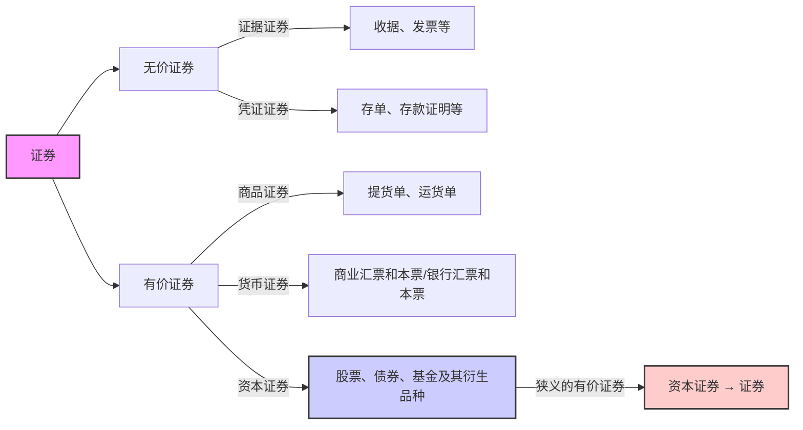
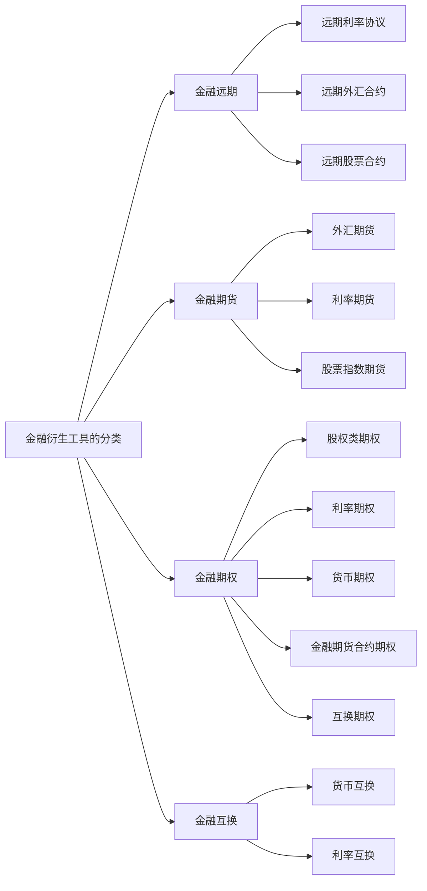

<!-- sec-note:NAV:start -->
[[02_Economy/06_证券投资学/01_证券工具与现金流权利|连续阅读：证券工具与现金流权利]] · [[证券工具与现金流权利.canvas|关系图]] · [[02_Economy/06_证券投资学/证券投资学.pdf|保留原课 PDF]]
<!-- sec-note:NAV:end -->

# 0. 考点,记忆用(Key Points for Exam, Memory Aid)
<!-- bilingual-en:start -->
*0. Key Points for Exam (Memory Aid)*
<!-- bilingual-en:end -->

债券定义、股票的定义(不仅仅股票是什么还有什么样的分类)、比如1.3.3 不同的分类方法,要记住、可转换债券.（不知道是不是债券的分类也要了解清楚）(Bond definition, stock definition (not just what stocks are but also different classification methods, e.g., 1.3.3 different classification methods, need to remember), convertible bonds. (Not sure if bond classification also needs to be clearly understood))
P46 虽然是小专栏,但是要了解基本的金融期货的品种和特征.转换因子和计算方法（作业提到了）(P46 Although it is a small column, it is necessary to understand the basic types and characteristics of financial futures, conversion factors, and calculation methods (mentioned in homework))
1.5金融衍生工具 了解(1.5 Financial Derivative Tools - Understand)
1.6另类投资工具,了解，是什么,有什么特点,不需要太深的了解(1.6 Alternative Investment Tools - Understand what they are and their characteristics, no need for in-depth understanding)
<!-- bilingual-en:start -->
Remember the definitions of bonds and stocks, including not only what a stock is but also its different classifications—for example, the methods in section 1.3.3—and convertible bonds. It is unclear whether every bond classification must also be mastered.
Although page 46 is only a short sidebar, understand the main types and characteristics of financial futures, as well as conversion factors and their calculation, which appeared in the homework.
Section 1.5, financial derivatives: understand the basics.
Section 1.6, alternative investments: understand what they are and their characteristics; no deep treatment is required.
<!-- bilingual-en:end -->

- [ ] 债券的概念
- [ ] 股票的概念
- [ ] 股票的分类
- [ ] 基本金融期货的品种和特征
- [ ] 转换因子计算方法
- [ ] 另类投资工具
<!-- bilingual-en:start -->
- [ ] The Concept of Bonds
- [ ] The Concept of Stocks
- [ ] Types of Stocks
- [ ] Types and Characteristics of Basic Financial Futures
- [ ] Methods for Calculating Conversion Factors
- [ ] Alternative Investment Tools
<!-- bilingual-en:end -->

# 1. 证券与投资(Securities and Investment)
<!-- bilingual-en:start -->
*1. Securities and Investments (Securities and Investment)*
<!-- bilingual-en:end -->

## 1.1证券及其特征(Securities and Their Characteristics)
<!-- bilingual-en:start -->
*1.1 Securities and Their Characteristics*
<!-- bilingual-en:end -->
#考点
>[!note] 证券
>指各类记载并证明特定权益的法律凭证
> <!-- bilingual-en:start -->
> Refers to a legal instrument that records and evidences specified rights or interests.
> <!-- bilingual-en:end -->

票面要素：
<!-- bilingual-en:start -->
Face Element:
<!-- bilingual-en:end -->

持有人 证券的标的物 标的物的价值 权利(Holder, subject matter of the security, value of the subject matter, rights)
<!-- bilingual-en:start -->
Holder of the security's subject matter, value of the subject matter, rights (Holder, subject matter of the security, value of the subject matter, rights)
<!-- bilingual-en:end -->

特征： 法律特征 书面特征   同时具备两个特征的 书面凭证称为证券(Characteristics: Legal characteristics, written characteristics. A written document with both characteristics is called a security)
<!-- bilingual-en:start -->
Characteristics: Legal characteristics and written characteristics. A written document that possesses both characteristics is called a security.
<!-- bilingual-en:end -->

<!-- sec-note:S01:start -->
> [!note] 权利与载体的边界
> 上述“书面凭证”保留课程的分类口径，但纸张不是现代证券的必要条件；证券也可通过电子簿记记录。学习时先做[[证券权利识别]]：谁发行、谁持有、向谁请求何种支付或其他权利，再辨认载体。法律凭证也不意味着一定盈利或随时可卖。
> <!-- bilingual-en:start -->
> The description of a written instrument preserves the course's classification, but paper is not essential to modern securities: rights can also be recorded electronically. Start with [[证券权利识别|identifying the security's rights]]—issuer, holder, obligor, and payment or other entitlements—before considering the record's form. A legal claim does not guarantee a profit or immediate resale.
> <!-- bilingual-en:end -->
> [[02_Economy/06_证券投资学/证券投资学.pdf#page=48|原课 PDF 48]]；[Delaware 公司法 §151(f)、158（非纸质股份的法域实例）](https://delcode.delaware.gov/title8/c001/sc05/index.html)。
<!-- sec-note:S01:end -->

## 1.2 证券分类(Classification of Securities)
<!-- bilingual-en:start -->
*1.2 Classification of Securities*
<!-- bilingual-en:end -->

有价证券和无价证券的区别：流通性，可盈利性(Differences between valuable securities and non-valuable securities: liquidity, profitability)
<!-- bilingual-en:start -->
Differences between valuable securities and non-valuable securities: liquidity, profitability
<!-- bilingual-en:end -->

狭义的有价证券 —— 资本证券 → 证券(Narrowly defined valuable securities —— Capital Securities → Securities)
<!-- bilingual-en:start -->
Narrowly defined valuable securities —— Capital Securities → Securities
<!-- bilingual-en:end -->

## 1.3 投资与证券投资(Investment and Securities Investment)
<!-- bilingual-en:start -->
*1.3 Investment and Securities (Investment and Securities Investment)*
<!-- bilingual-en:end -->

>[!note] 投资的定义
>投资主体为获取未来预期收益，将货币转化为资本的过程。
><!-- bilingual-en:start -->
>Definition of Investment
>Investment involves the process by which a subject converts monetary assets into capital in anticipation of future expected returns.
><!-- bilingual-en:end -->

投资对象：实物资产或金融资产。(Investment objects: real assets or financial assets)
真实物体 Vs 契约(Real Objects Vs Contracts)
投资 —— 投机 这两者没有特别明显的界限(Investment —— Speculation. There is no clear boundary between the two)
<!-- bilingual-en:start -->
Investment Object: Real Assets or Financial Assets. (Investment objects: real assets or financial assets)
Real Objects vs Contracts (Real Objects Vs Contracts)
Investment —— Speculation. There is no clear boundary between the two (Investment —— Speculation. There is no clear boundary between the two)
<!-- bilingual-en:end -->

* 投资目的:(Investment purposes:)
	* 本金保障(Principal protection) 
	* 资本增值(Capital appreciation) 
	* 经常性收益。(Regular income)
<!-- bilingual-en:start -->
* Investment objectives:
	* Protect principal.
	* Achieve capital appreciation.
	* Earn recurring income.
<!-- bilingual-en:end -->

>[!note] 证券投资定义
>投资者购买股票、债券、基金等资本证券及其衍 生品，以获取红利、利息及资本利得的投资行为 和投资过程
><!-- bilingual-en:start -->
>**Definition of Securities Investment**
>
>Investors engage in the purchase of stocks, bonds, funds, and other capital securities, as well as their derivatives, with the aim of obtaining dividends, interest, and capital gains, thereby constituting both the investment behavior and the investment process.
><!-- bilingual-en:end -->

## 1.4风险与风险偏好(Risk and Risk Preference)
<!-- bilingual-en:start -->
*1.4 Risk and Risk Preference*
<!-- bilingual-en:end -->

>[!note] 风险的定义(两种定义)
>未来结果的不确定性或损失
>个人和群体 在未来获得收益和遇到损失的可能性以及对这 种可能性的判断与认知
><!-- bilingual-en:start -->
>**Definition of Risk (Two Definitions)**
>Uncertainty or potential loss in future outcomes
>The possibility and assessment of gain and loss for individuals and groups, as well as their perception and cognition thereof.
><!-- bilingual-en:end -->

根据对风险的不同偏好,将人群分为三类:(According to different risk preferences, people can be divided into three categories:)
<!-- bilingual-en:start -->
According to different risk preferences, people can be divided into three categories:(According to different risk preferences, people can be divided into three categories:)
<!-- bilingual-en:end -->

风险规避,风险中立.风险2偏好.(Risk aversion, risk neutrality, risk-seeking)
<!-- bilingual-en:start -->
Risk aversion, risk neutrality, risk-seeking.
<!-- bilingual-en:end -->

```tikz
\begin{document}
\begin{tikzpicture}[scale=0.8]

  %---------------------------------------------
  % Diagram 1: Risk-Averse (Concave utility)
  %---------------------------------------------
  \begin{scope}[xshift=0cm,yshift=0cm]
    % Axes
    \draw[->] (0,0) -- (4.5,0) node[right] {Income};
    \draw[->] (0,0) -- (0,4.5) node[above] {Utility};

    % Concave function, e.g. u(x) = 2*sqrt(x)
    \draw[domain=0:4, samples=100, thick] 
      plot (\x, {2*sqrt(\x)})
      node[right] {};

    % Caption
    \node[below=0.4cm] at (2.0,0) {Risk-Averse (Concave Utility)};
  \end{scope}

  %---------------------------------------------
  % Diagram 2: Risk-Neutral (Linear utility)
  %---------------------------------------------
  \begin{scope}[xshift=6cm,yshift=0cm]
    % Axes
    \draw[->] (0,0) -- (4.5,0) node[right] {Income};
    \draw[->] (0,0) -- (0,4.5) node[above] {Utility};

    % Linear function, e.g. u(x) = x
    \draw[domain=0:4, samples=100, thick]
      plot (\x, {\x})
      node[right] {};

    % Caption
    \node[below=0.4cm] at (2.0,0) {Risk-Neutral (Linear Utility)};
  \end{scope}

  %---------------------------------------------
  % Diagram 3: Risk-Loving (Convex utility)
  %---------------------------------------------
  \begin{scope}[xshift=3cm,yshift=-6cm]
    % Axes
    \draw[->] (0,0) -- (4.5,0) node[right] {Income};
    \draw[->] (0,0) -- (0,4.5) node[above] {Utility};

    % Convex function, e.g. u(x) = x^2/4
    \draw[domain=0:4, samples=100, thick]
      plot (\x, {(\x)^2/4})
      node[right] {};

    % Caption
    \node[below=0.4cm] at (2.0,0) {Risk-Loving (Convex Utility)};
  \end{scope}

\end{tikzpicture}

\end{document}
```

# 2. 债券(Bonds)
<!-- bilingual-en:start -->
*2. Bonds*
<!-- bilingual-en:end -->

## 2.1 债券的定义与性质(Definition and Nature of Bonds)
<!-- bilingual-en:start -->
*2.1 Definition and Nature of Bonds (Definition and Nature of Bonds)*
<!-- bilingual-en:end -->
#考点
>[!note] 债券的定义
债券是发行人按照法定程序向投资者发行，并约 定在一定期限还本付息的有价证券
<!-- bilingual-en:start -->
Bonds are securities issued by issuers to investors in accordance with legal procedures and agreed to repay principal and interest at a certain time
<!-- bilingual-en:end -->

* 基本性质：虚拟资本 有价证券 债权凭证(Basic nature: Virtual capital, valuable securities, debt certificate)
* 票面要素：票面价值(溢价发行Vs 折价发行）、偿还 期限、利率（决定因素）、付息期(Face value elements: Par value (premium issuance vs. discount issuance), repayment term, interest rate (determining factor), interest payment period) 
* 基本特征：偿还性、流通性、安全性、收益性(Basic characteristics: Repayment, liquidity, safety, profitability)
<!-- bilingual-en:start -->
* Basic nature: virtual capital, marketable securities, and debt claims.
* Face-value terms: par value, including premium versus discount issuance; maturity; interest rate and its determinants; and the interest-payment interval.
* Basic characteristics: repayment at maturity, liquidity, safety, and return.
<!-- bilingual-en:end -->

## 2.2债券融资优缺点(Advantages and Disadvantages of Bond Financing)
<!-- bilingual-en:start -->
*2.2 Advantages and Disadvantages of Bond Financing (Advantages and Disadvantages of Bond Financing)*
<!-- bilingual-en:end -->

### 2.2.1优点(Advantages)
<!-- bilingual-en:start -->
*2.2.1 Advantages (Advantages)*
<!-- bilingual-en:end -->

1. 资金成本低：抵税；利率低；(Low capital cost: tax deductible; low interest rate;) 
2. 财务杠杆；债权融资优于股权融资；(Financial leverage; debt financing is better than equity financing;) 
3. 债券融资属于长期资金；(Bond financing belongs to long-term funds;) 
4. 债券筹资发行对象广，筹资额大(Bond financing has a wide range of issuance targets and large financing amounts)
<!-- bilingual-en:start -->

&nbsp;
**1.** Lower cost of capital: interest is tax-deductible and the interest rate is relatively low.<br>
**2.** Financial leverage: debt financing may be preferable to equity financing.<br>
**3.** Bond financing provides long-term funds.<br>
**4.** Bonds can be issued to a broad investor base and can raise large amounts.<br>
<!-- bilingual-en:end -->

### 2.2.2缺点(Disadvantages)
<!-- bilingual-en:start -->
*2.2.2 Shortcomings (Disadvantages)*
<!-- bilingual-en:end -->

1. 财务风险大；(High financial risk;) 
2. 限制条款多(Many restrictive clauses)
<!-- bilingual-en:start -->

&nbsp;
**1.** High financial risk; (High financial risk;)<br>
**2.** Many restrictive clauses; (Many restrictive clauses;)<br>
<!-- bilingual-en:end -->

<!-- sec-note:S02:start -->
> [!note] 约定现金流不等于保证收益
> [[债券]]的期限、利息与偿付均须看条款：既有短期或永续债，也有浮息、违约和低流动性债券。“安全、流通、收益”不是无条件保证。债权通常先于股权受偿，但还须辨认不同债权的[[受偿顺序]]。利息税务处理及融资成本取决于适用制度、税务能力和风险；杠杆与税盾不能单独推出“债权融资恒优于股权融资”。
> <!-- bilingual-en:start -->
> The maturity, interest and repayment of a [[债券|bond]] depend on its terms: bonds may be short-term or perpetual, floating-rate, illiquid or in default. Safety, liquidity and return are not guarantees. Debt usually ranks ahead of equity, but [[受偿顺序|priority among different claims]] also matters. Tax treatment and financing costs depend on the applicable rules, tax capacity and risk; leverage and a tax shield alone do not make debt financing universally superior to equity financing.
> <!-- bilingual-en:end -->
> [[02_Economy/06_证券投资学/证券投资学.pdf#page=54|原课 PDF 54–55]]；[SEC：Corporate Bonds（风险与权利）](https://www.investor.gov/introduction-investing/investing-basics/investment-products/bonds-or-fixed-income-products)。
<!-- sec-note:S02:end -->

## 2.3债券的种类(Types of Bonds)
<!-- bilingual-en:start -->
*2.3 Types of Bonds*
<!-- bilingual-en:end -->

### 2.3.1 按发行主体分类(By Issuer)
<!-- bilingual-en:start -->
*2.3.1 Categorizing by Issuer (By Issuer)*
<!-- bilingual-en:end -->

* 政府债券：中央政府、地方政府（利率高于国债）、政府机构；(Government bonds: central government, local government (interest rate higher than national debt), government agencies;) 
* 金融债券；银行或者非银金融机构发行(Financial bonds; issued by banks or non-bank financial institutions) 
* 公司债券  
	* 按发行目的分为：普通公司债券、改组公司债券、利息公司债券、延期公司债券；(Classified by issuance purpose: ordinary corporate bonds, restructuring corporate bonds, interest corporate bonds, deferred corporate bonds;) 
* 国际债券 
	* 外国债券：扬基债券、武士债券、龙债券、猛犬债券、熊猫债券等(Foreign bonds: Yankee bonds, Samurai bonds, Dragon bonds, Bulldog bonds, Panda bonds, etc.)  
	* 欧洲债券：欧洲美元债券、亚洲美元债券(Eurobonds: Eurodollar bonds, Asian dollar bonds)
<!-- bilingual-en:start -->
* Government bonds: central-government bonds, local-government bonds—whose rates are higher than those on central-government debt—and government-agency bonds.
* Financial bonds: issued by banks or non-bank financial institutions.
* Corporate bonds
	* By issuance purpose: ordinary corporate bonds, reorganization bonds, income bonds, and deferred-interest bonds.
* International bonds
	* Foreign bonds: Yankee bonds, Samurai bonds, Dragon bonds, Bulldog bonds, Panda bonds, and others.
	* Eurobonds: Eurodollar bonds and Asian-dollar bonds.
<!-- bilingual-en:end -->

### 2.3.2 按债券的期限分类(By Term)
<!-- bilingual-en:start -->
*2.3.2 Categorizing Bonds by Term*
<!-- bilingual-en:end -->

 * 短期债券：一年以内(Short-term bonds: within one year) 
 * 中期债券：1-5年(Medium-term bonds: 1-5 years) 
 * 长期债券：5年以上(Long-term bonds: more than 5 years) 
 * 永久债券 ：永续债(Perpetual bonds: Perpetual bonds)
<!-- bilingual-en:start -->
* Short-term bonds: within one year
* Medium-term bonds: 1-5 years
* Long-term bonds: more than 5 years (Long-term bonds: more than 5 years)
* Perpetual bonds : Perpetual bonds
<!-- bilingual-en:end -->

### 2.3.3按债券形态分类：(By Form) 
<!-- bilingual-en:start -->
*2.3.3 Classification by Bond Form: (By Form)*
<!-- bilingual-en:end -->

* 实物债券（不记名，不挂失，可流通）；(Physical bonds (bearer, non-negotiable, transferable);)
* 凭证式债券（记名，可挂失，不流通，自购买之日计息）；(Certificate bonds (registered, negotiable, non-transferable, interest accruing from purchase date);) 
* 记账式债券：没有实物形态，电脑记账方式记录债权，在交易所发行及交易(Book-entry bonds: no physical form, recorded electronically, issued and traded on exchanges)
<!-- bilingual-en:start -->
* Physical bearer bonds: unregistered, cannot be reported lost, and are transferable.
* Certificate bonds: registered, can be reported lost, are not tradable, and accrue interest from the purchase date.
* Book-entry bonds: have no physical certificate; claims are recorded electronically, and the bonds are issued and traded on exchanges.
<!-- bilingual-en:end -->

<!-- sec-note:S03a:start -->
> [!note] 簿记与可交易性不是同一分类轴
> “不挂失”指遗失后的处理，不是英文 non-negotiable（不可转让）的同义词；簿记只说明权利记录方式，也不能据此认定只能在交易所交易。上述凭证与交易限制须结合具体产品、市场和课程时点理解。
> <!-- bilingual-en:start -->
> Inability to report a lost certificate is not the same as being non-negotiable. Book-entry describes how a claim is recorded; it does not, by itself, restrict trading to an exchange. Interpret the listed certificate and trading restrictions in their particular product, market and historical context.
> <!-- bilingual-en:end -->
> [[02_Economy/06_证券投资学/证券投资学.pdf#page=58|原课 PDF 58]]；[TreasuryDirect：电子形式债券实例](https://www.treasurydirect.gov/marketable-securities/floating-rate-notes/)。
<!-- sec-note:S03a:end -->

### 2.3.4按利息的计息方式分：(By Interest Calculation Method)
<!-- bilingual-en:start -->
*2.3.4 Classified by the method of interest calculation: (By Interest Calculation Method)*
<!-- bilingual-en:end -->

单利债券 复利债券(Simple interest bonds, compound interest bonds)
<!-- bilingual-en:start -->
Simple Interest Bonds, Compound Interest Bonds
<!-- bilingual-en:end -->

### 2.3.5按利息支付方式分类(By Interest Payment Method)
<!-- bilingual-en:start -->
*2.3.5 Classification by Payment Method (By Interest Payment Method)*
<!-- bilingual-en:end -->

* 息票累积债券：到期一次还本付息(Accrual bond: Repays principal and interest at maturity) 
* 息票付息债券：富有息票的债券，标明利率及付息方式。(Coupon bond: Bond with coupons indicating interest rate and payment method) 
* 贴现付息债券（零息债券） ：发行价低于面额，到期按面额兑付；(Discount bond (zero-coupon bond): Issued at price below par, repaid at par at maturity)
<!-- bilingual-en:start -->
* Accrual bonds: principal and interest are paid together at maturity.
* Coupon bonds: carry coupons specifying the interest rate and payment method.
* Discount bonds, or zero-coupon bonds: are issued below par and redeemed at par at maturity.
<!-- bilingual-en:end -->

<!-- sec-note:S03b:start -->
> [!note] 零息与折价分开判断
> [[零息债券]]的关键是没有存续期票息支付；低于面值的价格是正到期收益率下的情形，不是“零息”的定义。零或负收益率下，价格可等于或高于面值。
> <!-- bilingual-en:start -->
> A [[零息债券|zero-coupon bond]] makes no coupon payments during its life. A price below par corresponds to a positive yield to maturity; it is not the definition of a zero coupon. At a zero or negative yield, the price may equal or exceed par.
> <!-- bilingual-en:end -->
> [[02_Economy/06_证券投资学/证券投资学.pdf#page=59|原课 PDF 59]]；[[固定现金流债券定价]]。
<!-- sec-note:S03b:end -->

### 2.3.6按债券是否记名分类(By Registration Status)
<!-- bilingual-en:start -->
*2.3.6 Classification of Bonds by Registration Status*
<!-- bilingual-en:end -->

记名债券；无记名债券；(Registered bonds; bearer bonds)
<!-- bilingual-en:start -->
Registered bonds; bearer bonds
<!-- bilingual-en:end -->

### 2.3.7按抵押担保状况分类(By Collateral and Guarantee Status) 
<!-- bilingual-en:start -->
*2.3.7 Classification by Collateral and Guarantee Status*
<!-- bilingual-en:end -->

* 抵押债券（Mortgage Bonds） 以动产或不动产作为抵押品，用以担保按期还本(Mortgage Bonds: Secured by movable or immovable property to guarantee repayment of principal) 
* 信用债券（Debenture Bonds） 指发行公司不提供任何有形、无形的抵押品，完全以公司的全部资信予以保证 的债券(Debenture Bonds: Unsecured bonds backed solely by the issuer's creditworthiness) 
* 保证债券：第三方作为还本付息担保(Guaranteed bonds: Guaranteed by a third party for principal and interest repayment) 
* 担保信托债券：以动产或者有价证券担保(Collateral trust bonds: Secured by movable property or securities)
<!-- bilingual-en:start -->
* Mortgage bonds: secured by movable or immovable property to support repayment of principal.
* Debenture bonds: unsecured bonds backed solely by the issuing company's creditworthiness.
* Guaranteed bonds: a third party guarantees repayment of principal and interest.
* Collateral trust bonds: secured by movable property or marketable securities.
<!-- bilingual-en:end -->
<!-- sec-note:S03c:start -->
> [!note] 担保增强追索，不保证足额回收
> [[资产担保与第三方保证]]分别关联特定资产与保证人的义务，均不自动保证按时足额支付；回收还受资产价值、优先顺序、执行及保证人偿付能力影响。Debenture 的法律用法存在法域差异，此处按课程的无担保信用债语境理解。
> <!-- bilingual-en:start -->
> [[资产担保与第三方保证|Asset security and a third-party guarantee]] concern, respectively, specified assets and a guarantor's obligation. Neither automatically assures full, timely repayment: recovery depends on value, priority, enforcement and the guarantor's capacity. The legal usage of “debenture” varies by jurisdiction; here it follows the course's unsecured-debt context.
> <!-- bilingual-en:end -->
> [[02_Economy/06_证券投资学/证券投资学.pdf#page=60|原课 PDF 60]]；[SEC：Corporate Bonds](https://www.investor.gov/introduction-investing/investing-basics/investment-products/bonds-or-fixed-income-products)。
<!-- sec-note:S03c:end -->

### 2.3.8按公司债券是否可转换分类(By Convertibility)
<!-- bilingual-en:start -->
*2.3.8 Classification of Company Bonds by Convertibility*
<!-- bilingual-en:end -->

可转换债券： 不可转换债券：(Convertible bonds; non-convertible bonds)
<!-- bilingual-en:start -->
Convertible bonds: Non-convertible bonds: (Convertible bonds; non-convertible bonds)
<!-- bilingual-en:end -->

### 2.3.9按是否提前偿还分类(By Callability)
<!-- bilingual-en:start -->
*2.3.9 Categorized by Whether Early Repayment Is Allowed (By Callability)*
<!-- bilingual-en:end -->

可赎回债券；不可赎回债券；(Callable bonds; non-callable bonds)
<!-- bilingual-en:start -->
Convertible bonds; Non-convertible bonds; (Callable bonds; non-callable bonds)
<!-- bilingual-en:end -->

<!-- sec-note:S04:start -->
> [!note] 赎回与转股是不同权利
> 本段中文“可赎回”对应 callable，而不是原英文层中的 convertible：[[可赎回债券]]涉及发行人的约定赎回权，[[可转换债券]]涉及持有人的约定转股权。下文的“随时／任意偿还”同样须以条款赋予的权利和限制为前提，不是债务人可任意改变还款安排。
> <!-- bilingual-en:start -->
> The Chinese term in this paragraph means callable, not convertible as stated in the original English layer. A [[可赎回债券|callable bond]] gives its issuer a contractual redemption right, while a [[可转换债券|convertible bond]] gives its holder a contractual conversion right. The subsequent discussion of discretionary repayment is likewise subject to contractual permissions and restrictions; it does not allow a debtor to rewrite repayment terms at will.
> <!-- bilingual-en:end -->
> [[02_Economy/06_证券投资学/证券投资学.pdf#page=61|原课 PDF 61–63]]。
<!-- sec-note:S04:end -->

### 2.3.10按本金的偿还方式分类(By Principal Repayment Method)
<!-- bilingual-en:start -->
*2.3.10 Classification by Method of Principal Repayment*
<!-- bilingual-en:end -->

1. 到期偿还也叫回满期偿还，是指按答发行债券时规定 的还本时间，在债券到期时一次全部偿还本金的偿债方式(Maturity repayment: Repays entire principal at maturity according to terms) 
2. 期中偿还也叫中途偿还，是指在债券最终到期日之前 ，偿还部分或全部本金的偿债方式。(Interim repayment: Repays part or all principal before maturity) 
3. 展期偿还是指在债券期满后又延长原规定的还本付息 日期的偿债方式。(Extension repayment: Extends repayment date after maturity)
<!-- bilingual-en:start -->

&nbsp;
**1.** Repayment at maturity, also called full repayment at maturity, means repaying all principal at once on the date specified when the bond was issued.<br>
**2.** Interim repayment means repaying part or all of the principal before the bond's final maturity date.<br>
**3.** Extended repayment means postponing the originally scheduled principal and interest payment date beyond the bond's maturity.<br>
<!-- bilingual-en:end -->

部分偿还和全额偿还(Partial repayment and full repayment) 
* 1.部分偿还是指从债券发行日起，经过一定宽限期后， 按发行额的一定比例，陆续偿还，到债券期满时全部还清(Partial repayment: Repays proportionally after grace period until maturity) 
* 2.全额偿还是指在债券到期之前，偿还全部本金 。(Full repayment: Repays entire principal before maturity)
<!-- bilingual-en:start -->
Partial redemption and full redemption
* 1. Partial redemption begins after a specified grace period following issuance. The issuer redeems a stated proportion of the issue over time and completes repayment by maturity.
* 2. Full redemption means repaying all principal before the bond's maturity.
<!-- bilingual-en:end -->

定时偿还和随时偿还(Timed repayment and optional repayment) 
* 1.定时偿还亦称定期偿还，它指债券发行后待宽限期过后，分次在规定的日期，按一定的偿还率偿还本金。(Timed repayment: Repays fixed amounts on scheduled dates after grace period)  
* 2.随时偿还也称任意偿还，是指债券发行后待宽限期过后，发行人可以自由决定偿还时间，任意偿还债券的一部分或全部。(Optional repayment: Issuer decides when to repay part or all after grace period) 
<!-- bilingual-en:start -->
Timed Repayment and Optional Repayment
* 1. Timed repayment is also known as periodic repayment, referring to the principal being repaid in fixed installments on predetermined dates after the grace period has ended. (Timed repayment: Repays fixed amounts on scheduled dates after grace period)
* 2. Optional repayment is also called arbitrary repayment, referring to the issuer being able to decide freely on the repayment date(s) after the grace period has ended, repaying a portion or all of the bonds at their discretion.(Optional Repayment: Issuer Decides When to Repay Part or All After Grace Period)
<!-- bilingual-en:end -->

抽签偿还和买入注销(Lottery repayment and buyback cancellation) 
* 1.抽签偿还是指在期满前偿还一部分债券时，通过抽签方式决 定应偿还债券的号码。(Lottery repayment: Randomly selects bonds to repay before maturity) 
* 2.买入注销是指债券发行人在债券未到期前按照市场价格从二 级市场中购回自己发行的债券而注销债务。(Buyback cancellation: Issuer repurchases bonds from secondary market to cancel debt)
<!-- bilingual-en:start -->
Lottery Repayment and Buyback Cancellation
* 1. Lottery repayment refers to repaying a portion of a bond before maturity through a lottery method, determining which bonds should be repaid. (Lottery repayment: Randomly selects bonds to repay before maturity)
* 2. Buyback cancellation involves the issuer of a bond purchasing back its own issued bonds from the secondary market before maturity at the market price, thereby canceling the debt.(Buyback cancellation: Issuer repurchases bonds from the secondary market to cancel debt)
<!-- bilingual-en:end -->

### 2.3.11按投资人的收益分类(By Investor's Return) 
<!-- bilingual-en:start -->
*2.3.11 Classified by Investors' Returns (By Investor's Return)*
<!-- bilingual-en:end -->

固定利率债券(Fixed-rate bonds) 
*  票面利率在整个债券有效期内固定不变；(Coupon rate remains fixed for bond's term)
* 或  以基础利率为基准，加上一个固定溢价加以确认。(Or based on a reference rate plus a fixed spread) 
浮动利率债券(Floating-rate bonds) 
* 典型的是指数债券，指根据某种指数的变动定期（半年或1 年）调整一次，使利率与通胀率挂钩来保证债券持有人免受 通胀的损失的一种公司债券。(Typically index-linked bonds that adjust periodically to link interest to inflation)
累进利率债券(Step-up bonds) 
* 利率与期限挂钩(Interest rate linked to bond term)
<!-- bilingual-en:start -->
Fixed-Rate Bonds (Fixed-rate bonds)
- The coupon rate remains fixed throughout the bond's term;
- Or based on a reference rate plus a fixed spread.
Floating-Rate Bonds
- Typically index-linked bonds, which adjust periodically (every six months or annually) to align the interest rate with inflation, ensuring that bondholders are protected against inflation.(Interest on typically index-linked bonds that adjust periodically to link to inflation)
Step-up bonds
* Rate linked to bond term (Interest)
<!-- bilingual-en:end -->

<!-- sec-note:S05a:start -->
> [!note] 固定利差不等于固定票息
> “参考利率＋固定利差”若按期重置，就是[[浮动利率债券]]；若仅在发行时确定一次、以后票息率固定，才可归入固定票息。[[通胀挂钩债券]]则按约定通胀指标调整现金流，不能与一般浮息互称；调整对象还可能是本金，而不只是票息率，也不消除所有通胀及市场风险。原课 PDF 64 本身混用了这几种分类。
> <!-- bilingual-en:start -->
> A reference rate plus a fixed spread is a [[浮动利率债券|floating-rate bond]] if it resets periodically. It can produce a fixed coupon only when set once and then held constant. [[通胀挂钩债券|Inflation-linked bonds]] adjust cash flows using a specified inflation index and are not synonymous with floating-rate bonds. The adjustment may affect principal rather than just the coupon rate, and it does not eliminate all inflation or market risk. The source slide itself mixes these classifications.
> <!-- bilingual-en:end -->
> [[02_Economy/06_证券投资学/证券投资学.pdf#page=64|原课 PDF 64]]；[TreasuryDirect：FRN 的基准与利差](https://www.treasurydirect.gov/marketable-securities/floating-rate-notes/)。
<!-- sec-note:S05a:end -->

### 2.3.12按债券选择权分类(By Bond Options) 
<!-- bilingual-en:start -->
*2.3.12 By Bond Options Classification*
<!-- bilingual-en:end -->

* 参加分红公司债券(Participating corporate bonds) 
* 免税债券(Tax-exempt bonds) 
* 收益公司债券(Income bonds)
	利息只在公司有盈利时才支付,即发行公司的利润扣除各项固定支 出后的余额用作债券利息的来源,如果余额不足支付,未付利息可以累加,待公司收 益改善后再补发。(Interest paid only if company is profitable; unpaid interest accumulates) 
* 附新股认购权债券(Bonds with stock purchase rights) 
* 产权债券：该公司债券的持有者,可以按所规定的价格向发行公司请示认购新股票 的一种公司债券(Equity-linked bonds: Bondholders can purchase new shares at specified price) 
* 可赎回债券 
* 可转换债券 
* 偿还基金债券：要求发行人以偿债基金方式还债(Sinking fund bonds: Issuer must set aside funds for repayment)
<!-- bilingual-en:start -->
* Participating corporate bonds
* Tax-exempt bonds
* Income bonds
	Interest is paid only when the issuing company earns a profit. The balance remaining after fixed expenses is used to pay bond interest; if it is insufficient, unpaid interest may accumulate and be paid when earnings improve.
* Bonds with stock-purchase rights
* Equity-linked bonds: holders may subscribe for newly issued shares from the issuing company at a specified price.
* Callable bonds
* Convertible bonds
* Sinking-fund bonds: the issuer must set aside a sinking fund for repayment.
<!-- bilingual-en:end -->
<!-- sec-note:S05b:start -->
> [!note] 此列表包含不同分类轴
> 税收待遇、利息支付条件、偿债基金安排与嵌入选择权不是同一分类标准；“免税”或“有偿债基金”本身不等于持有一份期权。各项条款可以同时出现在同一债券中，仍须逐项做[[证券权利识别]]。
> <!-- bilingual-en:start -->
> Tax treatment, conditional interest, sinking-fund arrangements and embedded options are different classification dimensions. Tax exemption or a sinking fund does not by itself constitute an option. Several such terms may coexist in one bond and require separate [[证券权利识别|identification of their rights and obligations]].
> <!-- bilingual-en:end -->
> [[02_Economy/06_证券投资学/证券投资学.pdf#page=65|原课 PDF 65]]。
<!-- sec-note:S05b:end -->

### 2.3.13按债券筹集方式(By Issuance Method)
<!-- bilingual-en:start -->
*2.3.13 By Issuance Method (By Bond-raising Method)*
<!-- bilingual-en:end -->

私募债券和公募债券。(Private placement bonds and public offering bonds)
<!-- bilingual-en:start -->
Private placement bonds and public offering bonds.
<!-- bilingual-en:end -->

### 2.3.14按使用币种(By Currency)
<!-- bilingual-en:start -->
*2.3.14 By Currency (By Currency)*
<!-- bilingual-en:end -->

本币、外币、双重货币债券。(Domestic currency, foreign currency, dual currency bonds)
<!-- bilingual-en:start -->
Domestic currency, foreign currency, and dual currency bonds.
<!-- bilingual-en:end -->

### 2.3.15按发行地域(By Issuance Region)
<!-- bilingual-en:start -->
*2.3.15 By Issuance Region (By Issuing Region)*
<!-- bilingual-en:end -->

国内债券和国际债券。(Domestic bonds and international bonds)
<!-- bilingual-en:start -->
Domestic bonds and international bonds.
<!-- bilingual-en:end -->

### 2.3.16按债券表现形式分(By Form of Expression)
<!-- bilingual-en:start -->
*2.3.16 By Form of Expression (According to the Form in Which Bonds Are Expressed)*
<!-- bilingual-en:end -->

货币债券，实物债券，折实债券。(Monetary bonds, physical bonds, real-value bonds)
<!-- bilingual-en:start -->
Bonds include monetary bonds, physical bonds, and fiat bonds. (Monetary bonds, physical bonds, real-value bonds)
<!-- bilingual-en:end -->

## 2.4 债券收益率的计算(Calculation of Bond Yield)
<!-- bilingual-en:start -->
*2.4 Calculation of Bond Yields (Calculation of Bond Yield)*
<!-- bilingual-en:end -->

>[!NOTE] 债券收益率的定义
>利息产生在资金的所有者和使用者不统一的场合，它的实质是资金的使用者付给 资金所有者的租金，用以补偿所有者在资金租借期内不能支配该笔资金而蒙受的损失。
><!-- bilingual-en:start -->
>**Definition of Bond Yield**
>When interest is generated in situations where the owner and user of funds are not unified, it essentially represents rent paid by the fund's user to the fund's owner as compensation for the owner's loss of control over that sum of money during the period of borrowing.
><!-- bilingual-en:end -->

影响利息大小的三要素: 本金,利率,时间长度(Three factors affecting interest amount: principal, interest rate, time period)
<!-- bilingual-en:start -->
The three determinants of the amount of interest are principal, the interest rate, and the length of time.
<!-- bilingual-en:end -->

<!-- sec-note:S06:start -->
> [!note] 利息金额与收益率
> 上一框正文解释的是利息，而不是完整的债券收益率定义。利息是现金金额；[[持有期收益率]]是相对投入的收益比例，还要纳入资本利得或损失并标明期间。不同收益率口径不能仅因都写成百分数而混用。
> <!-- bilingual-en:start -->
> The preceding box explains interest, not a complete definition of bond yield. Interest is a cash amount; a [[持有期收益率|holding-period return]] measures gain relative to investment, includes capital gains or losses, and specifies a period. Different return measures are not interchangeable merely because they are quoted as percentages.
> <!-- bilingual-en:end -->
> [[02_Economy/06_证券投资学/证券投资学.pdf#page=67|原课 PDF 67]]；[[02_Economy/06_证券投资学/证券投资学.pdf#page=94|原课 PDF 94]]。
<!-- sec-note:S06:end -->

### 2.4.1利息的度量(Measurement of Interest)
<!-- bilingual-en:start -->
*2.4.1 Measurement of Interest (Measurement of Interest)*
<!-- bilingual-en:end -->

#### 2.4.1.1 利息相关概念(Interest-related Concepts)
<!-- bilingual-en:start -->
*2.4.1.1 Concepts Related to Interest (Interest-related Concepts)*
<!-- bilingual-en:end -->

##### **(1) 积累函数 $a(t)$**(**(1) Accumulation Function $a(t)$**)
<!-- bilingual-en:start -->
*(1) Accumulation Function $a(t)$**(**(1) Accumulation Function $a(t)$**)*
<!-- bilingual-en:end -->

累积分函数描述“$1$ 元从起始时刻（$t=0$）累积至时刻 $t$ 时变成多少”。通常约定(Accumulation function describes how much 1 yuan becomes from time $t=0$ to time $t$. Usually约定)
$$a(0) = 1 $$
即在时刻 $0$ 时，$1$ 元尚未经过任何利息累积。(At time $0$, 1 yuan has not yet accumulated any interest)
<!-- bilingual-en:start -->
The accumulation function describes how much 1 yuan invested at the starting time, $t=0$, has grown to by time $t$. By convention,
$$a(0) = 1 $$
At time $0$, the 1 yuan has not yet earned any interest.
<!-- bilingual-en:end -->

若给定某种利率或利息模型，$a(t)$ 反映了资金随时间增长的倍数。比如简单复利时，$a(t) = (1 + i)^t$；若为连续复利，$a(t) = e^{\delta t}$ 等等。(Given an interest rate or interest model, $a(t)$ reflects the growth multiple of funds over time. For example, simple compound interest: $a(t) = (1 + i)^t$; continuous compound interest: $a(t) = e^{\delta t}$, etc.)
<!-- bilingual-en:start -->
If a given interest rate or interest model is provided, $a(t)$ reflects the growth multiple of funds over time. For instance, in simple compounding, $a(t) = (1 + i)^t$; for continuous compounding, $a(t) = e^{\delta t}$, among others. (Given an interest rate or interest model, $a(t)$ reflects the growth multiple of funds over time. For example, simple compound interest: $a(t) = (1 + i)^t$; continuous compound interest: $a(t) = e^{\delta t}$, etc.)
<!-- bilingual-en:end -->

##### **(2)总额函数 $A(t)$**(**(2) Total Amount Function $A(t)$**)
<!-- bilingual-en:start -->
*(2) Total Amount Function $A(t)$** (**(2) Total Amount Function $A(t)$**)*
<!-- bilingual-en:end -->

若初始投资本金为 $K$，则总额函数可写作(If initial investment principal is $K$, then total amount function can be written as)
$$A(t) = K \cdot a(t),.$$
它表示在时刻 $t$ 这笔本金所累积到的本息总额。就是上面的那个积累函数乘上本金的数值(It represents the total principal and interest accumulated at time $t$, which is the product of the above accumulation function and the principal)
<!-- bilingual-en:start -->
If the initial principal is $K$, the amount function can be written as
$$A(t) = K \cdot a(t),.$$
It is the total principal plus accumulated interest at time $t$: the accumulation function multiplied by the initial principal.
<!-- bilingual-en:end -->

##### **(3). 贴现函数 $a^{-1}(t)$**(**(3) Discount Function $a^{-1}(t)$**)
<!-- bilingual-en:start -->
*(3). Discount function $a^{-1}(t)$**(**(3) Discount Function $a^{-1}(t)$**)*
<!-- bilingual-en:end -->

一般把(Generally, it is called)
$$a^{-1}(t) = \frac{1}{a(t)}$$
称为“贴现函数”或“折现函数”，它表示在时刻 $0$ 看来，$1$ 元在时刻 $t$ 的现值有多少。(Called "discount function", it represents the [[复利与贴现|present value]] of 1 yuan at time $t$ as viewed from time $0$)
<!-- bilingual-en:start -->
The reciprocal
$$a^{-1}(t) = \frac{1}{a(t)}$$
is generally called the discount function or present-value function. It gives the present value at time $0$ of 1 yuan payable at time $t$.
<!-- bilingual-en:end -->

就是a(t)的倒数(It is the reciprocal of $a(t)$)
<!-- bilingual-en:start -->
It is the reciprocal of $a(t)$.
<!-- bilingual-en:end -->

##### **(4) 第 $N$ 期利息 $I(n)$**(**(4) Interest in Period $N$, $I(n)$**)
<!-- bilingual-en:start -->
*(4) Period $N$ Interest $I(n)$** (**(4) Period Interest, $I(n)$ $N$**)*
<!-- bilingual-en:end -->

第 $n$ 期利息常记为(Interest in period $n$ is often denoted as)
$$I(n) = A(n) - A(n-1),.$$
如果按离散期（如每年、每月等）计息，$I(n)$ 就表示第 $n$ 期相对于第 $n-1$ 期增长的“那部分利息”。(If interest is calculated in discrete periods (e.g., annual, monthly, etc.), $I(n)$ represents the "part of interest" that increased in period $n$ compared to period $n-1$)
<!-- bilingual-en:start -->
The interest earned during period $n$ is commonly denoted by
$$I(n) = A(n) - A(n-1),.$$
With discrete compounding periods, such as years or months, $I(n)$ is the portion by which the amount grows from the end of period $n-1$ to the end of period $n$.
<!-- bilingual-en:end -->

这个公式说明：(This formula indicates:)
1. $A(n)$ 是第 $n$ 期末的本息总和；($A(n)$ is the total principal and interest at the end of period $n$;)
2. $A(n-1)$ 是上一期末的本息总和；($A(n-1)$ is the total principal and interest at the end of previous period;)
3. 两者相减得到当前期的纯利息数额(The difference between the two gives the pure interest amount of current period)
<!-- bilingual-en:start -->
This formula says:
**1.** $A(n)$ is the total principal plus interest at the end of period $n$.<br>
**2.** $A(n-1)$ is the total principal plus interest at the end of the preceding period.<br>
**3.** Their difference is the interest earned during the current period.<br>
<!-- bilingual-en:end -->

#### 2.4.1.2 单利计息和复利计息(Simple Interest and Compound Interest)
<!-- bilingual-en:start -->
*2.4.1.2 Simple Interest and Compound Interest (Simple Interest and Compound, Interest)*
<!-- bilingual-en:end -->

```tikz
\begin{document}
\begin{tikzpicture}[scale=1.2, font=\small]
  % 1) Draw axes
  \draw[->, thick] (0,0) -- (6,0) node[right]{Time $t$};
  \draw[->, thick] (0,0) -- (0,6) node[above]{Value};
  % 2) Add a light grid for reference
  \draw[step=1, thin, gray!30] (0,0) grid (5,5);
  % 3) Simple Interest: V_simple(t) = 1 + 0.2 * t
  \draw[
    color=blue,       % line color
    thick,            % line thickness
    domain=0:5,       % plot from x=0 to x=5
    samples=100
  ] plot (\x, {1 + 0.3*\x});
  % 4) Compound Interest: V_compound(t) = (1.2)^t
  \draw[
    color=red,
    thick,
    domain=0:5,
    samples=100
  ] plot (\x, {(1.3)^\x});
  % 5) Legend in the top-right corner
  %    You can adjust the shift to move the box
  \begin{scope}[shift={(4.2,4.2)}]
    % Draw legend background (white rectangle) & border
    \draw[fill=white, draw=black, very thin] (0,0) rectangle (3,1);
    % Blue line for Simple Interest
    \draw[blue, thick] (0.3,0.7) -- (1,0.7);
    \node[anchor=west] at (1,0.7) {Simple Interest};
    % Red line for Compound Interest
    \draw[red, thick] (0.3,0.3) -- (1,0.3);
    \node[anchor=west] at (1,0.3) {Compound Interest};
  \end{scope}
\end{tikzpicture}
\end{document}
```

单利计息是线性积累.$a(t) = 1 + i t$                     $i_n = \frac{i}{1 + (n - 1)i}$(Simple interest is linear accumulation. $a(t) = 1 + it$, $i_n = \frac{i}{1 + (n - 1)i}$)
复利计息是指数积累$a(t) = (1 + i)^t$                   $i_n = i$(Compound interest is exponential accumulation. $a(t) = (1 + i)^t$, $i_n = i$)
<!-- bilingual-en:start -->
Simple interest accumulates linearly: $a(t) = 1 + i t$ and $i_n = \frac{i}{1 + (n - 1)i}$.
Compound interest accumulates exponentially: $a(t) = (1 + i)^t$ and $i_n = i$.
<!-- bilingual-en:end -->

在这里引入一个概念:实际利率:实际某一时期的利率应当是该期获得的利息相对于前一期末累计金额的比例。(Here introduces a concept: Effective interest rate: the actual interest rate in a certain period should be the ratio of the interest earned in that period to the cumulative amount at the end of the previous period)
<!-- bilingual-en:start -->
Here introduces the concept of actual interest rate: the actual interest rate for a certain period should be the ratio of the interest earned in that period to the cumulative amount at the end of the previous period. (Effective)
<!-- bilingual-en:end -->

那么易得:单利的实质利率逐期递减,复利的实质利率保持恒定。(Then it is easy to get: the effective interest rate of simple interest decreases period by period, while that of compound interest remains constant)
<!-- bilingual-en:start -->
Then it is easy to get: the effective interest rate of simple interest decreases period by period, while that of compound interest remains constant.
<!-- bilingual-en:end -->

>[!tip] 针对不同时期的单复利选择([!tip] Choice of Simple vs Compound Interest for Different Periods)
>$t\leq1$时，相同单复利场合，单利计息比复 利计息产生更大的积累值。所以短期业务 一般单利计息。(When $t \leq 1$, simple interest produces a larger accumulation value than compound interest in the same scenario. So short-term business generally uses simple interest) 
>$t\geq1$时，相同单复利场合，复利计息比单 利计息产生更大的积累值。所以长期业务 一般复利计息。(When $t \geq 1$, compound interest produces a larger accumulation value than simple interest in the same scenario. So long-term business generally uses compound interest)
><!-- bilingual-en:start -->
>**Choosing Between Simple and Compound Interest for Different Horizons**
>When $t\leq1$, simple interest produces a larger accumulated value than compound interest under otherwise identical conditions. Short-term transactions therefore generally use simple interest.
>When $t\geq1$, compound interest produces a larger accumulated value than simple interest under otherwise identical conditions. Long-term transactions therefore generally use compound interest.
><!-- bilingual-en:end -->

<!-- sec-note:S07:start -->
> [!note] 有效利率与时长条件
> 这里的 $i_n$ 是该期的 effective interest rate（有效利率），不是扣除通胀后的 real interest rate。对通常的 $i>0$，$0\le t\le1$ 时 $(1+i)^t\le1+it$，$t\ge1$ 时不等号反向；$t=0,1$ 时相等，不能写成严格大小。合同采用单利还是复利，仍取决于约定，不能由这个比较直接推出。
> <!-- bilingual-en:start -->
> Here $i_n$ is the effective interest rate for the period, not an inflation-adjusted real interest rate. For the usual case $i>0$, $(1+i)^t\le1+it$ when $0\le t\le1$, with the inequality reversed for $t\ge1$. Equality holds at $t=0,1$. The contractual choice between simple and compound interest does not follow from this size comparison.
> <!-- bilingual-en:end -->
> [[02_Economy/06_证券投资学/证券投资学.pdf#page=71|原课 PDF 71–75]]；[[复利与贴现]]。
<!-- sec-note:S07:end -->

#### 2.4.1.3利率和贴现率(Interest Rate and Discount Rate)
<!-- bilingual-en:start -->
*2.4.1.3 Interest Rates and Discount Rates*
<!-- bilingual-en:end -->

==期末计息--利率==(==End-of-period interest calculation -- interest rate==)
$$
i_n = \frac{I(n)}{A(n-1)} 
$$
$i_n$ 描述了第 $n$ 期从上一期末金额中**增长**了多少比例。例如，如果第 2 期的 $i_2 = 0.05$，就意味着从第 1 期末金额再增加了 5% 的利息。($i_n$ describes how much the amount at the end of period $n$ increases from the previous period. For example, if $i_2 = 0.05$, it means the amount at the end of period 1 increases by 5% interest)
<!-- bilingual-en:start -->
==Interest measured at the end of the period—the interest rate==
$i_n$ is the proportional growth from the amount at the end of period $n-1$ to the amount at the end of period $n$. For example, $i_2 = 0.05$ means that the amount at the end of period 1 earns 5% interest during period 2.
<!-- bilingual-en:end -->

==期初计息：贴现率==(==Beginning-of-period interest calculation: discount rate==)
<!-- bilingual-en:start -->
==Beginning-of-period interest calculation: discount rate==(==Beginning-of-period interest calculation: discount rate==)
<!-- bilingual-en:end -->

期初计息通常指：**把本期末的本息总和**当作基数，先想好“未来会有多少利息”，再“贴现”回本期初。也就是说，贴现率衡量的是“利息在最终金额中占多大比例”(Beginning-of-period interest calculation usually means: taking the total principal and interest at the end of the period as the base, first calculate the future interest, then discount back to the beginning of the period. That is, discount rate measures the proportion of interest in the final amount)
$$
d_n = \frac{I(n)}{A(n)} 
$$
其中 $A(n)$ 是第 $n$ 期末的总额（本金+利息）。(where $A(n)$ is the total amount at the end of period $n$ (principal + interest))
<!-- bilingual-en:start -->
Beginning-of-period measurement takes the total principal plus interest at the end of the current period as the base, determines how much of that future amount is interest, and discounts it back to the beginning of the period. Thus, the discount rate measures the share of the final amount accounted for by interest.
Here $A(n)$ is the total amount—principal plus interest—at the end of period $n$.
<!-- bilingual-en:end -->

$d_n$ 描述了第 $n$ 期从最终金额中**减少**多少算作“本期的利息”。在保险精算或债券贴现等场景里，常用贴现率来度量未来收到的钱折算到期初值时“扣掉”的那部分占比。($d_n$ describes how much is deducted from the final amount as the "interest of the current period". In scenarios like insurance actuarial or bond discounting, discount rate is used to measure the proportion of deduction when future money is discounted to present value)
<!-- bilingual-en:start -->
$d_n$ defines how much is subtracted from the final amount in the $n$ period to be considered as "interest for this period." In scenarios such as actuarial science or bond discounting, the discount rate is commonly used to measure the percentage of the portion that is deducted when future received money is converted to its initial value.($d_n$ refers to the amount deducted from the final amount as the "interest of the current period." In contexts such as insurance actuarial or bond discounting, discount rate is used to measure the proportion of deduction when future money is discounted to present value)
<!-- bilingual-en:end -->

>[!example] 假设第 1 期末有 100 元，第 2 期末有 105 元，于是第 2 期获得的利息是 5 元 (I(2)=5)(>[!example] Suppose there is 100 yuan at the end of period 1 and 105 yuan at the end of period 2, so the interest earned in period 2 is 5 yuan (I(2)=5))
>• **期末计息（利率）**(• **End-of-period interest calculation (interest rate)**)
>$$i_2 = \frac{5}{100} = 0.05 \quad (\text{即 }5\%).$$
>• **期初计息（贴现率）**(• **Beginning-of-period interest calculation (discount rate)**)
>$$d_2 = \frac{5}{105} \approx 0.0476 \quad (\text{即 }4.76\%).$$
>从 100 长到 105，增加 5，若用“上一期末的本金 100”做基数，利率就变成 5%；可如果从“本期末总额 105”来反推利息所占份额，就只有约 4.76%。它们都描述的是同一笔利息，只不过分母不同，因而数值有所区别。(From 100 to 105, an increase of 5. If using "previous period's principal 100" as the base, the interest rate is 5%; but if inferring from "current period's total 105", the interest share is only about 4.76%. They describe the same interest, but with different denominators, hence different values)
>==觉得别扭的主要是因为贴现率的概念在日常场景不太常用。你只要记住：**贴现率 = 利息 ÷ 期末总额**，它测的是“利息在期末总额中所占的份额”。==(==The discomfort is mainly because the concept of discount rate is not commonly used in daily scenarios. Just remember: **discount rate = interest ÷ final amount**, it measures the "proportion of interest in the final amount"==)
><!-- bilingual-en:start -->
>**Suppose there are 100 yuan at the end of period 1 and 105 yuan at the end of period 2. The interest earned during period 2 is therefore 5 yuan, so $I(2)=5$.**
>• **Interest measured at the end of the period—the interest rate**
>$$i_2 = \frac{5}{100} = 0.05 \quad (\text{that is, }5\%).$$
>• **Interest measured at the beginning of the period—the discount rate**
>$$d_2 = \frac{5}{105} \approx 0.0476 \quad (\text{that is, }4.76\%).$$
>The amount grows from 100 to 105, an increase of 5. If the denominator is the previous period-end principal of 100, the rate is 5%; if the interest share is instead measured against the current period-end amount of 105, the rate is about 4.76%. Both describe the same 5-yuan interest payment; only the denominator differs.
>==The unfamiliarity mainly comes from the fact that the discount rate is less common in everyday settings. Remember: **discount rate = interest ÷ period-end amount**. It measures the share of the period-end amount accounted for by interest.==
><!-- bilingual-en:end -->

#### 2.4.1.4不同场合下的贴现率与利率关系(Relationship between Discount Rate and Interest Rate in Different Scenarios)
<!-- bilingual-en:start -->
*2.4.1.4 Relationship between discount rate and Interest Rates in Different Scenarios (Relationship between Discount Rate and Interest Rate in Various Situations)*
<!-- bilingual-en:end -->

**在“单利场合”**(**In "simple interest scenario"**)
$$
d_n
= \frac{a(n) - a(n-1)}{a(n)}
= \frac{\bigl[1 + in\bigr] - \bigl[1 + i(n-1)\bigr]}{1 + in}
= \frac{i}{1 + in} 
$$
<!-- bilingual-en:start -->
**In "simple interest scenario"**
<!-- bilingual-en:end -->

说明：
<!-- bilingual-en:start -->
Note:
<!-- bilingual-en:end -->

在单利下，第 $n$ 期的利息相对于“期末总额”所占的比例是 $\tfrac{i}{1 + in}$。当 $n$ 越大，分母越大，所以 $d_n$ 越小。(Under simple interest, the ratio of interest in period $n$ to the "final amount" is $\tfrac{i}{1 + in}$. As $n$ increases, the denominator increases, so $d_n$ decreases)
<!-- bilingual-en:start -->
Under simple interest, the ratio of interest in period $n$ to the "final amount" is $\tfrac{i}{1 + in}$. As $n$ increases, the denominator increases, so $d_n$ decreases.
<!-- bilingual-en:end -->

**在“复利场合”**(**In "compound interest scenario"**)
$$
d_n
= \frac{(1+i)^n - (1+i)^{n-1}}{(1+i)^n}
= \frac{(1+i)^{n-1}\bigl[(1+i) - 1\bigr]}{(1+i)^n}
= \frac{i(1+i)^{n-1}}{(1+i)^n}
= \frac{i}{1 + i} 
$$
<!-- bilingual-en:start -->
**In "compound interest scenario"**
<!-- bilingual-en:end -->
  

说明：
<!-- bilingual-en:start -->
Note:
<!-- bilingual-en:end -->

在复利下，每期贴现率 $d_n$ 都等于 $\tfrac{i}{1 + i}$，**与 $n$ 无关**；这是因为每一期按相同的利率 $i$ 复利，导致期初贴现率也恒定不变。(Under compound interest, the discount rate $d_n$ per period equals $\tfrac{i}{1 + i}$, **independent of $n$**; this is because each period is compounded at the same interest rate $i$, resulting in a constant discount rate at the beginning of each period)
<!-- bilingual-en:start -->
Under compound interest, the discount rate in every period, $d_n$, equals $\tfrac{i}{1+i}$ and is **independent of $n$**. Because the same rate $i$ is compounded in every period, the beginning-of-period discount rate is constant.
<!-- bilingual-en:end -->

| **初始值** | **利息** | **积累值** |
| ------- | ------ | ------- |
| 1       | $i$    | $1 + i$ |
| $v$     | $d$    | 1       |
<!-- bilingual-en:start -->
| **Initial Value** | **Interest** | **Accumulated Value** |
| ------------------ | ------------- | --------------------- |
| 1                  | $i$   | $1 + i$           |
| $v$      | $d$   | 1                     |
<!-- bilingual-en:end -->

### 2.4.2年金([[货币时间价值与贴现.canvas|Annuity]])
<!-- bilingual-en:start -->
*2.4.2 Annuities (Annuity)*
<!-- bilingual-en:end -->

>[!note] 年金的定义(Definition of Annuity)
>按一定的时间间隔支付的一系列付款称为年金。原始含义是限于一年支付一次的付款，现已推广到任意间隔长度的系列付款(Annuity refers to a series of payments made at regular time intervals. Originally limited to annual payments, now extended to any interval length)
><!-- bilingual-en:start -->
>**Definition of Annuity**
>Payments made at regular time intervals in a series are referred to as an annuity. The original meaning was limited to annual payments, but it has since been expanded to include any interval length (Annuity refers to a series of payments made at regular time intervals. Originally limited to annual payments, now extended to any interval length).
><!-- bilingual-en:end -->

#### 2.4.2.2年金的分类(Classification of Annuity)
<!-- bilingual-en:start -->
*2.4.2.2 Classification of Annuity (Classification of Annuities)*
<!-- bilingual-en:end -->

基本年金 :等时间间隔付款,付款频率与利息转换频率一致,每次付款金额恒定(Basic [[普通年金|annuity]]: payments at equal time intervals, payment frequency consistent with interest conversion frequency, constant payment amount each time)
	付款时刻不同：初付年金/延付年金(Different payment times: annuity due / ordinary annuity) 
	付款期限不同：有限年金/永久年金(Different payment terms: finite annuity / perpetual annuity)
一般年金 :不满足基本年金三个约束条件的年金即为一般年金(General annuity: annuity that does not meet three basic annuity constraints)
<!-- bilingual-en:start -->
Basic Annuity: Payments made at equal time intervals, with a payment frequency consistent with the interest conversion period, and a constant payment amount each time (Basic annuity: payments at equal time intervals, payment frequency consistent with interest conversion frequency, constant payment amount each time)

Different payment times: Due Annuity/annuity / Ordinary Annuity/annuityPayment Terms Different: Finite Annuity/Permanent Annuity (Different payment terms: finite annuity / perpetual annuity)

General Annuity: An annuity that does not satisfy the three basic annuity constraints is referred to as a general annuity (General annuity: annuity that does not meet three basic annuity constraints)
<!-- bilingual-en:end -->

#### 2.4.2.3年金相关计算(Annuity-related Calculation)
<!-- bilingual-en:start -->
*2.4.2.3 Calculation of Annuities (Annuity-related Calculation)*
<!-- bilingual-en:end -->

• 用变量$i$表示有效利率(interest rate)，即每期的利率；(• Variable $i$ represents effective interest rate, i.e., per period interest rate;)
• 用$v$表示贴现因子(discount factor)，常见定义是 $v = \frac{1}{1 + i}$；(• Variable $v$ represents discount factor, commonly defined as $v = \frac{1}{1 + i}$;)
• 用$d$表示贴现率(discount rate)，常见定义是 $d = \frac{i}{1 + i}$，因此 $d = 1 - v$；(• Variable $d$ represents discount rate, commonly defined as $d = \frac{i}{1 + i}$, so $d = 1 - v$;)
• 上标或下标如 $n$ 表示期限(如$n$期)(• Superscript or subscript such as $n$ represents term (e.g., $n$-period))
• 符号 $a_{\overline{n}|}$、$\ddot{a}_{\overline{n}|}$、$s_{\overline{n}|}$、$\ddot{s}_{\overline{n}|}$ 等，分别表示不同类型年金(先付、后付)的现值或终值。S是终值,a是现值.带冒号的是先付年金,不带的是后付年金.(• Symbols $a_{\overline{n}|}$, $\ddot{a}_{\overline{n}|}$, $s_{\overline{n}|}$, $\ddot{s}_{\overline{n}|}$ etc., represent present value or [[普通年金|future value]] of different types of annuity (annuity due, ordinary annuity). $s$ is future value, $a$ is present value. With colon is annuity due, without is ordinary annuity)
<!-- bilingual-en:start -->
• $i$ denotes the effective interest rate, meaning the interest rate per period.

• $v$ denotes the discount factor, conventionally defined as $v = \frac{1}{1 + i}$.

• $d$ denotes the discount rate, conventionally defined as $d = \frac{i}{1 + i}$, so $d = 1 - v$.

• A superscript or subscript such as $n$ denotes the term—for example, an $n$-period contract.

• The symbols $a_{\overline{n}|}$, $\ddot{a}_{\overline{n}|}$, $s_{\overline{n}|}$, and $\ddot{s}_{\overline{n}|}$ denote the present value or future value of different annuity forms. Here $s$ denotes future value and $a$ present value; the double-dot notation denotes an annuity due, while the undotted notation denotes an ordinary annuity.
<!-- bilingual-en:end -->
##### **(1). 延付年金现值**(**(1) [[普通年金|Present Value]] of Ordinary Annuity**)
<!-- bilingual-en:start -->
*(1). Deferred Annuity Present Value**(**(1) Present Value of Ordinary Annuity**)*
<!-- bilingual-en:end -->

$$a_{\overline{n}|} = v + v^2 + \cdots + v^n = \frac{v (1 - v^n)}{1 - v} = \frac{1 - v^n}{i}$$
• 这里的后付年金(ordinary annuity 或 annuity immediate)是指：在每个期末支付(或收款)1元，持续$n$期；(• Ordinary annuity (or annuity immediate) here refers to: paying (or receiving) 1 yuan at the end of each period for $n$ periods;)
• $v^k$ 表示第$k$期末支付的金额的现值系数；(• $v^k$ represents present value coefficient for payment at the end of period $k$;)
• 也可以写成 $\frac{1 - v^n}{i}$，其中 $i$ 为利率，$v = \frac{1}{1 + i}$。(• Can also be written as $\frac{1 - v^n}{i}$, where $i$ is interest rate, $v = \frac{1}{1 + i}$)
<!-- bilingual-en:start -->
• Here an ordinary annuity, also called an annuity-immediate, means paying or receiving 1 yuan at the end of each period for $n$ periods.
• $v^k$ is the present-value factor for the payment made at the end of period $k$.
• The expression can also be written as $\frac{1 - v^n}{i}$, where $i$ is the interest rate and $v = \frac{1}{1 + i}$.
<!-- bilingual-en:end -->
>[!example] **例子**：假设利率为 $i = 5\%$，即 $v = \frac{1}{1.05} \approx 0.95238$。(>[!example] **Example**: Suppose interest rate $i = 5\%$, i.e., $v = \frac{1}{1.05} \approx 0.95238$)
>若你在每年期末存入1元，连续存5年，那么它们在第0期(现在)的总现值就是(If you deposit 1 yuan at the end of each year for 5 consecutive years, their total present value at period 0 (now) is)
>$$a_{\overline{5}|} = \frac{1 - v^5}{i}= \frac{1 - 0.95238^5}{0.05}\approx \frac{1 - 0.95238^5}{0.05}.$$
> <!-- bilingual-en:start -->
> Suppose the interest rate is $i = 5\%$, so $v = \frac{1}{1.05} \approx 0.95238$. If you deposit 1 yuan at the end of each year for five years, the displayed expression gives the total present value at time 0.
> <!-- bilingual-en:end -->

<!-- sec-note:S08a:start -->
> [!note] 普通年金的首笔支付时点
> 此式从第1期末开始支付，属于[[普通年金]]（ordinary annuity／annuity-immediate），不是还要额外推迟首笔支付的 deferred annuity。原标题中的“延付”在本段按“期末支付”理解。
> <!-- bilingual-en:start -->
> Payments in this formula start at the end of period 1. This is an [[普通年金|ordinary annuity or annuity-immediate]], not a deferred annuity with an additional delay before its first payment. Interpret the original heading according to the stated end-of-period timing.
> <!-- bilingual-en:end -->
> [[02_Economy/06_证券投资学/证券投资学.pdf#page=80|原课 PDF 80]]。
<!-- sec-note:S08a:end -->

##### **(2). 初付年金现值**(**(2) Present Value of Annuity Due**)
<!-- bilingual-en:start -->
*"(2). Present Value of Annuity Due" (2) Present Value of Annuity*
<!-- bilingual-en:end -->

$$\ddot{a}_{\overline{n}|} = 1 + v + \cdots + v^{n-1} = (1 + i), a_{\overline{n}|} = \frac{1 - v^n}{d}$$

• 先付年金(annuity due)是指：在每个期初支付(或收款)1元，持续$n$期；(• Annuity due refers to: paying (or receiving) 1 yuan at the beginning of each period for $n$ periods;)
• 相比后付年金，它比后付年金多“提前”了一期的贴现(或说每笔款项都比后付年金早付1期)；(• Compared to ordinary annuity, it has "one period earlier" discount (i.e., each payment is made one period earlier than ordinary annuity);)
• 因此也有 $\ddot{a}_{\overline{n}|} = (1 + i), a_{\overline{n}|}$ 的关系，其中 $d = 1 - v = \frac{i}{1 + i}$。(• Therefore, there is also the relationship $\ddot{a}_{\overline{n}|} = (1 + i) \cdot a_{\overline{n}|}$, where $d = 1 - v = \frac{i}{1 + i}$)
<!-- bilingual-en:start -->
• An annuity due pays or receives 1 yuan at the beginning of each period for $n$ periods.
• Relative to an ordinary annuity, every payment occurs one period earlier and is therefore discounted for one fewer period.
• Consequently, $\ddot{a}_{\overline{n}|} = (1 + i) \cdot a_{\overline{n}|}$, where $d = 1 - v = \frac{i}{1 + i}$.
<!-- bilingual-en:end -->

>[!example] **例子**：若还是 $i = 5\%$ (>[!example] **Example**: Still $i = 5\%$)
>但改为每年期初就存入1元，连续存5年，那么它们在现在的总现值就是(But instead, if you deposit 1 yuan at the beginning of each year for 5 consecutive years, their total present value now is)
>$$\ddot{a}_{\overline{5}|} = (1 + i) a_{\overline{5}|} = 1.05 \times a_{\overline{5}|}.$$
>
>因为先付年金比后付年金要“多”一段利息(每笔款项都早存了一期)。(Because annuity due "earns" one more period of interest than ordinary annuity (each payment is deposited one period earlier))
><!-- bilingual-en:start -->
>****Example:** Continue to assume $i = 5\%$.**
>Now deposit 1 yuan at the beginning of each year for five consecutive years. The total present value is
>$$\ddot{a}_{\overline{5}|} = (1 + i) a_{\overline{5}|} = 1.05 \times a_{\overline{5}|}.$$
>
>An annuity due earns one additional period of interest relative to an ordinary annuity because every payment is deposited one period earlier.
><!-- bilingual-en:end -->

<!-- sec-note:S08b:start -->
> [!note] 初付现值式中的乘号
> 上文公式的逗号应按乘法理解：$\ddot a_{\overline n|}=(1+i)a_{\overline n|}$。[[期初年金]]把同额的每笔支付提前一期，因此其时点0现值乘以 $1+i$；原例已正确写出了这个乘法。
> <!-- bilingual-en:start -->
> Read the comma in the earlier formula as multiplication: $\ddot a_{\overline n|}=(1+i)a_{\overline n|}$. An [[期初年金|annuity due]] moves each equal payment one period earlier, multiplying its time-0 present value by $1+i$. The original example already writes this multiplication correctly.
> <!-- bilingual-en:end -->
> [[02_Economy/06_证券投资学/证券投资学.pdf#page=80|原课 PDF 80–81]]。
<!-- sec-note:S08b:end -->

##### **(3). 后付年金终值(累积值)**(**(3) [[普通年金|Future Value]] of Ordinary Annuity (Accumulated Value)**)
<!-- bilingual-en:start -->
*(3). Postpaid Annuity Future Value** **(3) Future Value of Ordinary Annuity (Accumulated Value)*
<!-- bilingual-en:end -->

$$s_{\overline{n}|} = 1 + (1 + i) + \cdots + (1 + i)^{n-1} = \frac{(1 + i)^n - 1}{i}$$

• 后付年金的终值(future value)指的是：在每个期末存入1元，持续$n$期后，所有存入金额到最后一期末的累计值之和；
<!-- bilingual-en:start -->
The future value of an annuity due (future value) refers to the sum of all accumulated amounts from each end-of-period deposit of 1 yuan over $n$ periods until the last period ends;
<!-- bilingual-en:end -->

>[!example] **例子**：每年期末存1元，存5年，利率 $i = 5\%$
>那么在第5年期末的累积总额是
>$$s_{\overline{5}|} = \frac{(1.05)^5 - 1}{0.05}.$$
><!-- bilingual-en:start -->
>**Example:** Deposit 1 yuan annually at the end of each year for 5 years, with an interest rate of $i = 5\%$.
>
>Then, the accumulated total at the end of the 5th year is
>$$s_{\overline{5}|} = \frac{(1.05)^5 - 1}{0.05}.$$
><!-- bilingual-en:end -->

##### **(4). 先付年金终值**
<!-- bilingual-en:start -->
*(4). Present Value of Annuity Due*
<!-- bilingual-en:end -->

$$\ddot{s}_{\overline{n}|} = (1 + i) + (1 + i)^2 + \cdots + (1 + i)^n = (1 + i), s_{\overline{n}|} = \frac{(1 + i)^n - 1}{d}$$

• 先付年金的终值：在每个期初存1元，持续$n$期，在第$n$期末时的总累积值；
• 由于每笔款都比后付年金“提早”存入1期，因此可以乘以 $(1 + i)$ 得到和后付年金的关系。
<!-- bilingual-en:start -->
• The future value of an advance annuity: At the beginning of each period, deposit 1 yuan for $n$ periods, resulting in a total accumulated value at the end of the $n$th period;

• Since each payment is deposited 1 period earlier than in an ordinary annuity, it can be multiplied by $(1 + i)$ to obtain its relationship with an ordinary annuity.
<!-- bilingual-en:end -->

<!-- sec-note:S08c:start -->
> [!note] 终值术语与初付乘法
> 第(3)项是 ordinary annuity 的 future value，原英文中的 annuity due 错置；第(4)项是 annuity due 的 future value，不是英文副标题所写的 present value。初付终值的逗号也应按乘法理解：$\ddot s_{\overline n|}=(1+i)s_{\overline n|}$。以上有限期年金均使用同一每期有效利率；$i=0$ 时不用除以零的表达式，而由原现金流和得四个单位支付因子均为 $n$。
> <!-- bilingual-en:start -->
> Item (3) gives the future value of an ordinary annuity, not an annuity due as its English sentence says. Item (4) gives the future value, not the present value, of an annuity due. Its comma also means multiplication: $\ddot s_{\overline n|}=(1+i)s_{\overline n|}$. These finite annuities use the same effective rate per period. At $i=0$, use the cash-flow sum rather than divide by zero: all four unit-payment factors equal $n$.
> <!-- bilingual-en:end -->
> [[02_Economy/06_证券投资学/证券投资学.pdf#page=80|原课 PDF 80–81]]；[[普通年金]]；[[期初年金]]。
<!-- sec-note:S08c:end -->

##### **(5). 无限年金(永续年金)[[固定永续年金|现值]]**
<!-- bilingual-en:start -->
*(5). Infinite Annuity (Perpetual Annuity) present value*
<!-- bilingual-en:end -->

• 当 $n \to \infty$ 时(也就是持续无限期支付)，我们就得到常见的永续年金现值公式：
<!-- bilingual-en:start -->
• As $n \to \infty$—that is, as the payments continue indefinitely—we obtain the familiar present-value formula for a perpetuity:
<!-- bilingual-en:end -->

$$
a_{\overline{\infty}|}
= \lim_{n \to \infty} a_{\overline{n}|}
= \lim_{n \to \infty} \frac{1 - v^n}{i}
= \frac{1}{i},
$$
$$
\ddot{a}_{\overline{\infty}|}= \lim_{n \to \infty} \ddot{a}_{\overline{n}|}= \lim_{n \to \infty} \frac{1 - v^n}{d}
= \frac{1}{d}.
$$

• 这就是著名的“永续年金现值 = 每期支付 / 利率”。
<!-- bilingual-en:start -->
This is famously expressed as “Perpetual annuity present value = Payment per period / Interest rate.”
<!-- bilingual-en:end -->

<!-- sec-note:S08d:start -->
> [!note] 永续现值的收敛与时点
> 正的固定每期支付 $C$ 在每期末发生时，[[固定永续年金]]现值 $C/i$ 要求 $i>0$；若第一笔在现在、以后每期初支付，现值是 $C/d=C(1+i)/i$。$i=0$ 时无限串正支付不具有有限现值，不能把有限期的 $n$ 极限处理直接当作有限永续价值。
> <!-- bilingual-en:start -->
> For positive fixed payments $C$ at each period end, the [[固定永续年金|perpetuity]] value $C/i$ requires $i>0$. If the first payment is immediate and subsequent payments occur at each period beginning, the value is $C/d=C(1+i)/i$. At $i=0$, infinitely many positive payments have no finite present value; the finite-annuity limit does not produce a finite perpetuity value.
> <!-- bilingual-en:end -->
> [[02_Economy/06_证券投资学/证券投资学.pdf#page=80|原课 PDF 80]]。
<!-- sec-note:S08d:end -->

#### 2.4.2.4 银行贷款问题
<!-- bilingual-en:start -->
*2.4.2.4 Bank Loan Issues*
<!-- bilingual-en:end -->

##### **(1)分期偿还的基本概念**
<!-- bilingual-en:start -->
*(1) Basic Concepts of Periodic Repayment*
<!-- bilingual-en:end -->

分期偿还（Installment Repayment）指借款人在约定的还款期限内，以一定的周期（如按月、按季度等）向银行或其他金融机构归还部分本金和利息，直到贷款本息全部还清为止。
<!-- bilingual-en:start -->
Installment repayment refers to a borrower's periodic (such as monthly or quarterly) repayment of both principal and interest to a bank or other financial institution over a predetermined repayment period until the entire loan principal and interest have been repaid.
<!-- bilingual-en:end -->

##### **(2)常见的分期偿还类型**
<!-- bilingual-en:start -->
*(2) Common Types of Installment Repayment*
<!-- bilingual-en:end -->

###### **1. 等额本息还款**
<!-- bilingual-en:start -->
*1. Equal Principal and Interest Repayment*
<!-- bilingual-en:end -->

• **特点**：每期还款金额相同（本息合计金额相同），其中利息与本金的占比随期数变化。
<!-- bilingual-en:start -->
* Characteristics: The repayment amount is the same for each period (the total principal and interest is the same), where the ratio of interest to principal varies over time.
<!-- bilingual-en:end -->

**等额本息还款的核心公式**：
<!-- bilingual-en:start -->
**Core Formula for Equal Principal and Interest Repayment**:
<!-- bilingual-en:end -->

若贷款总额为$P$，期利率为$r$（注意如果是年利率，需要先转换为每期利率），还款总期数为$n$，则每期还款金额记为$A$。
<!-- bilingual-en:start -->
If the loan amount is $P$, the periodic interest rate is $r$ (note that if it is an annual rate, it needs to be converted to a periodic rate), and the total number of repayment periods is $n$, then the amount of each repayment is denoted as $A$.
<!-- bilingual-en:end -->

$$
A = P \times \frac{r(1+r)^n}{(1+r)^n - 1}
$$

其中：
• $P$：贷款本金
• $r$：每期利率（如月利率$= \frac{\text{年利率}}{12}$）
• $n$：还款总期数
• $A$：每期固定偿还额（含本金和利息）
<!-- bilingual-en:start -->
Where:
• $P$: loan principal
• $r$: interest rate per period—for example, the monthly rate is $\frac{\text{annual interest rate}}{12}$
• $n$: total number of repayment periods
• $A$: fixed payment each period, including both principal and interest
<!-- bilingual-en:end -->

计算过程:
<!-- bilingual-en:start -->
Calculation Process:
<!-- bilingual-en:end -->

将每月还款看作是一系列等额支付的现金流，其现值之和应等于贷款本金 $P$。即：
$$
P = A \left[\frac{1}{(1+r)^1} + \frac{1}{(1+r)^2} + \cdots + \frac{1}{(1+r)^n}\right]
$$
利用等比数列求和公式，上式可写为：
$$
P = A \cdot \frac{1 - (1+r)^{-n}}{r}
$$
整理后得出每月还款额公式：
$$
A = P \cdot \frac{r(1+r)^n}{(1+r)^n - 1}
$$
<!-- bilingual-en:start -->
Treat monthly repayments as a series of equal payments in cash flows, whose present value sum should equal the loan principal. That is:
Using the formula for the sum of a geometric series, the above equation can be written as:
After simplification, the monthly repayment formula is derived:
<!-- bilingual-en:end -->

**每期的利息和本金**可以进一步拆分：
<!-- bilingual-en:start -->
The interest and principal for each period can be further broken down:
<!-- bilingual-en:end -->

• 第$k$期应还利息：
$$I_k = \text{上期末剩余本金} \times r$$
• 第$k$期应还本金：
$$B_k = A - I_k$$
<!-- bilingual-en:start -->
• Principal Interest Due for Period $k$:
$$I_k = \text{Principal Balance at the End of the Previous Period} \times r$$
• Principal Due for Period $k$:
$$B_k = A - I_k$$
<!-- bilingual-en:end -->

等额本息还款中，随着期数增加，每期还款中利息占比逐渐减少、本金占比逐渐增加，但每期还款总额$A$保持不变。
<!-- bilingual-en:start -->
In an equal principal and interest repayment method, as the number of periods increases, the proportion of interest in each payment decreases while the proportion of principal increases; however, the total amount of each payment remains unchanged, $A$.
<!-- bilingual-en:end -->

>[!example] **等额本息还款示例**
>假设某人向银行贷款$P=10000$元，年利率为$12\%$，按月计息，则月利率$r = 12\%/12 = 1\% = 0.01$，还款期数$n=12$期（1年按12个月计）。
>
>
>• 计算每期应还款额$A$：
$$A = 10000 \times \frac{0.01 \times (1 + 0.01)^{12}}{(1 + 0.01)^{12} - 1}$$
你可以先计算$(1.01)^{12}$，再代入公式即可得出数值结果（此处仅展示公式结构）。
• 每期利息$= \text{上期末剩余本金} \times 0.01$；
• 每期本金$= A - \text{当期利息}$；
• 每期还完之后，更新剩余本金并进入下一期。
<!-- bilingual-en:start -->
****Equal-Payment Amortization Example****
Suppose a borrower takes a $P=10000$ yuan bank loan at an annual interest rate of $12\%$, compounded monthly. The monthly rate is $r = 12\%/12 = 1\% = 0.01$, and there are $n=12$ repayment periods—12 months in one year.


• Calculate the fixed payment $A$:
$$A = 10000 \times \frac{0.01 \times (1 + 0.01)^{12}}{(1 + 0.01)^{12} - 1}$$
First calculate $(1.01)^{12}$ and then substitute it into the formula to obtain the numerical result; only the formula structure is shown here.
• Interest in each period is $\text{outstanding principal at the end of the preceding period} \times 0.01$.
• Principal repaid in each period is $A - \text{interest for the current period}$.
• After each payment, update the outstanding principal and proceed to the next period.
<!-- bilingual-en:end -->

<!-- sec-note:S09:start -->
> [!note] 年率除以12的报价前提
> 上例把12%理解为按月转换的名义年利率，所以月率为1%。若12%指有效年利率，则月率应为 $(1.12)^{1/12}-1$，不能直接除以12。等额还款公式中的 $r$ 必须是每个还款期的有效利率；$r=0$ 时，由原现金流和得到 $A=P/n$。
> <!-- bilingual-en:start -->
> The example interprets 12% as a nominal annual rate convertible monthly, giving a monthly rate of 1%. If 12% were an effective annual rate, the monthly rate would instead be $(1.12)^{1/12}-1$. In the level-payment formula, $r$ must be the effective rate for one repayment period. At $r=0$, the cash-flow sum gives $A=P/n$.
> <!-- bilingual-en:end -->
> [[02_Economy/06_证券投资学/证券投资学.pdf#page=85|原课 PDF 85]]；[[债券付息周期换算]]。
<!-- sec-note:S09:end -->

###### **2. 等额本金还款**
<!-- bilingual-en:start -->
*2. Equal Principal Repayment*
<!-- bilingual-en:end -->

• **特点**：每期归还的本金相同，而利息部分逐期减少，所以每期还款总额呈递减趋势。
• **适用场景**：如果借款人希望前期能尽快偿还更多本金，后期还款压力逐步减小，可以选择等额本金还款。
<!-- bilingual-en:start -->
• **Characteristics**: The principal repaid each period is the same, while the interest portion decreases progressively from period to period, so the total repayment amount per period shows a decreasing trend.
• **Applicable Scenarios**: If the borrower wishes to repay a larger portion of the principal early on, with gradually decreasing repayment pressure later, an equal principal repayment method can be chosen.
<!-- bilingual-en:end -->

**等额本金的计算方法**：
<!-- bilingual-en:start -->
**The Calculation Method of Equal Principal Repayment**:
<!-- bilingual-en:end -->

• 每期本金：
$$B = \frac{P}{n}$$
• 第$k$期应还利息：
$$I_k = (\text{上期末剩余本金}) \times r$$
其中，上期末剩余本金会随偿还逐期递减。
• 第$k$期还款总额：
$$A_k = B + I_k$$
<!-- bilingual-en:start -->
• Principal per period:
$$B = \frac{P}{n}$$
• Interest to be repaid in Period $k$:
$$I_k = (\text{Principal remaining at the end of the previous period}) \times r$$
Where, the principal remaining at the end of the previous period decreases with each repayment.
• Total payment in Period $k$:
$$A_k = B + I_k$$
<!-- bilingual-en:end -->

>[!example] **等额本金还款示例**
>仍以$P=10000$元，月利率$r=0.01$，还款期数$n=12$为例：
>
>• 每期归还本金$B = 10000 / 12 \approx 833.33$元；
>• 第1期利息$= 10000 \times 0.01 = 100$元，第1期还款$= 833.33 + 100 = 933.33$元；
>• 第2期利息$= (10000 - 833.33) \times 0.01 \approx 91.67$元，第2期还款$= 833.33 + 91.67 = 925$元；
>• 依此类推，直到第12期。
>可以看到还款总额逐期递减，这就是等额本金还款的特征。
><!-- bilingual-en:start -->
>****Equal Principal Repayment Example****
>Still using the example of $P=10000$ yuan principal, a monthly interest rate of $r=0.01$, and a total of $n=12$ repayment periods:
>
>- Each period repays a principal of $B = 10000 / 12 \approx 833.33$ yuan;
>- The interest for the first period is $10000 \times 0.01 = 100$ yuan, and the total repayment for the first period is $833.33 + 100 = 933.33$ yuan;
>- The interest for the second period is $(10000 - 833.33) \times 0.01 \approx 91.67$ yuan, and the total repayment for the second period is $833.33 + 91.67 = 925$ yuan;
>- And so on, until the 12th period.
>
>One can see that the total repayment decreases progressively from period to period, which is a characteristic of equal principal repayment.
><!-- bilingual-en:end -->

###### **3. 不等额分期偿还**
<!-- bilingual-en:start -->
*3. Unequal Installments Repayment*
<!-- bilingual-en:end -->

• **递增分期偿还**：每期偿还金额在一定规则下递增，通常适用于预期未来收入会逐步增加的人群。
• **递减分期偿还**：每期偿还金额在一定规则下递减，一般适用于前期偿还能力较强，希望后期压力减轻的情形。
<!-- bilingual-en:start -->
• **Increasing Installment Repayment**: Each installment amount increases according to a certain rule, typically suitable for individuals whose expected future income will gradually increase.
• **Decreasing Installment Repayment**: Each installment amount decreases according to a certain rule, generally applicable to those with strong repayment capabilities in the early stages who wish for reduced pressure later on.
<!-- bilingual-en:end -->

### 2.4.3债券收益率的计算
<!-- bilingual-en:start -->
*2.4.3 Calculation of Bond Yields*
<!-- bilingual-en:end -->

决定债券收益率的主要因素有债券的票面利率、期限、面值和购买价格。  
最基本的债券收益率计算公式为：
<!-- bilingual-en:start -->
The primary factors that determine a bond's yield include its coupon rate, maturity, face value, and purchase price. The basic formula for calculating a bond's yield is:
<!-- bilingual-en:end -->

$$
\text{债券收益率}
= \frac{\text{到期本利合计} - \text{发行价格}}{\text{发行价格}}
\times \frac{100\%}{\text{持有年数}}
$$

由于债券持有人可能在债券还未到期前卖出债券，因此债券的收益率还可以细分为债券持有者的收益率、债券购买时的收益率和债券持有期间的收益率。各自的计算公式如下：
<!-- bilingual-en:start -->
Because bondholders may sell bonds before maturity, the yield on a bond can be further broken down into the yield to the bondholder, the purchase yield at the time of purchase, and the holding-period yield. The formulas for each are as follows:
<!-- bilingual-en:end -->

1. **债券持有者的收益率**  
   $$
   \text{债券持有者的收益率}
   = \frac{\text{卖出价格} - \text{发行价格}}{\text{发行价格}}
   \times \frac{100\%}{\text{持有年数}}
   $$
<!-- bilingual-en:start -->

&nbsp;
**1.** **Yield to Bondholders**<br>
<!-- bilingual-en:end -->

2. **债券购买时的收益率**  
   $$
   \text{债券购买时的收益率}
   = \frac{\text{到期本利合计} - \text{购买价格}}{\text{购买价格}}
   \times \frac{100\%}{\text{持有年数}}
   $$
<!-- bilingual-en:start -->

&nbsp;
**2.** **Yield at Bond Purchase Time**<br>
<!-- bilingual-en:end -->

3. **债券持有期间的收益率**  
   $$
   \text{债券持有期间的收益率}
   = \frac{\text{卖出价格} - \text{购买价格}}{\text{购买价格}}
   \times \frac{100\%}{\text{持有年数}}
   $$
<!-- bilingual-en:start -->

&nbsp;
**3.** **Yield During Bond Holding Period**<br>
<!-- bilingual-en:end -->

<!-- sec-note:S10:start -->
> [!note] 持有收入须含票息，并区分年化口径
> 上述第1、3式只保留价差，遗漏了期间收到的票息；原课 PDF 94 对应式实际上含利息。以 $P_0>0,P_1$ 为买入、卖出全价，$D$ 为期间现金收入，在无额外资金流、忽略再投资、费用与税时，[[持有期收益率]]为 $R_H=(P_1-P_0+D)/P_0$。若持有 $T>0$ 年，$R_H/T$ 是简单年化；$(1+R_H)^{1/T}-1$ 是相应财富增长的复合年化（要求 $1+R_H>0$），两者都不能直接代替逐笔贴现现金流求出的到期收益率。参考[[到期收益率与实现收益]]。
> <!-- bilingual-en:start -->
> Formulas 1 and 3 retain only the price change and omit coupons received during the holding period; the corresponding formulas on source PDF page 94 do include interest. Let $P_0>0,P_1$ be full purchase and sale prices and $D$ the interim cash income. With no additional contributions or withdrawals, and ignoring reinvestment, fees and taxes, the [[持有期收益率|holding-period return]] is $R_H=(P_1-P_0+D)/P_0$. Over $T>0$ years, $R_H/T$ is a simple annualization, while $(1+R_H)^{1/T}-1$ is the compound annualized wealth growth rate when $1+R_H>0$. Neither directly substitutes for the yield obtained by discounting each dated cash flow. See [[到期收益率与实现收益|yield to maturity versus realized return]].
> <!-- bilingual-en:end -->
> [[02_Economy/06_证券投资学/证券投资学.pdf#page=94|原课 PDF 94–95]]。
<!-- sec-note:S10:end -->

# 3. 股票
<!-- bilingual-en:start -->
*3. Stock*
<!-- bilingual-en:end -->

## 3.1股票的概念与价值
<!-- bilingual-en:start -->
*3.1 Concepts and Value of Stocks*
<!-- bilingual-en:end -->

>[!note]  股票的概念
>股票是一种有价证券，是股份有限公司发行的、 用以证明投资者的股东身份和权益、并据以获取股息 和红利的凭证。 
>
>* 不可偿还性、参与性、收益性、流通性、价格波动性和风险性
>* 一旦发行不可退换
><!-- bilingual-en:start -->
>**Concept of Stocks**
>
>Stocks are a type of negotiable security issued by a corporation, serving to prove the shareholder status and rights of investors and entitling them to dividends and bonuses.
>
>* Non-redeemability, Participatory nature, Profitability, Liquidity, Price volatility, and Riskiness
>* Once issued, they cannot be refunded.
><!-- bilingual-en:end -->

### 3.1.2 股票的价值
<!-- bilingual-en:start -->
*3.1.2 The Value of Stocks*
<!-- bilingual-en:end -->

>[!quote] 1. 票面价值
>==用货币来衡量的作为获利手段的价值==
>股票票面上标明的票面金额 发行时有意义
><!-- bilingual-en:start -->
>**1. Par Value**
>==The monetary value representing the potential profit mechanism==
>The par value marked on a stock, which holds significance at the time of issuance
><!-- bilingual-en:end -->

>[!quote] 2. 账面价值
>又称为每股净资产.是用会计统计的方法计算出 来的每股股票所代表的实际资产的价值
><!-- bilingual-en:start -->
>**2. Book Value**
>Also known as book value per share. This is the value calculated using accounting methods that represents the actual value of assets associated with each share of stock.
><!-- bilingual-en:end -->

>[!quote] 3. 市场价值
>在股票市场交易过程中所具有的价值
><!-- bilingual-en:start -->
>**3. Market Value**
>The value inherent in stock market transactions.
><!-- bilingual-en:end -->

>[!quote] 4. 清算价值
>公司解散的时候需要清算的价值
><!-- bilingual-en:start -->
>**4. Liquidation Value**
>The value required when a company undergoes liquidation.
><!-- bilingual-en:end -->

<!-- sec-note:S11a:start -->
> [!note] 股份返还与四种价值的边界
> [[股票]]通常没有持有人按固定到期日要求返还本金的权利，但这不排除法律和条款允许的公司回购或赎回。票面价值不是获利能力或内在价值；账面每股净资产是会计量，不是市场售价；股东实际清算所得还取决于资产变现、费用及[[受偿顺序]]，不能直接用账面值替代。
> <!-- bilingual-en:start -->
> [[股票|Shares]] generally do not give holders a fixed-maturity right to repayment of principal, but lawful and contractually permitted repurchases or redemptions may occur. Par value is not earning capacity or intrinsic value. Book value per share is an accounting measure, not a market sale price. Actual liquidation proceeds depend on asset realization, expenses and [[受偿顺序|claim priority]], and cannot simply be replaced with book value.
> <!-- bilingual-en:end -->
> [[02_Economy/06_证券投资学/证券投资学.pdf#page=97|原课 PDF 97–102]]；[Delaware §151(b)、160（回购／赎回的法域实例）](https://delcode.delaware.gov/title8/c001/sc05/index.html)。
<!-- sec-note:S11a:end -->

## 3.2股票的类型
<!-- bilingual-en:start -->
*3.2 Types of Stocks*
<!-- bilingual-en:end -->

### 3.2.1普通股票
<!-- bilingual-en:start -->
*3.2.1 Ordinary Stocks*
<!-- bilingual-en:end -->

 最常见的一种股票，其持有者享受股东的基本 权利和义务 股利完全随公司盈利的高低而变化 收益分配在还债纳税之后 
<!-- bilingual-en:start -->
One of the most common types of stocks grants shareholders both rights and obligations. Dividends fluctuate directly with the company's profitability. Distributions of profits occur after debt repayment and taxation.
<!-- bilingual-en:end -->

股东权利:
公司重大决策的参与权 公司盈余和剩余财产分配权 优先认股权
<!-- bilingual-en:start -->
Shareholder Rights:
Participation in major company decisions Dividend and residual asset distribution rights Preferential subscription rights
<!-- bilingual-en:end -->

### 3.2.2 优先股票
<!-- bilingual-en:start -->
*3.2.2 Cumulative Preferred Stock*
<!-- bilingual-en:end -->

是一种特殊股票 分配上比普通股股东享有优先权
<!-- bilingual-en:start -->
a special stock that confers priority rights to its holders over ordinary shareholders.
<!-- bilingual-en:end -->

特征:
股息率固定 股息分派优先 剩余资产分配优先 一般无表决权
<!-- bilingual-en:start -->
Features:

Fixed dividend rate
Priority dividend distribution
Priority residual asset distribution
Generally no voting rights
<!-- bilingual-en:end -->

<!-- sec-note:S11b:start -->
> [!note] 普通与优先权利须读条款
> [[普通股]]股利不是盈利的自动同比例分配，仍须依法依条款宣告及支付。[[优先股]]的优先事项、股息安排、累计与否、表决及赎回权均依具体条款；preferred 不必是 cumulative，固定股息也不是保证支付。“一般无表决权”不能改读为永远无表决权。这些是权利分类，不是股票与债券之间固定的风险大小排序。
> <!-- bilingual-en:start -->
> [[普通股|Common-stock]] dividends are not an automatic proportional distribution of profits; declaration and payment remain subject to law and the share terms. The priority, dividend provisions, cumulative status, voting and redemption rights of [[优先股|preferred stock]] depend on its terms. Preferred stock need not be cumulative, and a fixed dividend is not a payment guarantee. “Generally no voting rights” does not mean “never any voting rights.” These are classifications of rights, not a universal stock-versus-bond risk ranking.
> <!-- bilingual-en:end -->
> [[02_Economy/06_证券投资学/证券投资学.pdf#page=103|原课 PDF 103–104]]；[SEC：Stocks](https://www.investor.gov/introduction-investing/investing-basics/investment-products/stocks)；[Delaware §151(a)–(d)（具体条款的法域实例）](https://delcode.delaware.gov/title8/c001/sc05/index.html)。
<!-- sec-note:S11b:end -->

## 3.3我国现行的股票类型
<!-- bilingual-en:start -->
*3.3 Types of Stocks in Current Use in China*
<!-- bilingual-en:end -->

### 3.3.1外资股
<!-- bilingual-en:start -->
*3.3.1 Foreign Shares*
<!-- bilingual-en:end -->

境内上市:向境外投资者融资在境内上市
	以人民币表明面值，以外币认购或买卖
境外上市:向境外投资者募集在境外上市
	以人民币表明面值，以外币认购或买卖
<!-- bilingual-en:start -->
Domestic Listing: Financing from Offshore Investors in Domestic Markets
- Denominated in Renminbi (RMB), subscribed or traded in foreign currency
Foreign Listing: Raising Funds from Offshore Investors Abroad
- Denominated in Renminbi (RMB), subscribed or traded in foreign currency
<!-- bilingual-en:end -->

### 3.3.2 股票的内在价值
<!-- bilingual-en:start -->
*3.3.2 Intrinsic Value of Stocks*
<!-- bilingual-en:end -->

>[!note] 普通股的估值.使用贴现现金流模型
>股票理论价格等于股票的未来预期现金流的现值。
><!-- bilingual-en:start -->
>Valuation of common stock: Using the Discounted Cash Flow Model
>
>The theoretical price of a stock equals the present value of its expected future cash flows.
><!-- bilingual-en:end -->

股票价格与内在价值的偏离容易造成股市泡沫 
原因：过度投机、道德风险、规范失灵、诈骗、羊群效 应等
<!-- bilingual-en:start -->
The deviation between stock prices and intrinsic value is prone to create stock market bubbles. Reasons include: excessive speculation, moral hazard, regulatory failure, fraud, and herd mentality.
<!-- bilingual-en:end -->

eg:2015中国股灾.当时对于牛市的信心太足了,不少人冒进加大杠杆.
<!-- bilingual-en:start -->
eg:The 2015 Chinese stock market crash occurred when confidence in a bull market was too high, and many investors took risky bets by increasing leverage.
<!-- bilingual-en:end -->

### 3.3.3 送红股 配股 转增股本
<!-- bilingual-en:start -->
*3.3.3 Bonus Shares Issuance Rights Issue Capital Reserve Transfer*
<!-- bilingual-en:end -->

| **区别/名称**        | **送红股（发放股票股利）**                 | **配股**                                  | **转增股本**                         |
| ---------------- | ------------------------------- | --------------------------------------- | -------------------------------- |
| **定义**           | 将本年度的利润留在公司，通过发放股票作为股利，将利润转化为股本 | 公司按一定比例向现有股东发行新股，股东需要按配股价格和数量缴纳配股款      | 将公积金（如资本公积或盈余公积）转化为股本，与送红股在形式上相似 |
| **资金来源**         | 来自公司当期可分配利润                     | 来自股东的实际出资（股东需投入额外资金）                    | 来自公司公积金（资本公积或盈余公积）               |
| **是否需要股东投入额外资金** | 否                               | 是                                       | 否                                |
| **对公司总资产的影响**    | 总资产不变                           | 总资产增加（因股东投入新资金）                         | 总资产不变                            |
| **对股东权益总额的影响**   | 股东权益总额不变（内部结构变化：留存收益减少、股本增加）    | 股东权益总额增加（股本增加+股东投入的资金）                  | 股东权益总额不变（公积金转为股本）                |
| **对每股收益和股价的影响**  | 由于股本增多、每股收益通常摊薄，股价会相应除权         | 新增股本会摊薄每股收益，配股后股价也会除权                   | 同样增大股本摊薄每股收益，股价除权                |
| **与股东持股比例的关系**   | 所有股东按原有持股比例获得红股，一般不会改变股东之间的持股比例 | 如果股东不参与配股，其持股比例可能被摊薄；若按比例全额参与，可保持原有持股比例 | 所有股东持股比例不变（按持股比例同步增加股本）          |
<!-- bilingual-en:start -->
| **Distinction / Name** | **Bonus shares (stock dividend)** | **Rights issue** | **Capitalization issue** |
| --- | --- | --- | --- |
| **Definition** | The company retains the current year's profit and distributes shares as dividends, thereby converting profit into share capital. | The company offers new shares to existing shareholders in a specified proportion; shareholders must pay the subscription price for the allotted shares. | The company converts reserves, such as capital surplus or surplus reserves, into share capital; it resembles a bonus-share issue in form. |
| **Source of funds** | The company's distributable profit for the current period. | Shareholders' actual contributions; shareholders must provide additional funds. | The company's reserves, such as capital surplus or surplus reserves. |
| **Must shareholders contribute additional funds?** | No. | Yes. | No. |
| **Effect on the company's total assets** | Total assets remain unchanged. | Total assets increase because shareholders contribute new funds. | Total assets remain unchanged. |
| **Effect on total shareholders' equity** | Total shareholders' equity remains unchanged; only its internal composition changes, as retained earnings fall and share capital rises. | Total shareholders' equity increases through the increase in share capital and the funds contributed by shareholders. | Total shareholders' equity remains unchanged because reserves are converted into share capital. |
| **Effect on earnings per share and share price** | The larger number of shares generally dilutes earnings per share, and the share price is adjusted ex-rights accordingly. | The additional shares dilute earnings per share, and the share price is also adjusted ex-rights after the issue. | It likewise increases the number of shares and dilutes earnings per share, with the share price adjusted ex-rights. |
| **Relation to shareholders' ownership percentages** | All shareholders receive bonus shares in proportion to their existing holdings, so their relative ownership percentages generally do not change. | A shareholder who does not subscribe may be diluted; subscribing fully in proportion to the existing holding preserves the ownership percentage. | All shareholders' ownership percentages remain unchanged because share capital increases in proportion to existing holdings. |
<!-- bilingual-en:end -->

<span style="color: yellow;">送红股要收税,公积金转增股本不收税</span>
<!-- bilingual-en:start -->
Stock dividends are taxable, whereas capital reserve converted to share capital is not taxable.
<!-- bilingual-en:end -->

<!-- sec-note:S12:start -->
> [!note] 新现金、权益重分类与税务口径
> 配股带来的权益增量是净募集资金；股本与股本溢价是同一笔出资的分类，不能再把“股本增加＋股东出资”相加一次。忽略费用、税及其他同时事项，送股或转增只是权益内部重分类，不自行增加公司现金。每股收益摊薄还须说明总收益不变的比较前提，不能预测未来经营结果。原句的征税／免税结论缺少法域、投资人、资金来源及持有期，保留为课堂记述，不作普遍税务规则。
> <!-- bilingual-en:start -->
> A rights issue increases equity by its net proceeds. Share capital and share premium classify the same contribution; adding the increase in share capital to the contribution would double count it. Ignoring fees, taxes and simultaneous events, a bonus or capitalization issue reclassifies equity without itself adding cash. An earnings-per-share dilution comparison also holds total earnings fixed; it does not predict future operating results. The original tax statement lacks jurisdiction, investor, reserve-source and holding-period conditions, so it remains a classroom statement rather than a universal tax rule.
> <!-- bilingual-en:end -->
> [[02_Economy/06_证券投资学/证券投资学.pdf#page=107|原课 PDF 107]]；[[证券权利识别]]；[[持有期收益率]]。
<!-- sec-note:S12:end -->

## 3.4股票与债券的异同
<!-- bilingual-en:start -->
*3.4 Differences and Similarities Between Stocks and Bonds*
<!-- bilingual-en:end -->

| **区分**       | **股票**                                                                                                  | **债券**                                                                                                      |
|----------------|-----------------------------------------------------------------------------------------------------------|---------------------------------------------------------------------------------------------------------------|
| **相同点**     | 1. 长期投资金融工具<br>2. 有流通性<br>3. 具有获得一定收益的权利<br>4. 可以进行转让买卖                     | 1. 与股票同为长期投资金融工具<br>2. 同样具有流通性等特征                                                       |
| **关系**       | 1. 所有权凭证<br>2. 产权证券                                                                               | 1. 债权凭证<br>2. 债务关系                                                                                    |
| **目的**       | 1. 增加资本收益<br>2. 可以分红                                                                             | 1. 追加资金的需要<br>2. 公司负债<br>3. 不浪费资本                                                              |
| **期限**       | 1. 永久投资<br>2. 股份可流通                                                                               | 1. 有期限<br>2. 到期还本付息                                                                                 |
| **风险与收益** | 1. 风险较大<br>2. 股利和分红来自公司利润的一部分<br>3. 市场价格波动频繁                                     | 1. 风险较小<br>2. 利息固定<br>3. 利息属于公司支出成本或费用<br>4. 市场价格波动较小<br>5. 先还债券后分红       |
<!-- bilingual-en:start -->
| **Distinction** | **Stocks** | **Bonds** |
| --- | --- | --- |
| **Similarities** | 1. Long-term investment instruments<br>2. Tradable<br>3. Confer a right to receive returns<br>4. Can be transferred and traded | 1. Like stocks, they are long-term investment instruments<br>2. They are likewise tradable |
| **Legal relationship** | 1. Evidence of ownership<br>2. Equity security | 1. Evidence of a creditor claim<br>2. Debt relationship |
| **Purpose** | 1. Seek capital gains<br>2. May receive dividends | 1. Meet additional funding needs<br>2. Constitute a company's liabilities<br>3. Avoid leaving capital idle |
| **Term** | 1. Permanent investment<br>2. Shares remain tradable | 1. Have a specified maturity<br>2. Principal and interest are repaid at maturity |
| **Risk and return** | 1. Higher risk<br>2. Dividends and distributions come from part of the company's profit<br>3. Market prices fluctuate frequently | 1. Lower risk<br>2. Interest is fixed<br>3. Interest is a corporate cost or expense<br>4. Market prices fluctuate less<br>5. Bondholders are paid before dividends are distributed |
<!-- bilingual-en:end -->

# 4.证券投资基金
<!-- bilingual-en:start -->
*4. Securities Investment Funds*
<!-- bilingual-en:end -->

## 4.1证券投资基金的定义和特征
<!-- bilingual-en:start -->
*4.1 Definition and Characteristics of Securities Investment Funds*
<!-- bilingual-en:end -->

>[!note] 证券投资基金的定义
>指通过发售基金份额，将众多投资者的资金集 中起来，形成独立财产，由基金托管人托管，基金 管理人管理，以投资组合的方法进行证券投资的一 种利益共享、风险共担的集合投资方式。
><!-- bilingual-en:start -->
>**Definition of Mutual Funds**
>
>Mutual funds refer to a method of pooling investors' funds by issuing fund shares, creating a separate property managed by a custodian and a fund manager, and investing in securities through a diversified portfolio. This is a form of collective investment that offers shared profits and shared risks.
><!-- bilingual-en:end -->

特征:
* 集合理财，专业管理 
* 组合投资，分散风险 
* 利益共享，风险共担 
* 严格监管，信息透明 
* 独立托管，保障安全
<!-- bilingual-en:start -->
Features:
* Diversified finance, professional management
* Portfolio investment, risk dispersion
* Shared benefits, shared risks
* Strict regulation, transparent information
* Independent custody, ensuring security
<!-- bilingual-en:end -->

## 4.2 证券投资基金的运作
<!-- bilingual-en:start -->
*4.2 Operation of Securities Investment Funds*
<!-- bilingual-en:end -->

$$ \begin{array}{c}{{\left.\frac{\Gamma-\rightarrow\frac{\gamma_{\mathrm{E}}}{\sqrt{\mathrm{B}}}-\rightarrow\frac{\gamma_{\mathrm{E}}}{\sqrt{\mathrm{B}}}-\rightarrow\frac{\gamma_{\mathrm{E}}}{\sqrt{\mathrm{B}}}-\frac{\gamma_{\mathrm{E}}}{\sqrt{\mathrm{B}}}\right\}}{\left[\frac{\gamma_{\mathrm{E}}}{\sqrt{\mathrm{B}}}\frac{\gamma}{\Lambda}}{\Lambda}\right]}}\\ {{\left.\frac{\gamma}{\sqrt{\beta}}\left(\frac{\gamma_{\mathrm{E}}}{\sqrt{\frac{\gamma}{\Lambda}}}\right)}}\\ {{\left.\frac{\gamma}{\sqrt{\frac{\gamma}{\Lambda_{\mathrm{-}}\frac{\Lambda}{\sqrt{\Lambda}}}}{\Lambda}}}}\\ {{\frac{\beta}{\sqrt{\beta}}}}\end{array} $$
![[Pasted image 20250226152919.png]]

委托人:
	受益凭证持有人/投资者/受益人 
	享有《基金法》规定的基金份额持有人的一切权利
基金管理人 —— 基金管理公司
	基金产品的募集者和基金的管理者，在基金资产进 行具体的投资运用中具有核心作用
托管人 —— 具有托管资格的商业银行
	负责保管信托财产，会计核算 
	具体办理证券和现金的管理及相关的代理业务，对基 金投资运作进行监督
证券投资基金市场服务机构
	基金销售机构 
	注册登记机构 
	律师事务所 
	会计事务所 
	基金投资咨询公司 
	基金评级机构
<!-- bilingual-en:start -->
Investor / settlor:
	Beneficiary-certificate holder, investor, or beneficiary
	Enjoys all rights granted to fund-unit holders under the Fund Law
Fund manager — fund-management company
	Raises the fund product and manages the fund; it plays the central role in investing the fund's assets
Custodian — a commercial bank qualified to provide custody services
	Safeguards the trust property and performs accounting
	Manages securities and cash, handles related agency services, and supervises the fund's investment operations
Service providers in the securities-investment-fund market
	Fund distributors
	Registration agencies
	Law firms
	Accounting firms
	Fund-investment consulting firms
	Fund-rating agencies
<!-- bilingual-en:end -->

中 国 证 券 监督 管理 委员 会 aoe 部 门 证 监 会 基金 监管 部 深 沪 证 关 ee aeean 交易 所 地 方 证 券 监管 局 券 投 资 基金 委员 会 ) 各 下 属 省 市 证 券 监管 办 公 处 基金 管理 公司 及 各 类 中 介 机 构
![[Pasted image 20250304201422.png]]
—s a a * & see , 管 |* 基金 会 计 基金 清算 a 理 银 公 一 一 一 一 | 代销 基金 司 行 直属 ——— 7
![[Pasted image 20250304201431.png]]
<!-- bilingual-en:start -->
China Securities Regulatory Commission (CSRC) aoe Department CSRC Fund Supervision Department Shenzhen and Shanghai Stock Exchanges Local Securities Regulatory Bureaus Fund Investment Committee) Each affiliated provincial and municipal Securities Regulatory Office Fund Management Companies and Various Types of Intermediary Institutions—

—s a a * & see, fund accounting fund liquidation a |* management company —— 7 | agent fund sales companies operate directly
<!-- bilingual-en:end -->

<!-- sec-note:S13:start -->
> [!note] 托管保护与原图的阅读方式
> [[证券投资基金]]的财产独立、托管与监督不等于本金保证；投资人持有的是基金份额，不是直接管理每只底层证券的权利。上方乱码公式／文字按原记录保留，应结合原课 PDF 113、118、119 的角色、组织及流程图阅读，不能从乱码臆造数学等式；监管组织图也仅记录课程时点。2015年《基金法》第32条允许具有资格的商业银行或其他获准金融机构担任托管人，不能把一般定义限定为商业银行。
> <!-- bilingual-en:start -->
> Separate property, custody and supervision in a [[证券投资基金|securities investment fund]] do not guarantee principal. Investors hold fund units, not the right to manage each underlying security directly. The garbled formula and text are preserved as part of the original record; consult the role, organizational and workflow diagrams on source PDF pages 113, 118 and 119 rather than reconstruct an imaginary equation. The regulatory chart records the course's historical setting. Article 32 of China's 2015 Fund Law allows qualified commercial banks or other approved financial institutions as custodians, so a general definition should not be limited to banks.
> <!-- bilingual-en:end -->
> [[02_Economy/06_证券投资学/证券投资学.pdf#page=113|原课 PDF 113]]；[[02_Economy/06_证券投资学/证券投资学.pdf#page=118|原课 PDF 118–119]]；[2015年基金法第5、20、32条](https://www.beijing.gov.cn/zhengce/zhengcefagui/qtwj/202307/t20230707_3157218.html)。
<!-- sec-note:S13:end -->

基金管理费与规模成反比,与风险成正比.投资者既要承担大盘下跌带来的损失又要承担管理费用
<!-- bilingual-en:start -->
Management fees are inversely proportional to fund size and directly proportional to risk. Investors must bear both losses from a falling market and management fees.
<!-- bilingual-en:end -->

<!-- sec-note:S14:start -->
> [!note] 费用关系不是比例定律
> 应区分费率、计费基数与费用总额；费用按适用条款计算，并不存在对基金规模恒成反比、对风险恒成正比的通用关系。投资亏损时仍可能产生管理费及其他费用，原句提醒的这项成本应保留。
> <!-- bilingual-en:start -->
> Distinguish the fee rate, its assessment base and the total charge. Fees follow the applicable terms; there is no universal inverse proportionality to fund size or direct proportionality to risk. Management and other fees may still be charged when an investment loses value, so the original warning about costs remains relevant.
> <!-- bilingual-en:end -->
> [[02_Economy/06_证券投资学/证券投资学.pdf#page=120|原课 PDF 120–121]]；[SEC：基金特征与费用](https://www.investor.gov/introduction-investing/general-resources/news-alerts/alerts-bulletins/characteristics-mutual-funds-exchange-traded-funds)。
<!-- sec-note:S14:end -->

## 4.3 证券投资基金的类型
<!-- bilingual-en:start -->
*4.3 Types of Securities Investment Funds*
<!-- bilingual-en:end -->

>[!note] 合同型投资基金
>是依据我国《证券投资基金法》成立的一种信托型 投资基金，基于一定的信托合同组织起来的代理投资行 为，由投资者、基金管理公司、基金托管机构三方订立 信托投资契约而建立。
><!-- bilingual-en:start -->
>**Contractual Fund**
>
>is a type of trust-based fund established under China's Securities Investment Fund Law. It is an arrangement for proxy investment activities based on a certain trust contract, established through a trust investment agreement among investors, fund management companies, and custodian institutions.
><!-- bilingual-en:end -->

>[!note] 公司型投资基金
>是依据《公司法》而成立的投资基金。即发起组织以投 资为目的的投资公司发行投资基金股份，投资者购买基金 股份、参与共同投资的信托财产形态。
><!-- bilingual-en:start -->
>A **company-type fund** is an investment fund established according to the Company Law. It involves a sponsoring organization forming an investment company for the purpose of investing, issuing fund shares, and investors purchasing these shares to participate in joint investments through a trust property form.
><!-- bilingual-en:end -->

|                        | 合同型基金           | 公司型基金             |
|------------------------|----------------------|------------------------|
| **法人资格**          | 没有法人资格         | 具有法人资格           |
| **营运信托财产的依据** | 信托契约             | 公司章程               |
| **筹资工具**          | 发行受益凭证筹资     | 发行股票、债券筹资     |
| **投资者的地位**      | 对资金的营运没有发言权 | 股东大会行使股东权利   |
| **融资渠道**          | 受到限制             | 可以向银行借款         |
| **优势**             | 信托的大众化程度、经营成本、销售基金证券 | 稳定投资、保护基金持有人利益、运用信托资产 |
<!-- bilingual-en:start -->
|  | Contractual fund | Corporate fund |
| --- | --- | --- |
| **Legal personality** | Has no separate legal personality | Has legal personality |
| **Governing basis for operating trust property** | Trust deed | Articles of association |
| **Fundraising instrument** | Issues beneficiary certificates | Issues shares and bonds |
| **Investor's position** | Has no voice in operating the fund | Exercises shareholder rights through the shareholders' meeting |
| **Financing channels** | Restricted | May borrow from banks |
| **Advantages** | Broad public accessibility of the trust form, operating costs, and sale of fund securities | Stable investment, protection of fund holders' interests, and use of trust assets |
<!-- bilingual-en:end -->

<!-- sec-note:S15:start -->
> [!note] 不干涉日常投资不等于没有治理权
> [[契约型基金]]与[[公司型基金]]的法律组织方式不同，但“对资金营运没有发言权”不能概括为投资人没有任何权利。中国2015年《基金法》第46–49条区分持有人的召集、表决、诉权等权利与不得直接参与或干涉投资管理；日常选股权和基金治理权必须分开。
> <!-- bilingual-en:start -->
> [[契约型基金|Contractual funds]] and [[公司型基金|corporate funds]] have different legal forms, but lack of direct control over investment operations does not mean investors have no rights. Articles 46–49 of China's 2015 Fund Law distinguish meeting, voting and litigation rights from the prohibition on directly participating in or interfering with investment management. Day-to-day portfolio decisions and fund governance are separate matters.
> <!-- bilingual-en:end -->
> [[02_Economy/06_证券投资学/证券投资学.pdf#page=126|原课 PDF 126]]；[2015年基金法第46–49条](https://www.beijing.gov.cn/zhengce/zhengcefagui/qtwj/202307/t20230707_3157218.html)。
<!-- sec-note:S15:end -->

## 4.4 证券投资基金的运作方式
<!-- bilingual-en:start -->
*4.4 Fund Operation of Securities Investment Funds*
<!-- bilingual-en:end -->

### 4.4.1 封闭式/开放式基金
<!-- bilingual-en:start -->
*4.4.1 Closed-end/Open-end Funds*
<!-- bilingual-en:end -->

>[!note] 封闭式基金概念
>指基金管理公司在设立基金时，限定了基金的发行总 额，在初次发行达到了预定的发行计划后，基金即宣告成立，并进行封闭，在一定时期内不再追加发行新基金单位的一种基金。
><!-- bilingual-en:start -->
>**Definition of Closed-End Fund**
>A closed-end fund is one in which a management company sets a predetermined total amount for the issuance of the fund when it is established. Once the initial issuance reaches the planned amount, the fund is declared to be established and goes into a closed period during which no additional fund units will be issued for a specified time.
><!-- bilingual-en:end -->

>[!note] 开放式基金概念
>开放式基金是指基金发行总额不固定，基金单位总数 随时增减，投资者可以按基金的报价在国家规定的营业场 所申购或赎回的一种基金。
><!-- bilingual-en:start -->
>**Concept of Open-Ended Funds**
>
>Open-ended funds refer to securities investment funds where the total amount of fund issuance is not fixed, and the number of fund units can increase or decrease at any time. Investors can purchase or redeem fund units according to the fund's price at designated business locations as specified by the state.
><!-- bilingual-en:end -->

|          | 开放式基金               | 封闭式基金               |
| -------- | ------------------- | ------------------- |
| **规模**   | 不固定                 | 固定                  |
| **存续期限** | 不确定                 | 确定（10/15年）          |
| **交易方式** | 上市/不上市              | 上市流通                |
| **交易价格** | 基金单位资产净值+申购赎回费用     | 随行就市，多为折价           |
| **信息披露** | 每日公布基金单位净值，每季公布资产组合 | 每周公布基金单位净值，每季公布资产组合 |
| **投资策略** | 强调流动性管理             | 无流动性要求              |
|          |                     |                     |
<!-- bilingual-en:start -->
|  | Open-end fund | Closed-end fund |
| --- | --- | --- |
| **Size** | Variable | Fixed |
| **Duration** | Indefinite | Fixed—10 or 15 years |
| **Trading method** | May be listed or unlisted | Listed and traded |
| **Transaction price** | Net asset value per fund unit plus subscription or redemption fees | Market-determined, usually at a discount |
| **Disclosure** | Fund-unit net asset value announced daily; portfolio disclosed quarterly | Fund-unit net asset value announced weekly; portfolio disclosed quarterly |
| **Investment strategy** | Emphasizes liquidity management | No liquidity requirement |
|  |  |  |
<!-- bilingual-en:end -->

<!-- sec-note:S16:start -->
> [!note] 赎回、净值与流动性条件
> [[开放式基金]]在合同约定的时间、地点和条件下申赎，不是任何时刻均能兑现；[[封闭式基金]]通常不接受持有人的普通赎回申请，但仍可能需要资金支付费用、债务或分配，不能写成没有流动性要求。申购支付与赎回净收款应分别核算费用，并非均为“净值＋费用”；二级交易价格还可相对[[基金份额净值]]折溢价。表中的10／15年、披露频次等保留作课程制度背景，不作为两类基金的永久定义。
> <!-- bilingual-en:start -->
> An [[开放式基金|open-end fund]] permits subscriptions and redemptions at the times, places and conditions specified in its contract, not at every moment. A [[封闭式基金|closed-end fund]] generally does not accept ordinary holder-initiated redemptions, but may still need liquidity for expenses, liabilities or distributions. Subscription payments and net redemption receipts require different fee calculations, rather than both being “NAV plus fees.” Secondary-market prices may also trade at a premium or discount to [[基金份额净值|NAV per unit]]. The listed ten- or fifteen-year terms and disclosure frequencies remain historical course context, not permanent defining features.
> <!-- bilingual-en:end -->
> [[02_Economy/06_证券投资学/证券投资学.pdf#page=128|原课 PDF 128–130]]；[2015年基金法第45条](https://www.beijing.gov.cn/zhengce/zhengcefagui/qtwj/202307/t20230707_3157218.html)。
<!-- sec-note:S16:end -->

### 4.4.2 上市开放式基金(LOF)
<!-- bilingual-en:start -->
*4.4.2 Listed Open-Ended Fund (LOF)*
<!-- bilingual-en:end -->

>[!note] Listed Open - ended Funds LOF
>指在（深圳）交易所上市交易的开放式证券投资基 金，投资者既可以通过基金管理人或其委托的销售机构以 基金净值进行基金的申购、赎回，也可以通过交易所市场 以交易系统撮合成交价进行基金的买入卖出
><!-- bilingual-en:start -->
>Open-end investment funds listed for trading on (Shenzhen) Exchange, investors can purchase and redeem the fund at its net asset value through the fund manager or its commissioned sales agents. They can also trade the fund by buying and selling at the market-making price provided by the trading system in the exchange market.
><!-- bilingual-en:end -->

### 4.4.3 指数基金
<!-- bilingual-en:start -->
*4.4.3 Index Funds*
<!-- bilingual-en:end -->

>[!note] 指数基金概念
>指按照某种指数构成的标准购买该指数包含的证券市 场中的全部或一部分证券的基金，其目的在于达到与该指 数同样的收益水平
><!-- bilingual-en:start -->
>**Concept of Index Funds**
>An index fund is a type of fund that purchases all or part of the securities included in an index according to the composition standard of the index. Its purpose is to achieve the same level of returns as the index.
><!-- bilingual-en:end -->

特点:费用低廉 分散风险 监控较少
<!-- bilingual-en:start -->
Features: Low cost, less risk dispersion, less monitoring
<!-- bilingual-en:end -->

<!-- sec-note:S17:start -->
> [!note] 交易机制与指数策略分别识别
> [[上市开放式基金]]段的“撮合成交价”应读为订单撮合的市场成交价，英文 market-making 不是其同义词。[[指数基金]]段中文“分散风险”对应 diversification，而不是 less risk dispersion；实际分散程度取决于所跟踪指数，窄行业指数仍可高度集中，费用低也不是无条件保证。上市方式、法律组织形式与指数投资策略属于不同分类轴。
> <!-- bilingual-en:start -->
> In the [[上市开放式基金|LOF]] paragraph, a matched transaction price is a market execution price, not a synonym for market-making. The Chinese phrase in the [[指数基金|index-fund]] paragraph means diversification, not “less risk dispersion.” Actual diversification depends on the tracked index: a narrow sector index may remain concentrated, and low fees are not guaranteed. Listing mechanism, legal form and an indexing strategy are different classification dimensions.
> <!-- bilingual-en:end -->
> [[02_Economy/06_证券投资学/证券投资学.pdf#page=134|原课 PDF 134–139]]；[SEC：指数／主动及集中风险的对照](https://www.investor.gov/introduction-investing/general-resources/news-alerts/alerts-bulletins/characteristics-mutual-funds-exchange-traded-funds)。
<!-- sec-note:S17:end -->

### 4.4.4 交易所交易开放式指数基金ETF
<!-- bilingual-en:start -->
*4.4.4 Exchange-Traded Open-Ended Index Funds (ETFs)*
<!-- bilingual-en:end -->

>[!note] 交易所交易开放式指数基金
>实物申购/赎回: “一篮子股票” ←→ ETF份额 Exchange Traded Funds 两个市场 —— 套利机制 ETF是一种在交易所买卖的有价证券，代表一篮子股 票的所有权。机构投资者以这一篮子股票为担保，将其分 割为众多单价较低的ETF基金份额。投资者既可以在证券 交易所像买卖股票一样买卖ETF，也可以通过赎回ETF单 位换得一篮子股票
>可以在两个市场套利
><!-- bilingual-en:start -->
>Exchange-Traded Open-Ended Index Fund
>Physical Subscription/Liquidation: "basket of stocks" ↔ ETF Shares
>Exchange-Traded Funds (ETFs) are securities traded on an exchange that represent ownership in a basket of stocks. Institutional investors use this basket of stocks as collateral to divide it into numerous lower-priced ETF shares. Investors can trade ETFs on the stock exchange just like they would trade stocks, or redeem ETF units for the basket of stocks.
>Arbitrage opportunities exist between the two markets.
><!-- bilingual-en:end -->

<!-- sec-note:S18:start -->
> [!note] ETF申赎是交换，不是抵押拆分
> [[ETF]]份额代表对基金资产的权益；典型实物申赎是交付规定篮子换取基金份额及其反向操作，不是把股票抵押后拆成份额。具体制度可允许现金或混合篮子；ETF也不必只持股票或只采用被动指数策略。美国制度中的授权参与人、大额申赎单位与普通投资者二级交易须区分，但不应将其细节全球套用。[[ETF申赎价格联结]]受费用、可交易性与申赎条件约束，不能保证价格永远等于净值；原课PDF149的价差例只给毛额，尚须扣实际执行成本。
> <!-- bilingual-en:start -->
> [[ETF|ETF]] shares represent an interest in the fund's assets. Typical in-kind creation exchanges a specified basket for fund shares, with redemption reversing that exchange; it is not a subdivision of pledged collateral. Particular arrangements may allow cash or mixed baskets, and ETFs need not hold only equities or follow passive indexes. US authorized participants and large creation units should be distinguished from ordinary investors' secondary trading, without treating every US detail as universal. [[ETF申赎价格联结|The creation/redemption price link]] depends on costs, tradability and access: it does not guarantee permanent equality with NAV. The spread example on source PDF page 149 gives a gross amount before actual execution costs.
> <!-- bilingual-en:end -->
> [[02_Economy/06_证券投资学/证券投资学.pdf#page=144|原课 PDF 144–149]]；[SEC：ETF 2023说明](https://www.investor.gov/introduction-investing/general-resources/news-alerts/alerts-bulletins/investor-bulletins-24)。
<!-- sec-note:S18:end -->

### 4.4.5 FOF基金的基金
<!-- bilingual-en:start -->
*4.4.5 FOF Funds: Funds of Funds*
<!-- bilingual-en:end -->

>[!note] FOF
>FoF（Fund of Funds）是一种专门投资于其他投资基金的基 金。FoF并不直接投资股票或债券，其投资范围仅限于其他基金，通 过持有其他证券投资基金而间接持有股票、债券等证券资产，它是 结合基金产品创新和销售渠道创新的基金新品种。
><!-- bilingual-en:start -->
>FoF (Fund of Funds) is a fund that specializes in investing in other mutual funds. FoF does not directly invest in stocks or bonds; its investment scope is limited to other mutual funds. By holding other securities mutual funds, it indirectly holds securities assets such as stocks and bonds. It is a new type of fund combining innovations in fund products and distribution channels.
><!-- bilingual-en:end -->

<!-- sec-note:S19:start -->
> [!note] FOF并非由“100%只持基金”定义
> [[基金中基金]]以其他基金份额为主要投资对象，不能由名称推出绝对不持有现金或直接证券。以中国公募制度为例，《公开募集证券投资基金运作管理办法》第30条（四）的分类标准是基金资产80%以上投资于其他基金份额，而不是100%；具体允许范围仍须看适用规则与基金文件。
> <!-- bilingual-en:start -->
> A [[基金中基金|fund of funds]] invests primarily in other funds; its name does not imply an absolute prohibition on cash or direct securities. For example, Article 30(4) of China's rules for publicly offered funds classifies a fund of funds by investing at least 80% of fund assets in other fund units, not 100%. The permitted portfolio still depends on the applicable rules and fund documents.
> <!-- bilingual-en:end -->
> [[02_Economy/06_证券投资学/证券投资学.pdf#page=150|原课 PDF 150]]；[中国证监会：《运作管理办法》第30条](https://www.csrc.gov.cn/csrc/c106256/c1653978/content.shtml)。
<!-- sec-note:S19:end -->

# 5.金融衍生工具
<!-- bilingual-en:start -->
*5. Financial Derivatives*
<!-- bilingual-en:end -->

## 5.1商品期货及其发展
<!-- bilingual-en:start -->
*5.1 Commodity Futures and Their Development*
<!-- bilingual-en:end -->

### 5.1.1 商品期货及其交易机制
<!-- bilingual-en:start -->
*5.1.1 Commodity Futures and Their Trading Mechanisms*
<!-- bilingual-en:end -->

>[!note] 商品期货
>**商品期货是以农产品、能源、金属等实物商品为标的，通过期货合约在未来特定时间按约定价格进行交易的金融工具，用于套期保值和投机交易。**
><!-- bilingual-en:start -->
>**Commodity Futures**
>**Commodity futures are financial instruments based on physical commodities such as agricultural products, energy, and metals, where contracts for the future delivery of these goods at a predetermined price are traded. They are used for hedging and speculative trading.**
><!-- bilingual-en:end -->

期货特点:
1. 合约标准化 
2. 期货交易集中化 
3. 期货交易受法律保护，我国 交易驱动方式：指令驱动 
4. 期货交割方式
<!-- bilingual-en:start -->
Features of Futures:
**1.** Standardized contracts<br>
**2.** Centralized futures trading<br>
**3.** Futures trading is legally protected in China. The trading mechanism in China: Order-driven<br>
**4.** Futures delivery methods<br>
<!-- bilingual-en:end -->

期货功能:
1. 套保功能
2. 流动性功能
<!-- bilingual-en:start -->
Futures Functions:
**1.** Hedging Function<br>
**2.** Liquidity Function<br>
<!-- bilingual-en:end -->

期货交易性质
<!-- bilingual-en:start -->
Nature of Futures Trading
<!-- bilingual-en:end -->

1. 跨期套利
2. 跨市场套利
3. 跨品种套利
<!-- bilingual-en:start -->

&nbsp;
**1.** Inter-period arbitrage<br>
**2.** Inter-market arbitrage<br>
**3.** Inter-commodity arbitrage<br>
<!-- bilingual-en:end -->

### 5.1.2 套期保值
<!-- bilingual-en:start -->
*5.1.2 Hedging*
<!-- bilingual-en:end -->

>[!note] 套期保值
>**交易者在期货市场建立与现货市场方向相反**的头寸，以对冲价格波动带来的风险，确保未来的成本或收益稳定。
><!-- bilingual-en:start -->
>**Hedging**
>**Traders establish positions in the futures market that are opposite to those in the spot market**, in order to mitigate the risk of price fluctuations and ensure stability in future costs or returns.
><!-- bilingual-en:end -->

>[!example]  套期保值案例
>某农场生产大豆，生产成本在1800元/吨，生产能力在 10万吨/年。年初播种时，期货价格在2200元/吨，他们在 这个价格 卖出10万吨大豆的标准合约。待大豆收获时卖出 的大豆合约准备交割，期货价格有两种情况:上涨或下跌
><!-- bilingual-en:start -->
>**Case of Hedging**
>A farm produces soybeans, with production costs at 1800 yuan per ton and a capacity of 100,000 tons per year. At the beginning of planting, they sold 100,000 tons of standard contracts for soybeans at a price of 2200 yuan per ton. When the soybeans are harvested, they will sell the soybean futures contracts to prepare for delivery. There are two scenarios for the future price: it either rises or falls.
><!-- bilingual-en:end -->

<!-- sec-note:S20:start -->
> [!note] 卖出套保的平仓方向与基差条件
> 农场已经卖出期货；收获时若平仓，应买入相应合约，而不是原英文所说的再次卖出，也可按规则持有至交割。[[套期保值]]并不保证任何情形下净收益固定。原课PDF154–155的两个平仓情景中，现货与期货最终基差都设为 $S_T-F_T=-100$ 元/吨：上涨时现货净利润 $2300-1800-80=420$、期货价差 $2200-2400=-200$；下跌时现货 $2000-1800-80=120$、期货 $2200-2100=100$，均合计220元/吨。这里数量匹配且基差相同，按价差计算、未计保证金资金成本；若基差或数量改变，结果未必相同。源页另一个实际交割例使用不同交割费用，不能混用。
> <!-- bilingual-en:start -->
> The farm is already short futures. Closing the position at harvest requires buying the matching contracts, not selling again as the original English sentence says; alternatively, it may hold to delivery under the contract rules. [[套期保值|Hedging]] does not guarantee a fixed net outcome in every scenario. On source PDF pages 154–155, both closing scenarios deliberately use the same final basis, $S_T-F_T=-100$ yuan per tonne. In the rising-price case, the spot margin is $2300-1800-80=420$ and the futures difference is $2200-2400=-200$. In the falling-price case, they are $2000-1800-80=120$ and $2200-2100=100$. Both total 220 per tonne because quantities match and the final basis is the same across scenarios, with margin financing costs omitted. Different quantities or basis changes need not produce the same result. The separate physical-delivery example uses different delivery costs.
> <!-- bilingual-en:end -->
> [[02_Economy/06_证券投资学/证券投资学.pdf#page=154|原课 PDF 154–155]]；[[期货合约]]。
<!-- sec-note:S20:end -->

## 5.2 金融衍生工具
<!-- bilingual-en:start -->
*5.2 Financial Derivatives*
<!-- bilingual-en:end -->

### 5.2.1 金融期货
<!-- bilingual-en:start -->
*5.2.1 Financial Futures*
<!-- bilingual-en:end -->

背景:
布雷顿森林体系崩溃.固定汇率崩溃.汇率随时间波动.
<!-- bilingual-en:start -->
Background:
The Bretton Woods system collapses. Fixed exchange rates collapse. Exchange rates fluctuate over time.
<!-- bilingual-en:end -->

>[!note] 金融期货 
>指买卖双方在有组织的交易所内公开竞价的形式形 成的，在将来某一特定时间交收标准数量特定金融工 具的协议
><!-- bilingual-en:start -->
>**Financial Futures**
>
>are agreements between buyers and sellers to buy or sell a specific quantity of a standardized financial instrument at a predetermined future date and price, formed through open outcry in an organized exchange.
><!-- bilingual-en:end -->

<!-- sec-note:S21:start -->
> [!note] 竞价方式与结算方式
> [[期货合约]]的“公开竞价”不等于只能采用 open outcry（场内喊价），也可通过电子系统交易。结算还须区分实物交割与现金结算；金融期货并非一律移交标的金融工具，原课股指期货例即采用现金交割。
> <!-- bilingual-en:start -->
> Open competitive trading in [[期货合约|futures]] does not require open outcry; electronic trading is also possible. Physical delivery and cash settlement must also be distinguished. Financial futures do not invariably transfer the underlying financial instrument: the course's stock-index futures example uses cash settlement.
> <!-- bilingual-en:end -->
> [[02_Economy/06_证券投资学/证券投资学.pdf#page=165|原课 PDF 165]]。
<!-- sec-note:S21:end -->

汇率风险:各种货币组合
[[债券价格收益率反向|利率风险]]:利率的反向指标--债券价格
<!-- bilingual-en:start -->
Exchange Rate Risk: Various Currency Combinations
[[债券价格收益率反向|Interest Rate Risk]]: An inverse indicator of interest rates -- bond prices
<!-- bilingual-en:end -->

由于交割的时候可交割债券的利率和期限和标准国债不同,所以期货交割的时候需要一个转换,由此引入一个概念叫做转换因子
#考点
>[!note] 转换因子 conversion factor CF
>金融期货中的转换因子是用于将各个可交割债券的理论价格标准化，从而在交割时使不同债券之间的价格具有可比性的一种调整系数。
>在国债期货等金融期货中，为了使不同票面利率、期限的债券具有可比性，通常采用转换因子对债券价格进行标准化处理。最常用的转换因子计算公式是基于假设债券以年利率$0.06$（即6%）进行折现，且按半年度计息。其公式为：
$$\text{转换因子} = \sum_{i=1}^{N} \frac{C/2}{\left(1+0.03\right)^{t_i}} + \frac{100}{\left(1+0.03\right)^{T}}$$
其中：
• $C$ 表示债券年票息（以面值$100$计），
• 每期实际支付的票息为 $C/2$（因为半年度付息），
• $t_i$ 为第$i$次付息距离基准日的半年度期数，
• $T$ 为债券到期日距离基准日的总半年度期数，
• $N$ 为从基准日开始到到期前的付息次数。
<!-- bilingual-en:start -->
Because deliverable bonds differ from the standardized Treasury bond in coupon rate and maturity, futures delivery requires an adjustment known as a conversion factor.
In financial futures, a conversion factor is an adjustment coefficient that standardizes the theoretical prices of eligible deliverable bonds so that different bonds are comparable at delivery.
For Treasury-bond futures and similar contracts, conversion factors standardize bonds with different coupon rates and maturities. The common calculation assumes discounting at an annual rate of $0.06$, or 6%, with semiannual compounding:
$$\text{conversion factor} = \sum_{i=1}^{N} \frac{C/2}{\left(1+0.03\right)^{t_i}} + \frac{100}{\left(1+0.03\right)^{T}}$$
where:
• $C$ is the bond's annual coupon based on par value $100$;
• the coupon actually paid each period is $C/2$ because payments are semiannual;
• $t_i$ is the number of half-year periods from the reference date to coupon payment $i$;
• $T$ is the total number of half-year periods from the reference date to maturity;
• $N$ is the number of coupon payments from the reference date through maturity.
<!-- bilingual-en:end -->

<!-- sec-note:S22:start -->
> [!note] 转换因子先辨市场约定与单位
> [[国债期货转换因子]]不是所有金融期货的统一公式：原课PDF180写的是中金所3%框架，以上6%半年复利对应CME美国国债期货的基准框架，不能互相代入。真实规则还规定参考日期、剩余期限取整等细节。上式右边以面值100计价，首先得到的是价格，不是单位面值的因子；一般应按合约假设得到基准净价，再除以面值。下例只有补上“基准日恰为付息日、应计利息为零”的简化假设，才可直接把该现值除以100。$N$还应包含到期日的最后一笔票息，而不只是中文所写的“到期前”。原“P46”课堂提示保持不变，本地PDF页码与它不是同一编号。
> <!-- bilingual-en:start -->
> A [[国债期货转换因子|Treasury futures conversion factor]] is not a universal formula for all financial futures. Source PDF page 180 uses a CFFEX 3% framework, while the 6% semiannual framework above corresponds to CME US Treasury futures; these conventions are not interchangeable. Actual rules also specify the reference date and maturity rounding. With face value 100, the displayed right-hand side first gives a price, not a unit-par factor. In general, obtain the convention-based clean price and normalize by face value. Only under the added simplification that the reference date is a coupon date with zero accrued interest can the following present value be divided directly by 100. $N$ must include the final coupon at maturity. The original “P46” classroom reference is retained; it uses a different page numbering from the local PDF.
> <!-- bilingual-en:end -->
> [[02_Economy/06_证券投资学/证券投资学.pdf#page=180|原课 PDF 180]]；[CME：6%基准、单位面值与日期约定](https://www.cmegroup.com/articles/2024/calculating-us-treasury-futures-conversion-factors.html)。
<!-- sec-note:S22:end -->

>[!example] 转换因子的计算
>假设有一只面值$100$的债券，其年票息为$5\%$（即$C=5$），从交割日起到到期还有$3$年，即$T=6$个半年度期数，每个半年度付息一次。则每期的票息为：
>$$\frac{C}{2} = \frac{5}{2} = 2.5$$
>该债券的转换因子计算为：
>$$\text{转换因子} = 2.5 \times \left(\frac{1}{(1+0.03)^{1}} + \frac{1}{(1+0.03)^{2}} + \cdots + \frac{1}{(1+0.03)^{6}}\right) + \frac{100}{(1+0.03)^{6}}$$
><!-- bilingual-en:start -->
>**Calculation of Conversion Factors**
>Assume a bond with a face value of $100$ and an annual coupon rate of $5\%$ (i.e., $C=5$), maturing in $3$ years from the settlement date, which is $T=6$ semi-annual periods. Coupons are paid semi-annually. Therefore, the coupon for each period is:
>$$\frac{C}{2} = \frac{5}{2} = 2.5$$
>The conversion factor for this bond is calculated as:$$\text{Conversion Factor} = 2.5 \times \left(\frac{1}{(1+0.03)^{1}} + \frac{1}{(1+0.03)^{2}} + \cdots + \frac{1}{(1+0.03)^{6}}\right) + \frac{100}{(1+0.03)^{6}}$$
><!-- bilingual-en:end -->

<!-- sec-note:S23:start -->
> [!note] 简化例的数值与交割货款
> 在上述付息日、零应计利息的简化6%框架下，原式算得每100面值的价格 $97.2914042780609$，所以 $CF=97.2914042780609/100=0.972914042780609$，四位小数为 $0.9729$，而不是97.29。[[国债期货交割货款]]还要恢复单位并加应计利息：若 $F$ 是每100面值的期货报价，$AI$ 是每100面值的交割日应计利息，交割面值为 $Q$，则货款为 $(F\,CF+AI)Q/100$。例如 $F=100,AI=0,Q=1000000$、使用四位因子时为972900；未四舍五入的因子会给972914.04，故须按合约精度计算。CF使报价可换算，并不保证所有可交割券的市场经济性相同；最便宜可交割券也不能只按最低现货价格判断。
> <!-- bilingual-en:start -->
> Under the simplified 6% framework with a coupon-date reference and zero accrued interest, the original expression gives a price of $97.2914042780609$ per 100 par. Thus $CF=97.2914042780609/100=0.972914042780609$, or $0.9729$ to four decimals, not 97.29. [[国债期货交割货款|Treasury futures delivery payment]] also restores units and includes accrued interest. If $F$ is the futures quote per 100 par, $AI$ is delivery-date accrued interest per 100 par, and $Q$ is delivered face value, payment is $(F\,CF+AI)Q/100$. For example, $F=100,AI=0,Q=1000000$ gives 972900 using the four-decimal factor, versus 972914.04 without rounding; use the contract's precision. Conversion does not make all deliverable bonds economically identical, and the cheapest-to-deliver bond cannot be identified solely by the lowest cash price.
> <!-- bilingual-en:end -->
> [[02_Economy/06_证券投资学/证券投资学.pdf#page=181|原课 PDF 181–185（原简式须补应计与报价单位）]]；[CME：转换因子与交割价](https://www.cmegroup.com/trading/interest-rates/us-treasury-futures-conversion-factor-lookup-tables.html)。
<!-- sec-note:S23:end -->

### 5.2.2沪深300及其股指期货
<!-- bilingual-en:start -->
*5.2.2 SSE 300 and its Index Futures*
<!-- bilingual-en:end -->

>[!note] 沪深300指数
> 沪深300指数成份股总市值约占沪深两市总市值的82% 成份股总交易量占A股总成交量的46.5%，且成份股创 造了上市公司全部净利润近90%
><!-- bilingual-en:start -->
>**CSI 300 Index**
>The constituents account for about 82% of the combined market capitalization of the Shanghai and Shenzhen markets, about 46.5% of total A-share trading volume, and nearly 90% of all net profits earned by listed companies.
><!-- bilingual-en:end -->

<!-- sec-note:S24:start -->
> [!note] 指数名称与统计时点
> 沪深300对应 CSI 300，包含沪深市场，英文副标题的“SSE 300”易误读为单一上证市场。上框82%、46.5%、近90%均保留为原课统计；未给样本日期，不把它们当成当前占比，也不能据这些比例推断某个投资组合的全部风险。
> <!-- bilingual-en:start -->
> The index is the CSI 300, covering Shanghai and Shenzhen; “SSE 300” in the English subtitle could misleadingly suggest only Shanghai. The figures 82%, 46.5% and nearly 90% are retained as course statistics. Without a sample date, they are not current coverage ratios and do not establish a portfolio's complete risk exposure.
> <!-- bilingual-en:end -->
> [[02_Economy/06_证券投资学/证券投资学.pdf#page=163|原课 PDF 163]]。
<!-- sec-note:S24:end -->

### 5.2.3 期权
<!-- bilingual-en:start -->
*5.2.3 Options*
<!-- bilingual-en:end -->

>[!note] 期权的概念
>是指在未来一定时期可以买卖的权力，是买方向卖 方支付一定数量的金额后拥有的在未来时间以事先规 定好的价格向卖方购买或出售一定数量的特定标的物 的权力，但不负有必须买进或卖出的义务
><!-- bilingual-en:start -->
>**Concept of Options**
>
>is a right to buy or sell a specific underlying asset at a predetermined price in the future. The buyer pays a certain amount of money to the seller for this right, which allows the buyer to purchase or sell the asset at the agreed-upon price at a later date, without the obligation to do so.
><!-- bilingual-en:end -->

构成因素： 执行价格 权利金 履约保证金 看涨期权和看跌期权 欧式 美式
<!-- bilingual-en:start -->
Factors: Strike Price, Premium, Margin Requirement, Call Option and Put Option, European, American
<!-- bilingual-en:end -->

### 5.2.4 金融远期
<!-- bilingual-en:start -->
*5.2.4 Financial Futures*
<!-- bilingual-en:end -->

>[!note] 金融远期
>指合约双方同意在未来日期按照固定价格交换金 融资产的合约
>全国银行间债券市场：债券远期交易 金融远期 
>主要外汇银行：远期结售汇业务
><!-- bilingual-en:start -->
>**Financial Futures**
>Refers to a contract between two parties agreeing to exchange financial assets at a fixed price on a future date.
>National Interbank Bond Market: Bond Futures Transactions Financial Futures
>Major Foreign Exchange Banks: Forward Foreign Exchange Settlement and Sale Business
><!-- bilingual-en:end -->

### 5.2.5 金融期权
<!-- bilingual-en:start -->
*5.2.5 Financial Options*
<!-- bilingual-en:end -->

>[!note] 金融期权 
>指合约双方按约定价格，在约定日期内就是否买 卖某种金融工具所达成的契约
><!-- bilingual-en:start -->
>**Financial Options**
>
>refer to a contract between two parties that agree on a predetermined price for buying or selling a certain financial instrument at a specified date.
><!-- bilingual-en:end -->

<!-- sec-note:S25:start -->
> [!note] 远期义务与期权选择权
> §5.2.4的金融远期应译作 financial forwards／bond forwards，原英文的 Financial Futures、Bond Futures指错对象。[[远期合约]]约定双方的未来履约义务；[[期权]]则赋予买方按约定条件选择行权的权利，卖方承担相应履约义务。§5.2.5英文仅写双方约定买卖，遗漏了这个不对称；应结合前一段“但不负有必须买进或卖出的义务”理解。购买权对应[[看涨期权]]，出售权对应[[看跌期权]]。
> <!-- bilingual-en:start -->
> The instruments in §5.2.4 are financial forwards or bond forwards, not the futures named in its original English layer. A [[远期合约|forward contract]] creates future performance obligations for both parties. An [[期权|option]] gives its buyer a choice to exercise under the agreed terms, with a corresponding obligation on the writer. The English description in §5.2.5 omits this asymmetry and should be read with the earlier “without the obligation” qualification. The right to buy is a [[看涨期权|call]], and the right to sell is a [[看跌期权|put]].
> <!-- bilingual-en:end -->
> [[02_Economy/06_证券投资学/证券投资学.pdf#page=178|原课 PDF 178]]；[[02_Economy/06_证券投资学/证券投资学.pdf#page=186|原课 PDF 186]]。
<!-- sec-note:S25:end -->

### 5.2.6 另类投资
<!-- bilingual-en:start -->
*5.2.6 Alternative Investments*
<!-- bilingual-en:end -->

>[!note] 另类投资
>投资于除传统的股票、债券和现金之外的金融或实物 资产，如房地产、对冲基金、私募股权、大宗商品、证券化资 产、艺术品等。
><!-- bilingual-en:start -->
>**Alternative Investments**
>Investments in financial or physical assets other than traditional stocks, bonds, and cash, such as real estate, hedge funds, private equity, commodities, securitized assets, art, etc.
><!-- bilingual-en:end -->

市场未必一定很有效率，许多资产的价格没有体现其内在价值， 而且离公共交易平台越远，价格与价值之间的偏差可能越高
<!-- bilingual-en:start -->
Market efficiency is not necessarily high; many assets' prices do not reflect their intrinsic values, and the divergence between price and value tends to be greater for those farther from public exchanges.
<!-- bilingual-en:end -->

另类实物投资：钱币，邮票、红木等 
另类金融投资：私募股权、金融衍生品、风险投资、杠杆并购等 
<!-- bilingual-en:start -->
Alternative Real Asset Investments: Coins, stamps, redwood, etc.
Alternative Financial Investments: Private equity, financial derivatives, venture capital, leveraged buyouts, etc.
<!-- bilingual-en:end -->

另类投资特点： 
1. 与传统投资相关性差 
2. 流动性差，变现困难 
3. 估值需要更多的专业知识
<!-- bilingual-en:start -->
Alternative investment characteristics:

**1.** Low correlation to traditional investments<br>
**2.** Poor liquidity, difficult to convert to cash<br>
**3.** Valuation requires more specialized knowledge<br>
<!-- bilingual-en:end -->

证券支持证券ABS:
信用违约互换CDS:
	以债务类工具为资产池,进行分层设计.底层（劣后），夹层 （B级）、高基层（A级）
私募股权：
	以定向募集方式从投资者中募集资金投资与未 上市公司股权或者上市公司未流通股权
大宗商品：
	可以进入流通领域但非零售环 节，具有商品属性并用于消费及生产环节的 大批量买卖的物质商品。
<!-- bilingual-en:start -->
Asset-backed securities, or ABS:
Credit default swaps, or CDS:
	Debt instruments form the asset pool, which is divided into a junior or subordinated tranche, a mezzanine tranche rated B, and a senior tranche rated A.
Private equity:
	Funds are raised from investors through private placements and invested in equity of unlisted companies or non-tradable shares of listed companies.
Commodities:
	Physical goods traded in bulk that can enter commercial circulation but not the retail stage, possess commodity attributes, and are used in consumption or production.
<!-- bilingual-en:end -->

<!-- sec-note:S26:start -->
> [!note] 另类特征与证券化名称分开
> [[另类投资]]是范围性分类，低相关、低流动性或错误定价并非所有成员的必要特征，更不保证超额收益。原课PDF190将几种结构放在同页，笔记又将CDO的分层描述接在CDS之后：ABS指资产支持证券，REIT是房地产投资载体，CDO对债务资产或相应信用风险池分层，CDS则以信用保护费和约定信用事件下的结算义务为核心（见[[CDS信用事件与结算]]）。这些对象不能互称；“高级层”只是相对受偿层次，并不自动获得A级评级或成为无风险资产。
> <!-- bilingual-en:start -->
> [[另类投资|Alternative investment]] is a scope category: low correlation, illiquidity and mispricing are not necessary features of every member and do not guarantee excess returns. Source PDF page 190 puts several structures together, and the note attaches a CDO's tranching description to CDS. ABS means asset-backed securities; a REIT is a real-estate investment vehicle; a CDO tranches a pool of debt assets or the corresponding credit risks; and a CDS centers on credit-protection premiums and settlement obligations triggered by specified credit events (see [[CDS信用事件与结算|CDS credit events and settlement]]). These are not interchangeable. A senior tranche denotes relative payment priority, not an automatic A rating or absence of risk.
> <!-- bilingual-en:end -->
> [[02_Economy/06_证券投资学/证券投资学.pdf#page=190|原课 PDF 190（分类错置的来源定位）]]；[SEC：REIT定义](https://www.investor.gov/introduction-investing/investing-basics/glossary/real-estate-investment-trust-reit)；[Fed术语表：ABS、现金CDO与CDS](https://www.federalreserve.gov/regreform/reform-glossary.htm)；[Gibson（2004）PDF3／印刷1：现金与合成CDO的信用风险分层](https://www.federalreserve.gov/pubs/feds/2004/200436/200436pap.pdf#page=3)。
<!-- sec-note:S26:end -->

## 5.3 金融衍生工具的分类与功能
<!-- bilingual-en:start -->
*5.3 Classification and Functions of Financial Derivatives*
<!-- bilingual-en:end -->

### 5.3.1 金融衍生工具分类
<!-- bilingual-en:start -->
*5.3.1 Classification of Financial Derivatives*
<!-- bilingual-en:end -->


