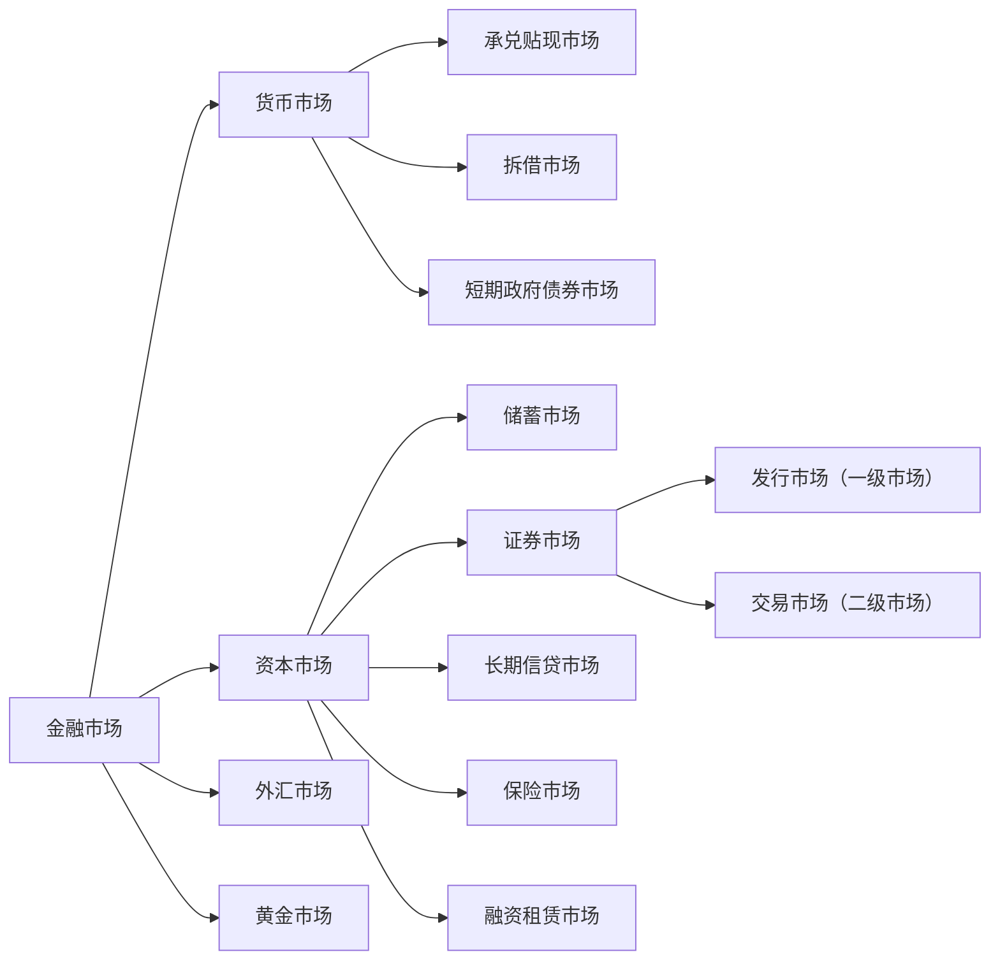

<!-- market-note:NAV:start -->
[[02_Economy/06_证券投资学/02_证券市场与交易|连续阅读：证券市场与交易]] · [[证券市场、订单与结算.canvas|关系图]] · [[02_Economy/06_证券投资学/证券投资学.pdf#page=193|原课 PDF 第二章（193–298页）]]
<!-- market-note:NAV:end -->

# 1. 证券市场概述
<!-- bilingual-en:start -->
*1. Securities Market Overview*
<!-- bilingual-en:end -->

## 1.1 证券市场的特征
<!-- bilingual-en:start -->
*1.1 Characteristics of Securities Markets*
<!-- bilingual-en:end -->

>[!note] 证券市场
>证券市场是股票、债券、基金和其他金融衍生工 具发行和买卖的场所，是一个高度组织化、集中 进行证券交易的市场，是整个证券市场的核心。 是有价证券、证券功能、财产权利和风险直接交换 的场所
>广义：证券市场指的是所有证券发行和交易的场所。
>狭义上:也是最活跃的证券市场指的是资本证券市场、货币证券市 场和商品证券市场。
><!-- bilingual-en:start -->
>**Securities Market**
>A securities market is a highly organized, centralized venue in which stocks, bonds, funds, and other financial derivatives are issued and traded. It is a core part of the broader financial market and a place where securities, the rights they embody, property claims, and risks are exchanged directly.
>Broadly defined, the securities market comprises every venue where securities are issued or traded.
>In the narrower and more active sense used here, it includes markets for capital-market securities, money-market securities, and commodity securities.
><!-- bilingual-en:end -->

<!-- market-note:M01:start -->
> [!note] 市场与交易所的定义边界
> 上述原课把[[证券市场]]与[[证券交易所]]的集中交易特征放在了一起。证券的发行、转让可以通过交易所或场外安排完成，不要求都在一个集中场所。下面的金融市场图保留原课分类口径，不表示所有金融市场类别互斥，也不能据此排除短期债券属于证券。
> <!-- bilingual-en:start -->
> The source combines the broader [[证券市场|securities market]] with the organized trading features of a [[证券交易所|securities exchange]]. Issuance and transfers can occur through exchanges or off-exchange arrangements; one centralized venue is not required. The diagram below preserves the course's classification, rather than establishing mutually exclusive categories or excluding short-term debt securities.
> <!-- bilingual-en:end -->
> [[02_Economy/06_证券投资学/证券投资学.pdf#page=195|原课 PDF 195–198（定义与分类图）]]。
<!-- market-note:M01:end -->

证券市场的基本功能:
融资定价,资本配置,信息传递,机制和监管,
<!-- bilingual-en:start -->
The basic functions of securities markets are financing and pricing, capital allocation, information transmission, market mechanisms, and regulation.
<!-- bilingual-en:end -->

## 1.2 证券市场分类与结构
<!-- bilingual-en:start -->
*1.2 Classification and Structure of Securities Markets*
<!-- bilingual-en:end -->

### 1.2.1 按照功能分类
<!-- bilingual-en:start -->
*1.2.1 Categorized by Function*
<!-- bilingual-en:end -->

1. 一级市场：融资活动，连接资 金需求和资金供给，闲散资金 转化为生产资本。 
2. 二级市场（交易市场）  交易，价格发现，资产配置，晴 雨表
<!-- bilingual-en:start -->

&nbsp;
**1.** primary market: Financing activities connect the demand for funds with their supply, converting idle capital into productive capital. 
**2.** Secondary market (trading market): trading, price discovery, asset allocation, and an economic-barometer function. 
<!-- bilingual-en:end -->

联系： 
* 一级市场供给二级市场的品 种 ,决定二级市场的交易规模、结构与速度；
* 二级市场为一级市场投资者 提供变现途径； 
* 二级市场的供求及定价效率 影响一级市场的发行。
<!-- bilingual-en:start -->
Link:
* primary market supplies secondary market with varieties, determining the scale, structure, and pace of secondary market's transactions;
* secondary market provides an exit for primary market investors;
* The efficiency of supply and demand in secondary market and its pricing affects the issuance by primary market.
<!-- bilingual-en:end -->

<!-- market-note:M02:start -->
> [!note] 发行与流通的联系不是单向决定
> [[一级市场]]创造新发行证券，[[二级市场]]转让已发行证券，通常不因此再次向发行人注资。发行规模影响可交易证券供给，但换手还受流动性、持仓与投资者需求等影响；“提供变现途径”也不是保证随时按理想价格退出。反向联系见[[二级流动性与发行价格]]。
> <!-- bilingual-en:start -->
> The [[一级市场|primary market]] issues new securities; the [[二级市场|secondary market]] transfers existing securities, normally without raising fresh funds for their issuer. Issuance affects supply, but turnover also depends on liquidity, holdings and investor demand. An exit mechanism does not guarantee an immediate sale at a desired price. See [[二级流动性与发行价格|how secondary-market liquidity affects issue prices]] for the reverse connection.
> <!-- bilingual-en:end -->
> [[02_Economy/06_证券投资学/证券投资学.pdf#page=201|原课 PDF 201]]。
<!-- market-note:M02:end -->

### 1.2.2 按照上市条件分类
<!-- bilingual-en:start -->
*1.2.2 Categorizing Listings by Listing Conditions*
<!-- bilingual-en:end -->

1. 主板，是资本市场最重要的组成部分，能够反映宏观经济，晴雨表。深圳和上海都有.
		对发行人的营业期限 ，股本、盈利，市值等要求.
		大型成熟企业，规模较大，盈利稳定。
2. 二板市场：创业板,为具有高成长的中小企业和高科技企业提供融资服务。上市条件偏低.
		甚至不要求盈利,只是有专利什么的就行.
		为风险投资资金提供退出通道；
3. 三板市场:全国中小企业股份转让系统.不向公众进行公开募股.
<!-- bilingual-en:start -->

&nbsp;
**1.** The main board is the most crucial component of the capital market, reflecting macroeconomic conditions and serving as a barometer. Both Shenzhen and Shanghai have them. 

For issuers, requirements include the duration of operations, share capital, profitability, and market value.

Large, mature companies tend to have substantial size and stable profits.

**2.** The secondary board, known as the ChiNext Board, provides financing services for high-growth small and medium-sized enterprises (SMEs) and high-tech firms. Listing criteria are relatively lenient. 

Even without requiring profitability, they may only need patents or other intellectual property.

It offers an exit route for venture capital funds;

**3.** The third board, the National Equities Exchange and Quotations (NEEQ), does not conduct public offerings; it operates on a non-public basis. 
<!-- bilingual-en:end -->

<!-- market-note:M03:start -->
> [!note] 板块定位不能代替发行上市条件
> “有专利就行”不能作为上市判断：板块定位、法定发行条件、具体上市标准是不同层次；允许某类未盈利企业并不免除其他要求。原课 PDF 203–205 的图表本身也列出多项条件，数字应保留为该课版本而非永久现行标准。新三板挂牌与北交所上市亦不能混用；判断发行方式应先核市场、层次与适用日期，参见[[发行注册与投资价值]]。
> <!-- bilingual-en:start -->
> Having patents is not a sufficient listing test. Board positioning, statutory issuance conditions and specific listing standards are separate requirements; admitting some unprofitable firms does not waive the others. The course's tables on PDF pages 203–205 already contain multiple conditions and should be treated as dated course material. NEEQ quotation and BSE listing are also distinct. Identify the market, segment and applicable date before assessing an offering; see [[发行注册与投资价值|registration and investment merit]].
> <!-- bilingual-en:end -->
> [证监会2023注册办法立法说明（注册仍须发行上市条件）](https://www.csrc.gov.cn/csrc/c101953/c7121923/7121923/files/%E9%99%84%E4%BB%B62%EF%BC%9A%E5%85%B3%E4%BA%8E%E3%80%8A%E9%A6%96%E6%AC%A1%E5%85%AC%E5%BC%80%E5%8F%91%E8%A1%8C%E8%82%A1%E7%A5%A8%E6%B3%A8%E5%86%8C%E7%AE%A1%E7%90%86%E5%8A%9E%E6%B3%95%E3%80%8B%E7%9A%84%E7%AB%8B%E6%B3%95%E8%AF%B4%E6%98%8E.pdf#page=2)；[[02_Economy/06_证券投资学/证券投资学.pdf#page=203|原课上市条件图表]]。
<!-- market-note:M03:end -->

### 1.2.3 按交易对象不同
<!-- bilingual-en:start -->
*1.2.3 Classification by Instrument Traded*
<!-- bilingual-en:end -->

股票市场； 
债券市场； 
基金市场 
衍生品市场
<!-- bilingual-en:start -->
Stock market;
Bond market;
Funds market;
Derivatives market
<!-- bilingual-en:end -->

### 1.2.4 按照交易场所
<!-- bilingual-en:start -->
*1.2.4 By Trading Venue*
<!-- bilingual-en:end -->

场内交易.有标准的地点和规则.交易标准化产品.
场外交易.交易非标准化产品.
<!-- bilingual-en:start -->
Exchange trading takes place in a standardized location with rules. Standardized products are traded. Over-the-counter (OTC) trading involves non-standardized products.
<!-- bilingual-en:end -->

<!-- market-note:M04:start -->
> [!note] 场所与标准化是两条分类轴
> [[场外市场]]也可以交易标准化证券，并采用电子平台与明确规则；“场外”不是“非标准化”或“无监管”的同义词。[[订单驱动市场]]与[[报价驱动市场]]则描述成交如何组织，不直接等同于场内／场外。
> <!-- bilingual-en:start -->
> [[场外市场|Off-exchange markets]] can trade standardized securities through electronic systems with explicit rules. Off-exchange does not mean non-standardized or unregulated. [[订单驱动市场|Order-driven]] and [[报价驱动市场|quote-driven markets]] classify how trading is organized, rather than simply duplicating the exchange/off-exchange distinction.
> <!-- bilingual-en:end -->
> [[02_Economy/06_证券投资学/证券投资学.pdf#page=206|原课 PDF 206、225（场所分类）]]。
<!-- market-note:M04:end -->

## 1.3 证券市场发展阶段
<!-- bilingual-en:start -->
*1.3 Stages in the Development of Securities Markets*
<!-- bilingual-en:end -->

1. 自由放任阶段(17世纪初至20世纪20年代末)：1929年10月黑色星期二标志着自由放任的结束.
2. 法制建设阶段(20世纪30年代初至60年代末) ：
	1. 美国：证券法，证券交易法，公共事业控股公司法，信托契约法，投资公司法， 投资顾问法 
	2. 英国：反欺诈投资法，公司法 
	推动了三公，发挥证券市场功能，促进证券市场持续发展。
3. 迅速发展阶段(20世纪70年代以来) ：GDP占比提高，资本市场结构优化，金融衍 生品层出不穷
<!-- bilingual-en:start -->

&nbsp;
**1.** The laissez-faire stage (from the early 17th century to the late 1920s): October 29, 1929, marked the end of laissez-faire. 

**2.** The regulatory stage (from the early 1930s to the late 1960s): 
↳ **1.** United States: Securities Act, Securities Exchange Act, Public Utility Holding Company Act, Trust Indenture Act, Investment Company Act, Investment Advisers Act 
↳ **2.** United Kingdom: Fraudulent Investment Act, Companies Act 
   These measures promoted fair play and facilitated the continuous development of the market.

**3.** Rapid Development Stage (since the 1970s): GDP share increased, capital market structures were optimized, and a plethora of financial derivatives emerged. 
<!-- bilingual-en:end -->

# 2. 证券市场的参与者
<!-- bilingual-en:start -->
*2. Securities-Market Participants*
<!-- bilingual-en:end -->

## 2.1 证券发行者
<!-- bilingual-en:start -->
*2.1 Issuers of Securities*
<!-- bilingual-en:end -->

### 2.1.1 证券发行者是谁
<!-- bilingual-en:start -->
*2.1.1 Who Issues Securities?*
<!-- bilingual-en:end -->

证券市场发行者是证券市场的资金需求者和证券的供给者
<!-- bilingual-en:start -->
The issuer is the demander of funds and the supplier of securities for securities market.
<!-- bilingual-en:end -->

* 政府:政府债券(国债和地方债)
* 企业:股份有限公司发行债券和股票,有限公司发行债券
* 银行和非银行金融机构:股票或金融债券.
<!-- bilingual-en:start -->
* Government: Government Bonds (Treasury Bonds and Local Bonds)
* Enterprise: Shares or Stocks issued by joint-stock companies, Bonds issued by limited liability companies
* Banks and Non-Bank Financial Institutions: Stocks or Financial Bonds.
<!-- bilingual-en:end -->

国债:
* 早期主要用于弥补财政赤字； 
* 现代，用途一般有： 
	* 提供公共品； 
	* 扩大政府开支，刺激经济增长； 
	* 维护金融市场稳定。
<!-- bilingual-en:start -->
Government Bonds:
* Originally used to offset fiscal deficits;
* Nowadays, purposes generally include:
	+ Provision of public goods;
	+ Expanding government spending, stimulating economic activity (economic growth);
	+ Maintaining financial market stability.
<!-- bilingual-en:end -->

金融债券是金融机构扩大信贷资金来源的手段，一般专款专用， 被用于定向特别贷款。
<!-- bilingual-en:start -->
Financial bonds are a means for financial institutions to expand their source of credit funds, generally used for specific purposes and directed towards targeted special loans.
<!-- bilingual-en:end -->

<!-- market-note:M05:start -->
> [!note] 发行工具与资金用途分别核对
> 上方原英文漏掉股份有限公司也能发行债券这一项；原中文列的是股票与债券两类。金融机构发行债券后的资金用途须核具体募集文件，不能仅凭“金融债券”名称就断定全部资金专用于某类贷款。识别时先看[[债券]]的权利条款，再看发行人的用途承诺。
> <!-- bilingual-en:start -->
> The English list above omits bonds from the instruments issued by joint-stock companies; the Chinese lists both shares and bonds. The permitted use of financial-bond proceeds must be checked in the offering documents, not inferred solely from the issuer being a financial institution. Identify the [[债券|bond's]] contractual rights and then the issuer's commitments about proceeds.
> <!-- bilingual-en:end -->
> [[02_Economy/06_证券投资学/证券投资学.pdf#page=209|原课 PDF 209（发行者与工具）]]。
<!-- market-note:M05:end -->

### 2.1.2 证券发行方式
<!-- bilingual-en:start -->
*2.1.2 Methods of Securities Issuance*
<!-- bilingual-en:end -->

1. 审批制.是完全的计划经济的产物.证监会控制额度,下划至各省市自治区.公司在申请股票发行时需要经过审批的证券发行管理制度， 是完全计划发行的模式，施行额度控制。不够市场化
2. 核准制:审批制后变为核准制.发行委员会的权力空前强大.那拨人贪美了.证监会既当裁判员,又当运动员.爽死了.
3. 注册制:监管机构只看发行人的真实准确性进行审查,不看这个公司有没有投资价值.
<!-- bilingual-en:start -->

&nbsp;
**1.** Quota-based administrative approval system. This was a product of the fully planned economy: the CSRC controlled issuance quotas and allocated them to provinces, municipalities, and autonomous regions. Companies needed administrative approval to issue shares, making it a fully planned model governed by quotas. It was insufficiently market-oriented. 
**2.** Approval system. The quota system was later replaced by an approval system, under which the issuance-review committee acquired exceptionally broad power. In the note's critical phrasing, the CSRC acted as both referee and player, creating strong opportunities for rent-seeking. 
**3.** Registration system. Regulators review whether an issuer's disclosed information is truthful and accurate, rather than judging whether the company has investment value. 
<!-- bilingual-en:end -->

<!-- market-note:M06:start -->
> [!note] 注册审核不等于免条件，也不保证收益
> [[发行注册与投资价值]]需要分开：注册制仍要求符合发行、上市及信息披露条件；审核通过不表示值得购买或保证回报。即使2006年核准制办法第7条，也明确核准不构成投资价值或收益保证。上面的制度批评保留为课堂评述，不把审批／核准与注册简化为“前者保证价值、后者只查真假”。
> <!-- bilingual-en:start -->
> [[发行注册与投资价值|Registration and investment merit]] are separate. Registration still requires issuance, listing and disclosure conditions; approval does not establish that a security is attractive or guarantee returns. Article 7 of the 2006 approval-system rules also disclaimed any guarantee of investment value or returns. The comments above remain classroom commentary, not a distinction under which one system guarantees value and the other merely checks truthfulness.
> <!-- bilingual-en:end -->
> [2023注册办法发布与附件](https://www.csrc.gov.cn/csrc/c101953/c7121923/content.shtml)；[2006核准办法第7条](https://www.csrc.gov.cn/csrc/c101802/c1004920/content.shtml)。
<!-- market-note:M06:end -->

## 2.2 证券投资者
<!-- bilingual-en:start -->
*2.2 Securities Investors*
<!-- bilingual-en:end -->

### 2.2.1 机构投资者
<!-- bilingual-en:start -->
*2.2.1 Institutional Investors*
<!-- bilingual-en:end -->

1. 政府机构:
	1. 财政部,各级政府.目的是为了调剂资金余缺和进行宏观调控.
	2. 中央银行:[[公开市场操作|公开市场操作]]
	3. 国资委:国资持股
2. 企业事业单位:投资 参股、控股某上市公司.
3. 金融机构
	1. 银行:按要求要持有一类资产二类资产
	2. 证券:自营,经济,服务三类业务.自营就是要在市场参与投资
	3. 保险:收到保险金后不能将钱放在哪里,需要拿出去钱滚钱.
	4. 基金机构 主权财富基金.
	5. 合格的境外机构投资者
	6. 其他金融机构
<!-- bilingual-en:start -->

&nbsp;
**1.** Government Institutions: 
↳ **1.** Ministry of Finance, various levels of government. The purpose is to balance surplus and shortage of funds and conduct macroeconomic regulation. 
↳ **2.** central bank: [[公开市场操作|open market operations]] 
↳ **3.** SASAC: State-owned equity holdings 
**2.** Enterprises and Public Institutions: Invest in or participate in the shares of listed companies. 
**3.** Financial Institutions: 
↳ **1.** Banks: Must hold certain types of assets and meet specific asset requirements. 
↳ **2.** Securities firms: three broad businesses—proprietary trading, brokerage, and services. Proprietary trading means investing the firm's own capital in the market. 
↳ **3.** Insurers: premiums received cannot simply remain idle; they must be invested to generate returns. 
↳ **4.** Fund institutions: Sovereign wealth funds. 
↳ **5.** Qualified Foreign Institutional Investors. 
↳ **6.** Other financial institutions 
<!-- bilingual-en:end -->

### 2.2.2 个人投资者
<!-- bilingual-en:start -->
*2.2.2 Individual Investors*
<!-- bilingual-en:end -->

散户
<!-- bilingual-en:start -->
Retail investors.
<!-- bilingual-en:end -->

## 2.3 证券市场中介机构
<!-- bilingual-en:start -->
*2.3 Securities-Market Intermediaries*
<!-- bilingual-en:end -->

为证券发行,交易提供服务的各类机构
1. 证券公司:证券承销、经纪、自营、投资咨询以及购并 （投行）、受托资产管理和基金管理等
2. 证券服务机构:登记结算公司、投资咨询公司、会计师事务 所、律师事务所、资产评估机构和证券信用评 级机构等
<!-- bilingual-en:start -->
Various institutions providing services for securities issuance and trading 
**1.** Securities Companies: Underwriting, brokerage, proprietary trading, investment consulting, mergers and acquisitions (M&A), as well as asset management and fund management, among others. 
**2.** Securities Service Providers: Registration and settlement companies, investment advisory firms, accounting firms, law firms, appraisal firms, and securities credit rating agencies, among others. 
<!-- bilingual-en:end -->

## 2.4 自律性组织
<!-- bilingual-en:start -->
*2.4 Self-Regulatory Organizations*
<!-- bilingual-en:end -->

### 2.4.1. 证券业协会
<!-- bilingual-en:start -->
*2.4.1. Securities Association*
<!-- bilingual-en:end -->

协助证券监管机构组织会员执行有关法律 维护会员的合法权益，为会员提供信息服务 制定规则 培训
<!-- bilingual-en:start -->
Assist securities regulatory authorities in organizing members to comply with relevant laws, protect members' legal rights and interests, provide information services, and formulate rules and train members.
<!-- bilingual-en:end -->

### 2.4.2. 证券交易所 
<!-- bilingual-en:start -->
*2.4.2. Securities Exchange*
<!-- bilingual-en:end -->

>[!note] 证券交易所
>是依据规定条件设立的，为证券的集中和有组织 的交易提供场所、设施，履行国家有关法律、法 规、政策规定的职责，实行自律性管理的法人
><!-- bilingual-en:start -->
>**Stock Exchange**
>
>is a body established under specified conditions to provide a centralized and organized venue and facilities for the trading of securities, fulfilling the duties prescribed by relevant laws, regulations, and policies of the state, and exercising self-regulatory management as a legal entity.
><!-- bilingual-en:end -->

#### 2.4.2.1 按组织形式分类
<!-- bilingual-en:start -->
*2.4.2.1 Classified by Organizational Form*
<!-- bilingual-en:end -->

>[!note] 会员制证券交易所
>会员制证券交易所是指由符合一定条件的会员自愿组成， 是不以营利为目的的法人团体。
><!-- bilingual-en:start -->
>Membership Stock Exchange
>A Membership Stock Exchange is a legal entity group composed of members who meet certain criteria, established for non-profit purposes.
><!-- bilingual-en:end -->

* 优点
	* 会员制证券交易所以自 律、自治管理为基础，因而收取费用较低，上市公司缴纳的上 市初费、上市月费较低；不存在破产的风险
* 缺点
	* 由于会员本身就是证券交易的买卖者，证券交易的 不公正性难以避免；
	* 证券交易所的管理者与参与者合一，不 利于交易所的自身管理，也不利于国家对其的统一管理；
	* 由 于该种证券交易所的买卖只限于该交易所的会员，事实上 形成了垄断性，不利于形成公平价格。
<!-- bilingual-en:start -->
* Advantages
	* The membership-based securities exchange operates on a self-regulatory, self-governance basis, thus charging lower fees; initial listing fees and monthly fees for listed companies are also lower; there is no risk of bankruptcy.
* Disadvantages
	* Since members themselves are both buyers and sellers in securities transactions, unfairness in these transactions cannot be avoided;
	* The managers and participants of the securities exchange are one and the same, which is disadvantageous to the internal management of the exchange and to unified management by the state;
	* Due to the fact that trading in this type of securities exchange is limited to members of the exchange, it actually fosters monopolistic tendencies, which is detrimental to the formation of fair prices.
<!-- bilingual-en:end -->

<!-- market-note:M07:start -->
> [!note] 组织形式不能推出无风险
> 会员自治会产生治理与利益冲突问题，但不能单凭会员制推出费率必低、交易必不公平，尤其不能推出“无破产风险”。[[证券交易所]]仍须管理资金、技术与运营风险；非营利目的不等于没有负债、亏损或解散风险。
> <!-- bilingual-en:start -->
> Member governance can create conflicts of interest, but does not by itself imply low fees, inevitable unfairness or immunity from financial failure. A [[证券交易所|securities exchange]] still faces financial, technological and operational risks. A not-for-profit purpose does not eliminate liabilities, losses or the possibility of dissolution.
> <!-- bilingual-en:end -->
> [《证券交易所管理办法》第15、19条（风险准备及解散条件）](https://www.csrc.gov.cn/csrc/c106256/c1653990/content.shtml)。
<!-- market-note:M07:end -->

>[!note] 公司制证券交易所 
>指以盈利为目的，由银行、证券公司、投资信托机构及各 类公营、民营公司等共同投资入股建立起来的法人公司
><!-- bilingual-en:start -->
>**Corporation-Run Securities Exchange**
>refers to a legal entity company established through joint investment by banks, securities firms, investment trust institutions, and various public and private companies all for the purpose of profit.
><!-- bilingual-en:end -->

* 优点
	* 经营者与交易者两者分离，有助于交易的公正进行；
	* 对交易的安全性提供担保， 有利于证券交易所的发展；
	* 由于有利润，所以能提供先进、完备的证券市场设备，可以保证证券交易的顺利进 行。
* 缺点:
	* 由于它以盈利为目的，公司制会员势必要扩大 人数，人为助长行情的波动，从而助长过度投机交易；
	* 要 收取较高的上市费和佣金，交易者为避免过高的交易成 本，会到场外市场进行交易；
	* 有可能破产，风险较大。
<!-- bilingual-en:start -->
* Advantages:
	* Separating operators from traders helps ensure fairness in transactions;
	* Providing security guarantees for transactions benefits the development of stock exchanges;
	* With profits, they can provide advanced and comprehensive securities market equipment, ensuring smooth transactions.
* Disadvantages:
	* As it operates for profit, company members will likely increase their numbers, artificially exacerbating market fluctuations and encouraging excessive speculative trading;
	* They charge high listing fees and commissions, making transaction costs prohibitive for traders who may opt to trade on over-the-counter markets instead;
	* There is a risk of bankruptcy, posing significant risks.
<!-- bilingual-en:end -->

<!-- market-note:M08:start -->
> [!note] 公司制的治理与履约保障分别判断
> 公司制描述所有权与治理结构，不能直接推出交易安全担保、技术必然先进、高费率或行情必然更波动。中国《证券交易所管理办法》分别规定公共利益优先、风险管理和组织结构，并禁止交易所为他人提供担保；不能把组织形式当作清算机构履约保障机制。
> <!-- bilingual-en:start -->
> Corporate form describes ownership and governance; it does not itself guarantee safe execution, superior technology, higher fees or greater volatility. China's exchange-management rules separately address public-interest priority, risk management and governance, and prohibit an exchange from providing guarantees for others. Organizational form is not a clearing institution's performance-guarantee mechanism.
> <!-- bilingual-en:end -->
> [《证券交易所管理办法》第6、8、15、17–19条](https://www.csrc.gov.cn/csrc/c106256/c1653990/content.shtml)。
<!-- market-note:M08:end -->

>[!note] 老钟的证券交易所
>深圳 上海证券交易所：是按《证券交易所管理 办法》规定条件设立，不以营利为目的，为证券的集中和 有组织的交易提供场所、设施，履行国家有关法律、法 规、规章、政策规定的职责，实行自律性管理的会员制事 业法人。它由中国证券监督管理委员会监管。
><!-- bilingual-en:start -->
>**Lao Zhong's Note on Stock Exchanges**
>Shenzhen and Shanghai Stock Exchanges: Established according to the "Management Measures for Stock Exchanges," they are non-profit institutions providing a venue and facilities for the centralized and organized trading of securities. They fulfill the duties prescribed by relevant laws, regulations, rules, and policies of the state, and operate under self-regulation as a membership-based non-profit legal entity. They are regulated by the China Securities Regulatory Commission (CSRC).
><!-- bilingual-en:end -->

上海和深圳会员制.北京公司制
<!-- bilingual-en:start -->
Shanghai and Shenzhen membership-based. Beijing company-based.
<!-- bilingual-en:end -->

#### 2.4.2.2 证券交易所功能
<!-- bilingual-en:start -->
*2.4.2.2 Functions of Stock Exchanges*
<!-- bilingual-en:end -->

1. 为交易双方提供了一个完备、公开的交易场所 
2. 形成较为合理的价格 
3. 引导社会资金的合理流动和资源的合理配置 
4. 及时传递上市公司状况、随时公布市场行情信息
5. 对整个证券市场进行一线监控
<!-- bilingual-en:start -->

&nbsp;
**1.** Provides a comprehensive, transparent marketplace for both parties involved in transactions. 
**2.** Forms a relatively reasonable price. 
**3.** Guides the rational flow of social capital and the rational allocation of resources. 
**4.** Timely disseminates information on company conditions and promptly publishes market trend updates. 
**5.** Monitors the securities market system in real-time. 
<!-- bilingual-en:end -->

#### 2.4.2.3 证券交易所的运行系统
<!-- bilingual-en:start -->
*2.4.2.3 Operational System of Stock Exchanges*
<!-- bilingual-en:end -->

1. 交易系统
	1. 有形席位属于一种场内报盘 
	2. 无形席位是属于一种场外报盘
2. 结算系统
	1. 指对证券交易进行结算、交收和过户的系统.我国使用T+1结算系统.买入第二天才能卖出.
3. 信息系统
	1. 对每日证券交易的行情信息和市场信息进行实时发布
4. 检查系统
	1. 负责证券交易所对市场进行实时监控的职责 行情监控、交易监控、证券监控、资金监控
<!-- bilingual-en:start -->

&nbsp;
**1.** Trading System 
↳ **1.** An executed seat is a floor-based submission. 
↳ **2.** An unexecuted seat is an off-floor submission. 
**2.** Settlement System 
↳ **1.** Refers to a system for settling, clearing, and transferring securities transactions. In China, the T+1 settlement system is used. Buyers can only sell on the second day after purchase. 
**3.** Information System 
↳ **1.** Publishes real-time information on daily securities trading market conditions. 
**4.** Monitoring System 
↳ **1.** Responsible for real-time monitoring of the market by the stock exchange. This includes surveillance of market data, transaction activities, securities holdings, and fund flows. 
<!-- bilingual-en:end -->

<!-- market-note:M09:start -->
> [!note] 报盘位置、交收日期、可卖时间不要混为一项
> 有形／无形席位指历史上的场内／远程报盘，并非已成交／未成交，原英文 executed／unexecuted 在此不适用。[[证券结算]]的 $T+n$ 表示约定交收日；买入后何时允许卖出是回转交易限制，两者不能相互定义。“第二天”还须区分交易日与自然日，并核证券品种的例外。
> <!-- bilingual-en:start -->
> Physical versus remote seats describe historical order-routing arrangements, not executed versus unexecuted orders. In [[证券结算|securities settlement]], $T+n$ identifies the scheduled settlement date. A restriction on when a purchased security may be resold is a separate trading rule. “The next day” must also distinguish a trading day from a calendar day and account for instrument-specific exceptions.
> <!-- bilingual-en:end -->
> [[02_Economy/06_证券投资学/证券投资学.pdf#page=222|原课 PDF 222、279]]；[深交所2026交易规则§3.1及§3.4.7](https://docs.static.szse.cn/www/lawrules/rule/trade/current/W020260424690713155663.pdf)。
<!-- market-note:M09:end -->

#### 2.4.2.4 交易所成员
<!-- bilingual-en:start -->
*2.4.2.4 Exchange Members*
<!-- bilingual-en:end -->

1. 会员。股票经纪人，证券自营商和专业会员 
	1. 股票经纪人：专门帮助客户进行股票交易并收取佣金的经纪人 
	2. 证券自营商：直接经营人和零数经营商 
	3. 专业会员：专门买卖一种或多种股票的交易所会员。交易对象为其 他经纪人。 
2. 交易人：特种经纪人和场内经纪人 
	1. 特种经纪人：充当其他经纪人的代理人；参与交易，轧平价差；大宗 交易中介人；负责区域交易；提供信息。 
	2. 场内经纪人：佣金经纪人和独立经纪人 
	3. 独立经纪人：独立个体，为特定公司完成指定交易。
<!-- bilingual-en:start -->

&nbsp;
**1.** Members. Stockbrokers, securities merchants, and professional members 

**1.** Stockbroker: A broker who assists clients in trading stocks and collects commissions. 

**2.** Securities Merchant: Direct operators and small account operators. 

**3.** Professional Member: An exchange member specializing in buying and selling one or more types of stocks. The trading objects are other brokers. 

**2.** Market Participants: Special Brokers and Floor Brokers 

**1.** Special Broker: Acts as an agent for other brokers; participates in transactions to close price differences; intermediaries for large-scale trades; responsible for regional trades; provides information. 

**2.** Floor Broker: Commission brokers and independent brokers. 

**3.** Independent Broker: An individual operating independently to complete specific transactions for a particular company. 
<!-- bilingual-en:end -->

客户与经纪人关系： 
（1）委托代理关系 
（2）债务债权关系（信用交易） 
（3）抵押关系（融资融券） 
（4）信托关系
<!-- bilingual-en:start -->
Customer-Broker Relationship:

(1) Agency Relationship

(2) Debt-Principal Relationship (Credit Transactions)

(3) Mortgage Relationship (Futures and Securities Lending)

(4) Trust Relationship
<!-- bilingual-en:end -->

<!-- market-note:M10:start -->
> [!note] 交易角色与账户合同
> 上述场内成员／特种经纪人是特定市场的历史角色，不能当作所有交易所的统一人员设置；“轧平价差”也不是保证买卖报价始终相等。可复用的区分是[[证券经纪与自营]]：为客户执行与以自己账户承担交易。客户另有信用交易时，还涉及相应借贷、担保等关系；原英文应分别理解为 debtor–creditor relationship、margin financing and securities lending，而不是 Debt-Principal 或 futures。受托保管亦须核具体法律与合同，不把所有账户一律认定为同一种信托。
> <!-- bilingual-en:start -->
> The floor-member and specialist categories describe historical roles in particular markets, not universal exchange staffing. Narrowing a spread does not guarantee equal bid and ask quotes. The reusable distinction is [[证券经纪与自营|agency brokerage versus principal trading]]. Credit transactions create the applicable debtor–creditor and collateral relationships; the intended terms are “debtor–creditor relationship” and “margin financing and securities lending,” not “Debt-Principal” or “futures.” Custody and trust arrangements also depend on the governing law and contract.
> <!-- bilingual-en:end -->
> [[02_Economy/06_证券投资学/证券投资学.pdf#page=223|原课 PDF 223–224]]；[深交所2026规则§3.8（融资融券）](https://docs.static.szse.cn/www/lawrules/rule/trade/current/W020260424690713155663.pdf#page=23)。
<!-- market-note:M10:end -->

### 2.4.3 场外交易场所
<!-- bilingual-en:start -->
*2.4.3 Off-exchange Trading Facilities*
<!-- bilingual-en:end -->

是在证券交易所之外进行证券交易的场所。
<!-- bilingual-en:start -->
"is a place for trading securities outside of stock exchanges."
<!-- bilingual-en:end -->

特点： 
* 无固定的交易场所和统一的交易制度。 
* 电子交易系统的发展导致和证券交易所的物理界限逐步消失 
* 转化为风险分层管理的概念。 
<!-- bilingual-en:start -->
Features:
* No fixed trading venue or unified trading system.
* The development of electronic trading systems has led to a gradual disappearance of physical boundaries between them and stock exchanges.
* Risk stratification management has been transformed into a concept.
<!-- bilingual-en:end -->

<!-- market-note:M11:start -->
> [!note] 场外不等于无制度
> 这里“无统一制度”宜理解为各场外安排不共享某一交易所的同一套规则，而不是每个平台均无规则。[[场外市场]]可以有明确准入、披露、交易与结算制度；电子化消除部分物理差异，不消除法律地位和监管边界。
> <!-- bilingual-en:start -->
> “No unified system” should mean that off-exchange arrangements do not all share one exchange's rulebook, not that each platform lacks rules. [[场外市场|Off-exchange markets]] may impose explicit access, disclosure, trading and settlement requirements. Electronic trading reduces physical differences without eliminating legal or regulatory distinctions.
> <!-- bilingual-en:end -->
> [[02_Economy/06_证券投资学/证券投资学.pdf#page=225|原课 PDF 225]]。
<!-- market-note:M11:end -->

功能： 
* 拓宽融资渠道，改善中小企业融资环境。 
* 为非上市证券提供转让场所； 
* 提供风险分层的金融资产管理渠道。 
<!-- bilingual-en:start -->
Functions:
- Broaden funding channels and improve the financing environment for small and medium-sized enterprises (SMEs).
- Provide a trading venue for unlisted securities;
- Offer financial asset management channels with tiered risk levels.
<!-- bilingual-en:end -->

我国场外市场：
* 银行间债券市场；
* 中小企业股份转让系统；
* 债券柜台交易
<!-- bilingual-en:start -->
China's Over-the-Counter Market:
* Interbank Bond Market;
* System for the Transfer of Shares by Small and Medium Enterprises;
* Counter Trading of Bonds.
<!-- bilingual-en:end -->

## 2.5证券监管机构
<!-- bilingual-en:start -->
*2.5 Securities Regulatory Authorities*
<!-- bilingual-en:end -->

* 负责行业性法规的起草 
* 负责监督有关法律法规的执行 
* 负责保护投资者的合法权益 
* 对相关机构的行为实施全面监管
<!-- bilingual-en:start -->
* responsible for drafting industry-specific regulations
* responsible for overseeing the enforcement of relevant laws and regulations
* responsible for protecting investors' legal rights and interests
* responsible for comprehensive oversight of the actions of relevant institutions
<!-- bilingual-en:end -->

# 3. 股票价格指数
<!-- bilingual-en:start -->
*3. Stock Price Index*
<!-- bilingual-en:end -->

## 3.1 股票价格指数
<!-- bilingual-en:start -->
*3.1 Stock Price Index*
<!-- bilingual-en:end -->

>[!note] 股票价格指数 
>是指由金融机构编制的通过对股票市场上一些有代表性的公司发行的股 票价格进行平均计算和动态对比后得出的数值。股票价格指数是衡量证 券市场整体变动方向和幅度的动态相对数，也是投资者投资决策的依据 之一。
><!-- bilingual-en:start -->
>Stock Price Index refers to a numerical value derived from averaging and dynamically comparing the prices of a set of representative stocks on the stock market, as compiled by financial institutions. A Stock Price Index is a dynamic relative measure that reflects the overall direction and magnitude of changes in the securities market, serving as one of the bases for investors' investment decisions.
><!-- bilingual-en:end -->

<!-- market-note:M12:start -->
> [!note] 先分清均价、指数与覆盖范围
> [[股价平均数]]汇总每股价格；[[股票价格指数]]按指定样本、权重与调整规则追踪相对变化，常另设基准点数。编制者不限于金融机构，指数也可能只覆盖某个行业或市场子集，不能都解释为“整个市场”。读数先做[[指数口径核对]]。
> <!-- bilingual-en:start -->
> An [[股价平均数|average stock price]] aggregates per-share prices. A [[股票价格指数|stock-price index]] tracks relative changes using specified constituents, weights and adjustment rules, often with a chosen base level. Providers need not be financial institutions, and an index may cover only a sector or market subset. Begin by [[指数口径核对|checking its precise methodology and scope]].
> <!-- bilingual-en:end -->
> [[02_Economy/06_证券投资学/证券投资学.pdf#page=227|原课 PDF 227–239（均价与指数）]]。
<!-- market-note:M12:end -->

### 3.1.2股票价格指数的计算
<!-- bilingual-en:start -->
*3.1.2 Calculation of Stock Price Indexes*
<!-- bilingual-en:end -->

#### 3.1.2.1 股价平均数计算
<!-- bilingual-en:start -->
*3.1.2.1 Calculation of Stock Price Indexes*
<!-- bilingual-en:end -->

##### 1. 股价算数平均数
<!-- bilingual-en:start -->
*1. Arithmetic Mean Stock Price*
<!-- bilingual-en:end -->

简单算平均
<!-- bilingual-en:start -->
Simple Average
<!-- bilingual-en:end -->

<!-- market-note:M13:start -->
> [!note] 原课四只股票的均价
> 同一时点 $n$ 只股票的简单[[股价平均数]]为 $\bar p=\sum_{i=1}^{n}p_i/n$。PDF228 的原例为 $(10+15+25+30)/4=20$ 元；它先汇总每股价格，不是各股收益率的平均。
> <!-- bilingual-en:start -->
> At one point in time, the simple [[股价平均数|average stock price]] is $\bar p=\sum_{i=1}^{n}p_i/n$. The original example on PDF page 228 gives $(10+15+25+30)/4=20$ currency units. This averages per-share prices, not stock returns.
> <!-- bilingual-en:end -->
> [[02_Economy/06_证券投资学/证券投资学.pdf#page=228|原课 PDF 228（原例与公式）]]。
<!-- market-note:M13:end -->

##### 2. 股价加权平均数
<!-- bilingual-en:start -->
*2. Price-Weighted Average Stock Price*
<!-- bilingual-en:end -->

乘上发行量或成交量算平均
<!-- bilingual-en:start -->
Calculate the average of issuance volume or trading volume.
<!-- bilingual-en:end -->

<!-- market-note:M14:start -->
> [!note] 数量加权均价不是“平均数量”
> 本段令 $q_i$ 为发行股数或成交股数，计算 $\bar p_q=\sum_i p_iq_i/\sum_iq_i$，需 $q_i\ge0$ 且总权重为正。原英文漏掉价格乘积；这里是 quantity-weighted average price，不应与[[价格加权指数]]的“价格越高影响越大”混称。
> <!-- bilingual-en:start -->
> With $q_i$ denoting issued shares or traded shares, this calculation is $\bar p_q=\sum_i p_iq_i/\sum_iq_i$, with nonnegative quantities and a positive total weight. The original English omits multiplication by price. This is a quantity-weighted average price, distinct from a [[价格加权指数|price-weighted index]], in which higher-priced shares receive greater weight.
> <!-- bilingual-en:end -->
> [[02_Economy/06_证券投资学/证券投资学.pdf#page=229|原课 PDF 229、238]]。
<!-- market-note:M14:end -->

##### 3. 股价修正平均数
<!-- bilingual-en:start -->
*3. Adjusted Stock Price Moving Average*
<!-- bilingual-en:end -->

为克服拆股、增发后平均数发生不合理下降，对原数值进行修正。一般采用两种方 法：
<!-- bilingual-en:start -->
To overcome the unreasonable decline in the average due to stock splits and additional issuances, the original values are typically corrected using two methods:
<!-- bilingual-en:end -->

1. 调整除数：即把原来的除数调整为新除数。给的例子有点神经,没看懂.
2. 调整股价： 即将拆股后的股价还原成拆股前的股价.
<!-- bilingual-en:start -->

&nbsp;
**1.** Adjusting the Divisor: This means adjusting the original divisor to a new one. The example given seems a bit off, I'm not sure what it's trying to convey. 
**2.** Adjusting the Stock Price: This involves restoring the stock price to its pre-split value after a stock split has occurred. 
<!-- bilingual-en:end -->

总之就是保证拆前拆后平均数一致.
<!-- bilingual-en:start -->
In essence, it ensures that the average before and after the disassembly is consistent.
<!-- bilingual-en:end -->

<!-- market-note:M15:start -->
> [!note] 拆股例逐步算：消除机械断点
> 接原例，D股一拆三使每股价从30变10，其余价格不变。未调整总价从80变60，原均价为20，所以新除数 $d'=60/20=3$，调整后 $60/3=20$。另一种统一单位的算法为 $(10+15+25+3\times10)/4=20$。[[指数除数调整]]只消除公司行动造成的机械跳变，不消除正常涨跌；此处不是移动平均，英文应为 adjusted average／stock split。
> <!-- bilingual-en:start -->
> Continuing the original example, a three-for-one split reduces D's per-share price from 30 to 10 while other prices stay unchanged. The unadjusted price sum falls from 80 to 60. Since the old average is 20, the new divisor is $d'=60/20=3$, preserving $60/3=20$. Alternatively, restore comparable share units: $(10+15+25+3\times10)/4=20$. A [[指数除数调整|divisor adjustment]] removes the mechanical discontinuity, not ordinary market movements. This is an adjusted average, not a moving average; the event is a stock split.
> <!-- bilingual-en:end -->
> [[02_Economy/06_证券投资学/证券投资学.pdf#page=230|原课 PDF 230–231（已目视原式）]]。
<!-- market-note:M15:end -->

#### 3.1.2.2 股价指数的计算
<!-- bilingual-en:start -->
*3.1.2.2 Calculation of Stock Price Indexes*
<!-- bilingual-en:end -->

##### 1. 简单算数平均法
<!-- bilingual-en:start -->
*1. Simple Arithmetic Mean Method*
<!-- bilingual-en:end -->

如题.将每个股价的指数算出来,然后对这些指数进行算术平均
<!-- bilingual-en:start -->
As such, calculate the index for each stock price, then take the arithmetic mean of these indices.
<!-- bilingual-en:end -->

<!-- market-note:M16:start -->
> [!note] 先算价格相对数，再平均
> 设基期价格 $p_{i0}>0$、报告期价格 $p_{i1}$、基点 $I_0$，则[[价格相对数算术平均]]为 $I_0\sum_i(p_{i1}/p_{i0})/n$。原课四股基期价 $(5,8,10,15)$、报告期价 $(8,12,14,18)$，取 $I_0=100$，得到 $100(1.6+1.5+1.4+1.2)/4=142.5$。
> <!-- bilingual-en:start -->
> For positive base prices $p_{i0}$, current prices $p_{i1}$ and base level $I_0$, the [[价格相对数算术平均|arithmetic average of price relatives]] is $I_0\sum_i(p_{i1}/p_{i0})/n$. The course uses base prices $(5,8,10,15)$ and current prices $(8,12,14,18)$. With a base of 100, the result is $100(1.6+1.5+1.4+1.2)/4=142.5$.
> <!-- bilingual-en:end -->
> [[02_Economy/06_证券投资学/证券投资学.pdf#page=232|原课 PDF 232（完整四股表）]]。
<!-- market-note:M16:end -->

##### 2. 综合平均法
<!-- bilingual-en:start -->
*2. Comprehensive Average Method*
<!-- bilingual-en:end -->

分别将基期和报告期的股价加总后，用报告期股价总额与基期股价总额相比较。
<!-- bilingual-en:start -->
Add the stock prices for both the base period and the reporting period, then compare the stock price total of the reporting period to that of the base period.
<!-- bilingual-en:end -->

<!-- market-note:M17:start -->
> [!note] 总价之比与比值平均不同
> 本法是 $I_0\sum_i p_{i1}/\sum_i p_{i0}$。用同一四股表，$100\times52/38\approx136.8421$，并非上一法的142.5。总价之比隐含以基期股价加权各股价格相对数；固定样本且无公司行动时，它对应[[价格加权指数]]的累计变化，不是每股投入相同金额的等权组合。
> <!-- bilingual-en:start -->
> This method is $I_0\sum_i p_{i1}/\sum_i p_{i0}$. The same table gives $100\times52/38\approx136.8421$, not 142.5. It implicitly weights each price relative by the stock's base-period price. With unchanged constituents and no corporate actions, it gives the cumulative change of a [[价格加权指数|price-weighted index]], not an equal-money allocation to each stock.
> <!-- bilingual-en:end -->
> [[02_Economy/06_证券投资学/证券投资学.pdf#page=233|原课 PDF 233]]。
<!-- market-note:M17:end -->

##### 3. 几何平均法
<!-- bilingual-en:start -->
*3. Geometric Mean Method*
<!-- bilingual-en:end -->

该方法分别把基期和报告期股价相乘后开 n次方，再用报告期与基期相比。
<!-- bilingual-en:start -->
This method multiplies the base-period and reporting-period stock prices, takes the nth root of the product, and then compares the reporting period to the base period.
<!-- bilingual-en:end -->

<!-- market-note:M18:start -->
> [!note] 正价格下的横截面几何平均
> [[价格相对数几何平均]]为 $I_0\left(\prod_i\frac{p_{i1}}{p_{i0}}\right)^{1/n}$，这里各价格取正。原四股表给 $100(1.6\times1.5\times1.4\times1.2)^{1/4}\approx141.7034$。这是同一期不同股票之间的平均，不是把一项投资的多期收益作复利年化。
> <!-- bilingual-en:start -->
> The [[价格相对数几何平均|geometric average of price relatives]] is $I_0\left(\prod_i\frac{p_{i1}}{p_{i0}}\right)^{1/n}$, using positive prices. The four-stock example gives $100(1.6\times1.5\times1.4\times1.2)^{1/4}\approx141.7034$. This averages across stocks over one comparison period, rather than annualizing one investment's compounded returns across time.
> <!-- bilingual-en:end -->
> [[02_Economy/06_证券投资学/证券投资学.pdf#page=234|原课 PDF 234]]。
<!-- market-note:M18:end -->

##### 4. 加权综合法
<!-- bilingual-en:start -->
*4. Weighted Comprehensive Method*
<!-- bilingual-en:end -->

给两边都乘上交易量或发行量作为权重.根据乘的东西不同分为:
1. 拉式:乘基期交易量
2. 派式:乘报告期交易量
3. 报告期发行量没有名字.
<!-- bilingual-en:start -->
Multiply both sides by either transaction volume or issue volume as weights. According to what is being multiplied, it can be classified as:
**1.** Pulling: Multiplying by base period transaction volume 
**2.** Pushing: Multiplying by reported period transaction volume 
**3.** Reported period issue volume does not have a name. 
<!-- bilingual-en:end -->

<!-- market-note:M19:start -->
> [!note] 拉氏／派氏按数量权重的时期区分
> [[拉氏价格指数]]为 $L=100\frac{\sum_i p_{i1}q_{i0}}{\sum_i p_{i0}q_{i0}}$；[[派氏价格指数]]为 $P=100\frac{\sum_i p_{i1}q_{i1}}{\sum_i p_{i0}q_{i1}}$。同一式的分子分母必须采用同一时期数量，且分母为正。原课用报告期发行股数 $W_{i1}$ 的式子也属于派氏形式，并非“没有名字”。英文为 Laspeyres／Paasche，不是 Pulling／Pushing。
> <!-- bilingual-en:start -->
> The [[拉氏价格指数|Laspeyres index]] is $L=100\frac{\sum_i p_{i1}q_{i0}}{\sum_i p_{i0}q_{i0}}$; the [[派氏价格指数|Paasche index]] is $P=100\frac{\sum_i p_{i1}q_{i1}}{\sum_i p_{i0}q_{i1}}$. Each numerator and denominator must use quantities from the same period, with a positive denominator. Replacing current trading quantities by current issued shares $W_{i1}$ still gives a Paasche-form index. The names are Laspeyres and Paasche, not Pulling and Pushing.
> <!-- bilingual-en:end -->
> [[02_Economy/06_证券投资学/证券投资学.pdf#page=234|原课 PDF 234–235（原式）]]。
<!-- market-note:M19:end -->

##### 5. 加权几何平均
<!-- bilingual-en:start -->
*5. Weighted Geometric Mean*
<!-- bilingual-en:end -->

如题.
<!-- bilingual-en:start -->
As stated in the question.
<!-- bilingual-en:end -->

<!-- market-note:M20:start -->
> [!note] 此处原图具体指 Fisher 指数
> PDF235末的根号内是拉氏与派氏两个指数的乘积，所以本课此项是[[Fisher价格指数]] $F=\sqrt{LP}$（$L,P$采用相同基点）。四股表另给 $q_0=(100,50,120,60)$、$q_1=(150,90,70,80)$，于是 $L=100(4160/3000)\approx138.6667$，$P=100(4700/3370)\approx139.4659$，$F\approx139.0657$。它不是对各只股票直接指定权重的几何平均。
> <!-- bilingual-en:start -->
> The radical on PDF page 235 contains the product of the Laspeyres and Paasche ratios. This particular course method is the [[Fisher价格指数|Fisher price index]], $F=\sqrt{LP}$, with a common base for $L$ and $P$. The table also gives $q_0=(100,50,120,60)$ and $q_1=(150,90,70,80)$. Thus $L=100(4160/3000)\approx138.6667$, $P=100(4700/3370)\approx139.4659$, and $F\approx139.0657$. It is not a directly weighted geometric average across individual stocks.
> <!-- bilingual-en:end -->
> [[02_Economy/06_证券投资学/证券投资学.pdf#page=235|原课 PDF 235（已目视，表在232页）]]。
<!-- market-note:M20:end -->

#### 3.1.2.3 股票价格平均数的计算
<!-- bilingual-en:start -->
*3.1.2.3 Calculation of Stock Price Indexes*
<!-- bilingual-en:end -->

这个算的是同一支股票的价格.
<!-- bilingual-en:start -->
This calculation pertains to the price of the same stock.
<!-- bilingual-en:end -->

<!-- market-note:M21:start -->
> [!note] 这里仍是多个样本股的均价
> 原课 PDF236–238 重新列出的是同一时点各样本股的简单／数量加权[[股价平均数]]，不是“同一支股票”的时间平均。下面的 $n$ 指样本股票种数；本段可作为前面均价方法的复习。
> <!-- bilingual-en:start -->
> PDF pages 236–238 repeat the simple and quantity-weighted [[股价平均数|average price across sample stocks]] at one time, not a time average of one stock. Here $n$ counts distinct sample stocks. This section can therefore be read as a review of the preceding average-price methods.
> <!-- bilingual-en:end -->
> [[02_Economy/06_证券投资学/证券投资学.pdf#page=236|原课 PDF 236–238]]。
<!-- market-note:M21:end -->

##### 1. 简单算术股价平均数
<!-- bilingual-en:start -->
*1. Simple Arithmetic Stock Price Mean*
<!-- bilingual-en:end -->

各样本股的平均数.股本变化时失去真实性,连续性和可比性.
<!-- bilingual-en:start -->
The mean of each sample stock loses its authenticity, continuity, and comparability when the capitalization changes.
<!-- bilingual-en:end -->

##### 2. 加权股价平均数
<!-- bilingual-en:start -->
*2. Weighted Price Average*
<!-- bilingual-en:end -->

将各样本股票的发行量或成交量作为权数
<!-- bilingual-en:start -->
Treat the issue quantity or trading volume of each sample stock as weights.
<!-- bilingual-en:end -->

### 3.1.3 股票价格指数的编制步骤
<!-- bilingual-en:start -->
*3.1.3 Steps in Compiling a Stock Price Index*
<!-- bilingual-en:end -->

1. 选择样本股(要有代表性)
2. 选定基期(有代表性的日期)
3. 计算,计算计算期的平均股价,并进行修正
4. 指数化.
<!-- bilingual-en:start -->

&nbsp;
**1.** Select sample stocks (with representativeness). 
**2.** Choose a base period (with representativeness). 
**3.** Compute the average stock price for the current period and adjust it. 
**4.** Index it. 
<!-- bilingual-en:end -->

## 3.2 国际主要的股票价格指数
<!-- bilingual-en:start -->
*3.2 Major Stock Price Indices in International Markets*
<!-- bilingual-en:end -->

### 3.2.1 道琼斯股票价格指数
<!-- bilingual-en:start -->
*3.2.1 Dow Jones Stock Price Index*
<!-- bilingual-en:end -->

基期:1928.10.1   ;基期指数:200
<!-- bilingual-en:start -->
Base Period: October 1, 1928; Base Period Index: 200
<!-- bilingual-en:end -->

包括:工业股价平均数 运输业股价平均数 公用事业股价平均数 股价综合平均数 公正市价指数
<!-- bilingual-en:start -->
Including: Industrial Stock Average Transportation Stock Average Utility Stock Average Composite Price Index Fair Market Index
<!-- bilingual-en:end -->

<!-- market-note:M22:start -->
> [!note] 先确定指数全名，再解释历史基期
> “道琼斯指数”是一个系列，不能给整个系列统一套上“1928年、200点”。官方历史区分1884年的早期平均数与1896年推出的道琼斯工业平均指数；上面的日期和数值保留为原课记录，但此处材料不足以核定其对应的具体指数版本。下列各国指数的名称、样本数与覆盖比例，也应按[[指数口径核对]]补上版本和观察日期，而不是视作永久不变的市场事实。
> <!-- bilingual-en:start -->
> “Dow Jones indexes” denotes a family, so the date 1928 and level 200 cannot be assigned to the whole family. The provider distinguishes its early 1884 average from the Dow Jones Industrial Average launched in 1896. The original figures remain as classroom records, but the material here does not establish the exact series and version to which they refer. The names, constituent counts and coverage figures below likewise require a version and observation date under an [[指数口径核对|index-specification check]], rather than being treated as permanent market facts.
> <!-- bilingual-en:end -->
> [S&P DJI：The Dow（官方历史）](https://www.spglobal.com/spdji/en/landing/investment-themes/the-dow/)；[[02_Economy/06_证券投资学/证券投资学.pdf#page=241|原课 PDF 241]]。
<!-- market-note:M22:end -->

### 3.2.2. 伦敦《金融时报》股票价格指数
<!-- bilingual-en:start -->
*3.2.2. London Financial Times Stock Price Index*
<!-- bilingual-en:end -->

《金融时报》工业股指数 基期：1935年7月 基数：100 
100种股票交易指数 基期：1984年1月3日 基数：1000 
综合精算股票指数 基期：1962年4月10日 基数：100
<!-- bilingual-en:start -->
Financial Times Industrial Index Base Period: July 1935, Base Number: 100
Index of 100 Stocks for Trading Purposes Base Period: January 3, 1984, Base Number: 1000
General Actuarial Stock Index Base Period: April 10, 1962, Base Number: 100
<!-- bilingual-en:end -->

### 3.2.3 日经225股价指数
<!-- bilingual-en:start -->
*3.2.3 Nikkei 225 Stock Index*
<!-- bilingual-en:end -->

东证修正平均股价：1950年9月开始编制 
日经225种股价指数 基数：176.21日元（1950年）
日经500种股价指数 1982年1月4日起开始编制
<!-- bilingual-en:start -->
Tokyo Stock Exchange Corrected Average Share Price: began compiling in September 1950
Nikkei 225 Stock Average Index base: 176.21 yen (1950)
Nikkei 500 Stock Average Index: began compiling on January 4, 1982
<!-- bilingual-en:end -->

<!-- market-note:M23:start -->
> [!note] 日经225的发布日与回溯起点
> 日经官方将开始发布日列为1950年9月7日，将回溯序列起点列为1949年5月16日；授权刊载的日经数据中，176.21对应后一个日期。因此不能把“1950年开始发布”与“176.21的历史起点”合成同一个日期，也不能把日经225与东证其他指数当作同一系列。
> <!-- bilingual-en:start -->
> Nikkei identifies September 7, 1950 as the commencement date and May 16, 1949 as the historical inception date. Its licensed data assign 176.21 to the latter date. The publication date and the starting observation must therefore not be collapsed into one date, nor should the Nikkei 225 be confused with other Tokyo Stock Exchange indexes.
> <!-- bilingual-en:end -->
> [Nikkei：官方指数概况](https://indexes.nikkei.co.jp/en/nkave/index/profile?idx=nk225)；[FRED：经授权的日经序列首条记录](https://fred.stlouisfed.org/data/NIKKEI225)。
<!-- market-note:M23:end -->

### 3.2.4 NASDAQ 纳指
<!-- bilingual-en:start -->
*3.2.4 NASDAQ: The Nasdaq*
<!-- bilingual-en:end -->

基期:1971.2.5 基数:100 所有的上市的普通股为基础计算
<!-- bilingual-en:start -->
Base Period: February 5, 1971 Base Index: 100 All listed common stocks are used for the calculation.
<!-- bilingual-en:end -->

## 3.3 我国主要的股票价格指数
<!-- bilingual-en:start -->
*3.3 Main Stock Price Indices in China*
<!-- bilingual-en:end -->

### 3.3.1 上证综合指数
<!-- bilingual-en:start -->
*3.3.1 Shanghai Composite Index*
<!-- bilingual-en:end -->

基期1990.12.19 基数100 使用加权平均法计算.
<!-- bilingual-en:start -->
Base period: December 19, 1990; base value: 100 Calculate using the weighted average method.
<!-- bilingual-en:end -->

新股上市等结构性变化出现的时候,对于基期进行修改.新股将按照总股的变动反推回去并加入原本的基期中.
<!-- bilingual-en:start -->
Structural changes such as new share listings occur, at which point the base period is revised. New shares will be back-calculated to account for the total stock change and then reintegrated into the original base period.
<!-- bilingual-en:end -->

<!-- market-note:M24:start -->
> [!note] 调整计算除数，不是改写历史基期
> 新股纳入或股本变化的具体处理取决于指数规则；为消除某些非价格变动造成的机械跳跃，可以做[[指数除数调整]]，而不是把历史基期日期重新选一次。还须区分现金分红与送配、拆并股：[[价格指数与全收益指数]]对现金分红的处理不同，不能把所有公司行动都笼统说成“保持价格指数不变”。下文“深121、沪179”等构成数字是课堂当时的样本记录，不是沪深300永久固定的交易所配额。
> <!-- bilingual-en:start -->
> The treatment of additions and share-count changes depends on the index methodology. An [[指数除数调整|index-divisor adjustment]] can remove mechanical jumps caused by specified non-price changes; it does not select a new historical base date. Cash dividends must also be distinguished from bonus issues, rights issues and share splits: [[价格指数与全收益指数|price and total-return indexes]] treat cash dividends differently. Not every corporate action leaves a price index unchanged. The later count of 121 Shenzhen and 179 Shanghai constituents records the classroom sample, not a permanent exchange quota for the CSI 300.
> <!-- bilingual-en:end -->
> [[02_Economy/06_证券投资学/证券投资学.pdf#page=246|原课 PDF 246、252（原有说明与样本记录）]]；[中证2024《股票指数计算规则》PDF9／印刷6，§3.2（公司行动及样本调整的区别）](https://oss-ch.csindex.com.cn/contract/cms_add/20240726155028-%E3%80%8A%E4%B8%AD%E8%AF%81%E6%8C%87%E6%95%B0%E6%9C%89%E9%99%90%E5%85%AC%E5%8F%B8%E8%82%A1%E7%A5%A8%E6%8C%87%E6%95%B0%E8%AE%A1%E7%AE%97%E8%A7%84%E5%88%99%E3%80%8B.pdf#page=9)。
<!-- market-note:M24:end -->

### 3.3.2 深证综合指数
<!-- bilingual-en:start -->
*3.3.2 Shenzhen Composite Index*
<!-- bilingual-en:end -->

全部A.B股.
A股基期：1991年4月3日 基期指数：100 
B股基期：1992年2月28日
<!-- bilingual-en:start -->
All A and B shares.

Base date for A-shares: April 3, 1991; Base index: 100

Base date for B-shares: February 28, 1992
<!-- bilingual-en:end -->

#### 3.3.3 上证成分股指数
<!-- bilingual-en:start -->
*3.3.3 SSE Component Stock Index*
<!-- bilingual-en:end -->

对原上证30指数进行调整和更名产生.发布：2002年7月1日起正式发布 基点：3299.05
<!-- bilingual-en:start -->
Adjustment and renaming of the original SSE 30 Index took place. Release: Effective July 1, 2002, it was officially released. Base point: 3299.05.
<!-- bilingual-en:end -->

### 3.3.4 上证50指数
<!-- bilingual-en:start -->
*3.3.4 SSE 50 Index*
<!-- bilingual-en:end -->

基期：2003年12月31日 基期指数：1000点
<!-- bilingual-en:start -->
Base Period: December 31, 2003 Base Index: 1000 points
<!-- bilingual-en:end -->

### 3.3.5 深圳成分股指数
<!-- bilingual-en:start -->
*3.3.5 Shenzhen Component Stock Index*
<!-- bilingual-en:end -->

基期：1994年7月20日 基期指数：1000点
<!-- bilingual-en:start -->
Base Period: July 20, 1994 Base Index: 1000 points
<!-- bilingual-en:end -->

### 3.3.6 深证100指数
<!-- bilingual-en:start -->
*3.3.6 Shenzhen 100 Index*
<!-- bilingual-en:end -->

基期：2002年12月31日 基期指数：1000点
<!-- bilingual-en:start -->
Base Period: December 31, 2002 Base Index: 1000 points
<!-- bilingual-en:end -->

### 3.3.7 沪深300指数
<!-- bilingual-en:start -->
*3.3.7 CSI 300 Index*
<!-- bilingual-en:end -->

深121,沪179.
基期：2004年12月31日 基期指数：1000点
<!-- bilingual-en:start -->
Shenzhen contributes 121 constituent stocks and Shanghai 179. Base period: December 31, 2004; base index: 1000 points.
<!-- bilingual-en:end -->

## 3.4 债券价格指数
<!-- bilingual-en:start -->
*3.4 Bond Price Index*
<!-- bilingual-en:end -->

和股票价格指数是一个道理.
<!-- bilingual-en:start -->
And stock price indices work on the same principle.
<!-- bilingual-en:end -->

需要考虑:
1. 市值权重； 
2. 排除低年限债券，浮动利率债券； 
3. 考虑利息收入的再投资； 
4. 债券定价：市场定价(适合交易量大,流动性强的)，交易者定价，模型定价(现金流贴现等)。
<!-- bilingual-en:start -->
Consider the following:
**1.** Market value weight; 
**2.** Excluding low-duration bonds and floating-rate bonds; 
**3.** Considering reinvestment of interest income; 
**4.** Bond pricing: Market pricing (suitable for highly traded and liquid securities), trader pricing, model pricing (such as discounted cash flow). 
<!-- bilingual-en:end -->

中国债券价格指数:
1.  债券指数 
2. 中银银债指数 
3. 上交所国债指数 
4. 同业拆借中心银债指数 
5. 中信债券指数
<!-- bilingual-en:start -->
Chinese Bond Price Index:

**1.** Bond Index 
**2.** Bank of China Bond Index 
**3.** SSE Government Bond Index 
**4.** Interbank Lending Center Bond Index 
**5.** CICC Bond Index 
<!-- bilingual-en:end -->

<!-- market-note:M25:start -->
> [!note] 债券指数的筛选、收益和估价须分别核对
> 上述四项是核对[[债券指数]]的方法维度，不是全部指数的统一规定。例如FTSE WGBI筛选固定息票且剩余期限至少一年的债券，但FTSE另有浮息债、0—1年国债指数。这里“年限”是剩余到期年限，不能直接译成久期。是否计入息票及如何处理息票现金流，也必须查收益口径：WGBI月度总收益计入月内现金流，但不假定这些现金流在该月内再投资。指数使用的指定时点估价并不保证投资人能按该价格即时成交。末项“中信”应对应CITIC，而不是英文层的CICC（中金）；该列表仍保留其课堂历史身份。
> <!-- bilingual-en:start -->
> These four items are dimensions to check in a [[债券指数|bond-index methodology]], not universal requirements. FTSE WGBI, for example, screens for fixed coupons and at least one year to maturity, while FTSE also provides floating-rate and 0–1-year government-bond indexes. Remaining maturity must not be translated as duration. Coupon inclusion and cash-flow treatment require a separate return convention: WGBI includes intra-month cash flows in monthly total return without reinvesting them within that month. A designated index valuation is not a guarantee of immediate execution at that price. Finally, “Zhongxin” corresponds to CITIC, not CICC; the list remains a historical classroom record.
> <!-- bilingual-en:end -->
> [FTSE《Fixed Income Index Guide》v3.1，2026年6月，PDF16、27—29（估价、WGBI筛选与现金流）](https://www.lseg.com/content/dam/ftse-russell/en_us/documents/ground-rules/ftse-fixed-income-indices-guide.pdf#page=29)；[FTSE EuroFIG浮息债指数](https://www.lseg.com/en/ftse-russell/indices/ftse-euro-frn-investment-grade-bond-index-eurofig)。
<!-- market-note:M25:end -->

## 3.5 证券市场监管
<!-- bilingual-en:start -->
*3.5 Securities-Market Regulation*
<!-- bilingual-en:end -->

监管目标：保护投资者；保证证券市场的公平、效率和透明；降低系统性风险
<!-- bilingual-en:start -->
Regulatory Objectives: Protecting Investors; Ensuring Fairness, Efficiency, and Transparency in the Market; Reducing Risks to Investors
<!-- bilingual-en:end -->

<!-- market-note:M26:start -->
> [!note] 系统性风险与个人投资亏损不同
> 此处第三项应译为“reducing systemic risk”，而非把“降低投资者风险”当作同义翻译。[[证券监管目标]]包含投资者保护、公平高效透明的市场和系统性风险控制；监管或注册并不承诺证券不会跌价，也不是投资收益担保。
> <!-- bilingual-en:start -->
> The third objective is “reducing systemic risk,” not the synonymous reduction of every investor's risk. [[证券监管目标|Securities-regulation objectives]] encompass investor protection, fair, efficient and transparent markets, and systemic-risk control. Regulation or registration does not promise that a security cannot fall in price or guarantee an investment return.
> <!-- bilingual-en:end -->
> [BIS：IOSCO Principles—Executive Summary（三项目标）](https://www.bis.org/publications/fsi-summary-iosco-principles-executive-summary)；投资价值边界见[[发行注册与投资价值]]。
<!-- market-note:M26:end -->

监管内容： 
1. 信息披露管理 
2. 金融行为监管 
3. 金融机构监管 
4. 外国参与者监管 
5. 银行与货币监管
<!-- bilingual-en:start -->
Regulatory Content:
**1.** Disclosure Management 
**2.** Financial Conduct Regulation 
**3.** Prudential Regulation of Financial Institutions 
**4.** Regulation of Foreign Participants 
**5.** Regulation of Banks and Money Markets 
<!-- bilingual-en:end -->

# 4. 证券交易程序
<!-- bilingual-en:start -->
*4. Securities Trading Procedures*
<!-- bilingual-en:end -->

## 4.1 开户
<!-- bilingual-en:start -->
*4.1 Account Opening*
<!-- bilingual-en:end -->

投资者开立证券账户与资金账户（实名、适当性评估）。~~略~~
<!-- bilingual-en:start -->
Investors open securities accounts and capital accounts (on a real-name basis, with suitability assessments). ~~Skipped~~
<!-- bilingual-en:end -->

## 4.2 委托
<!-- bilingual-en:start -->
*4.2 Order Placement*
<!-- bilingual-en:end -->

通过券商提交买卖指令（含价格、数量、期限等要素）。~~略~~
<!-- bilingual-en:start -->
Submit buy or sell instructions (including price, quantity, duration, etc.) through a broker. ~~Skipped~~
<!-- bilingual-en:end -->

<!-- market-note:M27:start -->
> [!note] 委托不仅要写方向和数量，还要选择价格条件
> 原课PDF266—271介绍的四种基本类型可在这里对照：[[市价单]]请求尽快按可得报价成交，不锁定成交价；[[限价单]]规定买入最高价或卖出最低价，但不保证成交。[[止损单]]达到触发条件后转为市价单，止损价不是保证成交价；[[止损限价单]]触发后转为限价单，可能因跳价而持续无法成交。停牌、对手方不足及场所支持的订单类型等仍受具体规则约束；开户通过适当性评估也不等于券商保证投资结果。
> <!-- bilingual-en:start -->
> The four basic types in original PDF pages 266–271 fill this gap: a [[市价单|market order]] requests prompt execution at available prices without locking in a price; a [[限价单|limit order]] sets a maximum purchase price or minimum sale price without guaranteeing execution. A [[止损单|stop order]] becomes a market order when triggered, so its stop price is not a guaranteed execution price. A [[止损限价单|stop-limit order]] instead becomes a limit order and can remain unfilled after a price gap. Trading halts, unavailable counterparties and the order types supported by a venue remain subject to its rules. Passing a suitability assessment is not a broker's guarantee of investment performance.
> <!-- bilingual-en:end -->
> [SEC：Understanding Order Types（含Stop-Limit Order）](https://www.investor.gov/introduction-investing/general-resources/news-alerts/alerts-bulletins/investor-bulletins-14)；[深交所2026《交易规则》PDF8—11，§3.1.7、3.3（适当性与申报范围）](https://docs.static.szse.cn/www/lawrules/rule/trade/current/W020260424690713155663.pdf#page=8)。
<!-- market-note:M27:end -->

## 4.3 竞价成交
<!-- bilingual-en:start -->
*4.3 Auction Transactions*
<!-- bilingual-en:end -->

竞价机制;
1. 价格优先,买的越高越优先,卖的越低越优先
2. 时间优先,
3. 市价优先.
4. 客户优先,基本代表数量优先,数量优先
<!-- bilingual-en:start -->
Sealed-bid mechanism;
**1.** Price priority, the higher the bid, the higher the priority; the lower the offer, the higher the priority. 
**2.** Time priority, 
**3.** Market price priority. 
**4.** Customer priority, generally representing quantity priority, with quantity priority. 
<!-- bilingual-en:end -->

对于中小股东来讲,不是很友好.
<!-- bilingual-en:start -->
For minority shareholders, not very friendly.
<!-- bilingual-en:end -->

<!-- market-note:M28:start -->
> [!note] 不能把五种优先规则拼成通用排序
> 在实行[[价格时间优先]]的订单簿里，先比较价格，再在同方向同价格的订单中按规定的接收时间排序；并非“大单天然优先”。客户身份与委托数量是两个不同属性，“客户优先”不能改写成“数量优先”。市价单、比例分配等安排也须分别查场所规则。这里的竞价机制应译为“auction mechanism”，并不自动意味着密封投标；小额订单的执行处境与公司治理中的少数股东权利也不是同一个问题。
> <!-- bilingual-en:start -->
> In a [[价格时间优先|price–time-priority]] order book, price is compared first, then the prescribed receipt time among orders on the same side at the same price; larger orders are not inherently prior. Customer identity and order quantity are different attributes. Market-order handling and pro-rata allocation likewise require venue-specific rules. “Auction mechanism” does not automatically mean sealed bidding, and the execution of small orders is distinct from minority-shareholder rights in corporate governance.
> <!-- bilingual-en:end -->
> [深交所2026《交易规则》PDF15，§3.4.2](https://docs.static.szse.cn/www/lawrules/rule/trade/current/W020260424690713155663.pdf#page=15)；[[02_Economy/06_证券投资学/证券投资学.pdf#page=272|原课 PDF 272（原优先规则列表）]]。
<!-- market-note:M28:end -->

竞价方式:
开盘的时候集合竞价.随报随撤.9:20之前可以撤回
交易的时候进行连续竞价.
<!-- bilingual-en:start -->
Opening bidding:
At the start, call auction. Bids can be withdrawn at any time. Withdrawals before 9:20 are allowed.
Trading:
During trading, continuous auction.
<!-- bilingual-en:end -->

<!-- market-note:M29:start -->
> [!note] 集合竞价不等于随时可撤单
> 以深交所2026规则的一般股票竞价安排为例，交易日9:15—9:25为开盘[[集合竞价]]，9:30—11:30及13:00—14:57为[[连续竞价]]，14:57—15:00为收盘集合竞价；9:20—9:25及14:57—15:00不接受参与竞价交易的撤销申报。其余可申报时段也只能撤销尚未成交的申报，并以交易主机确认为准。因此原文“随报随撤”须限缩，具体品种、停牌及特别安排另按规则核对。
> <!-- bilingual-en:start -->
> Under the Shenzhen Stock Exchange's general stock-auction schedule in its 2026 rules, the opening [[集合竞价|call auction]] runs from 9:15 to 9:25 on a trading day; [[连续竞价|continuous trading]] runs from 9:30 to 11:30 and 13:00 to 14:57; the closing call runs from 14:57 to 15:00. Auction-order cancellations are not accepted from 9:20 to 9:25 or 14:57 to 15:00. At other permitted submission times, only unexecuted orders can be cancelled, subject to confirmation by the trading system. The original unrestricted cancellation statement must therefore be qualified; instrument-specific and exceptional arrangements require separate checks.
> <!-- bilingual-en:end -->
> [深交所2026《交易规则》PDF7、10，§2.3.2、3.3.1—3.3.2](https://docs.static.szse.cn/www/lawrules/rule/trade/current/W020260424690713155663.pdf#page=10)。
<!-- market-note:M29:end -->

原则:
* 在有效价格范围内选取使所有有效委托产生最大成交 量的价位 进行集中撮合处理
* 最高买入价与最低卖出价价位相同，以该价格为成交 价
* 买入价格高于即时的最低卖出价格时，以即时的最低 卖出价格为成交价 
* 卖出价格低于即时的最高买入价格时，以即时的最高 买入价格为成交价
<!-- bilingual-en:start -->
Principles:
* In the effective price range, select the price that makes all effective commissions generate maximum trading volume for centralized matching processing
* The highest bid price is the same as the lowest ask price, and this price is the transaction price.
* When the bid price is higher than the current lowest ask price, the current lowest ask price is the transaction price.
* When the sell price is lower than the immediate highest bid price, the immediate highest bid price is the transaction price.
<!-- bilingual-en:end -->

<!-- market-note:M30:start -->
> [!note] 上述首项与后三项属于两种不同撮合
> 第一项是[[集合竞价]]的成交价选择，但最大成交量可能对应多个候选价格，还须满足场所规定的其他条件与平局处理。后三项是[[连续竞价]]对到达订单与在簿订单的撮合价格规则，不是集合竞价的补充步骤。大额订单跨越多档时，会产生多个成交价，应按数量加权计算[[逐档成交均价]]；不能把最优一档报价直接乘以全部委托量。
> <!-- bilingual-en:start -->
> The first item concerns the clearing price of a [[集合竞价|call auction]], but several candidate prices can maximize volume, so the venue's further conditions and tie-breakers matter. The remaining items concern [[连续竞价|continuous matching]] between incoming and resting orders, not additional call-auction steps. An order that consumes several price levels executes at several prices; its [[逐档成交均价|average execution price]] must be quantity-weighted rather than calculated by applying the best quote to the entire order.
> <!-- bilingual-en:end -->
> [深交所2026《交易规则》PDF15—16，§3.4.3—3.4.4](https://docs.static.szse.cn/www/lawrules/rule/trade/current/W020260424690713155663.pdf#page=15)；[[02_Economy/06_证券投资学/证券投资学.pdf#page=273|原课 PDF 273—274]]。
<!-- market-note:M30:end -->

## 4.4 结算
<!-- bilingual-en:start -->
*4.4 Settlement*
<!-- bilingual-en:end -->

成交后进行清算与资金/证券交收（T+1/T+2 规则视市场）。~~略~~
<!-- bilingual-en:start -->
Clearing and settlement shall follow after the transaction (T+1/T+2 rules vary by market). ~~Skipped~~
<!-- bilingual-en:end -->

<!-- market-note:M31:start -->
> [!note] 成交、清算、最终交收与可再售时间分开判断
> [[证券清算]]确定和计算履约义务，可按适用制度进行净额处理，但清算不等于必然净额结算。[[证券结算]]完成证券和资金的最终转移；[[货银对付]]把一腿的最终交收与另一腿的最终交收联系起来，针对本金风险，不消除全部流动性或操作风险。T+k描述交收周期，不能单凭它推出当日是否准许再卖；再售限制和例外须另查具体证券规则。原课PDF275—279的A/B股交收数字保留其历史身份，不作为所有市场的现行统一周期。
> <!-- bilingual-en:start -->
> [[证券清算|Clearing]] establishes and calculates obligations and may apply netting under the relevant arrangement; clearing does not necessarily imply net settlement. [[证券结算|Settlement]] completes final securities and funds transfers. [[货银对付|Delivery versus payment]] links final settlement of one leg to final settlement of the other, addressing principal risk without eliminating all liquidity or operational risk. T+k describes a settlement cycle, not by itself permission to resell the same day. Resale restrictions and exceptions require separate instrument-specific rules. The A/B-share figures on original PDF pages 275–279 remain historical records rather than universal current cycles.
> <!-- bilingual-en:end -->
> [CPSS–IOSCO《PFMI》PDF82—83，原则12](https://www.bis.org/pages/principles-financial-market-infrastructures/d101a.pdf#page=82)；[深交所2026《交易规则》PDF8，§3.1.4—3.1.5（再售与回转交易）](https://docs.static.szse.cn/www/lawrules/rule/trade/current/W020260424690713155663.pdf#page=8)。
<!-- market-note:M31:end -->

## 4.5 登记过户
<!-- bilingual-en:start -->
*4.5 Registration and Transfer*
<!-- bilingual-en:end -->

证券过户至买方名下并记入持有人账户。~~略~~
<!-- bilingual-en:start -->
Transfer securities to the buyer’s name and record them in the holder’s account. ~~Skipped~~
<!-- bilingual-en:end -->

<!-- market-note:M32:start -->
> [!note] 账户权益与发行人登记名义并非总是一致
> 登记过户的具体层级取决于市场和持有方式。例如美国证券可直接登记在投资人名下，也可由券商或其他名义持有人登记，客户的受益所有权记录在中介账簿中。因此，“买方名下”须分清最终投资人与登记名义人，不能把所有间接持有制度写成投资人直接进入发行人的股东名册。
> <!-- bilingual-en:start -->
> The registration chain depends on the market and holding arrangement. US securities, for example, may be registered directly in an investor's name or held in a broker's or another nominee's name, with the customer's beneficial ownership recorded on the intermediary's books. “In the buyer's name” must therefore distinguish the ultimate investor from the registered holder; indirect holding does not always place the investor directly on the issuer's register.
> <!-- bilingual-en:end -->
> [SEC 2023：Holding Your Securities（直接登记、街名持有与受益所有权）](https://www.investor.gov/introduction-investing/general-resources/news-alerts/alerts-bulletins/investor-bulletins-97)。
<!-- market-note:M32:end -->

# 5. 证券交易方式
<!-- bilingual-en:start -->
*5. Trading Methods in Securities Markets*
<!-- bilingual-en:end -->

竞价、做市、协议/大宗等方式并存，具体依交易场所规则。~~略~~
<!-- bilingual-en:start -->
Bid, market-making, and negotiated/direct transactions coexist, depending on the rules of the trading venue. ~~Skipped~~
<!-- bilingual-en:end -->

<!-- market-note:M33:start -->
> [!note] 原课第五节另有融资方式与合约类型这一分类轴
> 上句按成交组织方式分类；原课PDF283—296还比较现货、信用交易、期货与期权，不能由“竞价／做市／协议”替代。补读顺序为：先把现货成交与最终交收区分，再看[[融资买入]]的借款偿还及[[卖空]]的借券返还义务，最后比较[[期货合约]]的双方义务与[[期权]]买方的选择权。保证金并非最大亏损额；期权买方与卖方的支付结构也不能互换。涉及收益计算时，须区分合约到期支付、初始出资、融资和费用，参见[[到期支付与投资损益]]。这里保留“略”的课堂记录并补出原PDF范围，不表示已完成软件或交易实操。
> <!-- bilingual-en:start -->
> The preceding sentence classifies trade organization. Original PDF pages 283–296 instead also compare spot transactions, credit-financed trading, futures and options; this axis cannot be replaced by auctions, market making and negotiated trades. Read it by distinguishing spot execution from final settlement, then the loan-repayment obligation in [[融资买入|margin purchases]] and securities-return obligation in [[卖空|short selling]], and finally the bilateral obligations of [[期货合约|futures]] versus the buyer's choice under an [[期权|option]]. Margin is not a maximum-loss amount, and buyer and writer payoffs are not interchangeable. Return calculations must separate terminal payoff, initial investment, financing and costs; see [[到期支付与投资损益|terminal payoff versus investment profit]]. The skipped classroom record is retained with its source range; it does not certify practical trading or software work.
> <!-- bilingual-en:end -->
> [[02_Economy/06_证券投资学/证券投资学.pdf#page=283|原课 PDF 283—296（现货／信用／期货／期权）]]；具体义务与风险边界见上述相关卡及其权威来源。
<!-- market-note:M33:end -->
