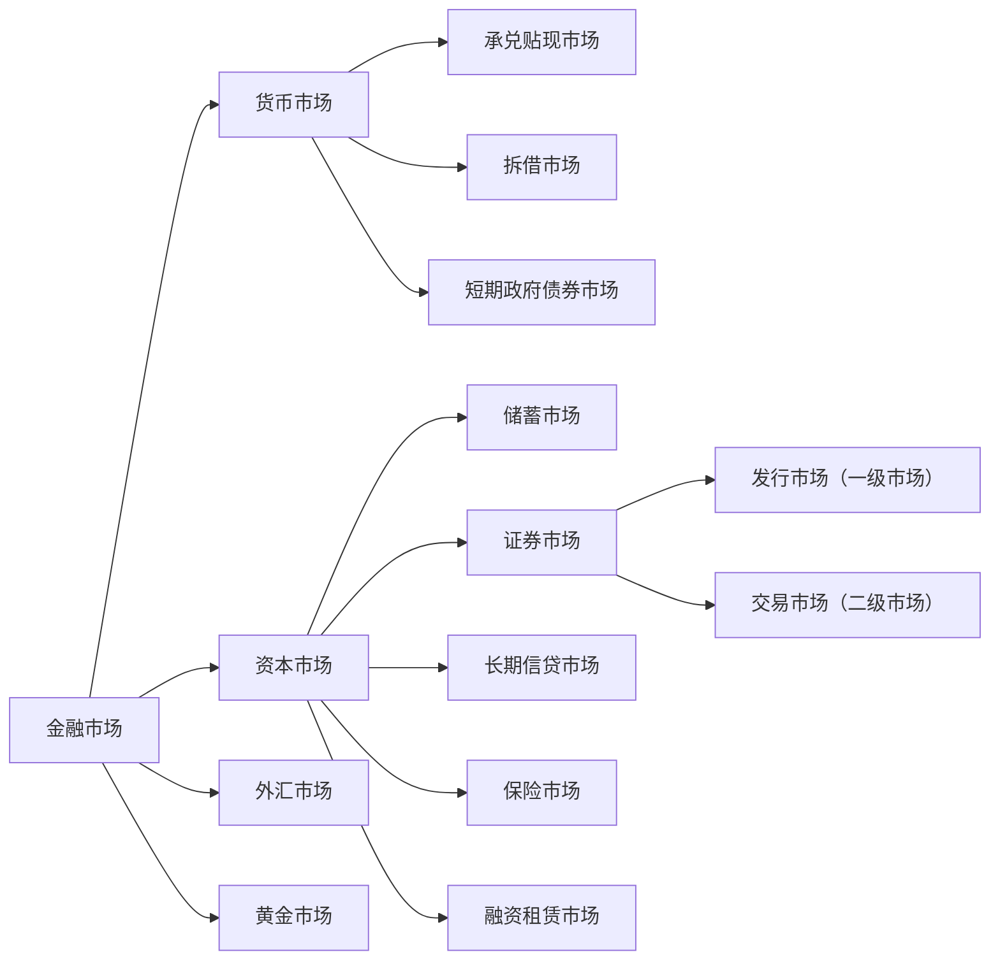

# 1. 证券市场概述
<!-- bilingual-en:start -->
*1. Securities Market Overview*
<!-- bilingual-en:end -->

## 1.1 证券市场的特征
<!-- bilingual-en:start -->
*1.1 Characteristics of Securities Markets*
<!-- bilingual-en:end -->

>[!note] 证券市场
>证券市场是股票、债券、基金和其他金融衍生工 具发行和买卖的场所，是一个高度组织化、集中 进行证券交易的市场，是整个证券市场的核心。 是有价证券、证券功能、财产权利和风险直接交换 的场所
>广义：证券市场指的是所有证券发行和交易的场所。
>狭义上:也是最活跃的证券市场指的是资本证券市场、货币证券市 场和商品证券市场。
><!-- bilingual-en:start -->
>**Securities Market**
>A securities market is a highly organized, centralized venue in which stocks, bonds, funds, and other financial derivatives are issued and traded. It is a core part of the broader financial market and a place where securities, the rights they embody, property claims, and risks are exchanged directly.
>Broadly defined, the securities market comprises every venue where securities are issued or traded.
>In the narrower and more active sense used here, it includes markets for capital-market securities, money-market securities, and commodity securities.
><!-- bilingual-en:end -->

证券市场的基本功能:
融资定价,资本配置,信息传递,机制和监管,
<!-- bilingual-en:start -->
The basic functions of securities markets are financing and pricing, capital allocation, information transmission, market mechanisms, and regulation.
<!-- bilingual-en:end -->

## 1.2 证券市场分类与结构
<!-- bilingual-en:start -->
*1.2 Classification and Structure of Securities Markets*
<!-- bilingual-en:end -->

### 1.2.1 按照功能分类
<!-- bilingual-en:start -->
*1.2.1 Categorized by Function*
<!-- bilingual-en:end -->

1. 一级市场：融资活动，连接资 金需求和资金供给，闲散资金 转化为生产资本。 
2. 二级市场（交易市场）  交易，价格发现，资产配置，晴 雨表
<!-- bilingual-en:start -->
1. primary market: Financing activities connect the demand for funds with their supply, converting idle capital into productive capital.
2. Secondary market (trading market): trading, price discovery, asset allocation, and an economic-barometer function.
<!-- bilingual-en:end -->

联系： 
* 一级市场供给二级市场的品 种 ,决定二级市场的交易规模、结构与速度；
* 二级市场为一级市场投资者 提供变现途径； 
* 二级市场的供求及定价效率 影响一级市场的发行。
<!-- bilingual-en:start -->
Link:
* primary market supplies secondary market with varieties, determining the scale, structure, and pace of secondary market's transactions;
* secondary market provides an exit for primary market investors;
* The efficiency of supply and demand in secondary market and its pricing affects the issuance by primary market.
<!-- bilingual-en:end -->

### 1.2.2 按照上市条件分类
<!-- bilingual-en:start -->
*1.2.2 Categorizing Listings by Listing Conditions*
<!-- bilingual-en:end -->

1. 主板，是资本市场最重要的组成部分，能够反映宏观经济，晴雨表。深圳和上海都有.
		对发行人的营业期限 ，股本、盈利，市值等要求.
		大型成熟企业，规模较大，盈利稳定。
2. 二板市场：创业板,为具有高成长的中小企业和高科技企业提供融资服务。上市条件偏低.
		甚至不要求盈利,只是有专利什么的就行.
		为风险投资资金提供退出通道；
3. 三板市场:全国中小企业股份转让系统.不向公众进行公开募股.
<!-- bilingual-en:start -->
1. The main board is the most crucial component of the capital market, reflecting macroeconomic conditions and serving as a barometer. Both Shenzhen and Shanghai have them.

For issuers, requirements include the duration of operations, share capital, profitability, and market value.

Large, mature companies tend to have substantial size and stable profits.

2. The secondary board, known as the ChiNext Board, provides financing services for high-growth small and medium-sized enterprises (SMEs) and high-tech firms. Listing criteria are relatively lenient.

Even without requiring profitability, they may only need patents or other intellectual property.

It offers an exit route for venture capital funds;

3. The third board, the National Equities Exchange and Quotations (NEEQ), does not conduct public offerings; it operates on a non-public basis.
<!-- bilingual-en:end -->

### 1.2.3 按交易对象不同
<!-- bilingual-en:start -->
*1.2.3 Classification by Instrument Traded*
<!-- bilingual-en:end -->

股票市场； 
债券市场； 
基金市场 
衍生品市场
<!-- bilingual-en:start -->
Stock market;
Bond market;
Funds market;
Derivatives market
<!-- bilingual-en:end -->

### 1.2.4 按照交易场所
<!-- bilingual-en:start -->
*1.2.4 By Trading Venue*
<!-- bilingual-en:end -->

场内交易.有标准的地点和规则.交易标准化产品.
场外交易.交易非标准化产品.
<!-- bilingual-en:start -->
Exchange trading takes place in a standardized location with rules. Standardized products are traded. Over-the-counter (OTC) trading involves non-standardized products.
<!-- bilingual-en:end -->

## 1.3 证券市场发展阶段
<!-- bilingual-en:start -->
*1.3 Stages in the Development of Securities Markets*
<!-- bilingual-en:end -->

1. 自由放任阶段(17世纪初至20世纪20年代末)：1929年10月黑色星期二标志着自由放任的结束.
2. 法制建设阶段(20世纪30年代初至60年代末) ：
	1. 美国：证券法，证券交易法，公共事业控股公司法，信托契约法，投资公司法， 投资顾问法 
	2. 英国：反欺诈投资法，公司法 
	推动了三公，发挥证券市场功能，促进证券市场持续发展。
3. 迅速发展阶段(20世纪70年代以来) ：GDP占比提高，资本市场结构优化，金融衍 生品层出不穷
<!-- bilingual-en:start -->
1. The laissez-faire stage (from the early 17th century to the late 1920s): October 29, 1929, marked the end of laissez-faire.

2. The regulatory stage (from the early 1930s to the late 1960s):
	1. United States: Securities Act, Securities Exchange Act, Public Utility Holding Company Act, Trust Indenture Act, Investment Company Act, Investment Advisers Act
	2. United Kingdom: Fraudulent Investment Act, Companies Act
	These measures promoted fair play and facilitated the continuous development of the market.

3. Rapid Development Stage (since the 1970s): GDP share increased, capital market structures were optimized, and a plethora of financial derivatives emerged.
<!-- bilingual-en:end -->

# 2. 证券市场的参与者
<!-- bilingual-en:start -->
*2. Securities-Market Participants*
<!-- bilingual-en:end -->

## 2.1 证券发行者
<!-- bilingual-en:start -->
*2.1 Issuers of Securities*
<!-- bilingual-en:end -->

### 2.1.1 证券发行者是谁
<!-- bilingual-en:start -->
*2.1.1 Who Issues Securities?*
<!-- bilingual-en:end -->

证券市场发行者是证券市场的资金需求者和证券的供给者
<!-- bilingual-en:start -->
The issuer is the demander of funds and the supplier of securities for securities market.
<!-- bilingual-en:end -->

* 政府:政府债券(国债和地方债)
* 企业:股份有限公司发行债券和股票,有限公司发行债券
* 银行和非银行金融机构:股票或金融债券.
<!-- bilingual-en:start -->
* Government: Government Bonds (Treasury Bonds and Local Bonds)
* Enterprise: Shares or Stocks issued by joint-stock companies, Bonds issued by limited liability companies
* Banks and Non-Bank Financial Institutions: Stocks or Financial Bonds.
<!-- bilingual-en:end -->

国债:
* 早期主要用于弥补财政赤字； 
* 现代，用途一般有： 
	* 提供公共品； 
	* 扩大政府开支，刺激经济增长； 
	* 维护金融市场稳定。
<!-- bilingual-en:start -->
Government Bonds:
* Originally used to offset fiscal deficits;
* Nowadays, purposes generally include:
	+ Provision of public goods;
	+ Expanding government spending, stimulating economic activity (economic growth);
	+ Maintaining financial market stability.
<!-- bilingual-en:end -->

金融债券是金融机构扩大信贷资金来源的手段，一般专款专用， 被用于定向特别贷款。
<!-- bilingual-en:start -->
Financial bonds are a means for financial institutions to expand their source of credit funds, generally used for specific purposes and directed towards targeted special loans.
<!-- bilingual-en:end -->

### 2.1.2 证券发行方式
<!-- bilingual-en:start -->
*2.1.2 Methods of Securities Issuance*
<!-- bilingual-en:end -->

1. 审批制.是完全的计划经济的产物.证监会控制额度,下划至各省市自治区.公司在申请股票发行时需要经过审批的证券发行管理制度， 是完全计划发行的模式，施行额度控制。不够市场化
2. 核准制:审批制后变为核准制.发行委员会的权力空前强大.那拨人贪美了.证监会既当裁判员,又当运动员.爽死了.
3. 注册制:监管机构只看发行人的真实准确性进行审查,不看这个公司有没有投资价值.
<!-- bilingual-en:start -->
1. Quota-based administrative approval system. This was a product of the fully planned economy: the CSRC controlled issuance quotas and allocated them to provinces, municipalities, and autonomous regions. Companies needed administrative approval to issue shares, making it a fully planned model governed by quotas. It was insufficiently market-oriented.
2. Approval system. The quota system was later replaced by an approval system, under which the issuance-review committee acquired exceptionally broad power. In the note's critical phrasing, the CSRC acted as both referee and player, creating strong opportunities for rent-seeking.
3. Registration system. Regulators review whether an issuer's disclosed information is truthful and accurate, rather than judging whether the company has investment value.
<!-- bilingual-en:end -->

## 2.2 证券投资者
<!-- bilingual-en:start -->
*2.2 Securities Investors*
<!-- bilingual-en:end -->

### 2.2.1 机构投资者
<!-- bilingual-en:start -->
*2.2.1 Institutional Investors*
<!-- bilingual-en:end -->

1. 政府机构:
	1. 财政部,各级政府.目的是为了调剂资金余缺和进行宏观调控.
	2. 中央银行:[[Open Market Operations|公开市场操作]]
	3. 国资委:国资持股
2. 企业事业单位:投资 参股、控股某上市公司.
3. 金融机构
	1. 银行:按要求要持有一类资产二类资产
	2. 证券:自营,经济,服务三类业务.自营就是要在市场参与投资
	3. 保险:收到保险金后不能将钱放在哪里,需要拿出去钱滚钱.
	4. 基金机构 主权财富基金.
	5. 合格的境外机构投资者
	6. 其他金融机构
<!-- bilingual-en:start -->
1. Government Institutions:
	1. Ministry of Finance, various levels of government. The purpose is to balance surplus and shortage of funds and conduct macroeconomic regulation.
	2. central bank: [[Open Market Operations|open market operations]]
	3. SASAC: State-owned equity holdings
2. Enterprises and Public Institutions: Invest in or participate in the shares of listed companies.
3. Financial Institutions:
	1. Banks: Must hold certain types of assets and meet specific asset requirements.
		2. Securities firms: three broad businesses—proprietary trading, brokerage, and services. Proprietary trading means investing the firm's own capital in the market.
		3. Insurers: premiums received cannot simply remain idle; they must be invested to generate returns.
	4. Fund institutions: Sovereign wealth funds.
	5. Qualified Foreign Institutional Investors.
	6. Other financial institutions
<!-- bilingual-en:end -->

### 2.2.2 个人投资者
<!-- bilingual-en:start -->
*2.2.2 Individual Investors*
<!-- bilingual-en:end -->

散户
<!-- bilingual-en:start -->
Retail investors.
<!-- bilingual-en:end -->

## 2.3 证券市场中介机构
<!-- bilingual-en:start -->
*2.3 Securities-Market Intermediaries*
<!-- bilingual-en:end -->

为证券发行,交易提供服务的各类机构
1. 证券公司:证券承销、经纪、自营、投资咨询以及购并 （投行）、受托资产管理和基金管理等
2. 证券服务机构:登记结算公司、投资咨询公司、会计师事务 所、律师事务所、资产评估机构和证券信用评 级机构等
<!-- bilingual-en:start -->
Various institutions providing services for securities issuance and trading 
1. Securities Companies: Underwriting, brokerage, proprietary trading, investment consulting, mergers and acquisitions (M&A), as well as asset management and fund management, among others. 
2. Securities Service Providers: Registration and settlement companies, investment advisory firms, accounting firms, law firms, appraisal firms, and securities credit rating agencies, among others.
<!-- bilingual-en:end -->

## 2.4 自律性组织
<!-- bilingual-en:start -->
*2.4 Self-Regulatory Organizations*
<!-- bilingual-en:end -->

### 2.4.1. 证券业协会
<!-- bilingual-en:start -->
*2.4.1. Securities Association*
<!-- bilingual-en:end -->

协助证券监管机构组织会员执行有关法律 维护会员的合法权益，为会员提供信息服务 制定规则 培训
<!-- bilingual-en:start -->
Assist securities regulatory authorities in organizing members to comply with relevant laws, protect members' legal rights and interests, provide information services, and formulate rules and train members.
<!-- bilingual-en:end -->

### 2.4.2. 证券交易所 
<!-- bilingual-en:start -->
*2.4.2. Securities Exchange*
<!-- bilingual-en:end -->

>[!note] 证券交易所
>是依据规定条件设立的，为证券的集中和有组织 的交易提供场所、设施，履行国家有关法律、法 规、政策规定的职责，实行自律性管理的法人
><!-- bilingual-en:start -->
>**Stock Exchange**
>
>is a body established under specified conditions to provide a centralized and organized venue and facilities for the trading of securities, fulfilling the duties prescribed by relevant laws, regulations, and policies of the state, and exercising self-regulatory management as a legal entity.
><!-- bilingual-en:end -->

#### 2.4.2.1 按组织形式分类
<!-- bilingual-en:start -->
*2.4.2.1 Classified by Organizational Form*
<!-- bilingual-en:end -->

>[!note] 会员制证券交易所
>会员制证券交易所是指由符合一定条件的会员自愿组成， 是不以营利为目的的法人团体。
><!-- bilingual-en:start -->
>Membership Stock Exchange
>A Membership Stock Exchange is a legal entity group composed of members who meet certain criteria, established for non-profit purposes.
><!-- bilingual-en:end -->

* 优点
	* 会员制证券交易所以自 律、自治管理为基础，因而收取费用较低，上市公司缴纳的上 市初费、上市月费较低；不存在破产的风险
* 缺点
	* 由于会员本身就是证券交易的买卖者，证券交易的 不公正性难以避免；
	* 证券交易所的管理者与参与者合一，不 利于交易所的自身管理，也不利于国家对其的统一管理；
	* 由 于该种证券交易所的买卖只限于该交易所的会员，事实上 形成了垄断性，不利于形成公平价格。
<!-- bilingual-en:start -->
* Advantages
	* The membership-based securities exchange operates on a self-regulatory, self-governance basis, thus charging lower fees; initial listing fees and monthly fees for listed companies are also lower; there is no risk of bankruptcy.
* Disadvantages
	* Since members themselves are both buyers and sellers in securities transactions, unfairness in these transactions cannot be avoided;
	* The managers and participants of the securities exchange are one and the same, which is disadvantageous to the internal management of the exchange and to unified management by the state;
	* Due to the fact that trading in this type of securities exchange is limited to members of the exchange, it actually fosters monopolistic tendencies, which is detrimental to the formation of fair prices.
<!-- bilingual-en:end -->

>[!note] 公司制证券交易所 
>指以盈利为目的，由银行、证券公司、投资信托机构及各 类公营、民营公司等共同投资入股建立起来的法人公司
><!-- bilingual-en:start -->
>**Corporation-Run Securities Exchange**
>refers to a legal entity company established through joint investment by banks, securities firms, investment trust institutions, and various public and private companies all for the purpose of profit.
><!-- bilingual-en:end -->

* 优点
	* 经营者与交易者两者分离，有助于交易的公正进行；
	* 对交易的安全性提供担保， 有利于证券交易所的发展；
	* 由于有利润，所以能提供先进、完备的证券市场设备，可以保证证券交易的顺利进 行。
* 缺点:
	* 由于它以盈利为目的，公司制会员势必要扩大 人数，人为助长行情的波动，从而助长过度投机交易；
	* 要 收取较高的上市费和佣金，交易者为避免过高的交易成 本，会到场外市场进行交易；
	* 有可能破产，风险较大。
<!-- bilingual-en:start -->
* Advantages:
	* Separating operators from traders helps ensure fairness in transactions;
	* Providing security guarantees for transactions benefits the development of stock exchanges;
	* With profits, they can provide advanced and comprehensive securities market equipment, ensuring smooth transactions.
* Disadvantages:
	* As it operates for profit, company members will likely increase their numbers, artificially exacerbating market fluctuations and encouraging excessive speculative trading;
	* They charge high listing fees and commissions, making transaction costs prohibitive for traders who may opt to trade on over-the-counter markets instead;
	* There is a risk of bankruptcy, posing significant risks.
<!-- bilingual-en:end -->

>[!note] 老钟的证券交易所
>深圳 上海证券交易所：是按《证券交易所管理 办法》规定条件设立，不以营利为目的，为证券的集中和 有组织的交易提供场所、设施，履行国家有关法律、法 规、规章、政策规定的职责，实行自律性管理的会员制事 业法人。它由中国证券监督管理委员会监管。
><!-- bilingual-en:start -->
>**Lao Zhong's Note on Stock Exchanges**
>Shenzhen and Shanghai Stock Exchanges: Established according to the "Management Measures for Stock Exchanges," they are non-profit institutions providing a venue and facilities for the centralized and organized trading of securities. They fulfill the duties prescribed by relevant laws, regulations, rules, and policies of the state, and operate under self-regulation as a membership-based non-profit legal entity. They are regulated by the China Securities Regulatory Commission (CSRC).
><!-- bilingual-en:end -->

上海和深圳会员制.北京公司制
<!-- bilingual-en:start -->
Shanghai and Shenzhen membership-based. Beijing company-based.
<!-- bilingual-en:end -->

#### 2.4.2.2 证券交易所功能
<!-- bilingual-en:start -->
*2.4.2.2 Functions of Stock Exchanges*
<!-- bilingual-en:end -->

1. 为交易双方提供了一个完备、公开的交易场所 
2. 形成较为合理的价格 
3. 引导社会资金的合理流动和资源的合理配置 
4. 及时传递上市公司状况、随时公布市场行情信息
5. 对整个证券市场进行一线监控
<!-- bilingual-en:start -->
1. Provides a comprehensive, transparent marketplace for both parties involved in transactions.
2. Forms a relatively reasonable price.
3. Guides the rational flow of social capital and the rational allocation of resources.
4. Timely disseminates information on company conditions and promptly publishes market trend updates.
5. Monitors the securities market system in real-time.
<!-- bilingual-en:end -->

#### 2.4.2.3 证券交易所的运行系统
<!-- bilingual-en:start -->
*2.4.2.3 Operational System of Stock Exchanges*
<!-- bilingual-en:end -->

1. 交易系统
	1. 有形席位属于一种场内报盘 
	2. 无形席位是属于一种场外报盘
2. 结算系统
	1. 指对证券交易进行结算、交收和过户的系统.我国使用T+1结算系统.买入第二天才能卖出.
3. 信息系统
	1. 对每日证券交易的行情信息和市场信息进行实时发布
4. 检查系统
	1. 负责证券交易所对市场进行实时监控的职责 行情监控、交易监控、证券监控、资金监控
<!-- bilingual-en:start -->
1. Trading System
	1. An executed seat is a floor-based submission.
	2. An unexecuted seat is an off-floor submission.
2. Settlement System
	1. Refers to a system for settling, clearing, and transferring securities transactions. In China, the T+1 settlement system is used. Buyers can only sell on the second day after purchase.
3. Information System
	1. Publishes real-time information on daily securities trading market conditions.
4. Monitoring System
	1. Responsible for real-time monitoring of the market by the stock exchange. This includes surveillance of market data, transaction activities, securities holdings, and fund flows.
<!-- bilingual-en:end -->

#### 2.4.2.4 交易所成员
<!-- bilingual-en:start -->
*2.4.2.4 Exchange Members*
<!-- bilingual-en:end -->

1. 会员。股票经纪人，证券自营商和专业会员 
	1. 股票经纪人：专门帮助客户进行股票交易并收取佣金的经纪人 
	2. 证券自营商：直接经营人和零数经营商 
	3. 专业会员：专门买卖一种或多种股票的交易所会员。交易对象为其 他经纪人。 
2. 交易人：特种经纪人和场内经纪人 
	1. 特种经纪人：充当其他经纪人的代理人；参与交易，轧平价差；大宗 交易中介人；负责区域交易；提供信息。 
	2. 场内经纪人：佣金经纪人和独立经纪人 
	3. 独立经纪人：独立个体，为特定公司完成指定交易。
<!-- bilingual-en:start -->
1. Members. Stockbrokers, securities merchants, and professional members

   1. Stockbroker: A broker who assists clients in trading stocks and collects commissions.

   2. Securities Merchant: Direct operators and small account operators.

   3. Professional Member: An exchange member specializing in buying and selling one or more types of stocks. The trading objects are other brokers.

2. Market Participants: Special Brokers and Floor Brokers

   1. Special Broker: Acts as an agent for other brokers; participates in transactions to close price differences; intermediaries for large-scale trades; responsible for regional trades; provides information.

   2. Floor Broker: Commission brokers and independent brokers.

   3. Independent Broker: An individual operating independently to complete specific transactions for a particular company.
<!-- bilingual-en:end -->

客户与经纪人关系： 
（1）委托代理关系 
（2）债务债权关系（信用交易） 
（3）抵押关系（融资融券） 
（4）信托关系
<!-- bilingual-en:start -->
Customer-Broker Relationship:

(1) Agency Relationship

(2) Debt-Principal Relationship (Credit Transactions)

(3) Mortgage Relationship (Futures and Securities Lending)

(4) Trust Relationship
<!-- bilingual-en:end -->

### 2.4.3 场外交易场所
<!-- bilingual-en:start -->
*2.4.3 Off-exchange Trading Facilities*
<!-- bilingual-en:end -->

是在证券交易所之外进行证券交易的场所。
<!-- bilingual-en:start -->
"is a place for trading securities outside of stock exchanges."
<!-- bilingual-en:end -->

特点： 
* 无固定的交易场所和统一的交易制度。 
* 电子交易系统的发展导致和证券交易所的物理界限逐步消失 
* 转化为风险分层管理的概念。 
<!-- bilingual-en:start -->
Features:
* No fixed trading venue or unified trading system.
* The development of electronic trading systems has led to a gradual disappearance of physical boundaries between them and stock exchanges.
* Risk stratification management has been transformed into a concept.
<!-- bilingual-en:end -->

功能： 
* 拓宽融资渠道，改善中小企业融资环境。 
* 为非上市证券提供转让场所； 
* 提供风险分层的金融资产管理渠道。 
<!-- bilingual-en:start -->
Functions:
- Broaden funding channels and improve the financing environment for small and medium-sized enterprises (SMEs).
- Provide a trading venue for unlisted securities;
- Offer financial asset management channels with tiered risk levels.
<!-- bilingual-en:end -->

我国场外市场：
* 银行间债券市场；
* 中小企业股份转让系统；
* 债券柜台交易
<!-- bilingual-en:start -->
China's Over-the-Counter Market:
* Interbank Bond Market;
* System for the Transfer of Shares by Small and Medium Enterprises;
* Counter Trading of Bonds.
<!-- bilingual-en:end -->

## 2.5证券监管机构
<!-- bilingual-en:start -->
*2.5 Securities Regulatory Authorities*
<!-- bilingual-en:end -->

* 负责行业性法规的起草 
* 负责监督有关法律法规的执行 
* 负责保护投资者的合法权益 
* 对相关机构的行为实施全面监管
<!-- bilingual-en:start -->
* responsible for drafting industry-specific regulations
* responsible for overseeing the enforcement of relevant laws and regulations
* responsible for protecting investors' legal rights and interests
* responsible for comprehensive oversight of the actions of relevant institutions
<!-- bilingual-en:end -->

# 3. 股票价格指数
<!-- bilingual-en:start -->
*3. Stock Price Index*
<!-- bilingual-en:end -->

## 3.1 股票价格指数
<!-- bilingual-en:start -->
*3.1 Stock Price Index*
<!-- bilingual-en:end -->

>[!note] 股票价格指数 
>是指由金融机构编制的通过对股票市场上一些有代表性的公司发行的股 票价格进行平均计算和动态对比后得出的数值。股票价格指数是衡量证 券市场整体变动方向和幅度的动态相对数，也是投资者投资决策的依据 之一。
><!-- bilingual-en:start -->
>Stock Price Index refers to a numerical value derived from averaging and dynamically comparing the prices of a set of representative stocks on the stock market, as compiled by financial institutions. A Stock Price Index is a dynamic relative measure that reflects the overall direction and magnitude of changes in the securities market, serving as one of the bases for investors' investment decisions.
><!-- bilingual-en:end -->

### 3.1.2股票价格指数的计算
<!-- bilingual-en:start -->
*3.1.2 Calculation of Stock Price Indexes*
<!-- bilingual-en:end -->

#### 3.1.2.1 股价平均数计算
<!-- bilingual-en:start -->
*3.1.2.1 Calculation of Stock Price Indexes*
<!-- bilingual-en:end -->

##### 1. 股价算数平均数
<!-- bilingual-en:start -->
*1. Arithmetic Mean Stock Price*
<!-- bilingual-en:end -->

简单算平均
<!-- bilingual-en:start -->
Simple Average
<!-- bilingual-en:end -->

##### 2. 股价加权平均数
<!-- bilingual-en:start -->
*2. Price-Weighted Average Stock Price*
<!-- bilingual-en:end -->

乘上发行量或成交量算平均
<!-- bilingual-en:start -->
Calculate the average of issuance volume or trading volume.
<!-- bilingual-en:end -->

##### 3. 股价修正平均数
<!-- bilingual-en:start -->
*3. Adjusted Stock Price Moving Average*
<!-- bilingual-en:end -->

为克服拆股、增发后平均数发生不合理下降，对原数值进行修正。一般采用两种方 法：
<!-- bilingual-en:start -->
To overcome the unreasonable decline in the average due to stock splits and additional issuances, the original values are typically corrected using two methods:
<!-- bilingual-en:end -->

1. 调整除数：即把原来的除数调整为新除数。给的例子有点神经,没看懂.
2. 调整股价： 即将拆股后的股价还原成拆股前的股价.
<!-- bilingual-en:start -->
1. Adjusting the Divisor: This means adjusting the original divisor to a new one. The example given seems a bit off, I'm not sure what it's trying to convey.
2. Adjusting the Stock Price: This involves restoring the stock price to its pre-split value after a stock split has occurred.
<!-- bilingual-en:end -->

总之就是保证拆前拆后平均数一致.
<!-- bilingual-en:start -->
In essence, it ensures that the average before and after the disassembly is consistent.
<!-- bilingual-en:end -->

#### 3.1.2.2 股价指数的计算
<!-- bilingual-en:start -->
*3.1.2.2 Calculation of Stock Price Indexes*
<!-- bilingual-en:end -->

##### 1. 简单算数平均法
<!-- bilingual-en:start -->
*1. Simple Arithmetic Mean Method*
<!-- bilingual-en:end -->

如题.将每个股价的指数算出来,然后对这些指数进行算术平均
<!-- bilingual-en:start -->
As such, calculate the index for each stock price, then take the arithmetic mean of these indices.
<!-- bilingual-en:end -->

##### 2. 综合平均法
<!-- bilingual-en:start -->
*2. Comprehensive Average Method*
<!-- bilingual-en:end -->

分别将基期和报告期的股价加总后，用报告期股价总额与基期股价总额相比较。
<!-- bilingual-en:start -->
Add the stock prices for both the base period and the reporting period, then compare the stock price total of the reporting period to that of the base period.
<!-- bilingual-en:end -->

##### 3. 几何平均法
<!-- bilingual-en:start -->
*3. Geometric Mean Method*
<!-- bilingual-en:end -->

该方法分别把基期和报告期股价相乘后开 n次方，再用报告期与基期相比。
<!-- bilingual-en:start -->
This method multiplies the base-period and reporting-period stock prices, takes the nth root of the product, and then compares the reporting period to the base period.
<!-- bilingual-en:end -->

##### 4. 加权综合法
<!-- bilingual-en:start -->
*4. Weighted Comprehensive Method*
<!-- bilingual-en:end -->

给两边都乘上交易量或发行量作为权重.根据乘的东西不同分为:
1. 拉式:乘基期交易量
2. 派式:乘报告期交易量
3. 报告期发行量没有名字.
<!-- bilingual-en:start -->
Multiply both sides by either transaction volume or issue volume as weights. According to what is being multiplied, it can be classified as:
1. Pulling: Multiplying by base period transaction volume
2. Pushing: Multiplying by reported period transaction volume
3. Reported period issue volume does not have a name.
<!-- bilingual-en:end -->

##### 5. 加权几何平均
<!-- bilingual-en:start -->
*5. Weighted Geometric Mean*
<!-- bilingual-en:end -->

如题.
<!-- bilingual-en:start -->
As stated in the question.
<!-- bilingual-en:end -->

#### 3.1.2.3 股票价格平均数的计算
<!-- bilingual-en:start -->
*3.1.2.3 Calculation of Stock Price Indexes*
<!-- bilingual-en:end -->

这个算的是同一支股票的价格.
<!-- bilingual-en:start -->
This calculation pertains to the price of the same stock.
<!-- bilingual-en:end -->

##### 1. 简单算术股价平均数
<!-- bilingual-en:start -->
*1. Simple Arithmetic Stock Price Mean*
<!-- bilingual-en:end -->

各样本股的平均数.股本变化时失去真实性,连续性和可比性.
<!-- bilingual-en:start -->
The mean of each sample stock loses its authenticity, continuity, and comparability when the capitalization changes.
<!-- bilingual-en:end -->

##### 2. 加权股价平均数
<!-- bilingual-en:start -->
*2. Weighted Price Average*
<!-- bilingual-en:end -->

将各样本股票的发行量或成交量作为权数
<!-- bilingual-en:start -->
Treat the issue quantity or trading volume of each sample stock as weights.
<!-- bilingual-en:end -->

### 3.1.3 股票价格指数的编制步骤
<!-- bilingual-en:start -->
*3.1.3 Steps in Compiling a Stock Price Index*
<!-- bilingual-en:end -->

1. 选择样本股(要有代表性)
2. 选定基期(有代表性的日期)
3. 计算,计算计算期的平均股价,并进行修正
4. 指数化.
<!-- bilingual-en:start -->
1. Select sample stocks (with representativeness).
2. Choose a base period (with representativeness).
3. Compute the average stock price for the current period and adjust it.
4. Index it.
<!-- bilingual-en:end -->

## 3.2 国际主要的股票价格指数
<!-- bilingual-en:start -->
*3.2 Major Stock Price Indices in International Markets*
<!-- bilingual-en:end -->

### 3.2.1 道琼斯股票价格指数
<!-- bilingual-en:start -->
*3.2.1 Dow Jones Stock Price Index*
<!-- bilingual-en:end -->

基期:1928.10.1   ;基期指数:200
<!-- bilingual-en:start -->
Base Period: October 1, 1928; Base Period Index: 200
<!-- bilingual-en:end -->

包括:工业股价平均数 运输业股价平均数 公用事业股价平均数 股价综合平均数 公正市价指数
<!-- bilingual-en:start -->
Including: Industrial Stock Average Transportation Stock Average Utility Stock Average Composite Price Index Fair Market Index
<!-- bilingual-en:end -->

### 3.2.2. 伦敦《金融时报》股票价格指数
<!-- bilingual-en:start -->
*3.2.2. London Financial Times Stock Price Index*
<!-- bilingual-en:end -->

《金融时报》工业股指数 基期：1935年7月 基数：100 
100种股票交易指数 基期：1984年1月3日 基数：1000 
综合精算股票指数 基期：1962年4月10日 基数：100
<!-- bilingual-en:start -->
Financial Times Industrial Index Base Period: July 1935, Base Number: 100
Index of 100 Stocks for Trading Purposes Base Period: January 3, 1984, Base Number: 1000
General Actuarial Stock Index Base Period: April 10, 1962, Base Number: 100
<!-- bilingual-en:end -->

### 3.2.3 日经225股价指数
<!-- bilingual-en:start -->
*3.2.3 Nikkei 225 Stock Index*
<!-- bilingual-en:end -->

东证修正平均股价：1950年9月开始编制 
日经225种股价指数 基数：176.21日元（1950年）
日经500种股价指数 1982年1月4日起开始编制
<!-- bilingual-en:start -->
Tokyo Stock Exchange Corrected Average Share Price: began compiling in September 1950
Nikkei 225 Stock Average Index base: 176.21 yen (1950)
Nikkei 500 Stock Average Index: began compiling on January 4, 1982
<!-- bilingual-en:end -->

### 3.2.4 NASDAQ 纳指
<!-- bilingual-en:start -->
*3.2.4 NASDAQ: The Nasdaq*
<!-- bilingual-en:end -->

基期:1971.2.5 基数:100 所有的上市的普通股为基础计算
<!-- bilingual-en:start -->
Base Period: February 5, 1971 Base Index: 100 All listed common stocks are used for the calculation.
<!-- bilingual-en:end -->

## 3.3 我国主要的股票价格指数
<!-- bilingual-en:start -->
*3.3 Main Stock Price Indices in China*
<!-- bilingual-en:end -->

### 3.3.1 上证综合指数
<!-- bilingual-en:start -->
*3.3.1 Shanghai Composite Index*
<!-- bilingual-en:end -->

基期1990.12.19 基数100 使用加权平均法计算.
<!-- bilingual-en:start -->
Base period: December 19, 1990; base value: 100 Calculate using the weighted average method.
<!-- bilingual-en:end -->

新股上市等结构性变化出现的时候,对于基期进行修改.新股将按照总股的变动反推回去并加入原本的基期中.
<!-- bilingual-en:start -->
Structural changes such as new share listings occur, at which point the base period is revised. New shares will be back-calculated to account for the total stock change and then reintegrated into the original base period.
<!-- bilingual-en:end -->

### 3.3.2 深证综合指数
<!-- bilingual-en:start -->
*3.3.2 Shenzhen Composite Index*
<!-- bilingual-en:end -->

全部A.B股.
A股基期：1991年4月3日 基期指数：100 
B股基期：1992年2月28日
<!-- bilingual-en:start -->
All A and B shares.

Base date for A-shares: April 3, 1991; Base index: 100

Base date for B-shares: February 28, 1992
<!-- bilingual-en:end -->

#### 3.3.3 上证成分股指数
<!-- bilingual-en:start -->
*3.3.3 SSE Component Stock Index*
<!-- bilingual-en:end -->

对原上证30指数进行调整和更名产生.发布：2002年7月1日起正式发布 基点：3299.05
<!-- bilingual-en:start -->
Adjustment and renaming of the original SSE 30 Index took place. Release: Effective July 1, 2002, it was officially released. Base point: 3299.05.
<!-- bilingual-en:end -->

### 3.3.4 上证50指数
<!-- bilingual-en:start -->
*3.3.4 SSE 50 Index*
<!-- bilingual-en:end -->

基期：2003年12月31日 基期指数：1000点
<!-- bilingual-en:start -->
Base Period: December 31, 2003 Base Index: 1000 points
<!-- bilingual-en:end -->

### 3.3.5 深圳成分股指数
<!-- bilingual-en:start -->
*3.3.5 Shenzhen Component Stock Index*
<!-- bilingual-en:end -->

基期：1994年7月20日 基期指数：1000点
<!-- bilingual-en:start -->
Base Period: July 20, 1994 Base Index: 1000 points
<!-- bilingual-en:end -->

### 3.3.6 深证100指数
<!-- bilingual-en:start -->
*3.3.6 Shenzhen 100 Index*
<!-- bilingual-en:end -->

基期：2002年12月31日 基期指数：1000点
<!-- bilingual-en:start -->
Base Period: December 31, 2002 Base Index: 1000 points
<!-- bilingual-en:end -->

### 3.3.7 沪深300指数
<!-- bilingual-en:start -->
*3.3.7 CSI 300 Index*
<!-- bilingual-en:end -->

深121,沪179.
基期：2004年12月31日 基期指数：1000点
<!-- bilingual-en:start -->
Shenzhen contributes 121 constituent stocks and Shanghai 179. Base period: December 31, 2004; base index: 1000 points.
<!-- bilingual-en:end -->

## 3.4 债券价格指数
<!-- bilingual-en:start -->
*3.4 Bond Price Index*
<!-- bilingual-en:end -->

和股票价格指数是一个道理.
<!-- bilingual-en:start -->
And stock price indices work on the same principle.
<!-- bilingual-en:end -->

需要考虑:
1. 市值权重； 
2. 排除低年限债券，浮动利率债券； 
3. 考虑利息收入的再投资； 
4. 债券定价：市场定价(适合交易量大,流动性强的)，交易者定价，模型定价(现金流贴现等)。
<!-- bilingual-en:start -->
Consider the following:
1. Market value weight;
2. Excluding low-duration bonds and floating-rate bonds;
3. Considering reinvestment of interest income;
4. Bond pricing: Market pricing (suitable for highly traded and liquid securities), trader pricing, model pricing (such as discounted cash flow).
<!-- bilingual-en:end -->

中国债券价格指数:
1.  债券指数 
2. 中银银债指数 
3. 上交所国债指数 
4. 同业拆借中心银债指数 
5. 中信债券指数
<!-- bilingual-en:start -->
Chinese Bond Price Index:

1. Bond Index
2. Bank of China Bond Index
3. SSE Government Bond Index
4. Interbank Lending Center Bond Index
5. CICC Bond Index
<!-- bilingual-en:end -->

## 3.5 证券市场监管
<!-- bilingual-en:start -->
*3.5 Securities-Market Regulation*
<!-- bilingual-en:end -->

监管目标：保护投资者；保证证券市场的公平、效率和透明；降低系统性风险
<!-- bilingual-en:start -->
Regulatory Objectives: Protecting Investors; Ensuring Fairness, Efficiency, and Transparency in the Market; Reducing Risks to Investors
<!-- bilingual-en:end -->

监管内容： 
1. 信息披露管理 
2. 金融行为监管 
3. 金融机构监管 
4. 外国参与者监管 
5. 银行与货币监管
<!-- bilingual-en:start -->
Regulatory Content:
1. Disclosure Management
2. Financial Conduct Regulation
3. Prudential Regulation of Financial Institutions
4. Regulation of Foreign Participants
5. Regulation of Banks and Money Markets
<!-- bilingual-en:end -->

# 4. 证券交易程序
<!-- bilingual-en:start -->
*4. Securities Trading Procedures*
<!-- bilingual-en:end -->

## 4.1 开户
<!-- bilingual-en:start -->
*4.1 Account Opening*
<!-- bilingual-en:end -->

投资者开立证券账户与资金账户（实名、适当性评估）。~~略~~
<!-- bilingual-en:start -->
Investors open securities accounts and capital accounts (on a real-name basis, with suitability assessments). ~~Skipped~~
<!-- bilingual-en:end -->

## 4.2 委托
<!-- bilingual-en:start -->
*4.2 Order Placement*
<!-- bilingual-en:end -->

通过券商提交买卖指令（含价格、数量、期限等要素）。~~略~~
<!-- bilingual-en:start -->
Submit buy or sell instructions (including price, quantity, duration, etc.) through a broker. ~~Skipped~~
<!-- bilingual-en:end -->

## 4.3 竞价成交
<!-- bilingual-en:start -->
*4.3 Auction Transactions*
<!-- bilingual-en:end -->

竞价机制;
1. 价格优先,买的越高越优先,卖的越低越优先
2. 时间优先,
3. 市价优先.
4. 客户优先,基本代表数量优先,数量优先
<!-- bilingual-en:start -->
Sealed-bid mechanism;
1. Price priority, the higher the bid, the higher the priority; the lower the offer, the higher the priority.
2. Time priority,
3. Market price priority.
4. Customer priority, generally representing quantity priority, with quantity priority.
<!-- bilingual-en:end -->

对于中小股东来讲,不是很友好.
<!-- bilingual-en:start -->
For minority shareholders, not very friendly.
<!-- bilingual-en:end -->

竞价方式:
开盘的时候集合竞价.随报随撤.9:20之前可以撤回
交易的时候进行连续竞价.
<!-- bilingual-en:start -->
Opening bidding:
At the start, call auction. Bids can be withdrawn at any time. Withdrawals before 9:20 are allowed.
Trading:
During trading, continuous auction.
<!-- bilingual-en:end -->

原则:
* 在有效价格范围内选取使所有有效委托产生最大成交 量的价位 进行集中撮合处理
* 最高买入价与最低卖出价价位相同，以该价格为成交 价
* 买入价格高于即时的最低卖出价格时，以即时的最低 卖出价格为成交价 
* 卖出价格低于即时的最高买入价格时，以即时的最高 买入价格为成交价
<!-- bilingual-en:start -->
Principles:
* In the effective price range, select the price that makes all effective commissions generate maximum trading volume for centralized matching processing
* The highest bid price is the same as the lowest ask price, and this price is the transaction price.
* When the bid price is higher than the current lowest ask price, the current lowest ask price is the transaction price.
* When the sell price is lower than the immediate highest bid price, the immediate highest bid price is the transaction price.
<!-- bilingual-en:end -->

## 4.4 结算
<!-- bilingual-en:start -->
*4.4 Settlement*
<!-- bilingual-en:end -->

成交后进行清算与资金/证券交收（T+1/T+2 规则视市场）。~~略~~
<!-- bilingual-en:start -->
Clearing and settlement shall follow after the transaction (T+1/T+2 rules vary by market). ~~Skipped~~
<!-- bilingual-en:end -->

## 4.5 登记过户
<!-- bilingual-en:start -->
*4.5 Registration and Transfer*
<!-- bilingual-en:end -->

证券过户至买方名下并记入持有人账户。~~略~~
<!-- bilingual-en:start -->
Transfer securities to the buyer’s name and record them in the holder’s account. ~~Skipped~~
<!-- bilingual-en:end -->

# 5. 证券交易方式
<!-- bilingual-en:start -->
*5. Trading Methods in Securities Markets*
<!-- bilingual-en:end -->

竞价、做市、协议/大宗等方式并存，具体依交易场所规则。~~略~~
<!-- bilingual-en:start -->
Bid, market-making, and negotiated/direct transactions coexist, depending on the rules of the trading venue. ~~Skipped~~
<!-- bilingual-en:end -->
