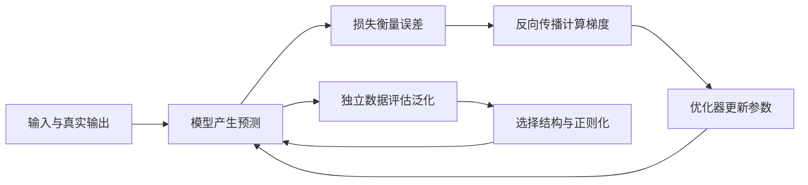

---
aliases:
  - Understanding Deep Learning 教材评估
  - UDL 全书学习路线
tags:
  - deep-learning
  - reading-guide
source_url: https://udlbook.github.io/udlbook/
reviewed: 2026-10-05
---

# Understanding Deep Learning：教材评估与全书导读
<!-- bilingual-en:start -->
*A textbook assessment and a connected route through Understanding Deep Learning*
<!-- bilingual-en:end -->

**结论：适合作为第一次系统学习深度学习的主教材，前提是把数学衔接和代码练习一起安排。完全没有微积分、线性代数、概率和 Python 基础的读者，需要额外的入门教学。** 本导读采用“原理以 UDL 为主、实践用官方 Notebook 和 D2L 补足”的路线。
<!-- bilingual-en:start -->
**This is a suitable main text for a first systematic course in deep learning, provided that mathematical preparation and coding practice are built into the course. Readers new to calculus, linear algebra, probability, and Python need additional introductory teaching.** The route below uses UDL for concepts, supported by its official notebooks and D2L for implementation.
<!-- bilingual-en:end -->

- [[03_Computer_Science/09_ST456_Deep_Learning/00_课程总览|课程入口]]
- [[03_Computer_Science/09_ST456_Deep_Learning/2026_Course_Materials/09_Books/00_书籍索引|本课程书籍]]
- [[UnderstandingDeepLearning_02_09_26_C.pdf|官方完整 PDF]] · [[UDL_Answer_Booklet_Students.pdf|学生答案]] · [[UDL_Errata.pdf|勘误]]
- [[03_Computer_Science/09_ST456_Deep_Learning/2026_Course_Materials/09_Books/Prince_Understanding_Deep_Learning/00_资料说明|本地配套资料与使用说明]]

## 版本与评估依据
<!-- bilingual-en:start -->
*Version and evidence*
<!-- bilingual-en:end -->

作者 Simon J. D. Prince，MIT Press。2026-10-05 核对作者官网后取得当前链接的完整 PDF：发布版本 **v5.0.3，2026-02-09**，封面日期为 2026-02-08，共 **541 个 PDF 页面**，包含 21 章、附录 A–C、参考文献和索引。GitHub 将该发布标为第五次印刷修订；这是官网电子文件的版本信息。
<!-- bilingual-en:start -->
The author is Simon J. D. Prince and the publisher is MIT Press. The complete PDF linked by the official website was checked on 5 October 2026: **release v5.0.3, dated 9 February 2026**, with a cover date of 8 February. Its **541 PDF pages** include 21 chapters, appendices A–C, references, and an index. GitHub describes the release as a fifth-printing revision; these details identify the downloaded electronic file.
<!-- bilingual-en:end -->

本次评估覆盖前言、全部章节的目录与开篇／总结，并重点抽查第 2–7、12、17–18 章的教学衔接、数学附录、基础 Notebook、学生答案说明与勘误。已目视检查线性回归、反向传播和注意力正文样页。下文的难度、学习顺序、过关任务与工时是**教学判断**，不代表作者的承诺、逐题验算结果或 ST456 的正式教学大纲。
<!-- bilingual-en:start -->
The assessment covers the preface, the complete chapter structure, chapter openings and summaries, and closer checks of the transitions in Chapters 2–7, 12, and 17–18. It also examines the mathematics appendices, the introductory notebook, the student-answer instructions, and the errata. Representative regression, backpropagation, and attention pages were visually inspected. Difficulty ratings, sequencing, practice tasks, and time estimates below are **teaching judgments**, rather than author guarantees, a verification of every exercise, or the official ST456 syllabus.
<!-- bilingual-en:end -->

## 它适合怎样的初学者
<!-- bilingual-en:start -->
*Which beginners can use it?*
<!-- bilingual-en:end -->

前言明确把前半本的读者定位为有入门线性代数、微积分和概率基础的定量专业二年级本科生；生成模型与强化学习部分要求更多概率和微积分。它从头介绍机器学习概念，但不会从头建立所有数学与编程能力。附录 B 的数学内容约 9 个印刷页，更适合回顾和查阅；例如 B.5 开头直接假设读者已经熟悉导数。依据：前言，PDF 第 11 页；附录 B，印刷页 440–448。
<!-- bilingual-en:start -->
The preface targets second-year undergraduates in quantitative subjects who know introductory linear algebra, calculus, and probability. Generative models and reinforcement learning require more probability and calculus. Machine-learning concepts are introduced from the beginning, while the necessary mathematical and programming skills are largely assumed. Appendix B devotes roughly nine printed pages to mathematics and is better suited to review and reference; B.5 explicitly assumes familiarity with derivatives. Evidence: the preface on PDF page 11 and Appendix B on printed pages 440–448.
<!-- bilingual-en:end -->

| 起点 | 可行性判断 | 建议的进入方式 |
|---|---|---|
| 没学过机器学习，能理解函数、基本求导、矩阵与概率 | 很适合作为主线 | 从第 1–2 章开始，遇到具体缺口再补 |
| 只有高中数学，大学数学陌生 | 带着补基础可行，独自顺读容易在第 5–7 章停住 | 先建立函数、向量与变化率直觉；概率在第 5 章前补 |
| 数学与 Python 都从零开始 | 可以把本书设为长期主线，起点要放在预备单元 | 将数学、代码和深度学习分成小步，允许先用交互图或手算理解 |

<!-- bilingual-en:start -->
| Starting point | Assessment | Entry route |
|---|---|---|
| New to machine learning; comfortable with functions, basic derivatives, matrices, and probability | A strong fit as the main text | Start with Chapters 1–2 and address specific gaps as they arise |
| High-school mathematics only | Feasible with support; Chapters 5–7 are likely obstacles to independent reading | Build intuition for functions, vectors, and rates of change; add probability before Chapter 5 |
| New to both mathematics and Python | Feasible as a longer-term learning spine, starting with preparation | Teach mathematical ideas, code, and deep learning in small connected steps; use interactive figures or hand calculations first |
<!-- bilingual-en:end -->

## 教材质量与使用边界
<!-- bilingual-en:start -->
*Strengths and limits*
<!-- bilingual-en:end -->

| 方面 | 具体依据 | 对学习方式的影响 |
|---|---|---|
| 解释与图示 | 第 2 章从直线拟合讲模型与损失，第 3–4 章用 ReLU 和函数复合解释网络 | 适合先看图、动参数，再读公式；可避免只背网络名称 |
| 结构 | 模型、损失、优化、梯度、评估、正则化依次展开，再进入专用架构 | 第 1–9 章构成完整基础主线，值得优先学扎实 |
| 数学衔接 | 第 5 章进入最大似然，第 7 章进入链式法则与矩阵求导；后半本有变量变换、ELBO 与随机过程 | 需要安排明确的衔接单元，数学附录适合作为查阅入口 |
| 代码与反馈 | 官网提供填空式 Python Notebook；正文 7.6 给出训练代码 | 能支持实践，但要补 Python、NumPy、张量形状与调试；按下运行不等于学会 |
| 自学支持 | 有部分学生答案与持续勘误；答案说明也提示内容可能存在错误 | 优先选有反馈的题目；用推导和小实验交叉检查，不能将答案册当作绝对裁判 |
| 覆盖范围 | 含 CNN、ResNet、Transformer、GNN、GAN、flow、VAE、diffusion、RL 和伦理 | 能建立较完整的深度学习地图；每条分支进一步做研究仍需专题资料 |
| 工程与时效 | 作者在前言强调核心思想；第 12 章以 BERT、GPT-3 等讲机制 | 适合打基础；完整产品开发、部署以及后续模型进展需另补资料，修订日期不等于全部内容追踪到该日期 |

<!-- bilingual-en:start -->
| Aspect | Evidence | Teaching implication |
|---|---|---|
| Explanations and figures | Chapter 2 introduces models and losses through line fitting; Chapters 3–4 develop ReLU networks and composition | Inspect diagrams and change parameters before reading dense notation |
| Structure | Models, losses, optimization, gradients, evaluation, and regularization precede specialized architectures | Chapters 1–9 form a coherent foundation and deserve sustained attention |
| Mathematical transitions | Maximum likelihood appears in Chapter 5, chain rules and matrix derivatives in Chapter 7; later material uses density transformations and the ELBO | Insert short preparation units at these transitions and use the appendices as references |
| Code and feedback | Official Python notebooks contain exercises, and Section 7.6 presents training code | Add Python, NumPy, tensor-shape reasoning, and debugging; successful execution alone is insufficient |
| Independent study | Selected student answers and errata are available; the answer booklet acknowledges possible errors | Choose exercises with feedback and cross-check answers through derivations or small experiments |
| Breadth | Coverage extends from common architectures to generative models, reinforcement learning, and ethics | Suitable for building a field-wide map; research in any branch requires further study |
| Engineering and currency | The preface emphasizes underlying ideas; Chapter 12 uses examples including BERT and GPT-3 | Supplement implementation, deployment, and subsequent research as needed; a revision date does not mean all topics are current to that date |
<!-- bilingual-en:end -->

## 把全书串起来的一条主线
<!-- bilingual-en:start -->
*One thread connecting the whole book*
<!-- bilingual-en:end -->

先用一个贯穿基础阶段的问题：**给定一些输入与正确输出，怎样得到一个能预测新数据的函数？** 设预测为 $\hat y=f[x,\phi]$，其中 $x$ 是输入，$\phi$ 是可调整的参数。全书前半部分分别回答：函数长什么样、怎样衡量错误、怎样调整参数、如何判断它学到的规律可以用于新数据。
<!-- bilingual-en:start -->
Begin with one question: **Given input–output examples, how can we obtain a function that predicts outputs for new inputs?** Write a prediction as $\hat y=f[x,\phi]$, with input $x$ and adjustable parameters $\phi$. The first half explains how to choose the function, measure errors, adjust its parameters, and assess whether its learned relationships extend to new data.
<!-- bilingual-en:end -->

建立这个闭环后，第 10–13 章研究如何让函数结构适合图像、文本和图；第 14–18 章把任务扩展为学习数据分布并生成样本；第 19 章把目标扩展为长期回报；第 20–21 章检视成功机制的知识边界与系统的社会后果。生成模型和强化学习继承前面的训练思想，但数据、目标和评估方式需要重新说明。
<!-- bilingual-en:start -->
Once this loop is understood, Chapters 10–13 adapt function structure to images, text, and graphs. Chapters 14–18 extend the task to learning data distributions and generating samples; Chapter 19 introduces long-term reward. Chapters 20–21 examine the limits of our explanations and the social consequences of these systems. Generative models and reinforcement learning retain earlier training ideas while requiring different accounts of data, objectives, and evaluation.
<!-- bilingual-en:end -->

## 21 章逐章路线
<!-- bilingual-en:start -->
*A route through all 21 chapters*
<!-- bilingual-en:end -->

每章先回答一个问题，再完成一个小任务。下表的任务是导读设计，不是原书习题全文。“基础精学”表示第一轮需要能解释和动手；“分支精学”放在基础之后；“先概览”表示先建立地图，再按目标加深。页码列为“印刷页 / PDF 页”，链接直接指向本地 PDF。
<!-- bilingual-en:start -->
Each chapter has a guiding question and a small practice task designed for this guide. “Core” calls for explanation and hands-on competence on the first pass. “Specialist” follows the foundation; “survey first” establishes orientation before deeper study. Page references give printed page followed by PDF page and link to the local book.
<!-- bilingual-en:end -->

| 章 | 核心问题 | 建议过关任务 | 首轮深度 | 起始页 |
|---|---|---|---|---|
| 1 导论 | 哪些问题能表述为从数据中学习？ | 分清监督学习、无监督学习和强化学习的反馈来源 | 基础精学 | [[UnderstandingDeepLearning_02_09_26_C.pdf#page=15\|1 / 15]] |
| 2 监督学习 | “训练一个模型”具体改变了什么？ | 手调直线的斜率与截距，计算预测误差 | 基础精学 | [[UnderstandingDeepLearning_02_09_26_C.pdf#page=31\|17 / 31]] |
| 3 浅层网络 | 怎样让直线模型表达弯曲的关系？ | 手算含 ReLU 的小网络，解释各参数的作用 | 基础精学 | [[UnderstandingDeepLearning_02_09_26_C.pdf#page=39\|25 / 39]] |
| 4 深层网络 | 多层函数复合增加了什么能力？ | 写出两层网络前向计算，核对矩阵尺寸 | 基础精学 | [[UnderstandingDeepLearning_02_09_26_C.pdf#page=55\|41 / 55]] |
| 5 损失函数 | 为什么回归和分类使用不同的损失？ | 从固定方差正态误差推到平方损失；解释二分类交叉熵 | 基础精学，先补概率 | [[UnderstandingDeepLearning_02_09_26_C.pdf#page=70\|56 / 70]] |
| 6 拟合模型 | 怎样根据误差改进参数？ | 手算一次梯度下降，比较两种学习率的效果 | 基础精学 | [[UnderstandingDeepLearning_02_09_26_C.pdf#page=91\|77 / 91]] |
| 7 梯度与初始化 | 如何高效算出每个参数的影响？ | 在小计算图中做前向与反向计算，解释初始化的用途 | 基础精学，先补链式法则 | [[UnderstandingDeepLearning_02_09_26_C.pdf#page=110\|96 / 110]] |
| 8 性能评估 | 训练误差低为什么仍可能预测得差？ | 划分训练、验证、测试用途，识别一次过拟合 | 基础精学 | [[UnderstandingDeepLearning_02_09_26_C.pdf#page=132\|118 / 132]] |
| 9 正则化 | 如何改善对新数据的表现？ | 在同一数据划分上比较早停或 L2 的效果 | 基础精学 | [[UnderstandingDeepLearning_02_09_26_C.pdf#page=152\|138 / 152]] |
| 10 卷积网络 | 图像结构如何帮助减少参数？ | 手算一个小卷积，说明参数共享和通道 | 分支精学 | [[UnderstandingDeepLearning_02_09_26_C.pdf#page=175\|161 / 175]] |
| 11 残差网络 | 如何让更深的网络容易训练？ | 比较直接映射与残差块，跟踪梯度的路径 | 分支精学 | [[UnderstandingDeepLearning_02_09_26_C.pdf#page=200\|186 / 200]] |
| 12 Transformer | 一个词如何利用其他词的信息？ | 手算三个 token 的注意力，说明 Q、K、V 与掩码 | 分支精学 | [[UnderstandingDeepLearning_02_09_26_C.pdf#page=221\|207 / 221]] |
| 13 图神经网络 | 节点怎样整合邻居的信息？ | 在四节点图上做一次聚合，检查重编号的影响 | 分支精学 | [[UnderstandingDeepLearning_02_09_26_C.pdf#page=254\|240 / 254]] |
| 14 无监督学习 | 没有标签时，模型在学习什么？ | 区分表征、分布建模与生成；解释样本质量和覆盖度 | 分支入口 | [[UnderstandingDeepLearning_02_09_26_C.pdf#page=283\|269 / 283]] |
| 15 GAN | 能否通过真假判别学会生成？ | 画清生成器与判别器各自的目标，识别模式坍塌 | 先概览，再练小模型 | [[UnderstandingDeepLearning_02_09_26_C.pdf#page=290\|276 / 290]] |
| 16 Normalizing flow | 可逆变换如何改变概率密度？ | 推一个一维密度变换，解释绝对导数的作用 | 先概览，数学单独补 | [[UnderstandingDeepLearning_02_09_26_C.pdf#page=318\|304 / 318]] |
| 17 VAE | 潜变量不可直接观察时，怎样训练生成模型？ | 说明生成与推断的区别，解释 ELBO 两部分和重参数化 | 分支精学，先补期望与 KL | [[UnderstandingDeepLearning_02_09_26_C.pdf#page=341\|327 / 341]] |
| 18 Diffusion | 为什么预测噪声能帮助生成数据？ | 跟踪前向加噪与反向采样；解释训练目标 | 接第 17 章后精学 | [[UnderstandingDeepLearning_02_09_26_C.pdf#page=363\|349 / 363]] |
| 19 强化学习 | 决策影响未来时，怎样定义“学得好”？ | 在小网格中区分状态、动作、奖励、价值和策略 | 独立分支 | [[UnderstandingDeepLearning_02_09_26_C.pdf#page=388\|374 / 388]] |
| 20 为何有效 | 哪些成功现象已有解释，哪些仍是问题？ | 区分实验观察、适用条件与一般定理 | 概览与回看 | [[UnderstandingDeepLearning_02_09_26_C.pdf#page=416\|402 / 416]] |
| 21 伦理 | 优化指标怎样影响现实中的人？ | 对一个应用指出受影响群体、目标偏差和可行改进 | 全程结合案例 | [[UnderstandingDeepLearning_02_09_26_C.pdf#page=435\|421 / 435]] |

<!-- bilingual-en:start -->
| Chapter | Guiding question | Practice target |
|---|---|---|
| 1 | What feedback makes learning possible? | Distinguish the three main learning settings |
| 2 | What changes during training? | Adjust a line and calculate prediction errors |
| 3 | How can a model express nonlinear relationships? | Evaluate a small ReLU network by hand |
| 4 | What does composition add? | Trace two layers and check matrix dimensions |
| 5 | How should a task determine its loss? | Connect fixed-variance Gaussian errors with squared loss and explain binary cross-entropy |
| 6 | How should parameters change? | Perform one gradient step and compare learning rates |
| 7 | How are parameter derivatives computed efficiently? | Run forward and backward calculations on a small graph |
| 8 | Why can training success fail to transfer? | Explain dataset splits and identify overfitting |
| 9 | How can generalization improve? | Compare early stopping or L2 under the same split |
| 10 | How does image structure reduce parameter requirements? | Calculate a small convolution and explain channels |
| 11 | How can deeper networks remain trainable? | Trace the function and gradient paths of a residual block |
| 12 | How does a token use contextual information? | Calculate attention for three tokens and explain masking |
| 13 | How do nodes use their neighbors? | Aggregate a four-node graph and examine relabeling |
| 14 | What is learned without labels? | Separate representation, density modeling, and generation |
| 15 | How can discrimination train generation? | Explain both players’ objectives and mode collapse |
| 16 | How do invertible maps change densities? | Derive a one-dimensional density transformation |
| 17 | How can latent-variable generation be trained? | Separate generation from inference and explain the ELBO and reparameterization |
| 18 | How does noise prediction support generation? | Trace corruption, training, and reverse sampling |
| 19 | How should learning account for future consequences? | Distinguish state, action, reward, value, and policy in a small environment |
| 20 | What is explained, and what remains open? | Distinguish empirical findings from general theorems |
| 21 | How do objectives affect people? | Analyze affected groups, objective mismatch, and practical improvements |
<!-- bilingual-en:end -->

## 零基础需要补的四座桥
<!-- bilingual-en:start -->
*Four preparation bridges*
<!-- bilingual-en:end -->

| 何时补 | 最小内容 | 能进入下一步的表现 |
|---|---|---|
| 第 2–4 章前／同步 | 函数、坐标图、加权和、向量、矩阵乘法、尺寸 | 给出输入和权重，能算出输出，能判断矩阵是否能相乘 |
| 第 5 章前 | 条件概率、密度与概率的区别、正态与 Bernoulli、对数、似然 | 能解释“某组参数让已观察的数据更可能出现”是什么意思 |
| 第 6–7 章前 | 导数、偏导、梯度、链式法则；多路径求导要相加 | 能对一个小复合函数求导，解释为什么沿负梯度做小步更新 |
| 第 16–18 章前 | 变量变换、Jacobian、期望、采样、KL、潜变量与 ELBO | 能说清正在对哪个随机变量求期望，以及积分／近似解决了什么问题 |

<!-- bilingual-en:start -->
| Timing | Minimum preparation | Readiness evidence |
|---|---|---|
| Before or alongside Chapters 2–4 | Functions, graphs, weighted sums, vectors, matrix multiplication, dimensions | Compute an output and check whether a matrix product is valid |
| Before Chapter 5 | Conditional probability, density versus probability, Gaussian and Bernoulli models, logarithms, likelihood | Explain why one parameter setting makes observed data more plausible |
| Before Chapters 6–7 | Derivatives, partial derivatives, gradients, chain rules, and addition across computational paths | Differentiate a small composition and explain a small negative-gradient step |
| Before Chapters 16–18 | Changes of variables, Jacobians, expectation, sampling, KL, latent variables, and the ELBO | Identify the random variable in an expectation and explain the role of integration or approximation |
<!-- bilingual-en:end -->

编程与以上内容同步推进：先会读写函数、循环和数组，再学 NumPy 的逐元素运算与矩阵乘法、画图、PyTorch 张量与自动求导。第一轮只用很小的数据和模型。官方 Notebook 是需要补全代码的练习，原样运行可能给出占位结果；部分单元还会联网取数据或安装依赖。具体运行环境应在实际教学时检查。
<!-- bilingual-en:start -->
Develop programming alongside these ideas: functions, loops, and arrays first, followed by NumPy operations, matrix multiplication, plotting, PyTorch tensors, and automatic differentiation. Start with small datasets and models. Official notebooks contain code to complete, so unmodified execution can produce placeholder results. Some cells fetch data or install dependencies; check the runtime when using them.
<!-- bilingual-en:end -->

注意记号差异：UDL 附录 B.5 将向量对向量求导排成“输入维数 × 输出维数”，与不少资料采用的转置约定不同。教学时先固定形状与坐标含义，再比较公式，避免把记号差别误判为数学矛盾。基础 Notebook 对 $\log 0$ 的表述也需要区分：实数对数定义在 $x>0$，$x\to0^+$ 时才趋于 $-\infty$。
<!-- bilingual-en:start -->
UDL Appendix B.5 arranges vector derivatives as input dimension by output dimension, transposed relative to another common convention. Fix shapes and coordinate meanings before comparing formulas. The introductory notebook’s treatment of $\log 0$ also needs care: the real logarithm is defined for $x>0$ and tends to $-\infty$ as $x\to0^+$.
<!-- bilingual-en:end -->

## 实际带读的方法
<!-- bilingual-en:start -->
*How guided study would work*
<!-- bilingual-en:end -->

每次围绕一个能回答的小问题，通常约 45–60 分钟：先用中文解释问题和图示，保留必要英文术语；遇到公式时逐个说明符号与尺寸；一起手算一个最小例子，再完成一小段代码或交互实验；最后换一个输入、数据或参数，让学习者独立解释结果。根据回答调整下一次内容。章节目录表示覆盖范围，理解与掌握需要另有实际证据。
<!-- bilingual-en:start -->
Each session focuses on one answerable question, usually over about 45–60 minutes. Introduce the problem and figures in Chinese while retaining useful English terms; explain each symbol and shape, calculate a minimal example together, and complete a short coding or interactive exercise. Then change an input, dataset, or parameter and ask the learner to explain the result independently. Use that evidence to choose the next step. Chapter coverage and demonstrated understanding are separate.
<!-- bilingual-en:end -->

第一轮按 **预备衔接 → 1–9 → 10–13 → 14–18 → 19 → 20–21** 推进，伦理问题随案例同步讨论。第 20 章可先略读以建立问题意识。第 16 章深入推导可以稍后回访；第 17 章的潜变量与 ELBO 应在第 18 章前建立起来，这也是作者在第 18 章开头明确给出的衔接。
<!-- bilingual-en:start -->
Use the sequence **preparation → 1–9 → 10–13 → 14–18 → 19 → 20–21**, discussing ethical questions throughout. Chapter 20 can be previewed early. Detailed derivations in Chapter 16 can be revisited later, while Chapter 17’s latent-variable and ELBO ideas should precede Chapter 18, as the author explicitly recommends.
<!-- bilingual-en:end -->

建议以第 1–9 章后的一个小型分类实验作为第一个阶段成果：能解释输入、网络、损失、参数更新和数据划分，绘出训练与验证曲线，比较一次正则化改动并说明局限。后续再分别增加一个小 CNN、一个注意力实验和一个低维生成实验。代码能运行、概念能解释、结论有证据，三者都要检查。
<!-- bilingual-en:start -->
Use a small classification experiment after Chapters 1–9 as the first milestone: explain inputs, network, loss, updates, and dataset splits; plot training and validation curves; compare one regularization change and state its limits. Later add a small CNN, an attention experiment, and low-dimensional generation. Check execution, explanation, and evidential support separately.
<!-- bilingual-en:end -->

作为安排工作量的粗估，有基本数学阅读能力、做精选练习与小实验时，第 1–9 章约需 **50–90 小时**，完整走完主线约 **180–300 小时**。每周 6 小时分别约为 8–15 周、30–50 周。真正从零补数学与 Python 还需额外时间。这不是个人测得的速度，也不包括做完所有题、复现所有论文或训练大型模型；前两三次课后再用实际反馈修正。
<!-- bilingual-en:start -->
For rough workload planning, a reader with basic mathematical literacy who completes selected exercises and small experiments might spend **50–90 hours** on Chapters 1–9 and **180–300 hours** on the complete route. At six hours per week, these correspond to about 8–15 and 30–50 weeks. Starting mathematics and Python from zero adds preparation time. These are uncalibrated estimates, excluding every exercise, paper replication, and large-model training; revise them after the first few sessions.
<!-- bilingual-en:end -->

## 第一次从哪里开始
<!-- bilingual-en:start -->
*The first learning step*
<!-- bilingual-en:end -->

从第 2 章之前的一条直线开始：给三个教学用数据点 $(1,3),(2,5),(3,7)$，用 $\hat y=wx+b$ 预测。取 $w=1,b=0$ 时，三个平方误差之和是 $4+9+16=29$；取 $w=2,b=1$ 时是 $0$。先讲清输入、输出、参数、预测和损失，再解释如何让程序自动调整参数。即使完美拟合这三个点，也不能仅凭它们保证对新数据有效，这自然接到泛化。
<!-- bilingual-en:start -->
Begin with a line and three illustrative data points: $(1,3),(2,5),(3,7)$. Predict with $\hat y=wx+b$. Setting $w=1,b=0$ gives a sum of squared errors of $29$; setting $w=2,b=1$ gives zero. Establish input, output, parameter, prediction, and loss before explaining automatic parameter adjustment. Perfect fit on these three points alone does not guarantee good predictions on new data, introducing generalization naturally.
<!-- bilingual-en:end -->

进入正式带读前，可用函数代入、矩阵尺寸、简单求导、条件概率和一小段 Python 各做一个短题，决定衔接从哪里开始。读过相关课程或保存过笔记只说明接触过材料，不能直接替代这一步的理解检查。
<!-- bilingual-en:start -->
Before sustained study, use a short task in function evaluation, matrix shapes, differentiation, conditional probability, and Python to choose the starting point. Previous exposure to a course or possession of notes is not sufficient evidence of current understanding.
<!-- bilingual-en:end -->

## 来源与核验

- [作者官网](https://udlbook.github.io/udlbook/)：支持官方资源身份、PDF 链接、68 个网页列出的练习和互动图入口；2026-10-05 核对。
- [官方 v5.0.3 发布](https://github.com/udlbook/udlbook/releases/tag/v5.0.3)：支持电子版发布时间与文件完整性；本地 SHA-256 与发布元数据一致。
- [[UnderstandingDeepLearning_02_09_26_C.pdf#page=11|前言]]、[[UnderstandingDeepLearning_02_09_26_C.pdf#page=30|§1.7]]：支持读者前置知识、正文定位、附录与习题使用方式。
- [[UnderstandingDeepLearning_02_09_26_C.pdf#page=70|第 5 章]]、[[UnderstandingDeepLearning_02_09_26_C.pdf#page=110|第 7 章]]、[[UnderstandingDeepLearning_02_09_26_C.pdf#page=462|附录 B.5]]：支持概率、链式法则及导数记号的衔接判断。
- [[UnderstandingDeepLearning_02_09_26_C.pdf#page=363|第 18 章开头]]：明确要求先熟悉第 17 章的 VAE。
- [官方 Notebook 仓库](https://github.com/udlbook/udlbook/tree/main/Notebooks)、[[UDL_Answer_Booklet_Students.pdf#page=3|答案说明]]、[[UDL_Errata.pdf#page=3|勘误说明]]：支持练习形式、答案覆盖范围与版本核对；已下载的 Notebook 未做执行验收。
- [D2L 前言与目录](https://d2l.ai/chapter_preface/index.html)：支持将代码实现、张量、自动求导与小项目作为实践补充的选择。

<!-- bilingual-en:start -->
The official site and release identify the downloaded edition. The preface and reading instructions establish its audience and scope; Chapters 5, 7, and 18 and Appendix B.5 support the preparation judgments. The repository, answer booklet, and errata establish the available practice materials and their limits. D2L’s official contents support its use for implementation practice. Downloaded notebooks have not yet been execution-tested.
<!-- bilingual-en:end -->
