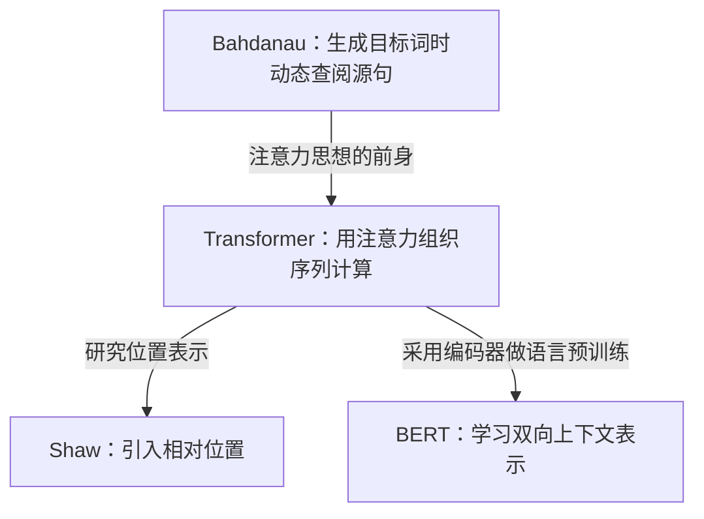

# 从注意力到 Transformer

**这四篇论文可以围绕一个问题来读：模型处理一个词时，怎样利用其他词的信息？**

下面用翻译一句话的例子，依次讲清注意力、Transformer，以及两篇后续论文各自改变了什么。例子用于解释机制，不是论文中的实验。

## 一、先理解注意力解决什么问题

假设要把 **“The cat sat on the mat”** 翻译成中文。模型准备输出“猫”的时候，需要利用源句中关于 “cat” 的信息；准备输出“垫子”时，需要利用关于 “mat” 的信息。

早期的一类编码器—解码器模型，会先把整个英文句子压缩成一个固定长度向量，再根据这个向量生成中文。句子越长，需要放进这个向量的信息就越多。这是 Bahdanau 等人指出的信息瓶颈。

**注意力的办法是：保留源句各个位置的表示，生成每一个目标词时，再决定从哪些位置多取一点信息。**

可以想成一次有侧重的查阅：输出“猫”时，更多关注与 “cat” 有关的源信息。但真正的模型操作是给向量分配权重并加权汇总，不是人工指定两个词一一对应；权重也不一定只集中在一个位置。

> [!abstract] 第一篇论文留下了什么
> **Bahdanau 等，2014 / ICLR 2015**：生成目标词时，动态汇总源句信息。
> 它的序列表示仍由循环网络计算。也就是说，注意力已经出现了，但计算句子表示时依然要沿着序列逐步进行。

[原始论文：Jointly Learning to Align and Translate](https://arxiv.org/abs/1409.0473)

## 二、Transformer 改变了什么

现在把问题往前推一步：**在生成译文之前，模型怎样理解英文句子内部的联系？**

比如，要形成 “cat” 在这句话里的表示，就需要结合其他词的信息。循环网络通过前后相继的计算传递信息；Transformer 的 self-attention 则让一个位置直接从同一句子的各个位置汇总信息。

这里的 **self** 表示信息来自同一个序列。它与刚才“中文生成过程查询英文源句”的注意力，用途不同。

| 正在做什么 | 去哪里取信息 | 在原始 Transformer 中的位置 |
|---|---|---|
| 理解英文源句 | 英文句子内部的各个位置 | 编码器 self-attention |
| 利用已经生成的中文 | 当前可见的中文前缀 | 解码器 masked self-attention |
| 根据英文生成中文 | 编码器输出的英文表示 | 编码器—解码器 attention |

**《Attention Is All You Need》的关键变化，是让注意力承担序列位置之间的信息交互，组成不依赖序列递归或卷积的翻译架构。** 它保留了编码器和解码器，也保留前馈层、残差连接、归一化等部件。

下面这张图可以按三个位置读：左边理解源句，右边底部利用目标前缀，右边中部查询源句。

![[06_paper/Attention 阅读样例/图/Transformer原图.png|360]]

*Vaswani 等，Figure 1，本地原文第 3 页。*[打开 Zotero 原图](zotero://open-pdf/library/items/P5TG5SYE?page=3)

这样做的一个好处是：训练时，句子里许多位置可以同时计算，不必像循环网络那样等前一个位置算完。**生成译文仍是逐步进行的**，因为下一个词依赖已经生成的词。

> [!abstract] 第二篇论文留下了什么
> **Vaswani 等，2017**：把注意力从一种查阅源信息的机制，扩展为组织整个序列模型的核心计算方式。
> 阅读重点是分清三种注意力的信息来源，以及训练并行与逐步生成的区别。

接下来出现两个不同的问题：“模型怎样知道词序？”以及“这套架构能否先学习通用语言表示？”下面两篇论文分别沿着这两个方向展开。

## 三、相对位置论文接着问了什么

“猫追狗”和“狗追猫”用了相同的词，但意思不同。模型除了知道有哪些词，还需要知道词序。

原始 Transformer 将位置编码加到词的输入表示中。可以把这理解为：除了词本身的表示，还加入“它位于哪里”的信息。

**Shaw 等人的后续工作进一步让注意力考虑两个位置之间的相对距离。** 直观上，它关心的是“这个词在另一个词的前面还是后面，相隔多远”。

> [!abstract] 这条分支改变的是位置表示
> **Shaw 等，2018**：在 self-attention 中纳入相对位置信息。
> 它沿用 Transformer 的框架，研究其中一个部件如何改进。

论文摘要报告在指定英德、英法翻译实验中的改善，也报告绝对位置与相对位置结合没有进一步改善。因此，这里的结论应保留实验条件。[原始论文：Relative Position Representations](https://aclanthology.org/N18-2074/)

## 四、BERT 接着改变了什么

另一条方向是：**能否先让编码器从大量文本中学会利用上下文，再把它用于不同的语言理解任务？**

BERT 采用 Transformer 编码器，预训练时遮蔽部分输入词，让模型根据上下文预测这些词。例如，给出“猫坐在 [MASK] 上”，模型需要结合左右两侧信息来预测被遮蔽的内容。这只是说明训练任务的示意句。

这里的目标不再是把英文翻译成中文，而是训练可以迁移到下游任务的语言表示。原始 BERT 还使用了 next sentence prediction 目标。

> [!abstract] 这条分支改变的是训练目标与用途
> **Devlin 等，2018 / NAACL 2019**：采用双向 Transformer 编码器做语言预训练，再针对下游任务微调。
> 它与相对位置论文可以并列看：一个研究怎样提供位置信息，一个研究怎样训练和使用编码器。

[打开 Zotero 中的 BERT](zotero://open-pdf/library/items/TLZ3NUSX) · [论文来源](https://aclanthology.org/N19-1423/)

## 把四篇论文放回一张图里

这是一条为理解机制选取的局部路线。Transformer 之前已有其他 self-attention 工作；上面的箭头只表示写明的技术联系，并不穷尽历史来源。

现在可以用一句话检验是否分清了它们：**Bahdanau 改变了生成目标词时如何取源信息；Transformer 改变了序列模型如何计算；Shaw 改位置表示；BERT 改编码器的训练目标和用途。**

需要在图上点选段落时，可打开 [[06_paper/Attention 阅读样例/论文关系.canvas|可点击的关系图]]。想补背景，可进入已有的 [[00_Knowledge/Transformer|Transformer 概念页]] 和 [[00_Knowledge/Transformer自回归约束|自回归约束页]]。

## 进一步看方法与证据

> [!info]- 注意力公式：一次加权汇总
> $$\operatorname{Attention}(Q,K,V)=\operatorname{softmax}\!\left(\frac{QK^\top}{\sqrt{d_k}}\right)V.$$
> Q 与 K 的点积提供匹配分数，缩放后沿可见位置做 softmax，得到汇总 V 的权重。若两个位置的权重是 0.8、0.2，Value 是 $(1,0)$、$(0,1)$，输出就是 $(0.8,0.2)$。
>
> Q、K、V 是学得的向量投影；“查阅”是理解其用途的比喻。Multi-head 在多个学得的子空间里分别完成这件事，再拼接投影。各个头不保证都有可命名的语言学职责。见原文 §3.2。

> [!info]- Transformer 的实验支持了多大的结论？
> 原文 Table 2 报告 Transformer big 在 WMT14 英德得到 28.4 BLEU，英法得到 41.8 BLEU；§5.2 记录使用 8 张 P100 训练约 3.5 天。这支持它在所列翻译任务与设置下的表现；并非所有任务、数据和规模上的优越性证明。跨论文训练成本比较还涉及硬件与估算方式。
>
> §4 比较了层的路径长度和计算复杂度。全连接 self-attention 的成对计算具有 $O(n^2d)$ 成本，短路径不意味着长序列没有计算代价。原文 Table 3 中学习式位置编码与正弦编码结果接近。本样例没有执行训练复现。

> [!info]- 来源与阅读范围
> Transformer 的机制、原图和数值依据本地 Zotero 原文 §1–4、§5.2、Table 2–3；[网页全文](https://arxiv.org/html/1706.03762v7)为后续修订版，页码可能不同。BERT 的架构和预训练目标核对本地原文 §3、§3.1。
>
> Bahdanau 与 Shaw 部分是依据原始摘要及 Transformer 对前作的说明整理的关系导读，未完成全部实验审读。翻译例子、阅读顺序和结论适用范围的解释由 Codex 整理。图像版权归原作者。
>
> 文献记录：[[06_paper/LLM/papers/vaswaniAttentionAllYou|Attention 条目]] · [[06_paper/LLM/papers/devlin2019BERTPretrainingDeep|BERT 条目]]。
