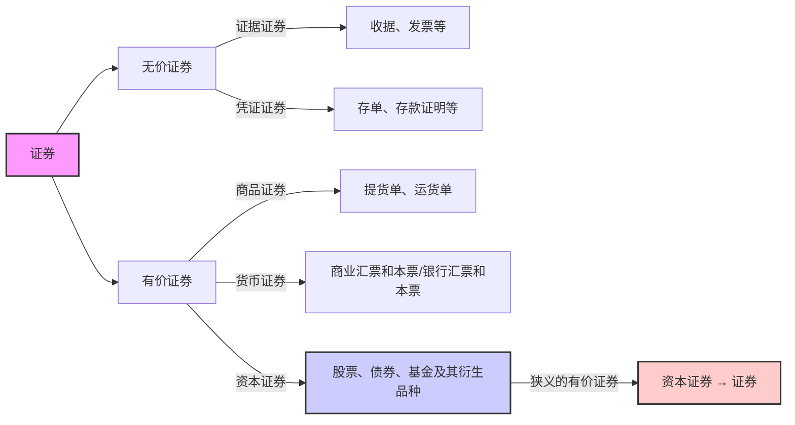

# 1. 证券与投资

## 1.1证券及其特征

证券：指各类记载并证明特定权益的法律凭证

票面要素：

持有人 证券的标的物 标的物的价值 权利

特征： 法律特征 书面特征   同时具备两个特征的 书面凭证称为证券

## 1.2 证券分类

有价证券和无价证券的区别：流通性，可盈利性

狭义的有价证券 —— 资本证券 → 证券

## 1.3 投资与证券投资

>[!note] 投资的定义
>投资主体为获取未来预期收益，将货币 转化为资本的过程。

投资对象：实物资产或金融资产。
真实物体 Vs 契约
投资 —— 投机 这两者没有特别明显的界限

投资目的; 

本金保障 资本增值 经常性收益。

# 2. 债券

## 2.1 债券的定义与性质

>[!note] 定义
债券是发行人按照法定程序向投资者发行，并约 定在一定期限还本付息的有价证券

>[!note] 性质
>* 基本性质：虚拟资本 有价证券 债权凭证
>* 票面要素：票面价值(溢价发行Vs 折价发行）、偿还 期限、利率（决定因素）、付息期 
>* 基本特征：偿还性、流通性、安全性、收益性
