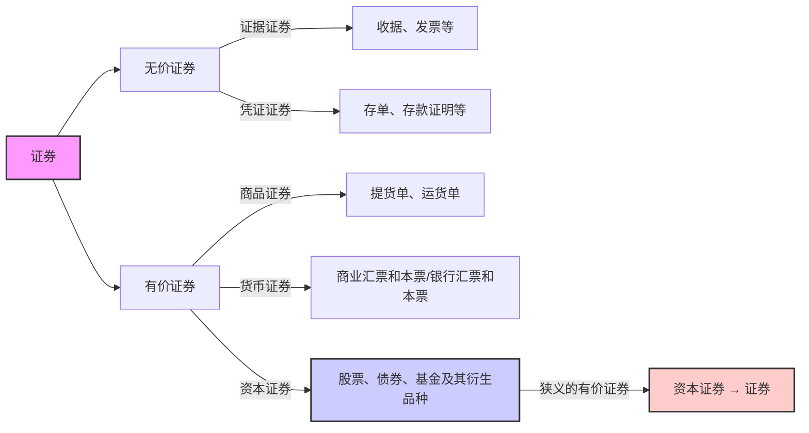

# 1. 证券与投资

## 1.1证券及其特征

证券：指各类记载并证明特定权益的法律凭证

票面要素：

持有人 证券的标的物 标的物的价值 权利

特征： 法律特征 书面特征   同时具备两个特征的 书面凭证称为证券

## 1.2 证券分类

有价证券和无价证券的区别：流通性，可盈利性

狭义的有价证券 —— 资本证券 → 证券

## 1.3 投资与证券投资

>[!note] 投资的定义
>投资主体为获取未来预期收益，将货币 转化为资本的过程。

投资对象：实物资产或金融资产。
真实物体 Vs 契约
投资 —— 投机 这两者没有特别明显的界限

* 投资目的:
	* 本金保障 
	* 资本增值 
	* 经常性收益。

>[!note] 证券投资定义
>投资者购买股票、债券、基金等资本证券及其衍 生品，以获取红利、利息及资本利得的投资行为 和投资过程

## 1.4风险与风险偏好

>[!note] 风险的定义
>未来结果的不确定性或损失、个人和群体 在未来获得收益和遇到损失的可能性以及对这 种可能性的判断与认知

根据对风险的不同偏好,将人群分为三类:

风险规避,风险中立.风险偏好.

```tikz
\begin{document}
\begin{tikzpicture}[scale=0.8]

  %---------------------------------------------
  % Diagram 1: Risk-Averse (Concave utility)
  %---------------------------------------------
  \begin{scope}[xshift=0cm,yshift=0cm]
    % Axes
    \draw[->] (0,0) -- (4.5,0) node[right] {Income};
    \draw[->] (0,0) -- (0,4.5) node[above] {Utility};

    % Concave function, e.g. u(x) = 2*sqrt(x)
    \draw[domain=0:4, samples=100, thick] 
      plot (\x, {2*sqrt(\x)})
      node[right] {};

    % Caption
    \node[below=0.4cm] at (2.0,0) {Risk-Averse (Concave Utility)};
  \end{scope}

  %---------------------------------------------
  % Diagram 2: Risk-Neutral (Linear utility)
  %---------------------------------------------
  \begin{scope}[xshift=6cm,yshift=0cm]
    % Axes
    \draw[->] (0,0) -- (4.5,0) node[right] {Income};
    \draw[->] (0,0) -- (0,4.5) node[above] {Utility};

    % Linear function, e.g. u(x) = x
    \draw[domain=0:4, samples=100, thick]
      plot (\x, {\x})
      node[right] {};

    % Caption
    \node[below=0.4cm] at (2.0,0) {Risk-Neutral (Linear Utility)};
  \end{scope}

  %---------------------------------------------
  % Diagram 3: Risk-Loving (Convex utility)
  %---------------------------------------------
  \begin{scope}[xshift=3cm,yshift=-6cm]
    % Axes
    \draw[->] (0,0) -- (4.5,0) node[right] {Income};
    \draw[->] (0,0) -- (0,4.5) node[above] {Utility};

    % Convex function, e.g. u(x) = x^2/4
    \draw[domain=0:4, samples=100, thick]
      plot (\x, {(\x)^2/4})
      node[right] {};

    % Caption
    \node[below=0.4cm] at (2.0,0) {Risk-Loving (Convex Utility)};
  \end{scope}

\end{tikzpicture}

\end{document}
```

# 2. 债券

## 2.1 债券的定义与性质

>[!note] 债券的定义
债券是发行人按照法定程序向投资者发行，并约 定在一定期限还本付息的有价证券

* 基本性质：虚拟资本 有价证券 债权凭证
* 票面要素：票面价值(溢价发行Vs 折价发行）、偿还 期限、利率（决定因素）、付息期 
* 基本特征：偿还性、流通性、安全性、收益性

## 2.2债券融资优缺点

### 2.2.1优点

1. 资金成本低：抵税；利率低； 
2. 财务杠杆；债权融资优于股权融资； 
3. 债券融资属于长期资金； 
4. 债券筹资发行对象广，筹资额大

### 2.2.2缺点

1. 财务风险大； 
2. 限制条款多

## 2.3债券的种类

### 2.3.1 按发行主体分类

* 政府债券：中央政府、地方政府（利率高于国债）、政府机构； 
* 金融债券；银行或者非银金融机构发行 
* 公司债券  
	* 按发行目的分为：普通公司债券、改组公司债券、利息公 司债券、延期公司债券； 
* 国际债券 
	* 外国债券：扬基债券、武士债券、龙债券、猛犬债券、熊 猫债券等  
	* 欧洲债券：欧洲美元债券、亚洲美元债券

### 2.3.2 按债券的期限分类

 * 短期债券：一年以内 
 * 中期债券：1-5年 
 * 长期债券：5年以上 
 * 永久债券 ：永续债

### 2.3.3按债券形态分类： 

* 实物债券（不记名，不挂失，可流通）；
* 凭证式债券（记名，可挂失，不流通，自购买之日计息）； 
* 记账式债券：没有实物形态，电脑记账方式记录债权，在交易 所发行及交易

### 2.3.4按利息的计息方式分：

单利债券 复利债券

### 2.3.5按利息支付方式分类

* 息票累积债券：到期一次还本付息 
* 息票付息债券：富有息票的债券，标明利率及付息方式。 
* 贴现付息债券（零息债券） ：发行价低于面额，到期按面额兑付；

### 2.3.6按债券是否记名分类

记名债券；无记名债券；

### 2.3.7按抵押担保状况分类 

* 抵押债券（Mortgage Bonds） 以动产或不动产作为抵押品，用以担保按期还本 
* 信用债券（Debenture Bonds） 指发行公司不提供任何有形、无形的抵押品，完全以公司的全部资信予以保证 的债券 
* 保证债券：第三方作为还本付息担保 
* 担保信托债券：以动产或者有价证券担保
### 2.3.8按公司债券是否可转换分类

可转换债券： 不可转换债券：

### 2.3.9按是否提前偿还分类

可赎回债券；不可赎回债券；

### 2.3.10按本金的偿还方式分类

1. 到期偿还也叫回满期偿还，是指按答发行债券时规定 的还本时间，在债券到期时一次全部偿还本金的偿债方式 
2. 期中偿还也叫中途偿还，是指在债券最终到期日之前 ，偿还部分或全部本金的偿债方式。 
3. 展期偿还是指在债券期满后又延长原规定的还本付息 日期的偿债方式。

部分偿还和全额偿还 
* 1.部分偿还是指从债券发行日起，经过一定宽限期后， 按发行额的一定比例，陆续偿还，到债券期满时全部还清 
* 2.全额偿还是指在债券到期之前，偿还全部本金 。

定时偿还和随时偿还 
* 1.定时偿还亦称定期偿还，它指债券发行后待宽限期过后，分次在规定的日期，按一定的偿还率偿还本金。  
* 2.随时偿还也称任意偿还，是指债券发行后待宽限期过后，发行人可以自由决定偿还时间，任意偿还债券的一部分或全部。 

抽签偿还和买入注销 
* 1.抽签偿还是指在期满前偿还一部分债券时，通过抽签方式决 定应偿还债券的号码。 
* 2.买入注销是指债券发行人在债券未到期前按照市场价格从二 级市场中购回自己发行的债券而注销债务。

### 2.3.11按投资人的收益分类 

固定利率债券 
*  票面利率在整个债券有效期内固定不变；
* 或  以基础利率为基准，加上一个固定溢价加以确认。 
浮动利率债券 
* 典型的是指数债券，指根据某种指数的变动定期（半年或1 年）调整一次，使利率与通胀率挂钩来保证债券持有人免受 通胀的损失的一种公司债券。
累进利率债券 
* 利率与期限挂钩

### 2.3.12按债券选择权分类 

* 参加分红公司债券 
* 免税债券 
* 收益公司债券
	利息只在公司有盈利时才支付,即发行公司的利润扣除各项固定支 出后的余额用作债券利息的来源,如果余额不足支付,未付利息可以累加,待公司收 益改善后再补发。 
* 附新股认购权债券 
* 产权债券：该公司债券的持有者,可以按所规定的价格向发行公司请示认购新股票 的一种公司债券 
* 可赎回债券 
* 可转换债券 
* 偿还基金债券：要求发行人以偿债基金方式还债
### 2.3.13按债券筹集方式

私募债券和公募债券。

### 2.3.14按使用币种

本币、外币、双重货币债券。

### 2.3.15按发行地域

国内债券和国际债券。

### 2.3.16按债券表现形式分

货币债券，实物债券，折实债券。

## 2.4 债券收益率的计算

>[!NOTE] 债券收益率的定义
>利息产生在资金的所有者和使用者不统一的场合，它的实质是资金的使用者付给 资金所有者的租金，用以补偿所有者在资金租借期内不能支配该笔资金而蒙受的损失。

影响利息大小的三要素: 本金,利率,时间长度

### 2.4.1利息的度量

#### 2.4.1.1 利息相关概念

##### **(1) 累积分函数 $a(t)$**

累积分函数描述“$1$ 元从起始时刻（$t=0$）累积至时刻 $t$ 时变成多少”。通常约定
$$a(0) = 1 $$
即在时刻 $0$ 时，$1$ 元尚未经过任何利息累积。

若给定某种利率或利息模型，$a(t)$ 反映了资金随时间增长的倍数。比如简单复利时，$a(t) = (1 + i)^t$；若为连续复利，$a(t) = e^{\delta t}$ 等等。

##### **(2)总额函数 $A(t)$**

若初始投资本金为 $K$，则总额函数可写作
$$A(t) = K \cdot a(t),.$$
它表示在时刻 $t$ 这笔本金所累积到的本息总额。就是上面的那个积累函数乘上本金的数值

##### **(3). 贴现函数 $a^{-1}(t)$**

一般把
$$a^{-1}(t) = \frac{1}{a(t)}$$
称为“贴现函数”或“折现函数”，它表示在时刻 $0$ 看来，$1$ 元在时刻 $t$ 的现值有多少。

就是a(t)的倒数

##### **(4) 第 $N$ 期利息 $I(n)$**

第 $n$ 期利息常记为
$$I(n) = A(n) - A(n-1),.$$
如果按离散期（如每年、每月等）计息，$I(n)$ 就表示第 $n$ 期相对于第 $n-1$ 期增长的“那部分利息”。

这个公式说明：
1. $A(n)$ 是第 $n$ 期末的本息总和；
2. $A(n-1)$ 是上一期末的本息总和；
3. 两者相减得到当前期的纯利息数额

#### 2.4.1.2 单利计息和复利计息

```tikz
\begin{document}
\begin{tikzpicture}[scale=1.2, font=\small]
  % 1) Draw axes
  \draw[->, thick] (0,0) -- (6,0) node[right]{Time $t$};
  \draw[->, thick] (0,0) -- (0,6) node[above]{Value};
  % 2) Add a light grid for reference
  \draw[step=1, thin, gray!30] (0,0) grid (5,5);
  % 3) Simple Interest: V_simple(t) = 1 + 0.2 * t
  \draw[
    color=blue,       % line color
    thick,            % line thickness
    domain=0:5,       % plot from x=0 to x=5
    samples=100
  ] plot (\x, {1 + 0.3*\x});
  % 4) Compound Interest: V_compound(t) = (1.2)^t
  \draw[
    color=red,
    thick,
    domain=0:5,
    samples=100
  ] plot (\x, {(1.3)^\x});
  % 5) Legend in the top-right corner
  %    You can adjust the shift to move the box
  \begin{scope}[shift={(4.2,4.2)}]
    % Draw legend background (white rectangle) & border
    \draw[fill=white, draw=black, very thin] (0,0) rectangle (3,1);
    % Blue line for Simple Interest
    \draw[blue, thick] (0.3,0.7) -- (1,0.7);
    \node[anchor=west] at (1,0.7) {Simple Interest};
    % Red line for Compound Interest
    \draw[red, thick] (0.3,0.3) -- (1,0.3);
    \node[anchor=west] at (1,0.3) {Compound Interest};
  \end{scope}
\end{tikzpicture}
\end{document}
```

单利计息是线性积累.$a(t) = 1 + i t$                     $i_n = \frac{i}{1 + (n - 1)i}$
复利计息是指数积累$a(t) = (1 + i)^t$                   $i_n = i$
单利的实质利率逐期递减,复利的实质利率保持恒定。

>[!tip] 针对不同时期的单复利选择
>$t\leq1$时，相同单复利场合，单利计息比复 利计息产生更大的积累值。所以短期业务 一般单利计息。 
>$t\geq1$时，相同单复利场合，复利计息比单 利计息产生更大的积累值。所以长期业务 一般复利计息。

#### 2.4.1.3利率和贴现率

==期末计息--利率==
$$
i_n = \frac{I(n)}{A(n-1)} 
$$
$i_n$ 描述了第 $n$ 期从上一期末金额中**增长**了多少比例。例如，如果第 2 期的 $i_2 = 0.05$，就意味着从第 1 期末金额再增加了 5% 的利息。

==期初计息：贴现率==

期初计息通常指：**把本期末的本息总和**当作基数，先想好“未来会有多少利息”，再“贴现”回本期初。也就是说，贴现率衡量的是“利息在最终金额中占多大比例”
$$
d_n = \frac{I(n)}{A(n)} 
$$
其中 $A(n)$ 是第 $n$ 期末的总额（本金+利息）。

$d_n$ 描述了第 $n$ 期从最终金额中**减少**多少算作“本期的利息”。在保险精算或债券贴现等场景里，常用贴现率来度量未来收到的钱折算到期初值时“扣掉”的那部分占比。

>[!example] 假设第 1 期末有 100 元，第 2 期末有 105 元，于是第 2 期获得的利息是 5 元 (I(2)=5)
>• **期末计息（利率）**
>$$i_2 = \frac{5}{100} = 0.05 \quad (\text{即 }5\%).$$
>• **期初计息（贴现率）**
>$$d_2 = \frac{5}{105} \approx 0.0476 \quad (\text{即 }4.76\%).$$
>从 100 长到 105，增加 5，若用“上一期末的本金 100”做基数，利率就变成 5%；可如果从“本期末总额 105”来反推利息所占份额，就只有约 4.76%。它们都描述的是同一笔利息，只不过分母不同，因而数值有所区别。
>==觉得别扭的主要是因为贴现率的概念在日常场景不太常用。你只要记住：**贴现率 = 利息 ÷ 期末总额**，它测的是“利息在期末总额中所占的份额”。==

#### 2.4.1.4不同场合下的贴现率与利率关系

**在“单利场合”**
$$
d_n
= \frac{a(n) - a(n-1)}{a(n)}
= \frac{\bigl[1 + in\bigr] - \bigl[1 + i(n-1)\bigr]}{1 + in}
= \frac{i}{1 + in} 
$$

说明：

在单利下，第 $n$ 期的利息相对于“期末总额”所占的比例是 $\tfrac{i}{1 + in}$。当 $n$ 越大，分母越大，所以 $d_n$ 越小。

**在“复利场合”**
$$
d_n
= \frac{(1+i)^n - (1+i)^{n-1}}{(1+i)^n}
= \frac{(1+i)^{n-1}\bigl[(1+i) - 1\bigr]}{(1+i)^n}
= \frac{i(1+i)^{n-1}}{(1+i)^n}
= \frac{i}{1 + i} 
$$
  

说明：

在复利下，每期贴现率 $d_n$ 都等于 $\tfrac{i}{1 + i}$，**与 $n$ 无关**；这是因为每一期按相同的利率 $i$ 复利，导致期初贴现率也恒定不变。

| **初始值** | **利息** | **积累值** |
| ------- | ------ | ------- |
| 1       | $i$    | $1 + i$ |
| $v$     | $d$    | 1       |

### 2.4.2年金

>[!note] 年金的定义
>按一定的时间间隔支付的一系列付款称为年金。原始含义是限于一年支付一次的付款，现已推广到任意间隔长度的系列付款

#### 2.4.2.2年金的分类

基本年金 :等时间间隔付款,付款频率与利息转换频率一致,每次付款金额恒定
	付款时刻不同：初付年金/延付年金 
	付款期限不同：有限年金/永久年金
一般年金 :不满足基本年金三个约束条件的年金即为一般年金

#### 2.4.2.3年金相关计算

• 用变量$i$表示有效利率(interest rate)，即每期的利率；
• 用$v$表示贴现因子(discount factor)，常见定义是 $v = \frac{1}{1 + i}$；
• 用$d$表示贴现率(discount rate)，常见定义是 $d = \frac{i}{1 + i}$，因此 $d = 1 - v$；
• 上标或下标如 $n$ 表示期限(如$n$期)
• 符号 $a_{\overline{n}|}$、$\ddot{a}_{\overline{n}|}$、$s_{\overline{n}|}$、$\ddot{s}_{\overline{n}|}$ 等，分别表示不同类型年金(先付、后付)的现值或终值。S是终值,a是现值.带冒号的是先付年金,不带的是后付年金.
##### **(1). 后付年金现值**
$$a_{\overline{n}|} = v + v^2 + \cdots + v^n = \frac{v (1 - v^n)}{1 - v} = \frac{1 - v^n}{i}$$

• 这里的后付年金(ordinary annuity 或 annuity immediate)是指：在每个期末支付(或收款)1元，持续$n$期；
• $v^k$ 表示第$k$期末支付的金额的现值系数；
• 也可以写成 $\frac{1 - v^n}{i}$，其中 $i$ 为利率，$v = \frac{1}{1 + i}$。

>[!example] **例子**：假设利率为 $i = 5\%$，即 $v = \frac{1}{1.05} \approx 0.95238$。
>若你在每年期末存入1元，连续存5年，那么它们在第0期(现在)的总现值就是
>$$a_{\overline{5}|} = \frac{1 - v^5}{i}= \frac{1 - 0.95238^5}{0.05}\approx \frac{1 - 0.95238^5}{0.05}.$$

##### **(2). 先付年金现值**

$$\ddot{a}_{\overline{n}|} = 1 + v + \cdots + v^{n-1} = (1 + i), a_{\overline{n}|} = \frac{1 - v^n}{d}$$

• 先付年金(annuity due)是指：在每个期初支付(或收款)1元，持续$n$期；
• 相比后付年金，它比后付年金多“提前”了一期的贴现(或说每笔款项都比后付年金早付1期)；
• 因此也有 $\ddot{a}_{\overline{n}|} = (1 + i), a_{\overline{n}|}$ 的关系，其中 $d = 1 - v = \frac{i}{1 + i}$。

>[!example] **例子**：若还是 $i = 5\%$
>但改为每年期初就存入1元，连续存5年，那么它们在现在的总现值就是
>$$\ddot{a}_{\overline{5}|} = (1 + i) a_{\overline{5}|} = 1.05 \times a_{\overline{5}|}.$$
>
>因为先付年金比后付年金要“多”一段利息(每笔款项都早存了一期)。

##### **(3). 后付年金终值(累积值)**

$$s_{\overline{n}|} = 1 + (1 + i) + \cdots + (1 + i)^{n-1} = \frac{(1 + i)^n - 1}{i}$$

• 后付年金的终值(future value)指的是：在每个期末存入1元，持续$n$期后，所有存入金额到最后一期末的累计值之和；

>[!example] **例子**：每年期末存1元，存5年，利率 $i = 5\%$
>那么在第5年期末的累积总额是
>$$s_{\overline{5}|} = \frac{(1.05)^5 - 1}{0.05}.$$

##### **(4). 先付年金终值**

$$\ddot{s}_{\overline{n}|} = (1 + i) + (1 + i)^2 + \cdots + (1 + i)^n = (1 + i), s_{\overline{n}|} = \frac{(1 + i)^n - 1}{d}$$

• 先付年金的终值：在每个期初存1元，持续$n$期，在第$n$期末时的总累积值；
• 由于每笔款都比后付年金“提早”存入1期，因此可以乘以 $(1 + i)$ 得到和后付年金的关系。

##### **(5). 无限年金(永续年金)现值**

• 当 $n \to \infty$ 时(也就是持续无限期支付)，我们就得到常见的永续年金现值公式：

$$
a_{\overline{\infty}|}
= \lim_{n \to \infty} a_{\overline{n}|}
= \lim_{n \to \infty} \frac{1 - v^n}{i}
= \frac{1}{i},
$$
$$
\ddot{a}_{\overline{\infty}|}= \lim_{n \to \infty} \ddot{a}_{\overline{n}|}= \lim_{n \to \infty} \frac{1 - v^n}{d}
= \frac{1}{d}.
$$

• 这就是著名的“永续年金现值 = 每期支付 / 利率”。

#### 2.4.2.4 银行贷款问题


### 2.4.3债券收益率的计算

决定债券收益率的主要因素有债券的票面利率、期限、面值和购买价格。  
最基本的债券收益率计算公式为：

$$
\text{债券收益率}
= \frac{\text{到期本利合计} - \text{发行价格}}{\text{发行价格}}
\times \frac{100\%}{\text{持有年数}}
$$

由于债券持有人可能在债券还未到期前卖出债券，因此债券的收益率还可以细分为债券持有者的收益率、债券购买时的收益率和债券持有期间的收益率。各自的计算公式如下：

1. **债券持有者的收益率**  
   $$
   \text{债券持有者的收益率}
   = \frac{\text{卖出价格} - \text{发行价格}}{\text{发行价格}}
   \times \frac{100\%}{\text{持有年数}}
   $$

2. **债券购买时的收益率**  
   $$
   \text{债券购买时的收益率}
   = \frac{\text{到期本利合计} - \text{购买价格}}{\text{购买价格}}
   \times \frac{100\%}{\text{持有年数}}
   $$

3. **债券持有期间的收益率**  
   $$
   \text{债券持有期间的收益率}
   = \frac{\text{卖出价格} - \text{购买价格}}{\text{购买价格}}
   \times \frac{100\%}{\text{持有年数}}
   $$

# 3. 股票

## 3.1股票的概念与价值

>[!note]  股票的概念
>股票是一种有价证券，是股份有限公司发行的、 用以证明投资者的股东身份和权益、并据以获取股息 和红利的凭证。 
>
>* 不可偿还性、参与性、收益性、流通性、价格波动性和风险性
>* 一旦发行不可退换

### 3.1.2 股票的价值

==用货币来衡量的作为获利手段的价值==

票面价值

2015中国股灾.上课讲了没听懂.


送红股和公积金转增股本,送红股要交税,公积金转增股本不收税.
## 3.2股票的类型

## 3.3我国现行的股票类型

## 3.4股票与债券的异同

| **区分**       | **股票**                                                                                                  | **债券**                                                                                                      |
|----------------|-----------------------------------------------------------------------------------------------------------|---------------------------------------------------------------------------------------------------------------|
| **相同点**     | 1. 长期投资金融工具<br>2. 有流通性<br>3. 具有获得一定收益的权利<br>4. 可以进行转让买卖                     | 1. 与股票同为长期投资金融工具<br>2. 同样具有流通性等特征                                                       |
| **关系**       | 1. 所有权凭证<br>2. 产权证券                                                                               | 1. 债权凭证<br>2. 债务关系                                                                                    |
| **目的**       | 1. 增加资本收益<br>2. 可以分红                                                                             | 1. 追加资金的需要<br>2. 公司负债<br>3. 不浪费资本                                                              |
| **期限**       | 1. 永久投资<br>2. 股份可流通                                                                               | 1. 有期限<br>2. 到期还本付息                                                                                 |
| **风险与收益** | 1. 风险较大<br>2. 股利和分红来自公司利润的一部分<br>3. 市场价格波动频繁                                     | 1. 风险较小<br>2. 利息固定<br>3. 利息属于公司支出成本或费用<br>4. 市场价格波动较小<br>5. 先还债券后分红       |

# 4.证券投资基金

## 4.1证券投资基金的定义和特征

>[!note] 证券投资基金的定义
>指通过发售基金份额，将众多投资者的资金集 中起来，形成独立财产，由基金托管人托管，基金 管理人管理，以投资组合的方法进行证券投资的一 种利益共享、风险共担的集合投资方式。

特征:
* 集合理财，专业管理 
* 组合投资，分散风险 
* 利益共享，风险共担 
* 严格监管，信息透明 
* 独立托管，保障安全

## 4.2 证券投资基金的运作

![[Pasted image 20250226152919.png]]

委托人:
	受益凭证持有人/投资者/受益人 
	享有《基金法》规定的基金份额持有人的一切权利
基金管理人 —— 基金管理公司
	基金产品的募集者和基金的管理者，在基金资产进 行具体的投资运用中具有核心作用
托管人 —— 具有托管资格的商业银行
	负责保管信托财产，会计核算 
	具体办理证券和现金的管理及相关的代理业务，对基 金投资运作进行监督
证券投资基金市场服务机构
	基金销售机构 
	注册登记机构 
	律师事务所 
	会计事务所 
	基金投资咨询公司 
	基金评级机构

## 4.3 证券投资基金的法律类型

>[!note] 合同型投资基金
>是依据我国《证券投资基金法》成立的一种信托型 投资基金，基于一定的信托合同组织起来的代理投资行 为，由投资者、基金管理公司、基金托管机构三方订立 信托投资契约而建立。

