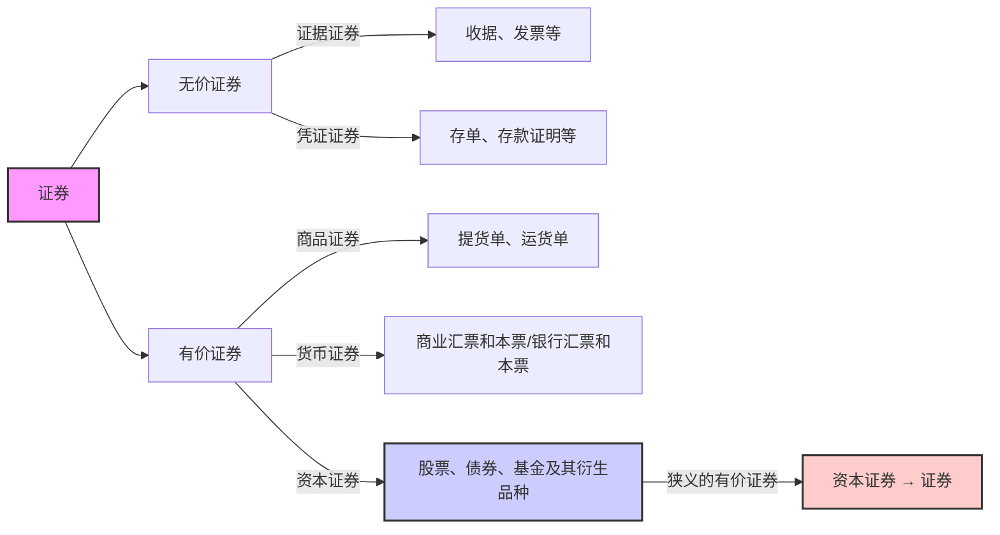

# 1. 证券与投资

## 1.1证券及其特征

证券：指各类记载并证明特定权益的法律凭证

票面要素：

持有人 证券的标的物 标的物的价值 权利

特征： 法律特征 书面特征   同时具备两个特征的 书面凭证称为证券

## 1.2 证券分类

有价证券和无价证券的区别：流通性，可盈利性

狭义的有价证券 —— 资本证券 → 证券

## 1.3 投资与证券投资

>[!note] 投资的定义
>投资主体为获取未来预期收益，将货币 转化为资本的过程。

投资对象：实物资产或金融资产。
真实物体 Vs 契约
投资 —— 投机 这两者没有特别明显的界限

* 投资目的:
	* 本金保障 
	* 资本增值 
	* 经常性收益。

>[!note] 证券投资定义
>投资者购买股票、债券、基金等资本证券及其衍 生品，以获取红利、利息及资本利得的投资行为 和投资过程

## 1.4风险与风险偏好

>[!note] 风险的定义
>未来结果的不确定性或损失、个人和群体 在未来获得收益和遇到损失的可能性以及对这 种可能性的判断与认知

根据对风险的不同偏好,将人群分为三类:

风险规避,风险中立.风险偏好.

```tikz
\begin{document}
\begin{tikzpicture}[scale=0.8]

  %---------------------------------------------
  % Diagram 1: Risk-Averse (Concave utility)
  %---------------------------------------------
  \begin{scope}[xshift=0cm,yshift=0cm]
    % Axes
    \draw[->] (0,0) -- (4.5,0) node[right] {Income};
    \draw[->] (0,0) -- (0,4.5) node[above] {Utility};

    % Concave function, e.g. u(x) = 2*sqrt(x)
    \draw[domain=0:4, samples=100, thick] 
      plot (\x, {2*sqrt(\x)})
      node[right] {};

    % Caption
    \node[below=0.4cm] at (2.0,0) {Risk-Averse (Concave Utility)};
  \end{scope}

  %---------------------------------------------
  % Diagram 2: Risk-Neutral (Linear utility)
  %---------------------------------------------
  \begin{scope}[xshift=6cm,yshift=0cm]
    % Axes
    \draw[->] (0,0) -- (4.5,0) node[right] {Income};
    \draw[->] (0,0) -- (0,4.5) node[above] {Utility};

    % Linear function, e.g. u(x) = x
    \draw[domain=0:4, samples=100, thick]
      plot (\x, {\x})
      node[right] {};

    % Caption
    \node[below=0.4cm] at (2.0,0) {Risk-Neutral (Linear Utility)};
  \end{scope}

  %---------------------------------------------
  % Diagram 3: Risk-Loving (Convex utility)
  %---------------------------------------------
  \begin{scope}[xshift=3cm,yshift=-6cm]
    % Axes
    \draw[->] (0,0) -- (4.5,0) node[right] {Income};
    \draw[->] (0,0) -- (0,4.5) node[above] {Utility};

    % Convex function, e.g. u(x) = x^2/4
    \draw[domain=0:4, samples=100, thick]
      plot (\x, {(\x)^2/4})
      node[right] {};

    % Caption
    \node[below=0.4cm] at (2.0,0) {Risk-Loving (Convex Utility)};
  \end{scope}

\end{tikzpicture}

\end{document}
```

# 2. 债券

## 2.1 债券的定义与性质

>[!note] 债券的定义
债券是发行人按照法定程序向投资者发行，并约 定在一定期限还本付息的有价证券

* 基本性质：虚拟资本 有价证券 债权凭证
* 票面要素：票面价值(溢价发行Vs 折价发行）、偿还 期限、利率（决定因素）、付息期 
* 基本特征：偿还性、流通性、安全性、收益性

## 2.2债券融资优缺点

### 2.2.1优点

1. 资金成本低：抵税；利率低； 
2. 财务杠杆；债权融资优于股权融资； 
3. 债券融资属于长期资金； 
4. 债券筹资发行对象广，筹资额大

### 2.2.2缺点

1. 财务风险大； 
2. 限制条款多

## 2.3债券的种类


```tikz
\begin{document}
\begin{tikzpicture}[scale=1.2, font=\small]
  % 1) Draw axes
  \draw[->, thick] (0,0) -- (6,0) node[right]{Time $t$};
  \draw[->, thick] (0,0) -- (0,6) node[above]{Value};
  % 2) Add a light grid for reference
  \draw[step=1, thin, gray!30] (0,0) grid (5,5);
  % 3) Simple Interest: V_simple(t) = 1 + 0.2 * t
  \draw[
    color=blue,       % line color
    thick,            % line thickness
    domain=0:5,       % plot from x=0 to x=5
    samples=100
  ] plot (\x, {1 + 0.3*\x});
  % 4) Compound Interest: V_compound(t) = (1.2)^t
  \draw[
    color=red,
    thick,
    domain=0:5,
    samples=100
  ] plot (\x, {(1.3)^\x});
  % 5) Legend in the top-right corner
  %    You can adjust the shift to move the box
  \begin{scope}[shift={(4.2,4.2)}]
    % Draw legend background (white rectangle) & border
    \draw[fill=white, draw=black, very thin] (0,0) rectangle (3,1);
    % Blue line for Simple Interest
    \draw[blue, thick] (0.3,0.7) -- (1,0.7);
    \node[anchor=west] at (1,0.7) {Simple Interest};
    % Red line for Compound Interest
    \draw[red, thick] (0.3,0.3) -- (1,0.3);
    \node[anchor=west] at (1,0.3) {Compound Interest};
  \end{scope}
\end{tikzpicture}
\end{document}
```
