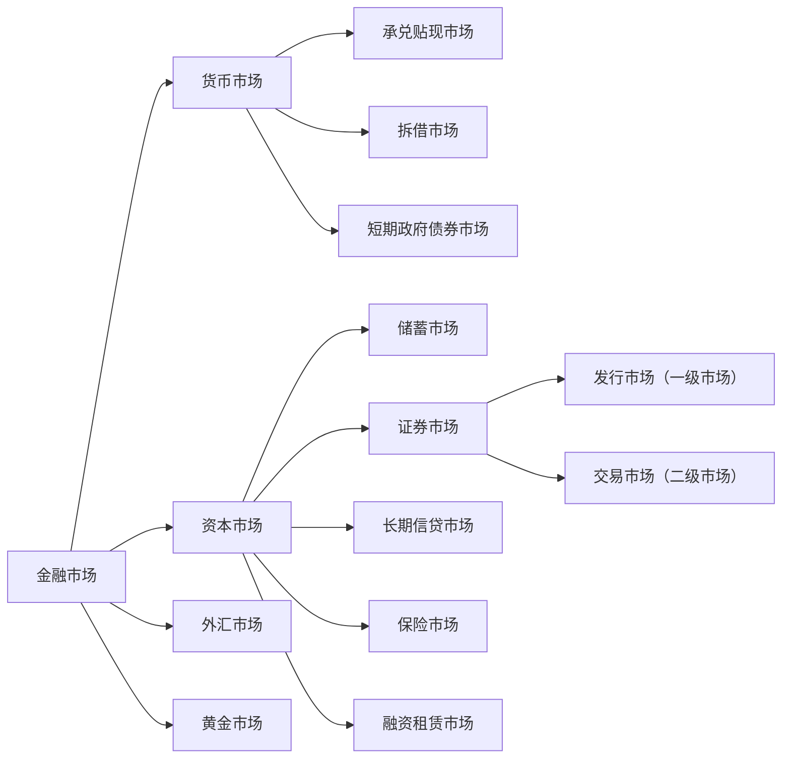

# 1. 证券市场概述

## 1.1 证券市场的特征

>[!note] 证券市场
>证券市场是股票、债券、基金和其他金融衍生工 具发行和买卖的场所，是一个高度组织化、集中 进行证券交易的市场，是整个证券市场的核心。 是有价证券、证券功能、财产权利和风险直接交换 的场所
>广义：证券市场指的是所有证券发行和交易的场所。
>狭义上:也是最活跃的证券市场指的是资本证券市场、货币证券市 场和商品证券市场。

## 1.2 证券市场分类与结构

### 1.2.1 按照功能分类

1. 一级市场：融资活动，连接资 金需求和资金供给，闲散资金 转化为生产资本。 
2. 二级市场（交易市场）  交易，价格发现，资产配置，晴 雨表

联系： 
* 一级市场供给二级市场的品 种 ,决定二级市场的交易规模、结构与速度；
* 二级市场为一级市场投资者 提供变现途径； 
* 二级市场的供求及定价效率 影响一级市场的发行。

### 1.2.2 按照上市条件分类

1. 主板，是资本市场最重要的组成部分，能够反映宏观经济，晴雨表。深圳和上海都有.
		对发行人的营业期限 ，股本、盈利，市值等要求.
		大型成熟企业，规模较大，盈利稳定。
2. 二板市场：创业板,为具有高成长的中小企业和高科技企业提供融资服务。上市条件偏低.
		甚至不要求盈利,只是有专利什么的就行.
		为风险投资资金提供退出通道；
3. 三板市场:全国中小企业股份转让系统.不向公众进行公开募股.

### 1.2.3 按交易对象不同

股票市场； 
债券市场； 
基金市场 
衍生品市场

### 1.2.4 按照交易场所

场内交易.有标准的地点和规则.交易标准化产品.
场外交易.交易非标准化产品.

## 1.3 证券市场发展阶段

1. 自由放任阶段(17世纪初至20世纪20年代末)：1929年10月黑色星期二标志着自由放任的结束.
2. 法制建设阶段(20世纪30年代初至60年代末) ：
	1. 美国：证券法，证券交易法，公共事业控股公司法，信托契约法，投资公司法， 投资顾问法 
	2. 英国：反欺诈投资法，公司法 
	推动了三公，发挥证券市场功能，促进证券市场持续发展。
3. 迅速发展阶段(20世纪70年代以来) ：GDP占比提高，资本市场结构优化，金融衍 生品层出不穷

# 2. 证券市场的参与者

## 2.1 证券发行者

### 2.1.1 证券发行者是谁

证券市场发行者是证券市场的资金需求者和证券的供给者

* 政府:政府债券(国债和地方债)
* 企业:股份有限公司发行债券和股票,有限公司发行债券
* 银行和非银行金融机构:股票或金融债券.

国债:
* 早期主要用于弥补财政赤字； 
* 现代，用途一般有： 
	* 提供公共品； 
	* 扩大政府开支，刺激经济增长； 
	* 维护金融市场稳定。

金融债券是金融机构扩大信贷资金来源的手段，一般专款专用， 被用于定向特别贷款。

### 2.1.2 证券发行方式

1. 审批制.是完全的计划经济的产物.证监会控制额度,下划至各省市自治区.公司在申请股票发行时需要经过审批的证券发行管理制度， 是完全计划发行的模式，施行额度控制。不够市场化
2. 核准制:审批制后变为核准制.发行委员会的权力空前强大.那拨人贪美了.证监会既当裁判员,又当运动员.爽死了.
3. 注册制:监管机构只看发行人的真实准确性进行审查,不看这个公司有没有投资价值.

## 2.2 证券投资者

### 2.2.1 机构投资者

1. 政府机构:
	1. 财政部,各级政府.目的是为了调剂资金余缺和进行宏观调控.
	2. 中央银行:公开市场操作
	3. 国资委:国资持股
2. 企业事业单位:投资 参股、控股某上市公司.
3. 金融机构
	1. 银行:按要求要持有一类资产二类资产
	2. 证券:自营,经济,服务三类业务.自营就是要在市场参与投资
	3. 保险:收到保险金后不能将钱放在哪里,需要拿出去钱滚钱.
	4. 基金机构 主权财富基金.
	5. 合格的境外机构投资者
	6. 其他金融机构

### 2.2.2 个人投资者

散户

## 2.3 证券市场中介机构

为证券发行,交易提供服务的各类机构

## 2.4 自律性组织--证券业协会

协助证券监管机构组织会员执行有关法律 维护会员的合法权益，为会员提供信息服务 制定规则 培训

## 2.5证券监管机构

# 3. 股票价格指数

# 4. 证券交易程序

# 5. 证券交易方式

