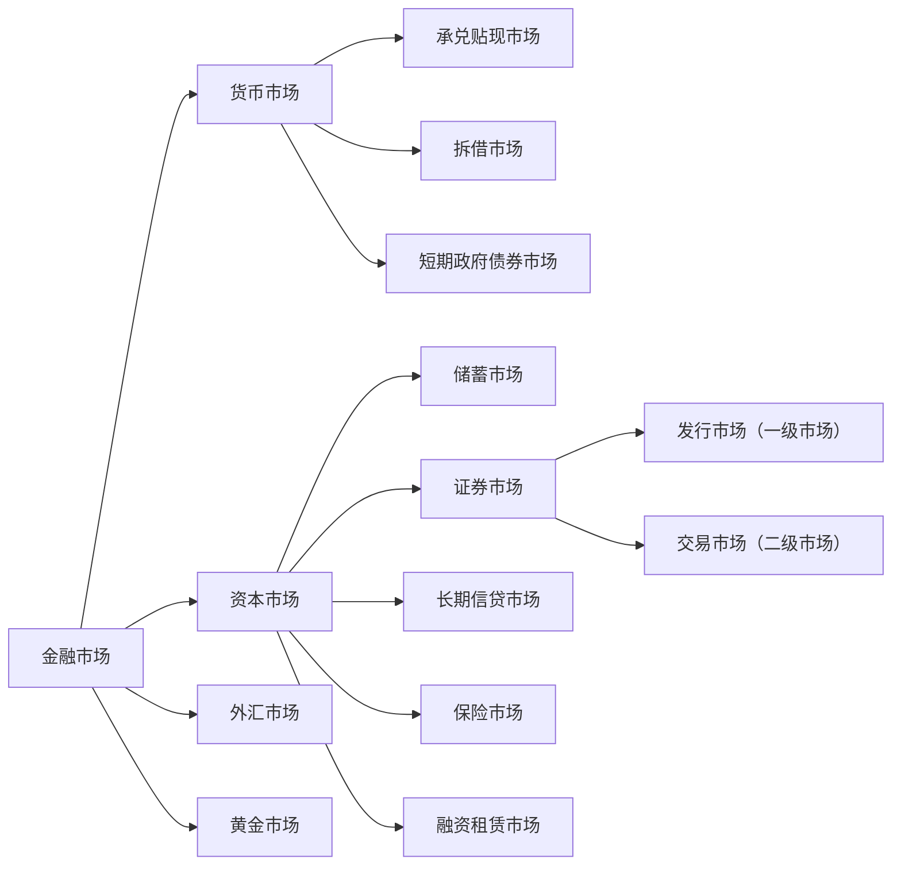

# 1. 证券市场概述

## 1.1 证券市场的特征

>[!note] 证券市场
>证券市场是股票、债券、基金和其他金融衍生工 具发行和买卖的场所，是一个高度组织化、集中 进行证券交易的市场，是整个证券市场的核心。 是有价证券、证券功能、财产权利和风险直接交换 的场所
>广义：证券市场指的是所有证券发行和交易的场所。
>狭义上:也是最活跃的证券市场指的是资本证券市场、货币证券市 场和商品证券市场。

## 1.2 证券市场分类与结构

### 1.2.1 按照功能分类

1. 一级市场：融资活动，连接资 金需求和资金供给，闲散资金 转化为生产资本。 
2. 二级市场（交易市场）  交易，价格发现，资产配置，晴 雨表

联系： 
* 一级市场供给二级市场的品 种 ,决定二级市场的交易规模、结构与速度；
* 二级市场为一级市场投资者 提供变现途径； 
* 二级市场的供求及定价效率 影响一级市场的发行。

### 1.2.2 按照上市条件分类

1. 主板，是资本市场最重要的组成部分，能够反映宏观经济，晴雨表。深圳和上海都有.
		对发行人的营业期限 ，股本、盈利，市值等要求.
		大型成熟企业，规模较大，盈利稳定。
2. 二板市场：创业板,为具有高成长的中小企业和高科技企业提供融资服务。上市条件偏低.
		甚至不要求盈利,只是有专利什么的就行.
		为风险投资资金提供退出通道；
3. 三板市场:全国中小企业股份转让系统.不向公众进行公开募股.

### 1.2.3 按交易对象不同

股票市场； 
债券市场； 
基金市场 
衍生品市场

### 1.2.4 按照交易场所

场内交易.有标准的地点和规则.交易标准化产品.
场外交易.交易非标准化产品.

## 1.3 证券市场发展阶段

1. 自由放任阶段(17世纪初至20世纪20年代末)：1929年10月黑色星期二标志着自由放任的结束.
2. 法制建设阶段(20世纪30年代初至60年代末) ：
	1. 美国：证券法，证券交易法，公共事业控股公司法，信托契约法，投资公司法， 投资顾问法 
	2. 英国：反欺诈投资法，公司法 
	推动了三公，发挥证券市场功能，促进证券市场持续发展。
3. 迅速发展阶段(20世纪70年代以来) ：GDP占比提高，资本市场结构优化，金融衍 生品层出不穷

# 2. 证券市场的参与者

## 2.1 证券发行者

### 2.1.1 证券发行者是谁

证券市场发行者是证券市场的资金需求者和证券的供给者

* 政府:政府债券(国债和地方债)
* 企业:股份有限公司发行债券和股票,有限公司发行债券
* 银行和非银行金融机构:股票或金融债券.

国债:
* 早期主要用于弥补财政赤字； 
* 现代，用途一般有： 
	* 提供公共品； 
	* 扩大政府开支，刺激经济增长； 
	* 维护金融市场稳定。

金融债券是金融机构扩大信贷资金来源的手段，一般专款专用， 被用于定向特别贷款。

### 2.1.2 证券发行方式

1. 审批制.是完全的计划经济的产物.证监会控制额度,下划至各省市自治区.公司在申请股票发行时需要经过审批的证券发行管理制度， 是完全计划发行的模式，施行额度控制。不够市场化
2. 核准制:审批制后变为核准制.发行委员会的权力空前强大.那拨人贪美了.证监会既当裁判员,又当运动员.爽死了.
3. 注册制:监管机构只看发行人的真实准确性进行审查,不看这个公司有没有投资价值.

## 2.2 证券投资者

### 2.2.1 机构投资者

1. 政府机构:
	1. 财政部,各级政府.目的是为了调剂资金余缺和进行宏观调控.
	2. 中央银行:公开市场操作
	3. 国资委:国资持股
2. 企业事业单位:投资 参股、控股某上市公司.
3. 金融机构
	1. 银行:按要求要持有一类资产二类资产
	2. 证券:自营,经济,服务三类业务.自营就是要在市场参与投资
	3. 保险:收到保险金后不能将钱放在哪里,需要拿出去钱滚钱.
	4. 基金机构 主权财富基金.
	5. 合格的境外机构投资者
	6. 其他金融机构

### 2.2.2 个人投资者

散户

## 2.3 证券市场中介机构

为证券发行,交易提供服务的各类机构
1. 证券公司:证券承销、经纪、自营、投资咨询以及购并 （投行）、受托资产管理和基金管理等
2. 证券服务机构:登记结算公司、投资咨询公司、会计师事务 所、律师事务所、资产评估机构和证券信用评 级机构等

## 2.4 自律性组织

### 2.4.1. 证券业协会

协助证券监管机构组织会员执行有关法律 维护会员的合法权益，为会员提供信息服务 制定规则 培训

### 2.4.2. 证券交易所 

>[!note] 证券交易所
>是依据规定条件设立的，为证券的集中和有组织 的交易提供场所、设施，履行国家有关法律、法 规、政策规定的职责，实行自律性管理的法人

#### 2.4.2.1 按组织形式分类

>[!note] 会员制证券交易所
>会员制证券交易所是指由符合一定条件的会员自愿组成， 是不以营利为目的的法人团体。

* 优点
	* 会员制证券交易所以自 律、自治管理为基础，因而收取费用较低，上市公司缴纳的上 市初费、上市月费较低；不存在破产的风险
* 缺点
	* 由于会员本身就是证券交易的买卖者，证券交易的 不公正性难以避免；
	* 证券交易所的管理者与参与者合一，不 利于交易所的自身管理，也不利于国家对其的统一管理；
	* 由 于该种证券交易所的买卖只限于该交易所的会员，事实上 形成了垄断性，不利于形成公平价格。

>[!note] 公司制证券交易所 
>指以盈利为目的，由银行、证券公司、投资信托机构及各 类公营、民营公司等共同投资入股建立起来的法人公司

* 优点
	* 经营者与交易者两者分离，有助于交易的公正进行；
	* 对交易的安全性提供担保， 有利于证券交易所的发展；
	* 由于有利润，所以能提供先进、完备的证券市场设备，可以保证证券交易的顺利进 行。
* 缺点:
	* 由于它以盈利为目的，公司制会员势必要扩大 人数，人为助长行情的波动，从而助长过度投机交易；
	* 要 收取较高的上市费和佣金，交易者为避免过高的交易成 本，会到场外市场进行交易；
	* 有可能破产，风险较大。

>[!note] 老钟的证券交易所
>深圳 上海证券交易所：是按《证券交易所管理 办法》规定条件设立，不以营利为目的，为证券的集中和 有组织的交易提供场所、设施，履行国家有关法律、法 规、规章、政策规定的职责，实行自律性管理的会员制事 业法人。它由中国证券监督管理委员会监管。

上海和深圳会员制.北京公司制

#### 2.4.2.2 证券交易所功能

1. 为交易双方提供了一个完备、公开的交易场所 
2. 形成较为合理的价格 
3. 引导社会资金的合理流动和资源的合理配置 
4. 及时传递上市公司状况、随时公布市场行情信息
5. 对整个证券市场进行一线监控

#### 2.4.2.3 证券交易所的运行系统

1. 交易系统
	1. 有形席位属于一种场内报盘 
	2. 无形席位是属于一种场外报盘
2. 结算系统
	1. 指对证券交易进行结算、交收和过户的系统.我国使用T+1结算系统.买入第二天才能卖出.
3. 信息系统
	1. 对每日证券交易的行情信息和市场信息进行实时发布
4. 检查系统
	1. 负责证券交易所对市场进行实时监控的职责 行情监控、交易监控、证券监控、资金监控

#### 2.4.2.4 交易所成员

1. 会员。股票经纪人，证券自营商和专业会员 
	1. 股票经纪人：专门帮助客户进行股票交易并收取佣金的经纪人 
	2. 证券自营商：直接经营人和零数经营商 
	3. 专业会员：专门买卖一种或多种股票的交易所会员。交易对象为其 他经纪人。 
2. 交易人：特种经纪人和场内经纪人 
	1. 特种经纪人：充当其他经纪人的代理人；参与交易，轧平价差；大宗 交易中介人；负责区域交易；提供信息。 
	2. 场内经纪人：佣金经纪人和独立经纪人 
	3. 独立经纪人：独立个体，为特定公司完成指定交易。

客户与经纪人关系： 
（1）委托代理关系 
（2）债务债权关系（信用交易） 
（3）抵押关系（融资融券） 
（4）信托关系

### 2.4.3 场外交易场所

是在证券交易所之外进行证券交易的场所。

特点： 
* 无固定的交易场所和统一的交易制度。 
* 电子交易系统的发展导致和证券交易所的物理界限逐步消失 
* 转化为风险分层管理的概念。 

功能： 
* 拓宽融资渠道，改善中小企业融资环境。 
* 为非上市证券提供转让场所； 
* 提供风险分层的金融资产管理渠道。 

我国场外市场：
* 银行间债券市场；
* 中小企业股份转让系统；
* 债券柜台交易

## 2.5证券监管机构

* 负责行业性法规的起草 
* 负责监督有关法律法规的执行 
* 负责保护投资者的合法权益 
* 对相关机构的行为实施全面监管

# 3. 股票价格指数

## 3.1 股票价格指数

>[!note] 股票价格指数 
>是指由金融机构编制的通过对股票市场上一些有代表性的公司发行的股 票价格进行平均计算和动态对比后得出的数值。股票价格指数是衡量证 券市场整体变动方向和幅度的动态相对数，也是投资者投资决策的依据 之一。

### 3.1.2股票价格指数的计算

#### 3.1.2.1 股价平均数计算

##### 1. 股价算数平均数

##### 2. 股价加权平均数
 
##### 3. 股价修正平均数

#### 3.1.2.2 股价指数的计算

##### 1. 简单算数平均法

##### 2. 综合平均法

##### 3. 几何平均法

##### 4. 加权综合法

## 3.2 国际主要的股票价格指数

## 3.3 我国主要的股票价格指数

# 4. 证券交易程序

# 5. 证券交易方式

