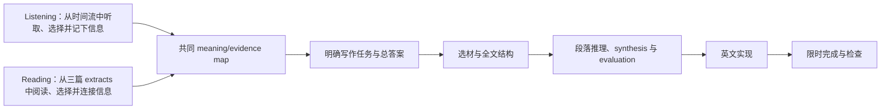

---
aliases:
  - LN905 考试总纲
tags:
  - teach
  - learning/ln905
status: active
source_checked: 2026-08-11
---

# LN905 Exam Playbook

> [!summary] 这门训练最终要让我会什么
> Listening 和 Reading 只是两种获取信息的入口。信息被整理成可用的 meaning/evidence map 后，后面的选材、判断、结构、论证、英文实现和检查共用同一棵 Writing 技能树。每天依据最近的真实输出选择当前瓶颈，不固定轮流练两个入口，也不能把练习变成无限纠正同一句话。

## 课件定义的终点

| | Paper A｜Listening into Writing | Paper B｜Reading into Writing |
|---|---|---|
| 输入 | 20–25 分钟现场讲座，只能依靠当场笔记 | 三篇 text extracts 与一个 essay question |
| 输出 | 40 分钟内写 200–400 词 critical summary | 2 小时内写约 600 词 essay |
| 内容标准 | 准确、成功 paraphrase、覆盖 key points、detail/depth 合适 | 用材料支撑自己的 points、按写作目的改造材料、跨文 synthesis、selection 与 paraphrase |
| 写作标准 | 评价有依据并融入 summary；结构清楚、语言与风格合适 | 回答题目；逻辑推进、有效段落与 cohesion；语言准确且符合 academic style |

## 两个输入入口，一棵共同 Writing 树

词汇访问是每天并行推进的底座，不是必须先通关的第一关。Listening 与 Reading 只在输入获取阶段分叉：

### 只有输入阶段不同

| 输入入口 | 人面对的特殊困难 | 该入口完成时必须交出的共同产物 |
|---|---|---|
| Listening | 信息只出现一次并随时间消失；要靠 signposts、选择性笔记和 speaker/source ownership 恢复结构 | `source/speaker → claim → grounds/evidence → warrant/mechanism → qualifier/scope` |
| Reading | 信息可回看但分散在多篇 extracts；要按 question 取舍，并识别跨文关系 | 同一张 map；多来源时再标明 agreement、explanation、qualification、tension 或 challenge |

一旦这张 map 可用，训练不再分成“Listening 写作技能”和“Reading 写作技能”。两种考试共用下面的 Writing 树，只在成品格式与材料数量上不同。

### 共同 Writing 技能树

| 节点 | 人类写作者在解决什么问题 | 学会的可见证据 |
|---|---|---|
| W1. 明确任务 | 我最终要回答什么，成品是 critical summary 还是 essay | 能用一句话说清写作任务、对象与必要判断 |
| W2. 形成控制性答案 | 全文到底要让读者相信什么 | 写作前已有 central answer/thesis，而不是边写边找立场 |
| W3. 选择材料 | 哪些信息真正服务这个答案，哪些细节应舍弃 | 被选材料都能说明“它怎样帮助我的答案” |
| W4. 准确转述 | 怎样压缩材料而不改变原意、certainty、数字、scope 或来源归属 | summary/paraphrase 保留原意且明确谁在作判断 |
| W5. 安排全文 | 读者应该按什么顺序理解我的答案 | 每个段落已有功能；不是按来源或材料出现顺序堆砌 |
| W6. 展开段落推理 | evidence 为什么支持 claim，中间缺的 warrant 是什么 | 段落能走完 `point → evidence → commentary/reasoning → link back` |
| W7. Synthesis 与 evaluation | 多条信息怎样共同工作，证据能支持多大的结论 | 能写明 support/explain/qualify/challenge，并给出有依据的强度与范围判断 |
| W8. 英文实现 | 怎样把已经想清楚的关系准确变成 academic English | writer voice、reporting、cohesion 与 recurring grammar 足以承载意思 |
| W9. 限时完成 | 怎样在有限时间内交出完整成品 | 不因局部句子留下缺段或缺结论，并能按 criteria 检查 |

Paper A 把共同树适配为“speaker 的 central argument + key points + integrated critical comments”的 critical summary；Paper B 把它适配为“自己的 thesis + 多来源 synthesis”的 essay。区别是任务壳和输入入口，不是两套底层写作思维。

## 先让人理解为什么，再让人动手

AI 在要求任何动作前，必须用普通人能理解的方式讲清：

1. **人现在面对什么真实写作问题**，而不是只报一个术语。
2. **为什么这个动作能解决它**，以及不做会在成文时造成什么后果。
3. **信息会怎样变化**：例如从零散笔记变成 evidence map，或从 map 变成段落判断。
4. **它会解锁下一步什么决策**，让用户知道自己不是在做孤立作业。
5. 必要时先展示一个简短 worked example 的完整思考过程，再让用户在自己的材料上应用。

`为什么` 不能只写“教师说要提高”或“评分标准要求”。那只能说明重要性，不能解释人为什么这样组织写作。也不要求用户为了证明理解而机械复述规则；如果用户仍不知道动作的用途，暂停任务并重新解释，不继续发命令。

## Paper A｜进考场后怎么做

### 听讲阶段

1. 先听 signposts：主题、分点转换、结论和限定通常会被讲者提示。
2. 只记录会影响 summary 的内容：central argument、key points、关键 evidence、限定和重要反驳；不要试图记下每句话。
3. 明确 source ownership：讲者本人接受的观点、讲者转述的争议观点、例子、research 和 data 不能混成同一种事实。
4. 可以用个人速记 `C`（central claim）、`B`（supporting block）、`E`（evidence）、`Q`（qualification）、`→`（warrant/reasoning）。这是训练辅助符号，不是课程规定格式。

### 写作阶段

1. **重建地图**：写出一个 central argument、主要 key points、各自最重要的 evidence/qualification。
2. **选结构**：讲座本身清楚且有逻辑时可用 linear summary；需要重新归类时用 thematic summary。
3. **成文**：先准确概括 central argument 与 key points，再把有依据的 critical comments 放到所评价的内容旁边。不要先写一个脱离内容的评价段。
4. **检查**：按 `accuracy → key-point coverage/detail → paraphrase/source ownership → supported criticality → structure → language` 的顺序检查。

> [!tip] 默认时间节奏｜训练建议，不是课程硬性规定
> 前约 5 分钟重建地图与选结构，中间约 28 分钟完成全文，最后约 7 分钟检查。完整模拟后再根据真实表现调整。

### 卡住时

- 不确定一个数字：保留确定的上位意思，删掉可能错误的细节。
- 不知道该记什么：先问“没有它会不会改变 central argument 或 key point？”
- 不知道怎么评价：按 `讲者用了什么 evidence → 支持哪个 claim → warrant 是否成立 → 需要怎样限定`。
- 英文写不出：先用简单短句保住 source ownership、certainty 和 scope。

## Paper B｜进考场后怎么做

### 审题与读材料

1. **拆题**：确认题目要求的是 position、solution、evaluation、cause 还是别的判断；再标出题目的组成部分、相对重要性、time/place/perspective restriction 和需要定义的争议词。
2. **读三篇 extracts**：每篇只提取 `C`（claim）、`E`（evidence/mechanism）、`Q`（scope/limitation）和可与其他文章连接之处。不要按文章分别准备三份摘要。
3. **建关系**：把相同主题放到一起，明确来源之间是 agreement、explanation、qualification、tension 还是 challenge。Synthesis 的核心是用自己的 voice 把多篇材料组织成一个判断。
4. **定 thesis**：直接回答题目，并说明主要理由与必要限定。没有 thesis 就先不写正文。

### 计划与成文

1. 根据题目选择结构：
   - `justification`：claim + reasons；每个 reason 仍要承认弱点或 alternative。
   - `rebuttal`：counter-claim 值得正面回应时使用。
   - `synthesis`：两个 position 需要比较、评价并形成自己的结论时使用。
   - `thematic`：按主题处理复杂问题；课件提醒它较费计划时间，短时写作要谨慎。
2. 每个主体段先写 **自己的 topic sentence**，再放入 supporting details。课程建议有效段落通常包含：`topic sentence → explanation → evidence/source use → commentary on evidence → concluding/link sentence`，一般约 4–6 句。
3. 至少让相关段落出现跨文关系：不是 `A says... B says...`，而是说明 B 怎样支持、解释、限定或挑战 A，以及这对题目的答案意味着什么。
4. Introduction 完成 context、thesis、approach 三个动作；conclusion 概括主要 points、重申 thesis，并只在有依据时写 implication。不要加入新证据。
5. 按 `task fulfilment → text use/selection → synthesis/source accuracy → structure/completion → recurring language` 的顺序检查。

> [!tip] 默认时间节奏｜训练建议，不是课程硬性规定
> 前约 30 分钟审题和读三篇 extracts，约 15 分钟建关系与计划，约 60 分钟成文，最后约 15 分钟检查。课程没有规定固定三段正文或各段字数；段落数量由题目和 thesis 决定。

### 卡住时

- 不知道 thesis：先写 `我对题目的直接判断 + 两个主要理由 + 一个必要限定`。
- 不知道如何 synthesis：先说清第二份来源与第一份的关系，再写“这对我的答案意味着什么”。
- 材料太多：只保留能支撑、改变或限定 thesis/paragraph claim 的内容。
- 来不及：先完成所有段落的判断与 conclusion，不在单句上反复打磨。

## 每天的训练怎样真正推进

每个 guided part 必须明确以下五件事：

1. **总纲能力**：明确是 Listening/Reading 输入入口，还是共同 Writing 树的 `W1–W9` 节点。
2. **考试位置**：正式考试的哪一步会调用它。
3. **当日产出**：今天留下什么完整、可检查的小产物。
4. **学会证据**：看到什么就说明能力已经出现，而不是要求文本完美。
5. **整合动作**：把刚学的动作放回一次 summary、paragraph 或 plan，并留下 `遇到 X → 做 Y` 的考试口令。

每天练什么不预先锁死，而是由同一个控制回路决定：

`看最近的完整产出 → 判断瓶颈在输入入口还是共同 Writing 树 → 练当前最高价值瓶颈 → 立即做小型整合 → 与上一份可比输出比较 → 再决定下一项`

- 如果 meaning/evidence map 已经准确，但成文仍卡在 thesis、选材、结构、推理、synthesis/evaluation、英文实现或完成度，下一项直接训练共同 Writing 树；不因为材料来自 Listening 或 Reading 就把输入再练一遍。
- 如果 map 本身遗漏 central claim、evidence、source ownership 或 scope，才回到对应的输入入口。
- 如果同一个 Writing 节点在连续两份可比输出中没有改善，接下来两个 guided parts 优先增加该 Writing 节点的时间，并用不同材料做迁移；直到下一份整合输出出现改善，再恢复其他薄弱项。
- 普通日只选择一条最高价值训练 lane：一个 standalone Shared Writing part，或一组使用同一材料的 `input → Shared Writing` 相邻 pair；词灵不计入。不得为了形式对称自动安排 Listening 和 Reading 各一项。真正 input 练习得到 map 后，当天趁记忆新鲜用独立 Writing part 接上；若只能练 Writing，就由导师提供足够使用的事实条目或短学术材料。
- 固定的是正式 assessment、必要的完整模拟和每日词汇底线；普通练习的日期、输入入口与支架强度由最新证据动态决定。

### 每周五真实校准

每周五的 Listening into Writing 与 Reading into Writing 测试是主要的独立状态样本。用户通常把原始笔记和成文放在 `07_Programme/01_LN905_LSE-language-class/00_inbox/`；教师反馈到达后加入同一次校准。

1. 第一次在周五测试文件出现后的 Student OS 运行中，读取两份原始作答并分别检查输入入口；随后把两份写作放到同一组 `W1–W9` 节点下比较。
2. 记录的是证据：哪些节点已经出现、哪个错误重复、是否写完、评分标准或教师反馈支持什么判断。不要仅凭“感觉退步”或完成任务数量更新能力状态。
3. 周五测试同时承担完整整合与校准作用；同一周不再默认增加一套重复的完整模拟。只有测试文件缺失、测试使用了 AI 因而不能作为独立基线，或需要验证一个明确的考试条件问题时，才额外安排完整模拟。
4. 如果同一个共同 Writing 节点连续两周五仍无改善，下周提高该节点的训练占比；如果只有一个输入入口退步，则只补那个入口。
5. 校准只读取 Inbox 并把结论写入学习计划/周复盘；不得在 Student OS 校准中移动、删除或改写 Inbox 原始文件。课程 Inbox 的正式整理与清理属于独立课后处理流程。

| 训练类型 | 当天主要推进 | 必须怎样接回考试 |
|---|---|---|
| 词灵 | lexical access | 给出具体分钟数；不替代理解、组织或写作 |
| Listening input | 一次性时间流中的选择、笔记和 speaker/source ownership | 独立产出共同 meaning/evidence map；同日相邻的 Shared Writing part 使用它 |
| Reading input | 正式测试量级的三篇学术 extracts 中 question-led 取舍、准确性和跨文关系识别 | 独立产出同一类 map；同日相邻的 Shared Writing part 使用它 |
| Shared Writing | `W1–W7` 的答案、选材、转述、结构、推理、synthesis/evaluation | 用 Listening 或 Reading 任一可用 map 产出 plan、summary 或 paragraph |
| English production | `W8` | 只修本人输出中反复出现的模式，再放回真实 summary/essay |
| Partial simulation | 相邻输入与 Writing 节点整合 | 在缩小材料或字数的情况下走完一段连续流程 |
| Complete simulation | 输入入口 + `W1–W9` | 无 AI 帮助完成计时输出；计时后才诊断与定向 revision |

## AI 反馈优先级

一次先看完整产出，再按以下顺序分流：

1. 会让题意、claim、source relationship、evidence、certainty 或 scope 失真的问题：当场教清。
2. 会让全文或段落失去答案、推理或完成度的问题：当场处理。
3. 多次出现的 grammar、word form、sentence structure、academic word choice：集中进入 English production / sentence clinic。
4. 一次性的拼写、措辞、风格和小语法：记录但不阻挡推进。

同一个微小问题最多要求一次 revision；仍未解决时直接用对比或 worked example 教清，然后回到一次整体应用。普通教学的成功标准是**能力已经可迁移地出现**，不是当前文本被修到零错误。

## 课程依据

- [[07_Programme/01_LN905_LSE-language-class/PDF/03_Paper-A-Listening-into-Writing/Listening into Writing Introduction.pdf|Paper A Introduction]]：考试格式、笔记选择、linear/thematic summary、criticality 与 reporting/evaluation。
- [[07_Programme/01_LN905_LSE-language-class/PDF/01_Assessment/Marking-Criteria/Paper A_Marking Criteria_Listening into Writing.pdf|Paper A Marking Criteria]]：accuracy、paraphrasing、coverage、detail/depth、supported critical comments、structure 与 language。
- [[07_Programme/01_LN905_LSE-language-class/PDF/04_Paper-B-Reading-into-Writing/Reading into Writing.pdf|Paper B Introduction]]：考试格式，以及 text use、synthesis、selection、paraphrasing、task fulfilment、structure 与 language。
- [[07_Programme/01_LN905_LSE-language-class/PDF/01_Assessment/Marking-Criteria/Paper B_Marking Criteria_Reading into Writing.pdf|Paper B Marking Criteria]]：多文本使用、跨文 links、paragraphing、cohesion、style 与 accuracy。
- [[07_Programme/01_LN905_LSE-language-class/PDF/02_Academic-Writing/Week-1/Week One Lesson Three.pdf|Academic Writing Week 1 Lesson 3]]：审题、restriction、definition 与回答任务类型。
- [[07_Programme/01_LN905_LSE-language-class/PDF/02_Academic-Writing/Week-1/Week One Lesson Two.pdf|Academic Writing Week 1 Lesson 2]]：introduction、thesis 与 conclusion。
- [[07_Programme/01_LN905_LSE-language-class/PDF/02_Academic-Writing/Week-2-Gender/Week 2 Lesson 3.pdf|Academic Writing Week 2 Lesson 3]]：synthesis、writer voice、跨来源组织与连接语言。
- [[07_Programme/01_LN905_LSE-language-class/PDF/02_Academic-Writing/Week-3-Demographics/Week 3 Lesson 1.pdf|Academic Writing Week 3 Lesson 1]]：essay structures、paragraph unity/coherence/development 与 topic sentences。
- [[07_Programme/01_LN905_LSE-language-class/PDF/02_Academic-Writing/Week-3-Demographics/Week 3 Lesson 3.pdf|Academic Writing Week 3 Lesson 3]]：Toulmin 的 claim、grounds、warrant、backing、qualifier 与 rebuttal。
- [[07_Programme/01_LN905_LSE-language-class/PDF/02_Academic-Writing/Week-3-Demographics/Week 3 Lesson 4.pdf|Academic Writing Week 3 Lesson 4]]：writer voice、evaluative language、用 literature 支撑自己的 claims 与 essay plan。

当总纲与课件冲突时，以最新课件和正式 marking criteria 为准；教师反馈用于决定训练优先级。上面的速记符号、默认时间节奏和“卡住时”动作都是训练策略，必须根据完整模拟证据调整，不能冒充课程硬性规则。
